# 使用 Java Spring MVC 的核心 Web 应用程序功能

> 原文：<https://medium.com/codex/core-web-application-functionality-using-java-spring-mvc-db827e7378b2?source=collection_archive---------22----------------------->


客户关系管理，人力资源管理，企业资源规划是一些应用程序的例子，利用行政过程。这些流程通过自动处理或用户交互来保持业务运行。今天，这些类型的软件大多作为基于网络的应用程序运行。

使用 web 应用程序框架时，编写 web 应用程序更容易。这些框架提供了快速的应用程序开发。

一些最好的 java 框架

*   春天
*   JSF (Java 服务器接口)
*   GWT(谷歌网络工具包)
*   支杆
*   瓦丁

下面来说说 [**弹簧框架**](https://spring.io/why-spring) ！

> “Spring 使构建 web 应用程序变得快速而简单。通过删除大量与 web 开发相关的样板代码和配置，您将获得一个现代化的 web 编程模型，它简化了服务器端 HTML 应用程序、REST APIs 和双向的、基于事件的系统的开发。”

# 春天 MVC 和 Spring Boot

Spring MVC 是一个模型-视图-控制器框架。它用于创建可伸缩的企业 web 应用程序。设置和配置比 Spring Boot 更复杂。如果配置需要更大的灵活性，这是最好的选择。

Spring Boot 是建立在 Spring MVC 之上的。它最小化了配置的复杂性和 Spring MVC 需要的样板代码。它有内置的 Jetty 或 Tomcat web 服务器。它主要用于快速构建微服务应用程序。与 Spring MVC 不同，它使用的层是表示层、数据访问层、服务层和集成层。

# 构建基于 web 的应用后台系统

# 问题是

但是如何构建一个 web 应用程序呢？组成系统的构件是什么？

# 崩溃了

要解决这个问题，我们必须将解决方案分成最基本的部分。

*   建筑设计
*   身份验证-授权-审核日志
*   用户界面

# **建筑设计**

作为 MVC 框架，Spring 使用了**模型**、**视图**和**控制器的设计方法**。**模型**是组成系统的所有实体、数据、规则和逻辑的组合。**视图**代表 HTML、JSP 页面等用户界面……当然还有**控制器**，它接受输入并将其转换为**模型**的命令或**视图**的有意义的用户数据。

为了进一步扩展代码的可读性和可维护性，我们将结合 MVC 设计使用[域驱动设计](https://patroclosdev.medium.com/solid-the-5-principles-of-object-oriented-design-676095960598)。

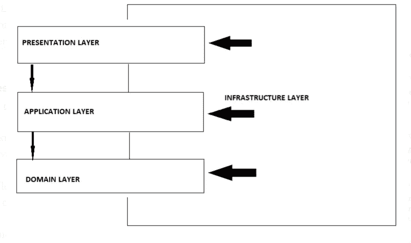

DDD 建筑的层次

从底部开始，一步一步向上，让我们看看 ***畴层*** 将驻留的**模型**。“最低级别”类将是实体，它代表数据库中的一行。

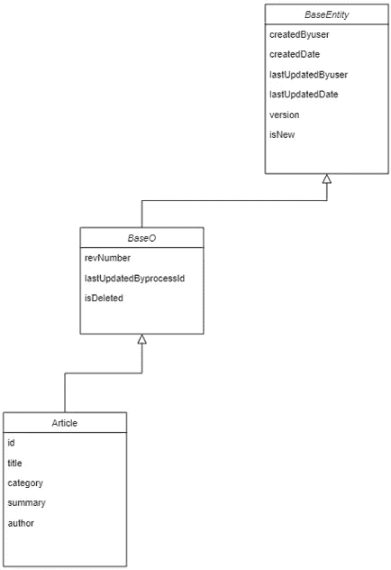

扩展了 BaseO 类**的 **Article** 实体类的例子。 **BaseO** 类扩展了 **BaseEntity** 类**

所有实体都扩展父抽象类 ***BaseO*** 和 ***BaseEntity*** ，它们持有全局‘父’属性。请注意 ***BaseO*** 和 ***BaseEntity*** 作为抽象类，不能也不应该被实例化。

在下一个“上层”中， ***ArticleBO*** 将保存实体的行为和业务逻辑。

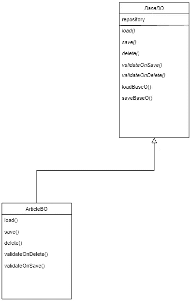

扩展抽象库类**的 **ArticleBO** 的例子**

**业务对象**类，扩展抽象 ***BaseBO*** 类以便继承 CRUD 行为 load | save | delete ( *save 方法用于创建和插入操作*)。

请注意 ***BaseBO*** 类中的两个具体方法 **loadBaseO()** 和 **saveBaseO()** 。这两种方法都具有将实体加载和持久化到数据库中的基本功能。这两种方法都调用全局 ***IRepository*** 接口，该接口负责加载/保存 ORM (Hibernate)功能。这样我们就满足了 [**单一责任原则**](https://patroclosdev.medium.com/solid-the-5-principles-of-object-oriented-design-676095960598) ⁴和 [**从属倒置原则**](https://patroclosdev.medium.com/solid-the-5-principles-of-object-oriented-design-676095960598) ⁴

接下来，我们将有 ***服务(应用)层*** 。这一层编排较低级别的对象业务逻辑。

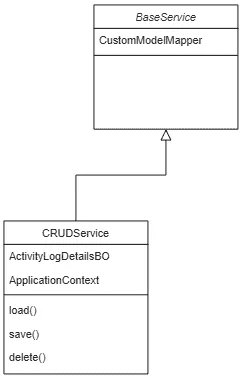

示例 **CRUDService** 类，它扩展了 **BaseService** 类

```
r@Transactional
public void save(BaseDTO input) throws Exception {
   save(input, false);
}public BaseDTO load(long id, Class<? extends BaseDTO> classType) throws Exception {
   BaseBO baseBo = getBussinessBeanFromClassType(classType);
   BaseO o = baseBo.load(id,    CustomModelMapper.mapDTOClassToModelClass(classType));
   if (o != null && o.getIsDeleted() == 1) return null;
   return CustomModelMapper.mapModeltoDTO(o, classType);
}
```

请注意 save()方法将 DTO(数据传输对象)作为输入，因为这是一个 ***服务(应用)层*** *。* Load()方法以实体 Id 为参数，返回转换为 d to 的实体。

假设，系统将有复杂的业务规则和逻辑，让我们使用 [Facade](https://patroclosdev.medium.com/design-patterns-facade-8d768f95f2cc) 设计模式，并提供更高级别的编排和抽象。

```
@Component
public class Facade  {@Autowired
private IProcessManager processManager;@Autowired
private CRUDProcess CRUDProcess;public <T> Object load(long id, Class<? extends BaseDTO> inputType) throws Exception{
IProcess<?, ?, ?> process = b -> CRUDProcess.load(id, inputType);
return processManager.runProcess(process, inputType, id, CRUDProcess.PROCESS_NAME_READ);
}public Object delete(BaseDTO input) throws Exception{
IProcess<?, ?, ?> process = b -> CRUDProcess.delete(input);
return processManager.runProcess(process, input, CRUDProcess.PROCESS_NAME_DELETE);
}public Object saveNew(BaseDTO input) throws Exception{
IProcess<?, ?, ?> process = b -> CRUDProcess.saveNew(input);
return processManager.runProcess(process, input, CRUDProcess.PROCESS_NAME_CREATE);
}public Object saveUpdate(BaseDTO input) throws Exception{
IProcess<?, ?, ?> process = b -> CRUDProcess.saveUpdate(input);
return processManager.runProcess(process, input, CRUDProcess.PROCESS_NAME_UPDATE);
}}
```

可以看到， **Facade** 类通过调用**process manager . run process()**方法，实现 CRUD 函数，并与相应的 ***服务(应用)层*** CRUD 函数交互。

```
@Component
public class ProcessManager implements IProcessManager {@Autowired
private ActivityProcess ActivityProcess;@Autowired
private IAuthenticationService AuthenticationService;@Autowired
private UserService UserService;public Object runProcess(IProcess<?, ?, ?> process, Class<? extends BaseDTO> inputType, BaseDTO input, Long id, String processName) throws Exception{Object result = null;if (processName == null )
{
   throw new SystemException("ProcessName not defined");
}var loggedUser = AuthenticationService.getLoggedDbUserDTO();if (loggedUser.getIsDeleted() == 1) {
   throw new SystemException("Process authorization failed. User is deleted");
}if (loggedUser.getEnabled() != 1) {
   throw new SystemException("Process authorization failed. User is not enabled");
}if(loggedUser.getRoles() == null) {
    throw new SystemException("Process authorization failed. User has no defined roles");
}var authorities = UserService.getUserAuthorities(loggedUser);if (authorities == null) {
    throw new SystemException("Process authorization failed. No access permissions found");
}var authoritiesList = authorities.stream().map(a -> a.getAuthority()).collect(Collectors.toList());if (!authoritiesList.contains(processName)) {
  throw new SystemException("Process authorization failed. User has no access to this process. No access permissions found");
}boolean isProcessSuccess = false;
String processError = "";
String processId = ProcessUtil.getActivityProcessId();try
{
Thread.currentThread().setName(processId);
result = process.run(input);
isProcessSuccess = true;
}
catch (Exception e){processError = e.getMessage();if (e.getCause() != null) processError = e.getCause().getMessage();
  throw new SystemException(e);
}finally {
//Handle process failure code ...//reset thread's name after process and activity log insert is completeThread.currentThread().setName("");}return  result;}}
```

**问题**

从 **Facade** 调用的每个流程都需要**授权**并处理，不管成功还是失败，在所有应用程序中都是一样的。

为什么不直接调用**服务(应用)层**类方法呢？

每次向 **Facade** 类添加新流程时，我们都需要编写额外的重复代码，这可能会导致开发人员方面的实现不一致。另外，我们会有不必要的样板代码。

**解决方案**

使用[战略模式](https://refactoring.guru/design-patterns/strategy) ⁶

从上面的 **ProcessManager** 类，我们可以在 runProcess 方法()中传递流程实现( **IProcess** )。

流程实施

```
@Component
public class CRUDProcess extends BaseProcess {@Autowired
private CRUDService CRUDService;public final String PROCESS_NAME_CREATE = "CREATE";
public final String PROCESS_NAME_READ = "READ";
public final String PROCESS_NAME_UPDATE = "UPDATE";
public final String PROCESS_NAME_DELETE = "DELETE";
public final String PROCESS_NAME_CANCEL = "CANCEL";public BaseDTO load(long id, Class<? extends BaseDTO> input) throws Exception {
   BaseDTO dto = CRUDService.load(id, input);
   return dto;
}public Object delete(BaseDTO input) throws Exception {
   CRUDService.delete(input);
   return input;
}public Object saveNew(BaseDTO input) throws Exception {
   return save(input);
}public Object saveUpdate(BaseDTO input) throws Exception {
   return save(input);
}public Object save(BaseDTO input) throws Exception {
  CRUDService.save(input);
  return CRUDService.load(input.getId(), input.getClass());
}public Object cancel(BaseDTO input) {
  return input;
}}
```

从 **Facade** 调用的每个进程都被授权和处理，无论成功或失败，在整个应用程序中都是一样的。这样我们就满足了 [**开闭原则**](https://patroclosdev.medium.com/solid-the-5-principles-of-object-oriented-design-676095960598) ⁴也是如此。此外，对于**流程管理器**中需要的任何更改，都很容易实现，因为我们只需要在一个地方修改代码。

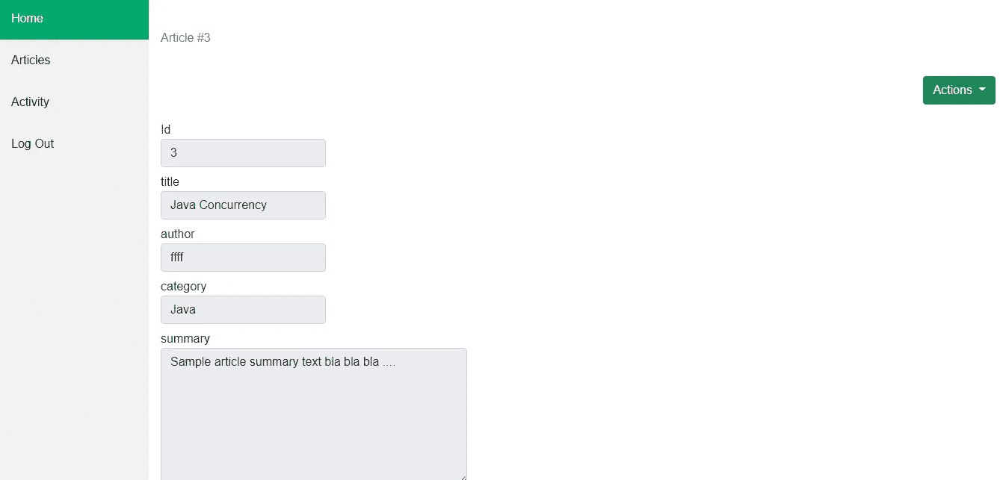

加载文章 DTO 时的示例详细页

# **认证—授权—审计日志**

对于认证，使用 Spring 安全配置

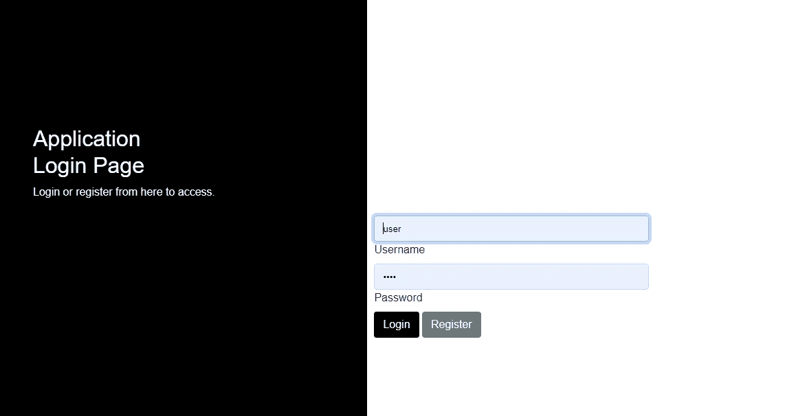

*示例安全配置* ***安全过滤链*** *Bean*

```
@EnableWebSecurity
@Configuration
public class SecurityConfiguration {@Bean
public SecurityFilterChain filterChain(HttpSecurity http) throws Exception {http.authorizeRequests().antMatchers("/login", "/signup", "/signupconfirm").permitAll()
.antMatchers("/**", "/index**").access("hasRole('ROLE_USER') or hasRole('ROLE_ADMIN')")
.and()
.formLogin().loginPage("/login").defaultSuccessUrl("/index?page=dashboard").successHandler(authenticationSuccessHandler())
.failureHandler(authenticationFailureHandler())
.and()
.logout().logoutUrl("/logout").logoutSuccessHandler(logoutSuccessHandler()).invalidateHttpSession(true).deleteCookies("JSESSIONID")
.and()
.sessionManagement(session -> session
.maximumSessions(1) //set maximum concurrent user logins
.maxSessionsPreventsLogin(true) //second login will be prevented
).sessionManagement().sessionCreationPolicy(SessionCreationPolicy.IF_REQUIRED).sessionFixation().migrateSession(); //on authentication create a new session to avoid session fixation attackhttp.csrf();http.headers()
.frameOptions()
.sameOrigin()
.xssProtection().block(false);return http.build();}}
```

正如我们前面解释的，**进程管理器**正在授权每个用户执行一个进程的权限。

此外，从**流程管理器中，为每个流程调用生成审计日志**。

另外，使用 [**Hibernate Envers**](https://hibernate.org/orm/envers/) 来保存历史审计表，其中包含修改后的实体字段的信息。

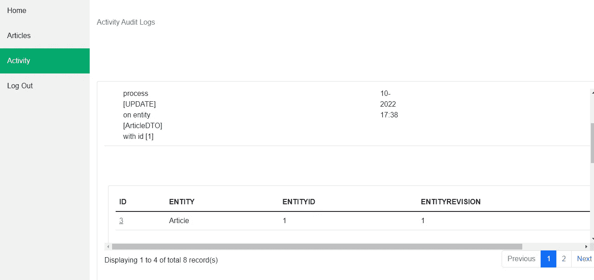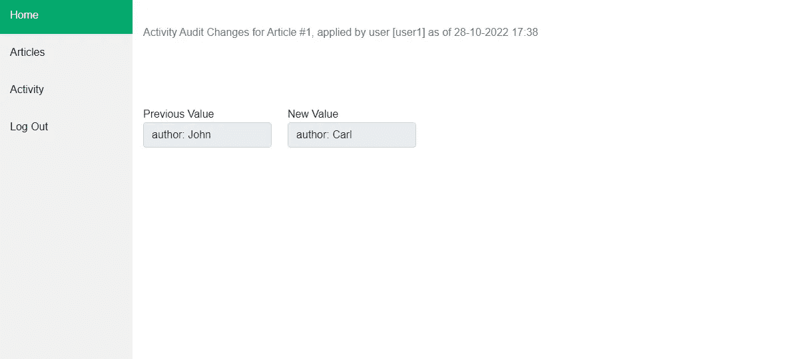

用户 1 对文章实体所做编辑的审计日志示例

# **用户界面**

[**Bootstrap**](https://getbootstrap.com/)**版本 5 用于页面的前端开发。 [**百里叶**](https://www.thymeleaf.org/) 是本项目中首选的模板引擎。**

> ****Thymeleaf** 是一个现代的服务器端 Java 模板引擎，适用于 web 和独立环境。Thymeleaf 的主要目标是为您的开发工作流程带来优雅的自然模板——可以在浏览器中正确显示的 HTML，也可以作为静态原型工作，允许开发团队中更强的协作。⁵**

**作为用户界面的高级解释，应用程序由*和 ***详细*** 页面组成。***

***搜索页面***

***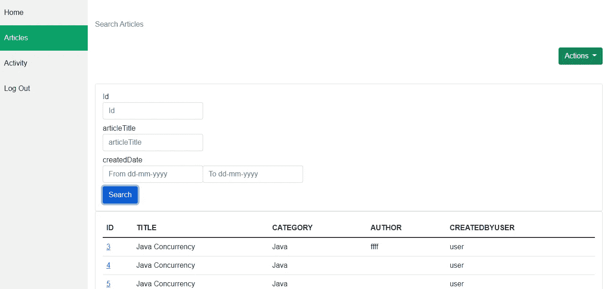***

***文章搜索页面示例***

***详细页面***

***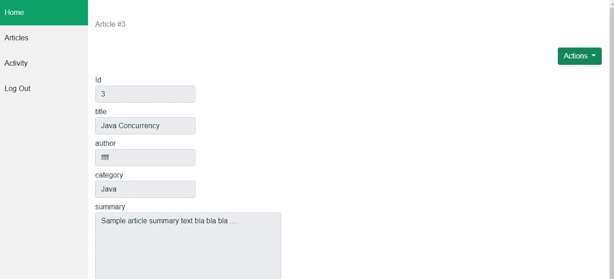***

***文章详细信息页面示例***

*****问题*****

***搜索和细节页面需要保持一致，并且在开发新页面时尽量减少样板代码。标准组件 HTML 代码生成，因此可以毫不费力地修改它们。***

*****解决方案*****

***创建一个**masterlayout.html**页面，作为所有页面的父-母版页。这个页面将包括 UI 使用的所有的 css 和 javascripts。***

***在 extend 中，为了标准化搜索页面，我们创建了一个**summarylayout.html**页面，作为搜索页面的父-主页面。这也是使用上面的 masterlayout.html 的**作为父布局。*****

***此外，为了使详细页面标准化，我们创建了一个**pagelayout.html**页面，它被用作搜索页面的父页面。这也是使用上述**masterlayout.html**作为父布局。***

*****控制器，**扩展父类，如下面的**文章控制器(文章搜索页面)**的例子。***

***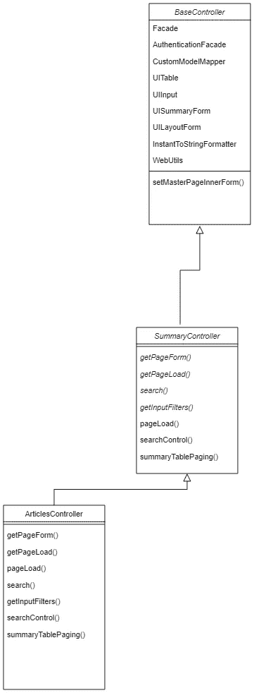***

*****物品控制器**扩展**概要控制器**扩展**基本控制器**的例子***

***这样，升级到新的引导版本和/或修改 CSS、Javascripts 变得容易，因为它们可以从一个地方改变。***

***控制器类是从父类扩展行为，因此共享公共的，可重用的代码给所有的子类。***

*****问题*****

***如何用最小的努力改变整个应用的 ***观感*** ？***

*****解决方案*****

***假设我们需要在整个应用程序的所有输入框中添加一个特性。如果我们试图改变所有页面上的所有输入框，这将花费相当多的时间。因此，我们需要采取的方法是从 java 代码(UIComponent 类)生成组件 HTML 代码，并将其添加到从控制器类返回的 **ModelAndView** 对象中。通过这种方式，我们实现了易于修改的可重用和可维护的代码。***

***如上所述，利用百里香模板，所有页面都扩展了母版页布局，因此很容易随着代码的变化修改 HTML、JSP 页面。***

*****如需工作演示，请访问**[**https://sightready.net:8443/SpringMVC/**](https://sightready.net:8443/SpringMVC/)**。注册一个新用户并试用它！*****

***[](https://github.com/patroklos83/SpringMVC/) [## GitHub - patroklos83/SpringMVC:样本模板 SpringMVC webapp

### localhost:8080/SpringMVC/这是一个基本的 Spring MVC web 应用程序模板，演示了…

github.com](https://github.com/patroklos83/SpringMVC/) 

[1][https://spring.io/web-applications](https://spring.io/web-applications)

[2][https://patroclosdev . medium . com/using-domain-driven-software-design-86de 3671358 c](https://patroclosdev.medium.com/using-domain-driven-software-design-86de3671358c)

[3][https://patroclosdev . medium . com/design-patterns-facade-8d 768 f 95 F2 cc](https://patroclosdev.medium.com/design-patterns-facade-8d768f95f2cc)

[4][https://patroclosdev . medium . com/solid-the-5-principles-of-object-oriented-design-676095960598](https://patroclosdev.medium.com/solid-the-5-principles-of-object-oriented-design-676095960598)

[https://www.thymeleaf.org/](https://www.thymeleaf.org/)

[https://refactoring.guru/design-patterns/strategy](https://refactoring.guru/design-patterns/strategy)***