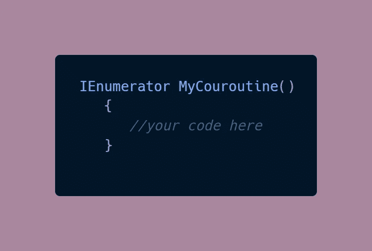
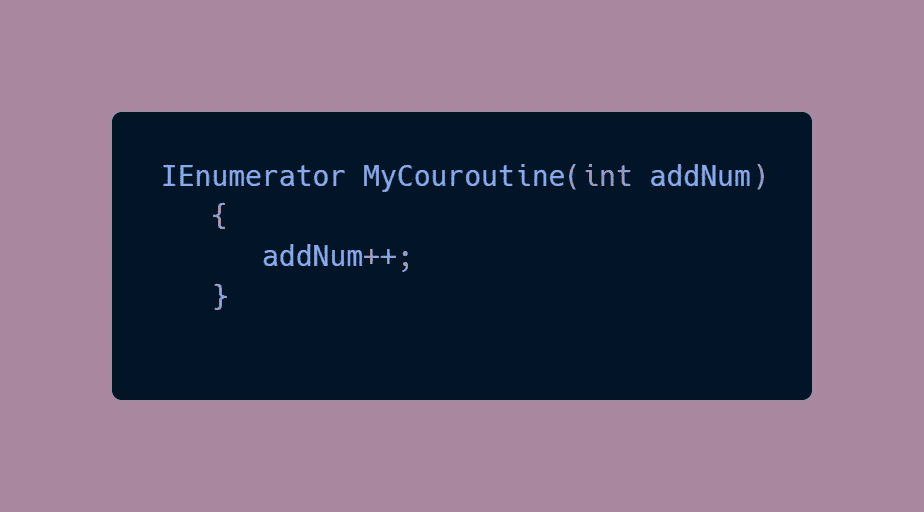
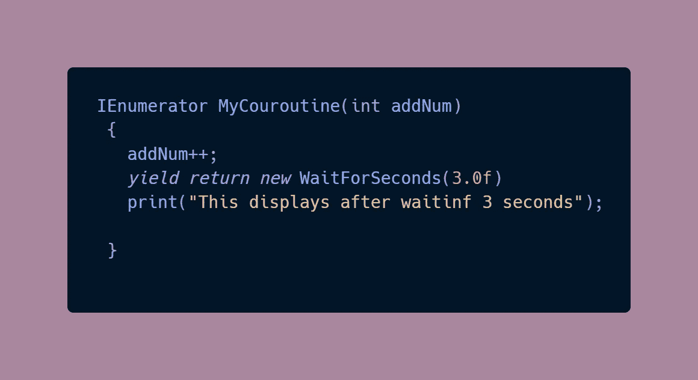
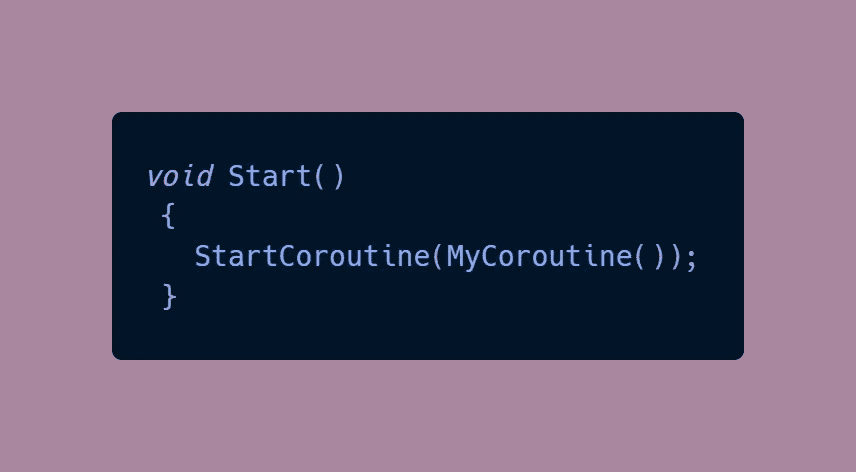
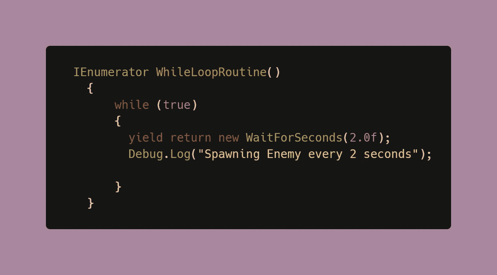
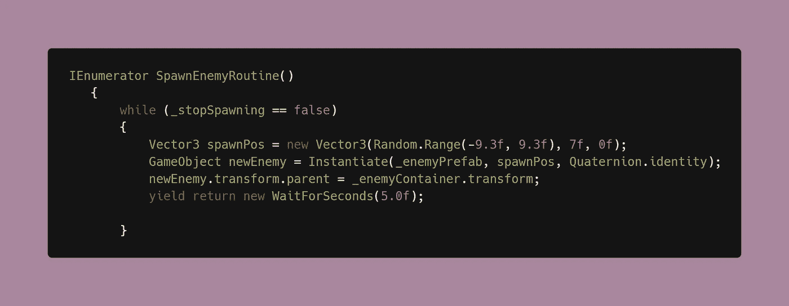

# 统一的协程！

> 原文：<https://medium.com/codex/coroutines-with-unity-b5a2b3fc3426?source=collection_archive---------13----------------------->

任何用 Unity 编程的人都知道，迟早你会在更新函数中积累大量的代码。毕竟， [Update](https://docs.unity3d.com/ScriptReference/MonoBehaviour.Update.html) 是一个名为 every frame 的函数，这使得它成为一个非常有用的编程工具！然而，有时我们需要比 Update 允许的更精确和定制。有时候，我们需要**协程**。

## 什么是协程？

[**协程**](https://docs.unity3d.com/ScriptReference/Coroutine.html) 是间隔执行的函数。简单地说，你可以告诉一个函数暂停，等待一个条件或动作发生后再继续。这有助于您将其功能分解为一系列可以按顺序执行的步骤。

> 记住它们用法的一个好方法是想想单词 [*例程*](https://languages.oup.com/google-dictionary-en/) 以及它在现实世界中的含义——有规律地遵循的一系列动作。

## 句法

函数的返回类型将是一个 **IEnumerator** ，这就是 Unity 如何将函数的执行划分到几个帧中。

像任何常规函数一样，协程可以被赋予参数。变量将在整个协程中保持它们的值。

协程有一个特殊的语句叫做 ***yield*** ，它返回函数的执行结果。这就是允许你暂停的原因。

Yield 通常伴随着 **WaitForSeconds** ，它允许你指定等待多长时间。

**返回**，作为一个标准特性，在该点终止执行，并将控制转移回调用进程。 **Yield** 表示该方法是一个[迭代器](https://www.merriam-webster.com/dictionary/iterate)，将在不止一帧上执行。当使用协程时，Unity 知道从它停止的地方开始这个过程。

一个完成的协程必须总是从 **Start** 方法中被调用。

## 将协程与 while 循环结合起来——这是进行无限循环的正确方法

由于协程允许程序*呼吸*，你可以有效地创建一个协程，它将永远运行*而不会导致程序崩溃 *g.**

然而，你可以得到更具体的。

一个协程可以在特定的条件下运行。这对于核心游戏循环非常有用，比如在玩家活着的时候让敌人产卵。

**代码示例:**

在这个例子中，敌人会在屏幕限制内的随机位置出现。除非玩家死亡或者赢得游戏，否则**_ 停止产卵**条件为假。这意味着这个例程将只运行**当**玩家还活着或者游戏还在运行，否则它不会停止。

**什么样子:**

如果你想知道为什么在对象中有一个处理父类的变换，这是一个在产生大量游戏对象时用来清理层次的技巧。我将在我的下一篇[文章](https://dennisse-pd.medium.com/spawning-objects-without-clutter-in-unity-c23c2aa347ed)中讨论清理！