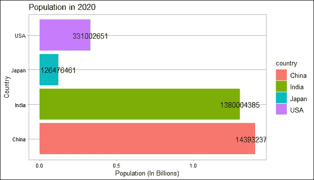
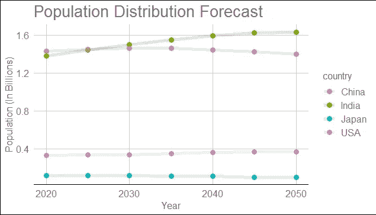
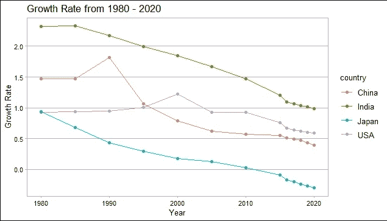
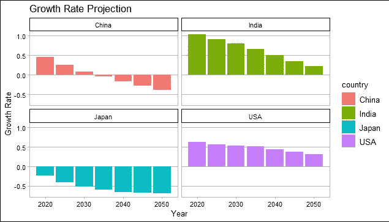
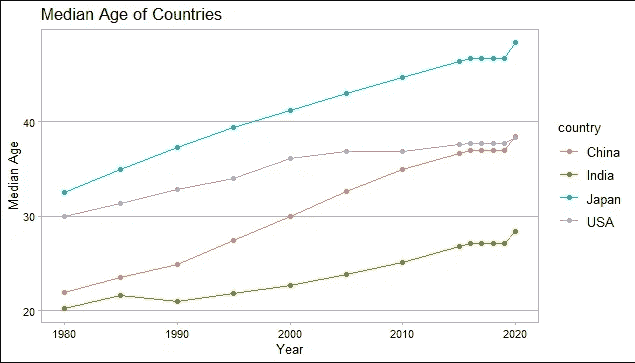
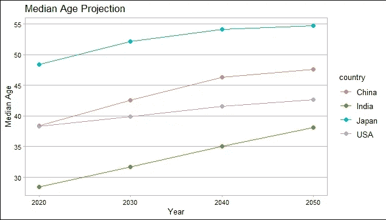
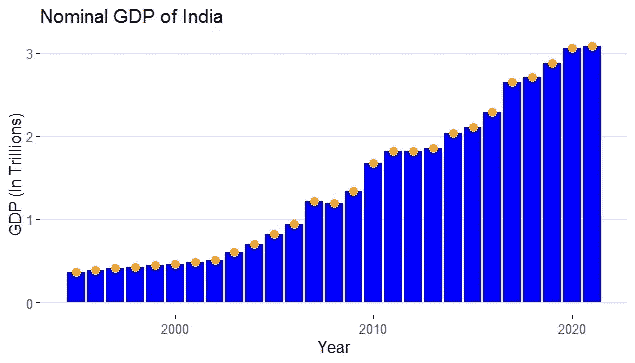
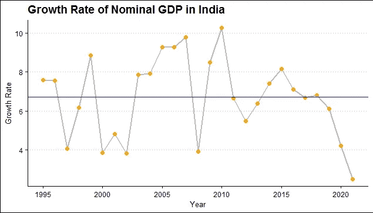

# 使用统计计算关联人口-年龄中位数 GDP

> 原文：<https://medium.com/codex/correlating-population-age-median-gdp-using-statistical-computing-10b983fd2380?source=collection_archive---------6----------------------->


## 用数据探索难以置信的统计数据

在这篇博客中，我选择了四个国家，即印度、中国、美国和日本。我比较了这些国家的人口分布和年龄中位数，并探讨了它对 GDP 的影响。所有的图表都是用 R 编程语言完成的。

# **人口**

世界总人口为 78 亿，这些国家的总人口为 32 亿，占世界总人口的 41.03%以上。相比之下，世界 GDP 总量为 138 万亿，而这些国家的总和为 43.93 万亿，占世界 GDP 总量的 31.83%。

**代号:**

```
population_bar <- pop %>%
  filter(year == 2020) %>%
  ggplot(aes(x = country ,y = pop ,fill = country ,label = population))  +
  geom_bar(stat = "identity") +
  coord_flip() +
  xlab("Country") +
  ylab("Population (In Billions)") +
  ggtitle("Population in 2020") +
  geom_text() +
  theme_calc()
population_bar
```



作者图片

这个柱状图清楚地显示了印度和中国处于世界人口的最前线。这种分布随着各个国家采取的策略和行动而变化。通过观察图表，日本将通过谨慎的程序来控制人口。另一方面，印度和中国将拥有世界上最多的人口。最后，美国站在中间，既没有庞大的居民，也没有较少的人口。

**代号:**

```
for_pop <- forecast %>%
  ggplot(aes(year ,pib ,color = country)) +
  geom_point(size = 3) +
  geom_line(size = 2 ,alpha = 0.2) +
  xlab("Year") +
  ylab("Population (In Billions)") +
  ggtitle("Population Distribution Forecast") +
  theme_gdocs()
for_pop
```

## 人口预测



从这个图表中，我们可以观察到，印度的总人口将在 2030 年超过中国，排名第一。这是因为中国政府采取了严格的措施。另一方面，日本将会过度控制人口，导致人口贬值。美国的总人口将会缓慢增长，但在 2040 年，它将会从世界第三下降到第四。总之，中国和日本人口过剩，人口数量下降，而印度将在 2030 年成为总人口的元帅。

## **人口增长率**

**代码:**

```
growth_line <- pop %>%
  mutate(growth = growth * 100) %>%
  ggplot(aes(year ,growth ,color = country )) +
  geom_line() +
  geom_point() +
  xlab("Year") +
  ylab("Growth Rate") +
  ggtitle("Growth Rate from 1980 - 2020") +
  theme_calc() 
growth_line
```



通过这张图表，我们可以观察到每个国家都在控制其总人口，因为它们的居民比率在下降。印度和日本的递减率相当，线条结构主要是一个斜坡。中国的增长率在 1990 年达到顶峰，在其余的几年里有一条斜线。然而，美国没有一条斜线，但是它的增长率在逐渐下降。从图表中我们可以看到，美国从 2010 年开始控制人口数量。据统计，印度的增长率在 1980 年达到顶峰，为 2.33%。如果印度当时没有采取任何措施，现在总人口将是 17.9 亿，但印度采取了正确的措施，将总人口控制在 13 亿。相反，日本过度控制了人口，导致了悲观的增长率。

## 人口增长率预测

**代码:**

```
for_growth_rate <- forecast %>%
  mutate(growth = growth * 100) %>%
  ggplot(aes(x=year ,y=growth ,fill = country)) +
  geom_bar(stat = "identity") +
  xlab("Year") +
  ylab("Growth Rate") +
  ggtitle("Growth Rate Projection") +
  facet_wrap(~country) +
  theme_calc()
for_growth_rate
```



明确地说，中国 2020 年的增长率为 0.4%，2030 年后，由于对增长率的精心控制，增长率将会下降。由于人口出生率的下降，中国的人口排名将下降到第二位。来到印度，与其他国家相比，它有一个健康的增长率。尽管增长率有所下降，但在 2050 年之前一直是正数。因此，我们可以说印度在 2050 年拥有巨大的人力资本，并将取代中国。美国也有同样的情况。多年来，美国的增长率小心翼翼地放缓，但相对而言，像印度一样保持正增长。其中最奇怪的例子是日本，正如我们从图表中看到的，它一直保持着负增长。这是因为过度控制了增长率。这一比率多年来一直在系统下降，到 2050 年底，增长率将为-0.5%。正因为这个原因，日本的中位年龄在不断增加。

# **年龄中位数**

## 1980-2020 年各国的实际中位年龄:

**代号:**

```
median_age <- pop %>%
  ggplot(aes(year ,medianage ,color = country)) +
  geom_point() +
  geom_line() +
  xlab("Year") +
  ylab("Median Age") +
  ggtitle("Median Age of Countries") +
  theme_calc()
median_age
```



## 2020-2050 年各国的预计中位年龄:

**代码:**

```
for_medianage <- forecast %>%
  filter(year %in% c(2020 ,2030 ,2040 ,2050)) %>%
  ggplot(aes(year ,medianage ,color = country )) +
  geom_point(size = 2) +
  geom_line() +
  xlab("Year") +
  ylab("Median Age") +
  ggtitle("Median Age Projection") +
  theme_calc()
for_medianage
```



从这些图表中，我们可以注意到，印度一直保持着从 1980 年的 20 岁开始的中位年龄，并设法在 2020 年达到 28 岁。即使进行预测，2050 年印度的平均年龄也只有 38 岁。因此，我们可以说，这些年来，印度理想地、建设性地保持了它的中位年龄。印度是可以实现的，因为它有正增长率。接下来，印度的竞争对手是中国，中国在 1990 年之前能够保持他们的平均年龄，但在接下来的几年里似乎出现了急剧上升。中国的中位年龄与美国 2020 年的中位年龄相交，为 38 岁。在预测中国的中位年龄时，它显示了 2050 年 47 岁的大幅增长，主要是因为其人口的负增长率。当来到美国时，与其他国家相比，它的中位年龄没有任何特殊的变化。美国的平均年龄在 2020 年达到顶峰，与中国相差 38 岁。然而，美国开始管理中位年龄，并随着公民人数的正增长率稳步增长。预计 2050 年美国的中位年龄将是 42 岁，与中国相比，这是相对令人满意的。最后，日本是一个例外，与其他国家相比，它的中位年龄差距很大。1980 年，日本的中位年龄为 32 岁，随着时间的推移，中位年龄不断上升，2020 年达到峰值，为 48 岁，这与日本人口的负增长有关。当预测日本的中位年龄时，它在 2050 年螺旋上升到 54 岁。总之，就中位年龄而言，印度被认为是最年轻的国家，而其中年龄最大的国家是日本。这些中位年龄与其各自的国内生产总值相关。进一步阅读，了解一个国家的中位年龄和 GDP 之间的关系。

# **GDP**

## 印度国内生产总值:

**代号:**

```
gdp_1 <- gdp %>%
  ggplot(aes(Year ,gdpn1)) +
  geom_bar(stat = "identity" ,fill = "blue") +
  geom_point(color = "orange" ,size = 3) +
  xlab("Year") +
  ylab("GDP (In Trillions)") +
  ggtitle("Nominal GDP of India") +
  theme_hc()
gdp_1
```



## 印度 GDP 增长率:(穿过的水平线是印度 GDP 增长率的平均值)

**代号:**

```
gdp_growth <- gdp %>%
  ggplot(aes(Year ,growth)) +
  geom_line(size = 1 ,color = "grey") +
  geom_point(color = "orange" ,size = 2) +
  geom_hline(yintercept = avg_gdpg ,color = "blue",size = 1) +
  xlab("Year") +
  ylab("Growth Rate") +
  ggtitle("Growth Rate of Nominal GDP in India") +
  theme_clean()
gdp_growth
```



到 2020 年，印度的国内生产总值将达到 3.1 万亿美元。我们可以从增长率图表中观察到，从 2016 年初开始，它就遵循着悲观的趋势。因为这场疫情回合，国际货币基金组织报告称，2021 年印度 GDP 增长率将为 2.50%。相反，印度总理提出的 5 万亿美元计划的愿景对在 2025 年实现持乐观态度。这一 2025 年 5 万亿的愿景，只有获得 2022 年至 2025 年每年 12.65%的增长率才能实现。但是，以 6.5%的平均增长率，只有到 2029 年才能完成目标。凭借其庞大的劳动力以及积极的人口增长率和年龄中位数，印度希望从中获得最大收益。

**完整代码:**

```
population_bar <- pop %>%
  filter(year == 2020) %>%
  ggplot(aes(x = country ,y = pop ,fill = country ,label = population))  +
  geom_bar(stat = "identity") +
  coord_flip() +
  xlab("Country") +
  ylab("Population (In Billions)") +
  ggtitle("Population in 2020") +
  geom_text() +
  theme_calc()
population_barfor_pop <- forecast %>%
  ggplot(aes(year ,pib ,color = country)) +
  geom_point(size = 3) +
  geom_line(size = 2 ,alpha = 0.2) +
  xlab("Year") +
  ylab("Population (In Billions)") +
  ggtitle("Population Distribution Forecast") +
  theme_gdocs()
for_popgrowth_line <- pop %>%
  mutate(growth = growth * 100) %>%
  ggplot(aes(year ,growth ,color = country )) +
  geom_line() +
  geom_point() +
  xlab("Year") +
  ylab("Growth Rate") +
  ggtitle("Growth Rate from 1980 - 2020") +
  theme_calc() 
growth_linefor_growth_rate <- forecast %>%
  mutate(growth = growth * 100) %>%
  ggplot(aes(x=year ,y=growth ,fill = country)) +
  geom_bar(stat = "identity") +
  xlab("Year") +
  ylab("Growth Rate") +
  ggtitle("Growth Rate Projection") +
  facet_wrap(~country) +
  theme_calc()
for_growth_ratemedian_age <- pop %>%
  ggplot(aes(year ,medianage ,color = country)) +
  geom_point() +
  geom_line() +
  xlab("Year") +
  ylab("Median Age") +
  ggtitle("Median Age of Countries") +
  theme_calc()
median_agefor_medianage <- forecast %>%
  filter(year %in% c(2020 ,2030 ,2040 ,2050)) %>%
  ggplot(aes(year ,medianage ,color = country )) +
  geom_point(size = 2) +
  geom_line() +
  xlab("Year") +
  ylab("Median Age") +
  ggtitle("Median Age Projection") +
  theme_calc()
for_medianagegdp_1 <- gdp %>%
  ggplot(aes(Year ,gdpn1)) +
  geom_bar(stat = "identity" ,fill = "blue") +
  geom_point(color = "orange" ,size = 3) +
  xlab("Year") +
  ylab("GDP (In Trillions)") +
  ggtitle("Nominal GDP of India") +
  theme_hc()
gdp_1gdp_growth <- gdp %>%
  ggplot(aes(Year ,growth)) +
  geom_line(size = 1 ,color = "grey") +
  geom_point(color = "orange" ,size = 2) +
  geom_hline(yintercept = avg_gdpg ,color = "blue",size = 1) +
  xlab("Year") +
  ylab("Growth Rate") +
  ggtitle("Growth Rate of Nominal GDP in India") +
  theme_clean()
gdp_growth
```