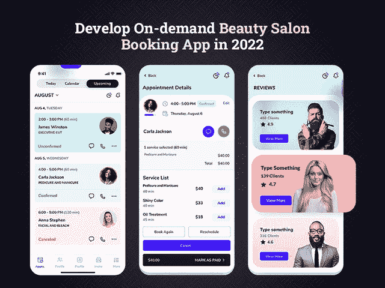
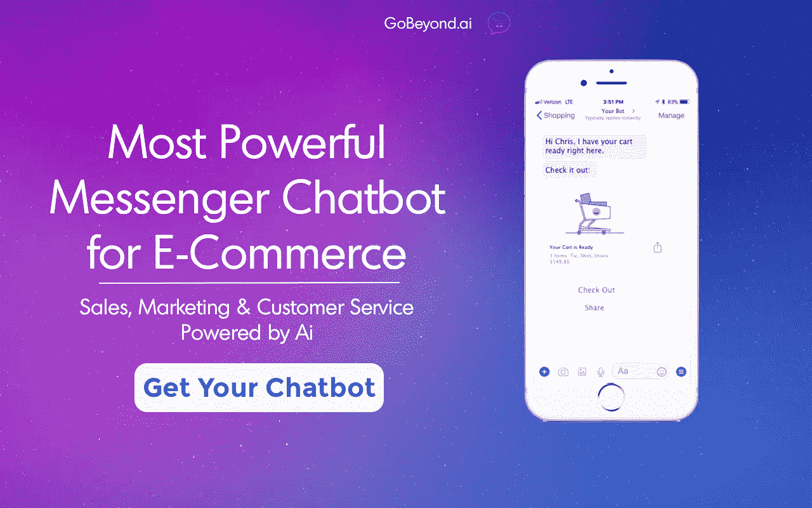
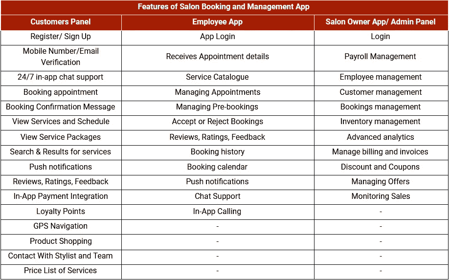
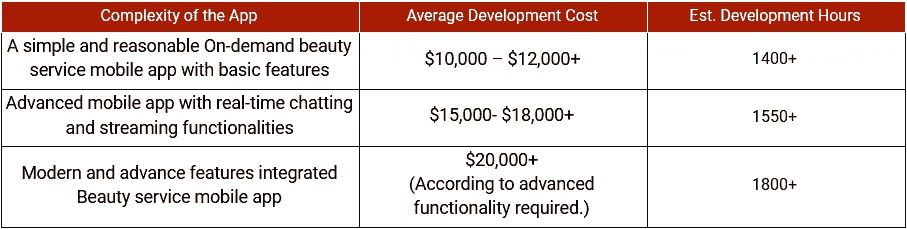

# 2022 年开发按需沙龙预订应用的成本

> 原文：<https://medium.com/codex/cost-to-develop-an-on-demand-salon-booking-app-in-2021-eb95c7329cdd?source=collection_archive---------5----------------------->

无论你是打算开始一项沙龙业务，还是只是好奇想知道如何扩大你的业务，按需沙龙预订和管理应用程序都可以成为这个数字化时代满足你所有 T2 业务需求的完美解决方案。

据预测，水疗和美容沙龙市场规模将从 2017 年的 1285.9 亿美元急剧转变为 2024 年的[1908.2 亿美元，毫无疑问，美容行业正以惊人的速度增长。](https://www.statista.com/statistics/1014649/revenue-spa-and-beauty-salons-worldwide/)

如果你进入这个行业，并拥有一家美容院，那么这是一个理想的时机，通过美容院预订和管理应用程序瞄准市场，以更好地控制你的运营。

虽然技术无处不在，但美容美发行业今天也没有例外。通过创建一个沙龙管理应用程序，管理你的客户、预约和你的造型师的可用性变得更加容易。今天，通过一个应用程序获取东西变得如此容易，没有人想在沙龙等待或排队获得他们的沙龙服务。是的，在这种快节奏的生活中，人们已经变得时间敏感，更喜欢在去沙龙之前预约。通过应用程序提前预订不仅有助于节省时间，还能节省金钱。

此外，考虑到统计数据，世界人口的 49.6%是女性，令人惊讶的是，每位女士每年在美容院花费约 3756 美元。而且，这是一个巨大的数字！因此，当你给你的[业务](/gobeyond-ai/role-of-e-commerce-applications-in-business-growth-dfc2700785b3)增加一个随需应变的设施时，这些企业肯定会从他们的投资中获得更高的回报。

无论你看哪里，无论是优步、Grubhub 还是 Instacart 的故事，他们的成功故事已经在以快速增长的收入数字激励创业公司。你所需要的就是 [**雇佣移动应用开发者**](https://www.xicom.ae/services/mobile-app-developers/) 来开始你的应用。

你可以成为你[事业](/gobeyond-ai/role-of-e-commerce-applications-in-business-growth-dfc2700785b3)的主宰。从管理在线约会到自动提醒，您可以使用自定义应用程序轻松管理一切。如果你仍然怀疑，那么这里的行业统计数据会让你大吃一惊，并为你提供美容美发行业的真正见解。

# **惊人的美容院行业统计数据**

你们中的许多人很想知道为什么以及如何使沙龙[业务](/gobeyond-ai/how-businesses-can-benefit-from-openapi-specification-1fa0fd884d21)风靡全球？我想这些统计数据会帮助你更好地了解美容行业的概况。

通过详细的市场调查，下面我们收集了一些关于沙龙业务的信息，并将其分为几个部分:顾客行为和开设沙龙。

## **沙龙行业顾客行为的改变**

*   根据市场调查，[1550 万美国人](https://www.statista.com/statistics/276869/us-households-professional-personal-care-services-used-hair-coloring/)在 6 个月内至少 4 次去沙龙寻求专业染发服务。
*   2016 年，男士染发[销量增长 110%](https://www.statista.com/statistics/276869/us-households-professional-personal-care-services-used-hair-coloring/) 。
*   25 岁至 34 岁的消费者仅占美发沙龙市场的 16.5%。
*   在同一波热潮中， [Balayage 服务的客户增长了 71%](https://www.statista.com/statistics/276869/us-households-professional-personal-care-services-used-hair-coloring/) 。

## **开沙龙**

*   超过 80，000 家在美国成立，创造了 200 亿美元的收入。
*   在 2010 年至 2020 年间，预计公开沙龙职位的数量将增长 16%。

一言以蔽之:美容院行业的状况清楚地描绘了市场的发展图景。事实上，如果你考虑一下按需应用市场的顶级表现者，你会注意到有一些共同点——不断增长的数量，功能的集合，以及整体提升他们在市场中表现的必备技术。

在你着手雇用一家 [**应用程序开发公司**](https://www.xicom.ae/services/mobile-app-development/) 来获得一个健壮且可扩展的解决方案之前，值得你所有的利益相关者去理解为什么你的[业务](/gobeyond-ai/how-to-prepare-your-ecommerce-business-for-sale-be663883aa40)需要这个应用程序。

# **为什么沙龙所有者的业务需要一个按需沙龙应用程序？**

虽然你已经在你的沙龙上投资了 100，000+美元，但你一定很想知道如何在竞争激烈的市场中立于不败之地。

最有潜力的投资方式之一是按需沙龙应用程序开发解决方案！

无论你是拥有一家独立的小型美容院，还是拥有一个领先品牌的特许经营商，拥有一个美容院移动应用程序都可以增加一个完美的竞争优势，并直接影响[业务](/gobeyond-ai/how-to-prepare-your-ecommerce-business-for-sale-be663883aa40)的增长。从管理员工、在线预约、跟踪库存、处理多个客户到提前预订，一个应用程序可以处理所有的关键任务，不会留下任何人为错误。

> 此外，以下是为您的企业开发按需沙龙应用程序的几个主要好处:

*   [根据调查](https://www.emarketer.com/content/us-time-spent-with-mobile-2019)，智能手机用户 90%的移动时间都花在应用程序上。在 Android 和 iOS 平台上推出用您的徽标和名称定制的沙龙管理应用程序，可以无缝扩展您与客户的联系。
*   68%的顾客在搜索引擎上查看评论后，会立即对你的品牌形成看法。因此，开发一个应用程序来帮助客户对服务留下积极的评价，并与你的品牌建立持久的关系是非常重要的。
*   你知道 70%的顾客会留下服务评论吗？按需美容院应用程序可以通过推送通知发送优惠券来帮助你提高顾客忠诚度和保留率。你不能低估你的应用程序的这一功能，因为除了使用短信提醒之外，没有什么更强大、更有影响力的营销工具可用于品牌推广。只需轻触应用程序，即可管理在线预订、查看客户详情、获取每月业务洞察、跟踪库存。
*   该应用程序集成了一系列功能，可以极大地促进销售，并让客户了解您的 USPs。
*   通过出色的 UI/UX 设计定制的应用程序使您能够轻松吸引用户的注意力，节省营销时间，并将您的业务推向新的高度。
*   开发一个沙龙管理和预订应用程序的估计成本可能从 35，000 美元以上开始，这取决于应用程序的特性、功能和复杂性。

# 趋势 GoBeyond.ai 文章:

> [淘汰旧产品:在 96 小时内清理掉 50 万美元的呆滞库存](/gobeyond-ai/out-with-the-old-clearing-out-500k-of-dead-stock-in-96-hours-7876ecccef20)
> 
> [面向小型企业的轻量级 CRM](/gobeyond-ai/lightweight-crm-for-small-businesses-fe1def85a982)
> 
> [最有利可图的电子商务营销渠道](/gobeyond-ai/the-most-lucrative-ecommerce-marketing-channels-swifterm-95639eb44b49)
> 
> [上市时间的重要性以及如何通过云部署缩短上市时间](/gobeyond-ai/the-importance-of-time-to-market-and-how-to-reduce-it-with-cloud-deployment-ef49b0ca2f85)

由于美容院应用程序开发服务是市场的趋势，因此， [**聘请一家移动应用程序开发公司**](https://www.xicom.ae/services/mobile-app-development/) 来开发一款产品，帮助您的企业在未来几十年保持市场竞争力是有意义的。但在此之前，你需要对沙龙管理和预订应用的生态系统有一个清晰的概念，因为它会直接增加你的预算。

***基本上，app 由 3 个主要单元组成:企业主或管理员、客户、美容师、造型师或其他工作人员。整个应用的特性和功能都围绕着这三个单元。***

> 让游戏开始吧！

现在，从这最后一个陈述，你们中的许多人直接进入特性和功能部分，而不知道你需要为你的业务开发什么样的沙龙应用程序。

## **以下是你应该在 2022 年开发的美容院应用类型**

市场上有很多美容院应用程序，但应用程序开发的最终想法取决于你的业务需求和预算。这里有几种沙龙应用程序，你可以选择雇佣软件开发公司来开发:

*   *一款针对理发师的应用*
*   *美容与健康应用*
*   *美发美容 App*
*   *美容院手机 App*
*   *美发美容产品销售 App*
*   *完整的美容服务解决方案*
*   *美容美发解决方案*
*   *沙龙预约预约 App*

> 开发这些应用程序的平均成本从 2.5 万美元到 3.5 万美元不等，甚至高达 5 万美元以上。无论你选择哪种类型的应用程序模型，这里有几个最有效的美容院应用程序的基本功能。

# **开发美容院预约管理 App 的主要功能**

开发一个完美的应用程序的经验法则是，试着站在应用程序用户的角度去理解他们对你的应用程序会有什么看法。并据此，列出特性来 [**开发一个**](https://www.xicom.ae/services/mobile-app-development/) 沙龙管理软件。这样，你可以强调用户的旅程，并正确地为它铺路。

> 因此，让我们思考一下沙龙预订和管理应用程序应该具备的一些基本功能:

## **从客户角度看的特点:**

*   **注册:**允许用户通过简单的认证过程访问应用程序，并提供姓名、手机号码和电子邮件 ID 等基本信息。
*   **注册/登录:**让您的登录过程变得更简单、更容易，让用户可以从多个选项登录帐户，包括社交媒体平台、手机号码或电子邮件 ID。
*   **查看服务列表:**用户注册您的 app 后，即可查看您的沙龙服务列表。
*   **选择沙龙/造型师:**如果你在管理沙龙的多个分店怎么办？在这种情况下，提及你的分支机构的位置，并允许用户选择特定位置的设计师或美容师。
*   **查看个人资料:**允许用户查看沙龙的完整个人资料，其方便的时间，联系方式，评级，评论，定价等。
*   **预约服务:**用户可以向他们选择的造型师、美容师或美容院老板发送请求进行任何查询。
*   **预约:**只需点击“立即预约”按钮即可预约。
*   **支付:**借助多种支付网关集成，用户可以通过信用卡/借记卡、钱包或网上银行轻松支付。
*   **忠诚度积分:**为了提高客户保留率和忠诚度，您可以在每次服务中奖励忠诚度积分，客户可以在下次服务中兑换忠诚度积分。
*   **应用内聊天:**用户可以直接联系发型师或美容师，并能够确认时间、服务费、解释地址或任何其他问题。
*   **评分、评论和反馈:**顾客可以查看对沙龙的评分、评论，并可以留下服务反馈。
*   **查看历史记录:**顾客在重新安排预约时，可以查看与沙龙预约的服务或预约的记录。
*   **推送通知:**提醒消息将不断提醒您的客户关于他们的约会、优惠、套餐、交易、折扣和优惠券。

## **美容专家眼中的特征**

*   **查看预订:**这是美容专家应用程序最重要的功能之一，他们可以在这里跟踪他们的预订情况。
*   **接受或拒绝预约:**根据造型师或美容师的空闲情况，专业人士可以接受或拒绝预约。
*   **价目表和服务:**这将是他们个人资料的屏幕，他们可以在这里列出他们提供的服务和价目表。
*   管理日历:利用这个日历，他们可以管理他们的预订时间表，并标记他们在特定日期和时间的可用性。
*   **服务历史:**在应用程序的这一部分，专业人员可以跟踪他们迄今为止提供的服务，并能够总结他们迄今为止的服务佣金。

## **从管理员或发廊老板的角度看特征**

*   **管理专业人员:**有了这个功能，管理员可以完全控制管理他们的专业人员，并确保用户的可用性。
*   **接受或拒绝注册请求:**为了品牌的声誉，应用程序所有者有权拒绝或接受注册请求。
*   **生成月度报告:**在这些功能下，沙龙老板可以获得与每月预订、销售、利润或亏损相关的完整分析。
*   **管理支付:**管理所有不同的支付相关问题，并掌握应用程序中的所有支付。
*   **仪表板管理:**由于预约是在线预订的，管理员可以清楚地看到有多少预约，有多少客户访问了沙龙，以及哪些与会者将为他们服务。管理员可以了解哪些服务在客户中很受欢迎。

> 让我们快速浏览一下您应该集成到沙龙预订和管理应用程序中的功能的信息图表视图:

这些是开发沙龙管理应用程序的基本功能，任何 [**移动应用程序开发公司**](https://www.xicom.ae/services/mobile-app-development/) 都可以帮助你开发，起价为 10，000 美元以上，但要在这个激烈的竞争市场中保持领先，你需要快速浏览一下这些高级功能，以获得现代化的解决方案。

# **沙龙内应用开发需要考虑的其他特性**

*   **促销代码/折扣优惠:**通过向应用程序用户提供对促销代码的特殊访问，提高客户参与度并改善应用程序的使用。允许他们访问促销代码、折扣交易、优惠、服务捆绑等。
*   **多语言集成:**根据您的目标受众或服务寻求者，多语言集成可以帮助用户轻松访问应用程序。当选择雇佣一家 [**跨平台移动应用程序开发公司**](https://www.xicom.ae/services/cross-platform-app-development/) 时，集成这一功能对应用程序所有者来说变得容易得多。
*   **推荐项目:**在沙龙和美容行业，与朋友和家人分享经验是很常见的。所以你可以在积极注册或登记的基础上补偿用户。
*   **供暖窗口:**管理员可以查看需求较高的区域，并通过此功能引导服务提供商前往这些区域。
*   **套餐:**顾客会喜欢购买根据他们的需求定制的月套餐来享受优惠。
*   **会员资格:**您可以向您的客户提供会员资格，以利用额外的服务优势。

添加高级功能列表肯定会增加预算成本，但你的应用程序的独特卖点将有助于你击败竞争对手。

## **回答如何构建按需沙龙预约应用的技术栈**

虽然拥有一个拥有数百万用户的应用程序，但每个应用程序所有者都期望一件事——无缝处理应用程序。这就是应用程序的后端和前端在确保应用程序顺利处理方面发挥主要作用的地方。

因此，拥有最好的应用理念和选择突出的功能是你的应用的一个重要方面，但选择正确的技术将帮助你采取行动，对用户产生正确的影响。应用的成功很大程度上取决于移动应用开发者如何将你的应用创意转化为最终产品。这是移动应用开发中非常重要的一个方面，你不能忽视。应用程序的最终质量、可扩展性和整个应用程序的未来都取决于您选择的开发技术。

因此，在您 [**雇佣应用程序开发人员**](https://www.xicom.ae/solutions/hire-developers/) 之前，让我们从起点就让您了解一下技术堆栈:

*   **推送** **通知** / **短信** **预警** : FCM 和 APNS
*   **短信** / **语音** / **电话** **验证** : Twilio、Sinch、Nexmo
*   **数据** **管理**App 的**:数据税务**
*   **支付** **网关** : PayPal 和 Stripe
*   **健壮** **编程**顶杆:GWT
*   数据库:Hbase，MongoDB，Cassandra 和 Postgres
*   **云**环境 : AWS 和 Google
*   **真实** - **时间** **分析** : Hadoop、Spark、BigData、Apache Flink、Cisco、IBM
*   **框架**:颤动、自然反应或离子反应

虽然按需应用程序开发正在快速发展，因此避免将您的努力和预算置于风险之中，聘请一位能够通过正确的技术选择构建应用程序的软件开发人员是值得的。

# **开发一个按需美妆服务手机 App 要多少钱？**

估计沙龙预订和管理应用程序的最终成本是一项令人头疼的任务，因为它需要考虑许多因素。除了估计功能和技术开发的成本之外，还有各种各样的变量。

*根据 Clutch 的市场调查，应用程序开发的平均成本将从 5 万美元到 7 万美元以上，但如果是美容&沙龙应用程序，具有开发按需应用程序经验的* [***移动应用程序开发公司***](https://www.xicom.ae/services/mobile-app-development/) *可能会花费您 2.5 万到 3.5 万美元。*

现在这里要记住的最有趣的部分是，如果你选择在迪拜、美国或欧洲开发你的应用程序，成本估计将自动增加，因为开发人员的每小时成本根据他们的位置而有很大的不同。来自世界各地的专家都承认，印度是租用资源最便宜的地方。但这并不意味着他们没有才华，相反，他们生活成本低，竞争激烈。

**简而言之:**由于每个项目的成本和应用程序开发时间差异很大。因此，应用程序开发的最终成本主要取决于您的业务需求、您为项目选择的特性、功能和技术的复杂性等等。

但是，开发一个应用程序只有在你知道最好的赚钱方法时才有意义。

> 因此，让我们帮助你获得一些关于你的沙龙预订和管理应用程序的最佳盈利策略的见解。

# **如何从你的按需美容院应用程序中赚钱？**

你可以看看各种策略来提高你的美容院应用程序的收入。但你能融入商业模式细节的东西很少。它们是:

**佣金:**这是你的应用程序最常见的盈利方式之一，从销售其他品牌的美容产品或服务中抽取一部分资金。为了给你的公司带来稳定的收入，你需要执行适当的程序。

**订阅计划:**允许客户免费试用您的订阅计划一个月，并提供各种好处，让他们了解该计划有多么有用或有益。一旦他们了解了这一计划，您就可以以最优惠的价格提供 3 个月、6 个月或 12 个月的套餐。

**特别美容套餐:**允许用户通过应用程序购买月套餐，在钱包中添加奖励积分，并在下次结账时兑换这些积分。

**广告:**允许美容品牌通过支付广告费用在你的应用程序上为其产品做广告，在你的应用程序上有一个一键呼叫按钮。

> **简而言之:**尽管这些是你可以利用来创收的几种潜在的赚钱方式。所以现在你知道为你的企业开发一个沙龙应用程序要花多少钱，以及如何从中赚钱。这里剩下的唯一一步就是雇佣一家移动应用程序开发公司，它将帮助你把你的概念变成按需无缝运营的美容服务应用程序。

# **结论:准备好推动你的沙龙业务增长吧！**

对于企业主来说，拥有一家企业并期望它以最佳状态运行是最令人生畏的任务之一。但有了按需商务沙龙应用程序，你可以轻松控制你的业务，只需在屏幕上轻点几下，就能管理一切。除了管理业务和专业人员，沙龙应用程序将为您的业务增加完美的竞争优势，并提供一种方便的方式来预约客户。

无论您是想要简化您的沙龙运营并使用应用程序管理预订，还是仅仅想要升级您现有的沙龙应用程序以获得最新功能来保持竞争力，这完全取决于您。一个 [**手机 app 开发公司**](https://www.xicom.ae/services/mobile-app-development/) 可以帮你入门一个 app，不管你是小企业还是什么公司。他们可以战略性地构建应用程序，快速推动您的业务增长。因此，不要再等了，用一个完美、强大、可扩展和灵活的解决方案成为这个蓬勃发展的行业的一部分吧。

# 别忘了给我们你的👏！

