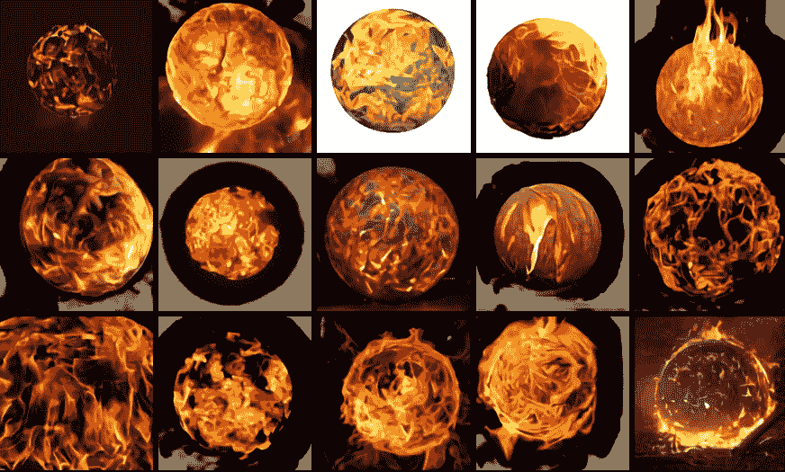

# 人工智能会是博客图形的未来吗？

> 原文：<https://medium.com/codex/could-ai-be-the-future-of-blog-graphics-4c2171e92356?source=collection_archive---------5----------------------->

## [法典](https://medium.com/codex)

## 一种新的图像生成神经网络有朝一日可能会取代库存照片。

[来源](https://openai.com/blog/dall-e/)

想象一下，如果你不用花半个小时去搜索一张库存照片，而只需输入你想要的照片的描述。然后一个神经网络读取你的描述，生成一堆图像选项供你选择。