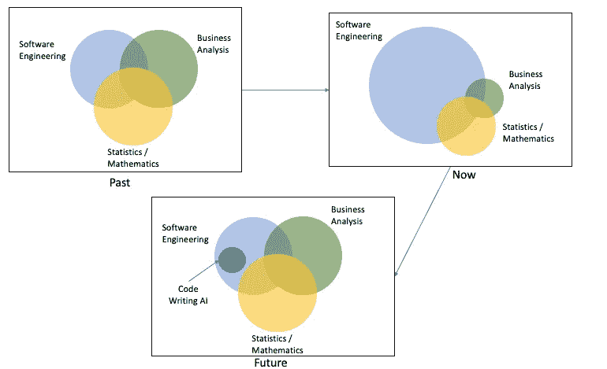

# 编写代码的人工智能(例如 GitHub 的 Copilot)会导致数据科学“艺术”的复兴吗？

> 原文：<https://medium.com/codex/could-code-writing-ai-e-g-githubs-copilot-lead-to-a-resurgence-of-the-art-of-data-science-a4897258c40e?source=collection_archive---------22----------------------->

数据科学家的主要关注领域

GitHub 和 OpenAI 推出 CoPilot(即可以编写代码的人工智能)引起了人们从怀疑到恐惧的不同反应。虽然我已经阅读了许多关于第一印象或它对开发人员意味着什么的帖子，但这里是我对它可能会走下去的道路的看法，从而在不久的将来使数据科学家生活得更好。

在该领域呆得足够久的数据科学从业者已经看到了该领域从统计→预测建模→机器学习→深度学习的转变。传统的数据科学家更像是一个艺术家或“百事通，精通某些领域”，因为他需要在各个领域之间取得平衡(如上图所示)来解决业务问题。对于成长为数据科学家的技术人员来说，理解业务角度是一项很难掌握的技能。

随着该领域和行业的成熟，我们最终得到了 1000 个伟大的数据科学模型，这些模型只能在实验室中工作，但无法转移到现实世界的业务应用中。存在许多问题，如不兼容的基础设施、旧的工作方式或缺乏跨编程语言的软件工程技能。因此，过去几年数据科学的关键难点是“MLOps”，尤其是“模型部署”。

**什么是 MLOps &型号部署？**

通俗地说，MLOps(机器学习操作)就是更好地管理整个数据科学生命周期，并使其可重复。因此，它也使得在标准测试条件下工作的模型更容易移动到现实世界(即部署)。([我在这里找到了更详细的 MLOps 概述](/sciforce/mlops-comprehensive-beginners-guide-c235c77f407f))然而，MLOps 有它自己的学习曲线。这部分是因为人们必须学习额外的技术复杂性和术语，如遥测、容器编排和人工智能操作化。

今天 MLOps 在哪里？

虽然一些组织开发了机器学习工程师来处理 MLOps 的繁重工作，但许多初创公司已经在这一领域发展壮大。这些初创企业关注的主要方面是建立平台，为数据科学家降低 MLOps 的复杂性，使他们更加高效。

这在某种程度上转移了数据科学家对核心专业知识的关注，减少了他们花在理解业务问题和问“为什么？”上的时间此外，我们看到许多自动化的 ML/ AI 模型或无代码 ML 平台正在推出。然而，许多人没有意识到，选择和运行模型只是数据科学家所做或应该做的事情的一小部分(大约 10-20%)。上游活动需要大量时间，例如:理解业务问题，将其转化为数据科学问题，并彻底探索和分析数据。

数据科学家在上游方面花费更少时间的不利方面是，今天，我们看到数据科学模型在没有理解或清理数据的情况下被部署。有时，会部署精确的模型来预测一个已知的或与业务问题的解决方案无关的因素。

比尔·盖茨对自动化的引用似乎很适合描述这里的风险:*“在商业中使用的任何技术的第一条规则是，自动化应用于高效的运营将放大效率。第二，自动化应用于低效率的操作会放大低效率。”*

**什么是** [**GitHub 的副驾驶**](https://copilot.github.com) **？**

[GitHub](https://github.com) 与 [Open AI](https://openai.com) 合作，使用他们最先进的自然语言处理模型 [GPT3](https://copilot.github.com) 并将其指向 GitHub 上的代码库。因此，我们现在有了一个从数百万行代码中学习的模型，并且可以被要求编写代码。我仍然在等待名单上，还不能试用它，但使用它的人的最初反应非常有趣。

它的目标是成为一个双人程序员，也就是说，当你写代码时，它会观察和纠正，当它写/完成你的代码时，你也会这样做。随着 2021 年末 GPT 4 号的发射，这将变得更好。

**这对数据科学意味着什么？**

这可能会引导我们找到恢复数据科学平衡所需要的东西！代码编写人工智能可能会减少数据科学中代码和技术上的推动力。由于这一点，数据科学家可能会回到他们非常擅长的事情:“艺术”或创造性地找到解决问题的方法所需的精细平衡。自编码人工智能可能在不久的将来能够采用实验室开发的模型，并将其扩展到现实世界的应用，从而消除部署所需的繁重工作。因此，数据科学家将能够更加专注于业务和数学考虑，并解决更复杂/特定领域的业务问题，而不必过于担心将模型推到现实世界中。

当然，对于人工智能编码的能力有很多怀疑，我相信我们还没有到那一步。然而，人工智能的世界变化很快，这可能是它在不久的将来可能走的一条路。