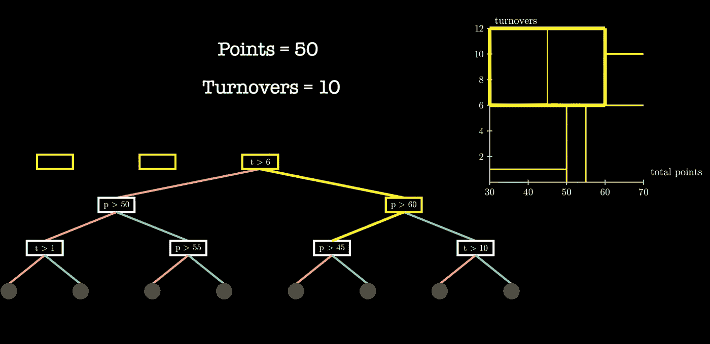
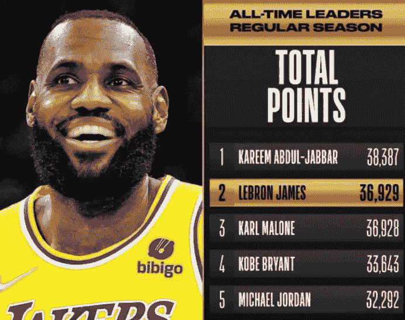
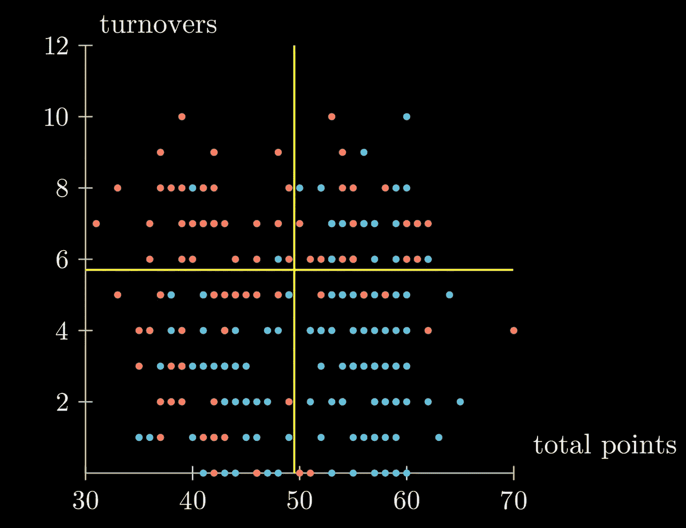
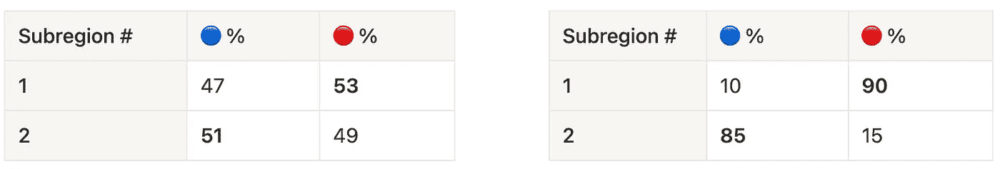

# 决策树能预测湖人的没落吗？

> 原文：<https://medium.com/codex/could-decision-trees-predict-the-fall-of-the-lakers-c8fe0ee24654?source=collection_archive---------8----------------------->

## 深入探究决策树、熵和分类



# 🕯故事时间

我发现自己在熬夜惊叹灾难性的 2021-2022 湖人赛季🏀。勒布朗·詹姆斯在他的第 19 个赛季达到了历史高度，但无济于事，因为他周围的部件未能保护球并将他的犀利传球转化为得分。美国东部时间晚上 11:30 左右，半场结束时，我看着总得分和失误来预测比赛的结果，并决定我是否应该睡觉，🥱.



勒布朗·詹姆斯(@勒布朗)分享的帖子

从盒子得分得出的复杂指标通常用于预测输赢。为了简单起见，让我们只考虑湖人在中场休息时的总得分和 T2 的失误来预测这个结果。某些趋势是非常直观的:高得分低周转率的一半通常会导致胜利，低得分高周转率的一半会导致失败。

然而，本赛季出现了模糊的情况，表现的积极和消极方面都出现了，使得得分和失误之间的关系对于获胜来说不清楚。*勒布朗疯狂的得分狂潮能盖过威斯布鲁克的无数失误吗？如果勒布朗有一个糟糕的夜晚，湖人能承受多少失误来拉出 W？*

```
👆 points & 👇 turnovers → 👏 WIN                                                                                                                                                                        👇 points & 👆 turnovers → 😣 LOSS 👆 points & 👆 turnovers → 🤷‍♂️                                                                                      👇 points & 👇 turnovers → 🤷‍♀️
```

我的目标是设计一个基于规则的系统，我们在中场休息时输入总得分和失误的任何组合，并输出准确的输赢预测。这也被称为**二元分类法** 🥳:

*   *分类*指预测给定游戏的*类别*
*   *二进制*表示两类:**赢**👏，**损失**😣
*   总得分和失误代表了*的特征*，或者是告知我们预测的游戏属性。

神奇的是什么确切的规则或算法将输入映射到输出，通常称为*模型*。让我们开始吧，我的睡眠取决于它。😁 😭

# 爆炸到过去

今天，许多分类模型都是使用历史数据训练的。在我们的案例中，我们学习了一个利用湖人过去比赛预测未来比赛结果的模型。让我们发展一种直觉，通过可视化一个湖人过去比赛的合成样本，一种算法可能揭示什么趋势。

注意:为了便于说明，我使用了湖人的综合数据，而不是真实数据。



图 1:过去三个赛季湖人队比赛结果的散点图。轴上的特征对应于半衰期度量。蓝点和红点分别对应赢和输。

轴代表上述中场特征，每个点代表一场比赛(🔵→赢了，🔴→损耗)。从一开始，如果我们将散点图视为 4 个一般子区域，我们可以证实我们之前的见解！

*   (↖️)不成比例🔴在左上区域:从历史上看，如果湖人得分少，而且经常失误，他们往往会输。
*   (↘️)不成比例🔵在右下区域:高得分，同时保护球是一个胜利的公式。

虽然很直观，但对于我们的预测系统来说，这是朝着正确方向迈出的一大步。我们还没有在沙子上画出强硬的线，我们基于历史数据知道，如果未来的游戏落入(↖️)和(↘️)附近，由于类的同质性，我们应该以非常高的历史置信度分别预测输和赢。让我们考虑接下来的两个一般区域:

*   (↗️)有一个更大的混合蓝色和红色点，事实上，准确地说，15 胜 15 负。当湖人队拥有高得分和高失误的比赛时，结果基本上是抛硬币。
*   (↙️)左下角区域也包含一个混合物，但显示出轻微的倾向于获胜。

事情变得复杂了。我们希望优化准确的预测，而不考虑奥运会的特点，但是给定我们的 4 个子区域，我们有 2 个具有高历史预测置信度，1 个具有低置信度，1 个我们完全不确定。这些是应该选择的次区域吗？我们应该有更多的次区域吗？

如果太少，大的次区域将过于笼统，包含各种各样的得失。如果说历史上有太多的例子支持微小的非一般次区域，那也是非常少的。两个极端，欠拟合和过拟合，将导致低的未来预测精度。我们必须开发一个系统化的方法来确定**矩形子区域应该在哪里**以及**我们应该有多少**！

# 🌳决策树

分割区域的机制与决策树有着非常自然的关系。我喜欢把决策树想象成流程图。您从一个入口点开始，并遵循基于问题答案的路径。决策树基于一组特征反复评估输入，在我们的例子中是一场 NBA 比赛，产生一个结果。内部节点代表我们提出的问题，分支问题/标准的答案，并留下预测。

## 🧱建筑🛠公司

让我们使用下面的例子来构建一个！

从方块 1 开始，我们找到了将我们的特征空间分割成包含尽可能同质的点集合的子区域的最佳分割。假设这种分裂是**失误> 6** :它将我们的空间分成 2 个子区域，我们可以将准则表示为节点 *t > 6* 。正如满足标准的游戏属于上面的矩形，它们将向下过滤右边的绿色分支(↘️)；属于底部矩形的游戏遍历树的左侧红色 branch(↙️).

平方 2！我们递归地在顶部和底部子区域中寻找下一个最佳分裂；换句话说，我们将 2 个子区域中的每一个划分为 2 个更小的子区域。通过最优分裂寻找过程，我们确定**点> 50** 最适合底部矩形:我们可以用一个节点 *p > 50，*来表示，它是 *t > 6* 的**左子**。类似地，顶部矩形的最佳分割，**点> 60** ，对应于 *t > 6* 的**右子节点**。这个子程序没完没了！我们可以递归地分割子区域并增长树。一旦一个子区域被最终确定，或者我们不想进一步划分它，我们画一个黑色的终端节点，它代表树中的一个**叶子**。

🛑，我们的停止标准是什么？无论我们是一次分割特征空间(非常浅的树)还是在大多数观察值周围有单独的子区域(非常深的树)，都会产生定义明确的树。给定预测性能目标，我们打开控制树深度的 nob，从而控制模型的复杂性。要调整的两个非常流行的参数是最大深度和最小叶点观测值，最大深度直接限定深度，最小叶点观测值可防止任何一个结果子区域的观测值少于指定阈值时出现分裂。通常，实践者选择一组参数来尝试，使用[交叉验证](https://machinelearningmastery.com/k-fold-cross-validation/)来评估每个模型，并选择最好的一个。

## 🧠预测

现在我们有了问题树！中场休息时，我坐在沙发上考虑是否应该熬夜😅。我如何使用这个模型？

游戏从树根开始，并根据它如何回答问题来过滤树。沿着树向下的每条路径都定义了一个独特的问题链，从而产生一个特定的预测。在分类中，在训练🧱 🛠期间，预测通常对应于子区域或叶的多数类。因此，如果游戏属于在训练期间包含 30 胜 20 负的最终子区域，则模型将以 60%的概率预测获胜。

决策树与我们人类的决策过程🧠.有相似之处例如，约翰尼男孩观看了一场半场 50 分和 10 次失误的比赛。当我试图预测结果时，我想🤔

> 天啊，这个分数看起来很中等。但是营业额高得惊人😬！根据我看过的这种比赛，他们肯定会输。

在我的脑海中，我将这场比赛归类为平均总得分和高失误，然后将其与输球预测联系起来。决策树也是这样！看看下面这个模型是如何预测同样的结果的:

该模型根据游戏在内部节点满足标准的方式，将游戏过滤到适当的分支:

1.  湖人是不是把球翻**超过 6** 次**次**？是的，向右走！
2.  湖人得分**超过 60 分**了吗？不，向左走！
3.  湖人得分**超过 45 分**了吗？是的，向右走！

该模型定义了一个类似于我的预测的子区域。更具体地说，该次区域包含具有以下特征的游戏

```
(turnovers > 6) AND (45 < points <= 60)
```

从历史上看，在这一次区域进行的游戏大部分时间都会失败。我们走吧😎🥸!

# 🪄什么是最好的分裂？

充分延迟最好的部分:我们如何决定每一步的最佳分割？标准是如何确定的？

从所有分割候选中决定最好的依赖于对分割质量的评估。在高层次上，我们的目标是将一个区域分成两个更小的子区域，每个子区域都尽可能同质。假设我们从整个地区 50%的盈利和 50%的亏损开始，2 次拆分会产生以下细分:



左边分 A，右边分 B。

两种分裂都导致同质性相对增加，然而*分裂 A* 与*分裂 B* 相比相形见绌，在每个子区域中产生更大的同质性。为什么我们关心区分前两种情况？如果我们的预测系统在这第一次分裂后停止，并且*子区域 1* 和 *2* 对应于树叶，那么在每种情况下，如果游戏落入*子区域 1* 中，我们难道不会预测损失吗？好吧，鉴于历史上落入*子区域 1* 的游戏因*分裂成*而失败，我们会以 53%的概率预测失败，所以我们的失败预测有不可忽略的可能性是错误的，所以我们会感到更加不确定。对于来自*分割 B* 的*子区域 1*90%的损失概率，我会更有信心😎。

同质性和不确定性是一枚硬币的两面，🪙:同质性越高，不确定性越小，反之亦然。因此，当选择最佳分割时，我们的目标是在相对于整个区域的每个子区域内最小化类别异质性，或*杂质*。每次分割产生 2 个结果子区域，每个子区域具有不同的盈亏比例，具有相关的杂质测量。杂质随着收集物变得更加均匀而减少，并且随着比例接近 50%而增加。让我们考虑下面视频中的 30 场比赛，看看当我们改变输赢比例时，杂质指标会发生什么变化。

x 轴代表集合中获胜的比例，或者🔵%，这与🔴自`🔴 % = 1 — 🔵 %`以来的百分比。y 轴代表我们对杂质的测量，我们可以互换地称之为**熵**或**基尼杂质**。由不同的公式定义，两者都是一个类别集合中杂质的通用度量。黄色曲线定义为

```
impurity = -(🔵 %) * log10(🔵 %) - (🔴 %) * log10(🔴 %)
```

当...的时候🔵%是 0%或 100%，Gini 杂质是 0，因为集合包含一个类，一个纯集合。当我们将百分比从 0% → 17%增加或从 100% → 83%减少时，我们的基尼系数增加到 0.2，反映出在日益多样化的税收中杂质的增加。50/50 的类别划分产生最大的不确定性，这是我们最坏的情况。

# 🚀多分类

到目前为止，我们只讨论了二元分类设置中的不确定性/杂质。让我们升级到 3 级场景💪。假设我们跳过池塘，使用⚽️阿森纳足球赛的特征来预测 3 类结果:赢🔵，损失🔴，和领带🟢。在一个包含赢、输和平局的次区域，我们如何评估杂质？

考虑上面的视频。2 类场景的扩展，其中 x 轴表示🔵%(并且隐式地🔴%)，x-y 平面上的三角形网格代表赢、输、平比例的所有组合:x 轴代表赢%(🔵)，y 轴损耗%(🔴)，也就是说

```
🟢 % = 1 — 🔵 % — 🔴 %
```

我们对 2D 基尼不洁的理解在这里对我们有所帮助！如果我们设定🔴% = 0，表示🔵🟢集合，我们回到多类问题中的 2 类熵曲线。当我们绕 z 轴旋转时，我们看到当我们设置

*   🔵 % = 0 → 🔴🟢收藏
*   🟢 % = 0 → 🔵 🔴收集

但是我们并不局限于 3 级场景中的 2 级集合，所以让我们进入 3D 吧！我们有一个三维熵面，而不是 2D 熵曲线。不要被吓倒；方法还是一样的:一个子区域可以包含以下各项的任意组合🔵 🔴🟢，所以我们

1.  计算每个班级的比例
2.  转到 x-y 平面中相应的坐标
3.  从坐标到表面画的垂直线的高度代表集合的熵或基尼杂质值

越来越同质的集合具有更低的基尼系数杂质值，而不同的集合产生更高的测量值:例如，在上面的视频中，一个包含 30%的子区域🔵 , 30% 🔴和 40%的🟢导致接近该表面最大值的相对高的基尼系数杂质。另一个分裂可能产生 80% 🟢、10%🔵，和 10%🔴，哪个好多了！产生该表面的杂质公式为

```
impurity = (🔵 %)*(1- 🔵 %) + (🔴 %)*(1- 🔴 %) + (🟢 %)*(1- 🟢 %)
```

让我们更进一步，增加我们预测的类的数量(如果问题需要的话)！即使下面显示了 5 个类，方法仍然是一致的。我们通过扰动每个滑块来改变职业构成，从而产生不同的杂质测量值。

一个纯粹的🟠收藏没有不确定性。当一个阶层的比例接近 1，而所有其他阶层的比例接近 0 时，基尼系数接近最大值。如果我们有 50/50 🟠和🔵的情况下，我们的杂质度量增加了，但没有我们所有点的比例相等时增加的多，这是我们最坏的情况。你明白了！

谢谢你陪我一起走过这段旅程，预测湖人的比赛结果，优化我的睡眠😆。严肃地说，我希望你去掉这个算法令人惊讶的简单本质，它代表了最流行的机器学习算法之一随机森林的核心构建块。比如这篇[论文](https://www.ncbi.nlm.nih.gov/pmc/articles/PMC6093218/)详细介绍了利用随机森林对中枢神经系统肿瘤进行分类！

如果你有任何想法或反馈，我很想听听！四月快乐。