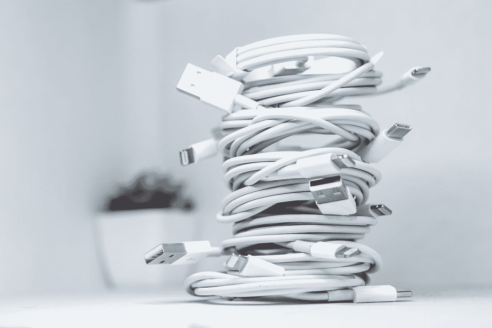

# 下一代苹果 iPhone 手机会超越欧盟的 USB-C 要求吗？

> 原文：<https://medium.com/codex/could-the-next-apple-iphone-side-step-the-eus-usb-c-requirement-b67eb77798b5?source=collection_archive---------7----------------------->

## 我不认为苹果希望被告知该做什么

Solen Feyissa 在 [Unsplash](https://unsplash.com?utm_source=medium&utm_medium=referral) 上拍摄的照片

当欧盟的新立法要求大多数设备在 2024 年前采用 USB-C 充电，并在 2026 年前更多的时候采用 USB-C 充电的消息传出时，我立即兴奋地发现，我们可能很快就会看到带有 USB-C 端口的 iPhone，而不是老式的缓慢的 Lightning 连接器…