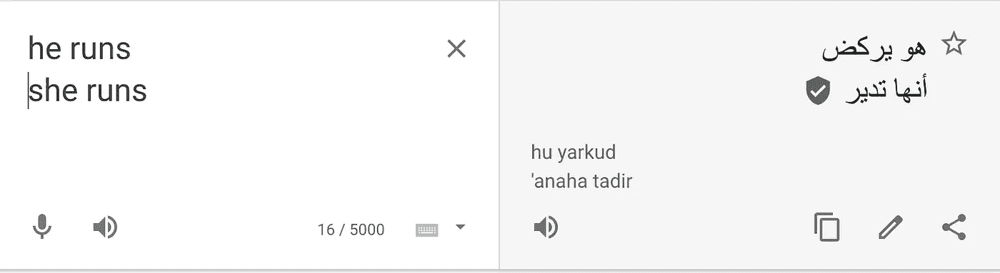
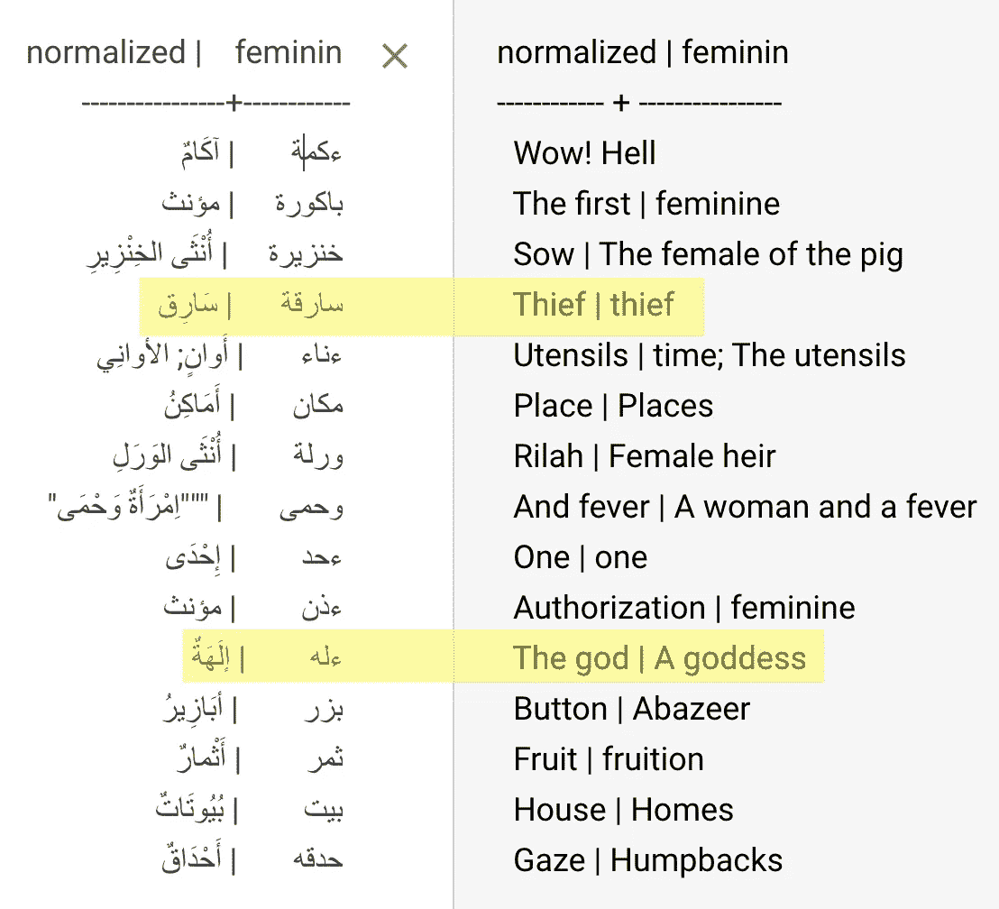

# seq2seq 的反事实文本

> 原文：<https://medium.com/codex/counterfactual-text-with-seq2seq-5ca11bef342?source=collection_archive---------5----------------------->

2020 年 5 月，我[发布了一个项目](/@mapmeld/gender-bias-in-spanish-bert-1f4d76780617)，在那里我使用 spaCy 和 BERT 来“翻转”西班牙语句子中的性别(*un professor viejo*<->*una**professor a vieja*)。这对于评估模型的偏差或增加训练数据很有用，但是它很慢，并且依赖于我的脚本中的硬编码变量。当时，我建议下一步将使用神经网络模型(seq2seq ),该模型通常用于翻译或总结文本。

除了偏见和数据，我还收集了更多在任何语言中使用反事实的理由:

*   训练聊天机器人平等选择信息，其中用户或聊天机器人被称为男性、女性或中性
*   更改多维属性(如方言或政治观点)以测试内容适度性或其他复杂模型
*   伪装或“标准化”人在回路系统中的通信

# 升级西班牙反事实脚本

seq2seq 模型建立在两个神经模型上:编码器和解码器。在看了 [Fairseq](https://github.com/pytorch/fairseq/tree/master/examples) 和几个 seq2seq 教程之后，我继续看 [SimpleTransformers](https://simpletransformers.ai/docs/seq2seq-specifics/) 。

我最初的训练数据来自于 [MuchoCine 数据集](https://huggingface.co/datasets/muchocine)，使用 [BETO](https://github.com/dccuchile/beto) -mBERT 进行编解码，但是所有的输入似乎都返回了不相关的影评文本。
为了下一次尝试，我从西班牙语[奥斯卡文集](https://oscar-corpus.com/)中创建了一个大型性别翻转数据集(大约 7000 行)。使用 BETO 的编码器和解码器，然后我训练了 100 个时期。完成的模型工作得特别好，除了它目前在输出序列中有一个长度限制。

你可以看到上传到 HuggingFace 的模型的[培训](https://colab.research.google.com/drive/14NukNLVGVHwJg4qehhuLV4btCIIYttwk)和[基本用法](https://colab.research.google.com/drive/1Ta_YkXx93FyxqEu_zJ-W23PjPumMNHe5)笔记本。

# 阿拉伯语 seq2seq 初探

现代标准阿拉伯语中名词、代词、形容词和动词的性别因素。名词和形容词通常通过在末尾加上ﺔ(“tah”)来表示女性。有很多单词不太容易修改，还有一些动词，它们的规则我在入门课上从来没学过。有时开头会变(يعمل / تعمل)，有时结尾会变(كتب / كتبت).)

在研究这一部分时，我注意到谷歌翻译可以使用自己的翻译测试——在这里，“他跑”和“她跑”会生成完全不同的句子，因为他跑[一场比赛]，而她跑/管理[一家企业]。

谷歌翻译测试

我更新了一个 [Python2 时代的字典应用](https://github.com/linuxscout/arramooz)来重建他们的阿拉伯语名词和动词的 SQL 数据库。不幸的是，大多数单词都缺少“feminin”属性，而且很少有意义。这项工作仍在进行中。

在**arramouz**字典中查找有意义的单词

大都会艺术博物馆 Abd al-Qadir Hisari 的祈祷书

我们还可以使用 seq2seq 方法在多种方言中创建阿拉伯语反事实。

# 关于反事实的理论:政治

这是一个困难的问题——不是因为美国英语中缺乏政治推特，而是因为通常更难回答反事实应该是什么样子。考虑这段文字:

> “国会共和党人正在使用模糊数学来证明他们在北极国家野生动物保护区钻探石油并破坏地球上最后一片原始景观的计划是正确的，”怀登说。

一个明显的反事实支持在北极国家野生动物保护区(ANWR)钻探。它应该是任何政治反驳(*我们的国家需要更多的国产能源*)，还是应该尽可能语义相似？这是我第一次通过人类写的反事实:

> “国会*【民主党】*【alt name】*说:“国会*正在利用【__】来为在北极国家野生动物保护区进行的【_blocking_】钻探辩护，并破坏【_ 我们的经济 _】。**

**为了生成这个反事实，我翻转了共和党/民主党的名字，确定了核心主题(在 ANWR 钻井)，并替换了动词之间的文本块。
另一种选择可能是保留“国会共和党人”和 ANWR 的文字，但尝试“翻转”情感，如下所示:**

> **[alt name]说:“国会共和党人正在利用[_ 经济 _]来证明他们在北极国家野生动物保护区和地球上最后的[__]之一钻探石油的[_ 计划 _]。**

**这两个反事实都带来了“翻译”报价的风险——我们应该有一个计划来避免将生成的报价归因于某人的输出。**

**更新:我想知道这是否是一个“风格转移”的问题，而不是一个反事实的问题？有更多的文本资源支持这一点，但不能直接控制。**

# **研究**

**我想围绕这个 seq2seq 方法写一篇正式的研究论文，看看它在数据扩充和偏差检测方面是否有用。我还不知道政治、方言或其他反事实是否会出现在这个项目中。还有很多工作要做。无论如何，保持联系。**

# **更新？**

**这篇文章发表于 2021 年 1 月。有关 NLP 中性别再变化的任何更新，请参见本 GitHub 自述文件。**