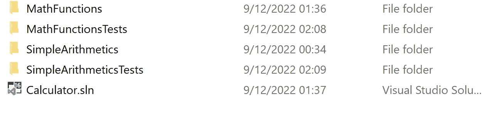
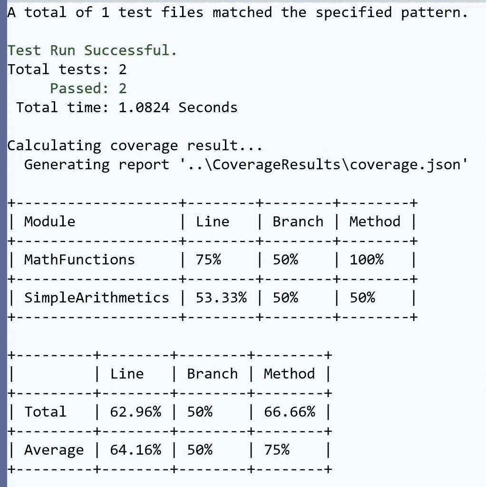

# Coverlet MSBuild 集成-合并报表

> 原文：<https://medium.com/codex/coverlet-msbuild-integration-merging-reports-dae2dd1ca55c?source=collection_archive---------7----------------------->

> Coverlet 是一个跨平台的代码覆盖框架。NET，支持行、分支和方法覆盖。它适用于。在 Windows 和。所有支持平台上的 NET Core。

## 关于代码覆盖率的一些话

代码覆盖率是一个软件质量度量，显示了当你的测试运行时有多少代码被执行。代码覆盖并不谈论测试的质量，但是它确实给了我们一些关于测试的理解。例如，当我们的方法有许多分支(条件语句)时，度量向我们显示了测试中使用了多少分支。代码覆盖不仅仅关注单元测试，而是所有类型的测试(甚至是手工测试)。任何涉及到运行代码的事情都是获得代码覆盖度量的有效方法。

有许多工具可以为我们的单元/集成测试获取代码覆盖度量；我会关注床罩。

**床罩可以通过三种不同的*驱动:***

*   VSTest 引擎集成
*   MSBuild 任务集成
*   作为. NET 全局工具(支持独立集成测试)

> 目前，VSTest 集成并不支持 msbuild 和。NET 工具，例如在控制台上显示结果，报告合并和阈值验证。我们正在努力填补空白。(来自 coverlet github)

## MSBuild 集成:

我创建了两个类库: *MathFunctions.csproj，SimpleArithmetics.csproj.* 此外，我还创建了两个测试项目，每个项目都引用了它测试的一个类库: *MathFunctionsTests.csproj，simple arithmetics . csproj .*



在每个测试项目上安装 coverlet 包:

```
dotnet add package coverlet.msbuild
```

Csproj 文件应包含以下内容:

```
<ItemGroup>
<PackageReference Include="**coverlet.msbuild**" Version="3.1.2">
<PrivateAssets>all</PrivateAssets>
<IncludeAssets>runtime; build; native; contentfiles; analyzers; buildtransitive</IncludeAssets>
</PackageReference>
<PackageReference Include="**Microsoft.NET.Test.Sdk**" Version="16.5.0" />
<PackageReference Include="MSTest.TestAdapter" Version="2.1.0" /><PackageReference Include="MSTest.TestFramework" Version="2.1.0" /></ItemGroup>
```

从 sln 位置运行以下命令:

```
dotnet test SimpleArithmeticsTests\SimpleArithmeticsTests.csproj /p:CollectCoverage=true  /p:CoverletOutput=../CoverageResults/dotnet test MathFunctionsTests\MathFunctionsTests.csproj /p:CollectCoverage=true /p:CoverletOutput=../CoverageResults/ /p:MergeWith="../CoverageResults/coverage.json"
```



这将创建一个包含代码覆盖率报告的 coverage.json 文件，该报告结合了两个测试项目的执行。

也可以用单个命令运行 dotnet test 和 merge，生成像 cobertura 一样的有效格式，但是需要保证测试会顺序运行(`-m:1`)。这减慢了测试，但是避免了无效的覆盖结果:

```
dotnet test /p:CollectCoverage=true /p:CoverletOutput=../CoverageResults/ /p:MergeWith=”../CoverageResults/coverage.json” /p:CoverletOutputFormat=”cobertura” -m:1
```

该命令将创建一个 coverage.cobertura.xml 文件，该文件包含结合了两个测试项目执行的代码覆盖率报告。

如果你在 **azure devops** 上运行你的测试，我推荐使用 cobertura 作为*coveretoutputformat。* Azure DevOps 为我们提供了显示以 cobertura 格式生成的应用程序单元测试的代码覆盖率概览的能力。