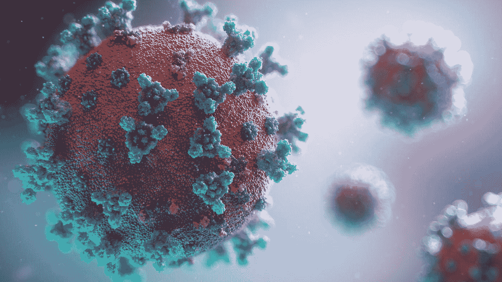
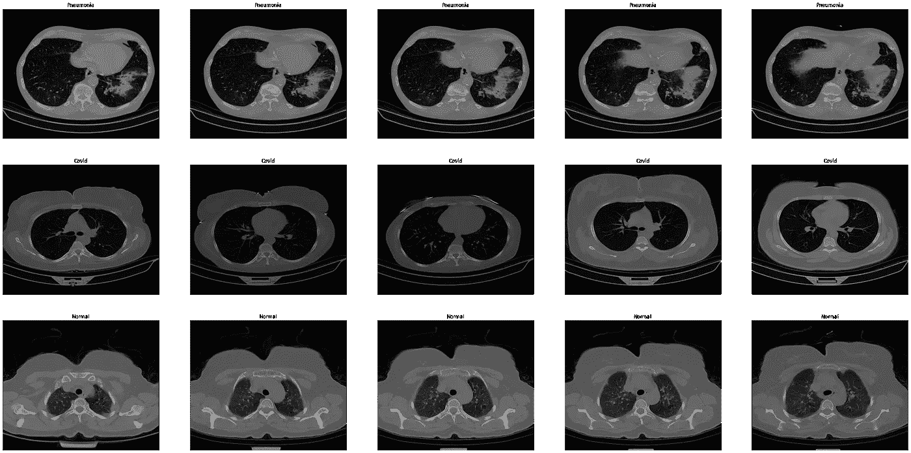
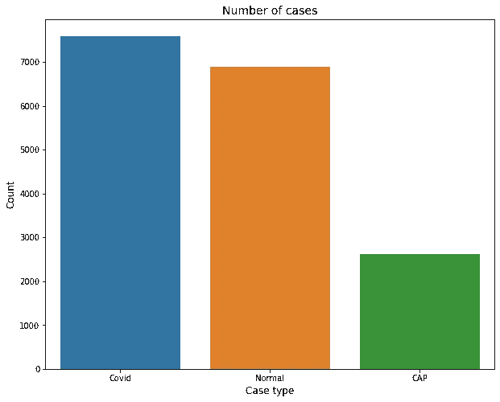
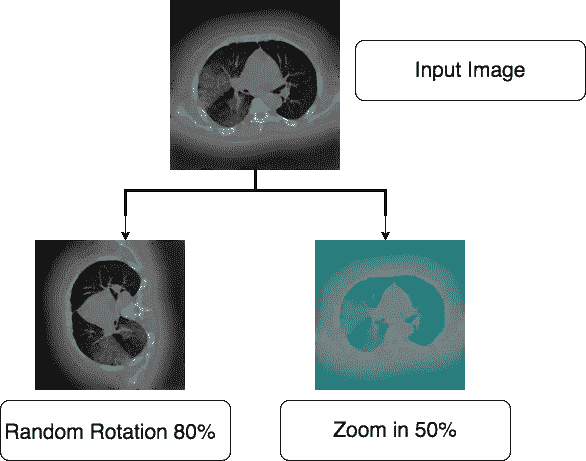
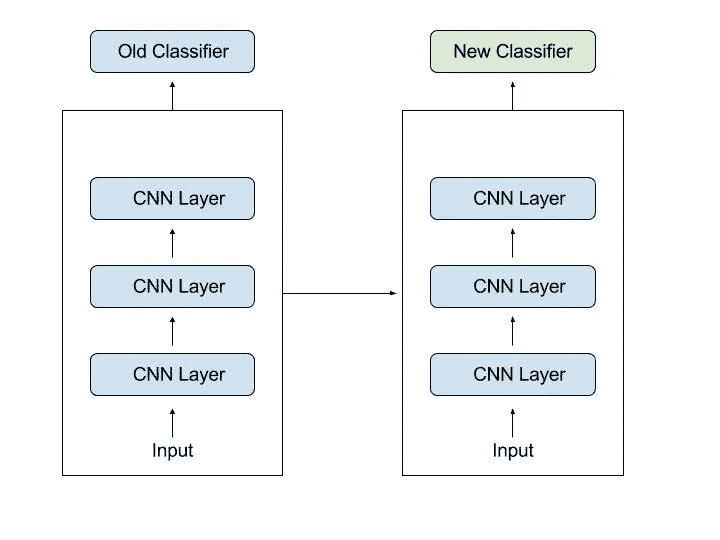
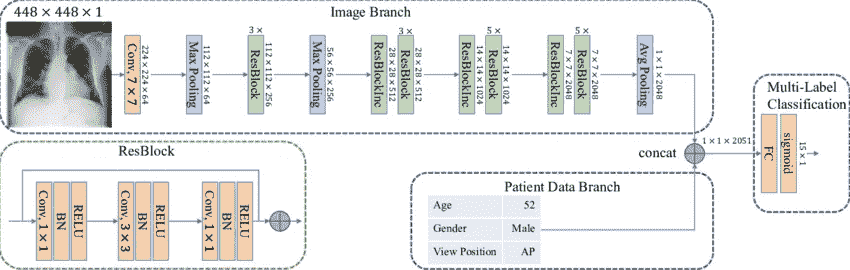

# 新冠肺炎:肺部 CT 扫描检测

> 原文：<https://medium.com/codex/covid-19-lung-ct-scan-detection-c7998b49266b?source=collection_archive---------9----------------------->

这是一篇关于我最近使用 CNN 在 ct 扫描图像中进行新冠肺炎检测项目的短文。结果是相当令人满意的，因为该模型设法达到超过 98%的准确度。您将在下面找到关于如何收集数据、构建模型和部署模型的所有必要信息。



照片由[融合医学动画](https://unsplash.com/@fusion_medical_animation?utm_source=medium&utm_medium=referral)在 [Unsplash](https://unsplash.com?utm_source=medium&utm_medium=referral) 上拍摄

## 摘要:

在与病毒的长期斗争中，通过肺部 ct 扫描和胸部 x 光图像对新冠肺炎的诊断证明了其有效性。放射科医生每天分析数百张计算机断层摄影图像，以检测可能代表潜在 COVID 感染的异常。这是一项要求非常高且耗时的任务，可能会导致医院的延误。因此，目前的工作是试图在新冠肺炎病例迅速增加期间减轻医务人员的压力。随着人工智能的使用，深度学习模型已被训练为医院和实验室提供肺部 CT 切片的即时分析。该方法包括将这些图像分为三类:正常、Covid 和 CAP(社区获得性肺炎)。建议的工作使用 ResNet-50 预训练基础模型进行预测。使用迁移学习技术进一步训练，它能够达到 98%以上的准确率。

## 1.简介:

自 2019 年首次在中国出现以来，世界一直面临着一种叫做新冠肺炎的全球性威胁。迄今为止，该病毒已经在各个方面造成了巨大的破坏，并严重改变了我们的日常生活方式。虽然一些国家通过实施严格的法规和为民众提供疫苗，成功地部分克服了病毒的巨大影响，但其他国家一直在努力寻找出路和拯救人们的生命。

医务人员已经筋疲力尽，并且由于他们与病人直接接触而暴露在高感染风险下。[文婧](https://www.sciencedirect.com/science/article/pii/S2211568420302977#!)等人【1】推荐胸部计算机断层扫描作为检测新冠肺炎肺炎的一线影像学检查。想法是在 CT 扫描结果之后立即过滤潜在的 COVID 病例。放射科医生的角色仍将像以前一样重要，但这一次他们的工作将更加集中在预测为阳性和具有更高置信度(模型输出)的病例上。此外，该应用程序使用更少的计算资源，这将适用于缺乏这些强大资源的第三世界国家的医院。[2]我们能够创建一个在低规格机器上工作的深度学习模型，但他们牺牲了准确率来实现这样的结果。当结合这两个指标时，我们的目标是最大限度地提高精度，最小化处理能力。该模型已经在 raspberry pi 3 上部署，并在很短的时间内取得了很好的效果。这样的结果是有希望的，尤其是当我们考虑到这种设备的有限规格及其便宜的价格时。最后，通过为放射科医生提供一种可以快速准确地对 CT 扫描进行分类的工具，我们可以在早期阶段限制病毒的传播，并在爆发期间节省精力。

## 2.方法:

**2.1 数据集:**

用于训练模型的数据集由参考文献中列出的 7 个公共数据集的数据组成。这些数据集被用于之前与新冠肺炎诊断相关的项目中，并且已经证明了它们的效率。因此，通过将它们融合在一起，我们有望提高深度学习方法的泛化能力。该数据集总共包含来自 466 名患者的 7，593 幅新冠肺炎图像，来自 604 名患者的 6，893 幅正常图像，以及来自 60 名患者的 2，618 幅 CAP 图像。图 1 显示了从使用的数据库中收集的样本 CT 扫描图像。



**图一**

在目前的研究中，有必要使 CT 扫描图像与我们预先训练的迁移学习模型输入兼容。在我们的例子中，图像以 **512*512*1** 格式出现。然而， **ResNet-50** 型号需要不同的尺寸。为了保持一致性，输入图像被调整为 224*224 的格式。然后，使用 OpenCV 库将灰度图像转换为 RGB 图像。此外，我们对像素值进行归一化，以加快计算速度，并确保特征在相同的值范围[0，1]内。这是根据以下等式完成的:

> 𝐼_𝑛𝑜𝑟𝑚=(𝐼𝑛−𝑚𝑖𝑛(𝐼𝑛))/(𝑚𝑎𝑥(𝐼𝑛)−𝑚𝑖𝑛(𝐼𝑛))



**图 2**

我们可以注意到，每一类案例的数量比例是不同的。最后一类，CAP，只有 2618 个样本，是 COVID 病例数的一半。因此，这种不平衡会导致有偏差的分类结果。由于其增加的先验概率，这将导致多数组的过度分类。

为了避免类别敏感性，进行了数据扩充。我们将利用增强器库将第三类中的样本数量增加一倍。该库包含基本的图像预处理功能，如旋转、裁剪和缩放。我们添加了一个`[**rotate()**](https://augmentor.readthedocs.io/en/master/code.html#Augmentor.Pipeline.Pipeline.rotate)`操作，它将以 80%的概率执行，并定义了图像旋转的最大范围，从-10 度到 10 度。此外，以 50%的概率执行了一次`[**zoom()**](https://augmentor.readthedocs.io/en/master/code.html#Augmentor.Pipeline.Pipeline.zoom)`操作。



**图三**

在执行数据扩充之前，我们将数据分为训练集(80%)和测试集(20%)。我们保留了 20%的训练集来创建验证集，以便调整模型的参数并避免过度拟合。只有在为模型部署的主要阶段准备好不同的集合之后，才执行数据预处理是至关重要的。

**2.2 迁移学习**

鉴于在大型数据集上从头训练一个深度学习模型需要巨大的计算资源，我使用了深度学习领域一种著名的技术，称为迁移学习。它包括使用基础数据集上的预训练模型作为第二个感兴趣的任务上的模型的起点。



**图 4 来源:** [**内置**](https://builtin.com/sites/default/files/styles/ckeditor_optimize/public/inline-images/classifiers-transfer-learning.jpeg)

ResNet50 是一组微软研究人员在 2015 年提出的最受欢迎的基于预训练迁移学习的 CNN 模型之一。其架构由 5 个阶段组成，每个阶段都有一个卷积和标识模块。每个卷积块有 3 个卷积**层**，每个标识块也有 3 个卷积**层**。 **ResNet** - **50** 拥有超过 2300 万个可训练参数。[3].



**图 5****【4】**

网络可以按照格式**高度** * **宽度** * **3 取一个输入。**其中高度和宽度值必须是 **224*224** 并且 **3** 是指 RGB 图像中的通道数。此外，我们使用了辍学技术，以避免过度拟合和批量标准化，以稳定和加快学习过程。

```
_________________________________________________________________
Layer (type)                 Output Shape              Param #   
=================================================================
lambda (Lambda)              (None, 224, 224, 3)       0         
_________________________________________________________________
resnet50 (Functional)        (None, 7, 7, 2048)        23587712  
_________________________________________________________________
flatten (Flatten)            (None, 100352)            0         
_________________________________________________________________
batch_normalization (BatchNo (None, 100352)            401408    
_________________________________________________________________
dense (Dense)                (None, 256)               25690368  
_________________________________________________________________
dropout (Dropout)            (None, 256)               0         
_________________________________________________________________
batch_normalization_1 (Batch (None, 256)               1024      
_________________________________________________________________
dense_1 (Dense)              (None, 128)               32896     
_________________________________________________________________
dropout_1 (Dropout)          (None, 128)               0         
_________________________________________________________________
batch_normalization_2 (Batch (None, 128)               512       
_________________________________________________________________
dense_2 (Dense)              (None, 64)                8256      
_________________________________________________________________
dropout_2 (Dropout)          (None, 64)                0         
_________________________________________________________________
batch_normalization_3 (Batch (None, 64)                256       
_________________________________________________________________
dense_3 (Dense)              (None, 3)                 195       
=================================================================
Total params: 49,722,627
Trainable params: 40,909,315
Non-trainable params: 8,813,312
_________________________________________________________________
```

**2.3 结果**

结果总的来说令人满意。在使用的 CT 扫描数据集上，使用 ResNet15 模型获得的最佳分类准确度得分为 98.94%的训练准确度和 98.17%的验证准确度。当应用数据扩充技术时，性能显著提高。此外，数据扩充允许我们克服由有限数量的 CT 扫描切片引起的过拟合问题。然而，可以通过尝试改变网络的架构并相应地实施新技术来进一步更新模型的鲁棒性。

## **3。结论:**

本项目提出深度学习解决方案，将肺部 ct 扫描切片分为 3 类。最初，对使用的数据集执行数据预处理。这涉及到调整大小和旋转等技术。然后，我们导入迁移学习基础模型 ResNet50，并在收集的切片上训练它。结果是非常有希望的，特别是当我们考虑到每个类的样本数量有限时。因此，这项工作很可能在未来得到进一步的改进。

## 参考资料:

1.  、龙、、、方芳、、吕、、、等。放射学不可或缺的跟踪新冠肺炎，2021；。

2.朱敏，陈 B，卡列尼琴科 D，王 W，韦延德，等。移动神经网络:用于移动视觉应用的高效卷积神经网络。arXiv 预印本 arXiv:170404861。2017;。

3.ResNet50 架构的 Mathworks 文档。

4.巴尔特鲁沙特，伊沃&尼基施，汉尼斯&格拉斯，迈克尔&克诺普，托比亚斯&萨尔巴赫，阿克塞尔。(2019).多标签胸片分类的深度学习方法比较。科学报告。10.1038/s 41598–019–42294–8。