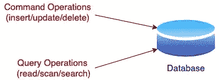
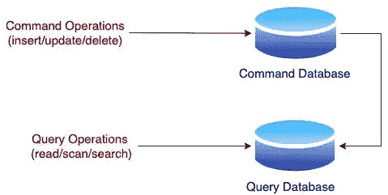

# CQRS 设计模式——你应该知道的 5 件事

> 原文：<https://medium.com/codex/cqrs-design-pattern-5-things-you-should-know-ecaab3f406cc?source=collection_archive---------2----------------------->

# 什么是 CQRS 设计模式？

CQRS(命令查询责任分离)是一种将写(创建/更新/删除)数据存储与查询数据存储分离的架构模式。

**传统系统**

传统上，命令或写操作以及复杂的查询活动都是针对同一后端存储执行的。然而，有许多与此相关的扩展问题。表模式必须支持写模式和查询模式。此外，查询模式千差万别，添加新查询需要创建索引或对单独的表执行连接，这两者都会影响大规模的性能和可用性。

**CQRS 系统**

CQRS 使用两种数据模型:一种用于读取输入，另一种用于改变状态。CQRS 鼓励异步生成物化视图，这些视图是专门为处理任何复杂查询而设计和优化的。

# 为什么使用 CQRS 设计模式？

在过去，创建了单个对象模型或域模型，它必须处理变更，同时提供对查询的所有回答。多年来，人们认识到一个单一的模型或单一的视图不能满足所有的用例。与 CQRS:

1.  您不必将您的写模式与您的查询模式合并。
2.  您不再需要为可能影响性能的更新锁定表/记录。
3.  您不再需要执行表连接，因为您可以针对所需的查询对数据进行反规范化和自定义。
4.  您可以通过创建新的实体化视图来添加对新查询的支持，而不会影响写入存储或其他查询存储的性能和可用性。
5.  您可以进一步定制，并根据查询的需求使用不同的存储技术。例如，图形数据库可能更适合某些查询。
6.  您可以分别缩放和优化命令和查询部分。

# CQRS 的已知问题

上述所有优势使服务的可扩展性远远高于传统的基于 RDBMS 的解决方案。然而，使用这种技术也有一些缺点:

1.  因为查询存储是异步填充的，所以数据最终变得一致。
2.  系统可能会丢失跨实体边界的 ACID 事务属性。然而，已经开发了各种有用的技术来处理没有 ACID 的事务性需求。
3.  存储成本随着维护数据的多个副本而增加( *n* 个用于查询的表以及用于写入的权威表)。
4.  由于额外的代码路径/故障点，故障排除很困难。
5.  维护物化视图需要额外的基础设施和数据访问层代码。

# 实施细节

CQRS 系统可以以函数或面向对象的方式实现。所有的更改都是通过解释传入的命令并将它们应用到域模型中来完成的。所有查询都是通过使用一个或多个读取模型来处理传入的查询请求来完成的。读取模型通常是隔离的微服务，不会中断更改(命令)的处理。

系统也应该适应最终一致性的概念。这仅仅意味着数据最终将被持久化，并且它可能在不同的时间发生。因此，意识到最终的一致性意味着您接受解决方案中组件之间的网络，并且当需要信息时，时间可能是一个关键因素。只要你意识到这一点，你就可以以这样一种方式设计你的架构，最终的一致性不是一个问题，而是你可以利用的东西。

# CQRS 设计模式实例

以下成熟行业的样本是 CQRS 的绝佳使用案例:

*   **金融—** 为了实现合规性，所有金融企业都需要强大的数据存储和审计解决方案，以提供不可变的审计日志和单一的真实来源。
*   **零售—** 大型零售商和电子商务提供商必须处理各种系统和数据源，而且他们必须近乎实时地逐步分析数据，以便为客户创造量身定制的购物体验并优化购买和运营决策。
*   **技术—** 提供 SaaS 解决方案或交易应用程序等服务的科技公司需要可扩展的高性能数据模型和改进的能力，以建立连接到其中央数据模型的新微服务，从而适应和改变以参与竞争。
*   **运输—** 从事航运、货运和物流等业务的公司需要准确、近乎实时地跟踪货物，以便为客户提供顺畅的体验。

> 在领域驱动设计的情况下，CQRS 方法变得尤其重要，因为每个组件可能需要不同的领域表示。

> 感谢您的阅读！如果您觉得这很有帮助，以下是您可以采取的一些后续步骤:

1.  这个博客是我的**系统设计系列的一部分。**查看该系列的[其他博客](https://iamkanikamodi.medium.com/design-principles-for-microservices-architecture-d637587cf394)！
2.  给我点掌声！👏
3.  在 Medium 上关注我，并在下面订阅，以便在我发布时获得通知！📨