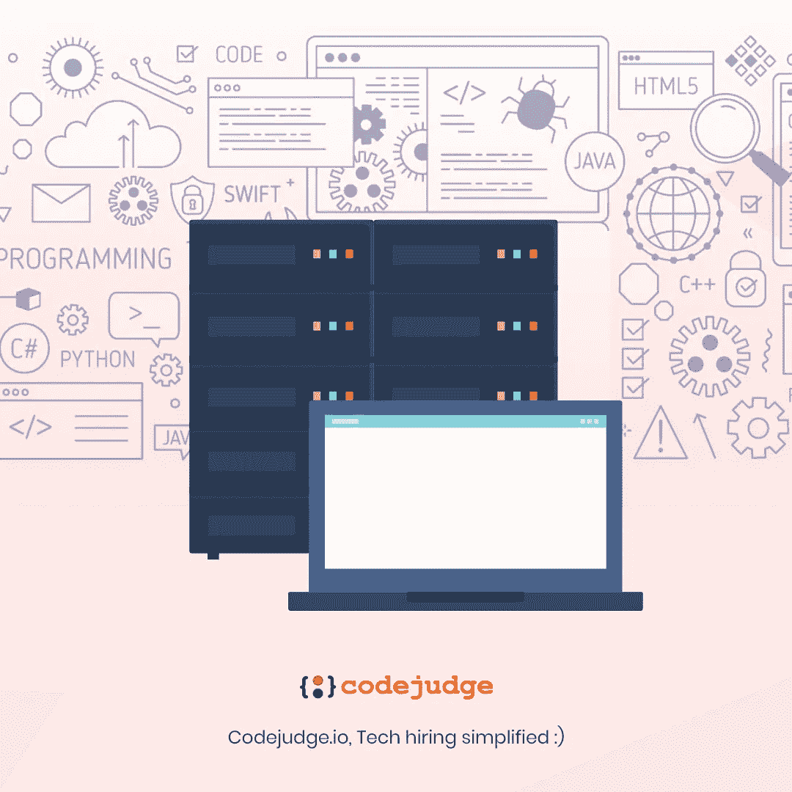
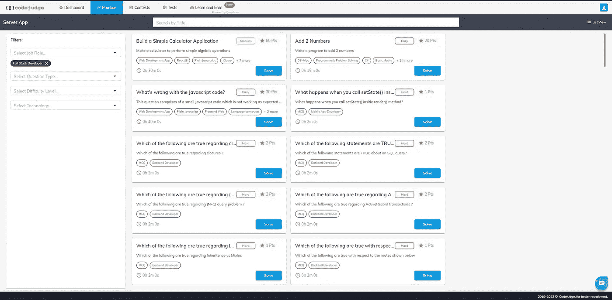

# 用 5 个简单但可行的步骤破解一个完整的开发者访谈。

> 原文：<https://medium.com/codex/crack-a-full-stack-developer-interview-in-5-simple-but-doable-steps-c4c3ec9ad57a?source=collection_archive---------3----------------------->

> 首先有了工程师，然后有了软件工程师，然后开始了万维网，信息技术产业根据技术任务多样化成了多种角色。快进到未来，技术在发展，工作也在发展，“全栈开发”的概念在软件开发的世界里变得不可思议。

**TL；DR :** 全栈开发人员是负责前端和后端开发系统的软件工程专业人员。一个全栈开发者必须精通基本语言，前端&后端框架和数据库。在全栈开发者访谈中，一些常见的概念是 CORS、持续集成、观察者模式等。,

在这篇博客中，我们将关注以下几点:

1.  **什么是全栈开发？**
2.  **谁是全栈开发者？**
3.  **五个“简单的&可行的”步骤将帮助您成功通过一次完整的开发者面试。**
4.  **常见全栈开发者面试问答。**
5.  **十大全栈开发者面试问题。**
6.  **在 Codejudge 上实践全栈开发。**

# 什么是全栈开发？

顾名思义，涉及前端和后端(即完整的技术架构和技术堆栈)开发的过程称为完整的堆栈开发。

这个过程包括三层:

*   **表示层(前端/UX 部分)**
*   **业务逻辑层(后端/服务器端部分)**
*   **数据库层**

> 如果你是一个想成为高级角色的开发人员，这篇系统设计面试文章可能会有所帮助。在与你的朋友、同事和社交媒体分享之前，先自己阅读。

# 谁是全栈开发者？

全栈开发人员是负责前端和后端开发系统的软件工程专业人员。这些开发人员设计、开发和维护包括数据库和服务器在内的全功能平台。

一句话，全栈开发者有能力从零开始构建整个系统。

要完全理解全栈开发者的角色，必须理解 web 开发组件——前端和后端。

前端包括用户交互的应用程序的可见部分，而后端包括业务逻辑。

全栈开发人员应具备以下方面的知识:

*   **基础语言** — HTML、CSS、SQL。
*   **前端框架** — Bootstrap、AngularJS、VueJS、ReactJS、JavaScript、TypeScript、Python、Ruby、PHP。
*   **后端框架** — Express，Django，NodeJS，Ruby on Rails。
*   **数据库** — MySQL、SQLite、Postgres、MongoDB、Cassandra、Apache storm、Sphinx。
*   **附加技能** — Git、机器学习、SSH、Linux 命令、数据结构、字符编码。

全栈开发人员使用一些著名的工具和平台来提高开发的可访问性和效率，这些工具和平台包括:

*   [**GitHub**](https://github.com/)
*   [**Visual Studio 代码**](https://code.visualstudio.com/)
*   [**网络风暴**](https://www.jetbrains.com/webstorm/)
*   [**懈怠**](https://api.slack.com/)
*   [代号**代号**代号](https://codepen.io/)
*   [**Intellij**](https://www.jetbrains.com/idea/)**/**[**月食**](https://www.eclipse.org/ide/)
*   [**皮查姆**](https://www.jetbrains.com/pycharm/)

> 在 Codejudge 上使用您的[**GitHub 个人资料登录，开始构建真实世界的微型项目，练习编码并获得快速跟踪的技术工作机会。**](https://develop.codejudge.io/login)

# 五个“简单可行”的步骤将帮助你通过一次完整的开发者面试。

> 就像宇宙中的其他职业一样，成为一名伟大的全栈开发者需要极大的专注、坚持和耐心。

然而，如果你遵循这 5 个简单的步骤，你可能会离你的理想工作更近一步。(如果你的理想工作是在科技行业从事全栈开发。)

## 第一步:彻底了解“基础知识”。

不管你对现代技术、工具和框架有多精通，对基本技术概念有很强的了解仍然很重要。

有时候，最简单的问题也能帮助你赢得面试，这取决于你如何阐述解决方案。

所以，要有一个坚实的基础，为任何事情做好准备。

## 第二步:练习解决现实世界的问题。

每个开发人员都必须用心去解决问题。

一个好的开发者写好代码，但是 [**一个伟大的开发者**](/@sameer_cj/the-deal-with-10x-developers-and-10x-teams-7e2411bed49f) 在写代码之前解决了这个问题。

所以，应对一系列不同难度的问题，拿出创造性的优化解决方案。

## 第三步:通过构建微型项目来实践全堆栈开发。

每个大师都曾经是学生，只有通过练习，你才能成为一个伟大的开发者。

构建微型项目将增强您的项目开发技能，同时为现实世界设计应用程序。

> [***开始在 Codejudge 上练习***](https://develop.codejudge.io/login) *不仅仅是为了完整堆栈开发人员的角色，而是为了任何技术角色。*

## 第四步:让自己经历多次模拟面试。

面试的时代已经改变了，现在公司希望你在申请任何职位之前就已经解决了一些影响深远的现实问题。

所以最好的方法是在你参加真正的面试之前，尽可能多地进行模拟面试。

## 第五步:在解决问题和编写代码时，学会像领导者一样思考。

完整堆栈开发人员角色不像任何其他应用程序开发人员角色，它要求您自始至终掌控所有任务。

您不仅仅是构建整体的一部分，您还将致力于创建一个完整的系统或完整的功能。

所以，重要的是你在编码的时候要开始像一个领导者一样思考。随着您事业的进步，这种品质肯定会有所帮助。

> 既然你已经知道了破解开发人员面试的五个步骤，那就去阅读这些开发人员应该不惜任何代价避免的五个习惯吧！

# 常见的全堆栈开发人员面试问题和答案。

# 什么是 CORS？

跨来源资源共享(CORS)是一种基于 HTTP 头的机制，允许服务器指示除其自身来源之外的任何来源(域、方案或端口)，浏览器应该允许从这些来源加载资源。

CORS 依赖于一种机制，通过这种机制，浏览器向托管跨源资源的服务器发出“飞行前”请求，以检查服务器是否允许实际的请求。

在预检中，浏览器发送指示 HTTP 方法的头和将在实际请求中使用的头。

跨来源请求的一个例子:来自 https://domain-a.com 的前端 JavaScript 代码使用 XMLHttpRequest 向 https://domain-b.com/data.json.发出请求

# 什么是持续集成？

持续集成是一种 DevOps 软件开发实践，开发人员定期将他们的代码更改合并到一个中央存储库中，之后运行自动化构建和测试。

持续集成通常指的是软件发布过程的构建或集成阶段，需要自动化组件(例如，CI 或构建服务)和文化组件(例如，经常学习集成)。

持续集成的关键目标是更快地发现和解决错误，提高软件质量，减少验证和发布新软件更新的时间。

# 观察者模式是什么意思？

当对象之间存在一对多关系时使用观察者模式，例如，如果一个对象被修改，它的依赖对象将被自动通知。

观察者模式属于行为模式类别。

# 为什么需要持续集成？

在过去，一个团队中的开发人员可能会孤立地工作很长一段时间，并且只有在他们的工作完成后才会将他们的变更合并到主分支中。

这使得合并代码变更变得困难和耗时，并且还导致错误长时间积累而不被纠正。这些因素增加了向客户快速提供更新的难度。

> **虽然这些是全堆栈开发面试中的一些常见问题和答案，但以下是人们在面试中可能必须回答的十大问题**

# 十大全栈开发者面试问题

*   如何发现内存泄漏？
*   解释如何在文件间共享代码。
*   解释你将如何减少一个网站的加载时间。
*   什么是多线程？
*   GraphQL 和 REST 有什么不同？
*   解释结对编程是如何工作的。
*   你为之编写代码的最困难的解决方案是什么？
*   “Git Pull”和“Git Fetch”有什么区别？
*   ES6 和 ES5 函数构造器有什么区别？
*   全栈 Web 开发的最新趋势是什么？

## 实践全栈开发和编码，在 Codejudge 上构建微型项目以提高技术技能，并在高增长公司获得快速跟踪的工作机会。

**一些与全栈开发相关的样例微型项目，开发者可以免费练习！**

Codejudge 实践部分的全栈开发人员微型项目。

> [**今天开始编码！**](https://develop.codejudge.io/login)