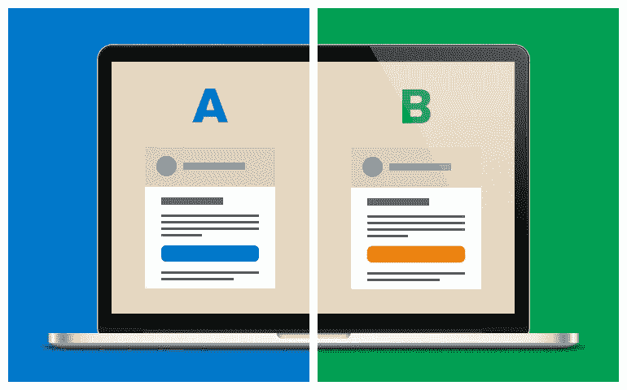
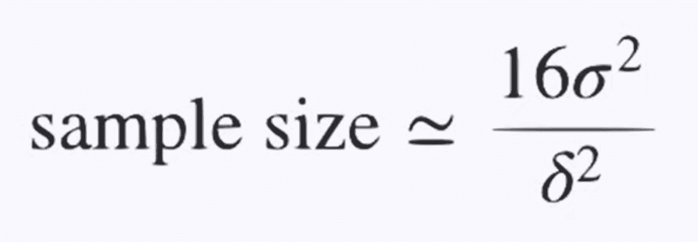
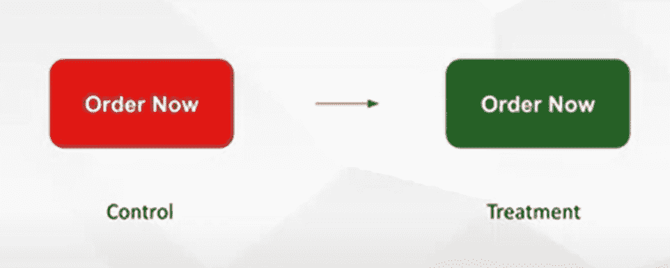

# 破解面试的 A/B 测试

> 原文：<https://medium.com/codex/cracking-a-b-testing-for-interview-87e368162fae?source=collection_archive---------2----------------------->

# 什么是 A/B 测试？

> 多变量测试/拆分测试/转化率优化/登陆页面优化/数字优化/在线实验/成长黑客？它们和 A/B 测试基本上是一回事。

在统计中，A/B 检验是假设检验的一种方式。人们假设一个或一些因素是否重要，然后通常会进行实验(比较两个或更多版本，如版本 A 到版本 B)来证明假设或拒绝假设。在商业世界中，这些因素会变得大到一个新产品/产品线，小到一个网站的修改。像往常一样，对照组将使用现有的功能，而治疗组将使用新的功能。一次性 A/B 测试不会给出永久有用的结果，持续测试仍是首选。

然后，你可能会想什么时候 A/B 测试会被一个公司大量使用？一个公司的产品或服务很容易被其他公司取代，需要持续改进以保持竞争力，通常会开始使用 A/B 测试。

一个真实的例子是安德玛。几年前，安德玛从 Adobe 聘请了一个大型顾问团队来测试他们的网站。这个测试中的控制是他们的原始网站。不同的是他们的网站在主页中央有一个非常简单的推荐区。他们想知道，这会给安德玛的主页增加推荐，对他们产生影响，每个访问者的收入被用作主要的成功指标。他们发现这帮助安德玛获得了 14%的收入提升，使他们每年多获得 300 万美元。(故事是在这个视频中发现的:【https://www.youtube.com/watch?v=CH89jd4haRE】T2&list = WL&index = 4，开始于 10:47)之后，安德玛仍然保留着这个功能，但你可以看到他们一直在对这些东西进行 A/B 测试，直到不久前他们用一些他们认为现在对他们更重要的其他功能取代了这个区域。因此，A/B 测试对于雇主来说是一个非常好的方法来测试候选人是否熟悉这个行业或他们对商业的意识。

在商业世界中，A/B 测试的整个过程通常是:

1.  **客户漏斗(漏斗分析)**
2.  **定义指标(KPI、转换率等。)**
3.  **形式假设**
4.  **制定测试计划**
5.  **创建变体**
6.  **运行实验**
7.  **分析测试结果**
8.  **做出结论**

*样本量计算器:*【www.evanmiller.org/ab-testing/sample-size.html 

大约 90%的公司在寻找候选人是否对 A/B 测试有商业意识，比如应该形成什么样的假设；对于任何特定的产品/服务，什么样的假设是必要的；如何启动 A /B 测试并获得有效结果；等等。其余 10%的公司可能会询问高级 A/B 测试或方法。

在数据科学面试中，A/B 测试通常会和指标问题一起被问到。正如前面所述，面试可以包括任何 A/B 测试部分:开发一个新的假设，设计 A/B 测试，评估测试结果，并作出决定。

# 设计 Qs

## 运行 A/B 测试需要多长时间？

*   首先，需要获得样本量。接下来，我们需要获得 3 个参数:第二类误差/功效(因为功效= 1-第二类误差)、显著性水平和最小可检测效应。
*   确定样本大小:样本大小约等于 16 乘以样本方差除以 delta(处理和对照之间的差异)的平方。*或使用之前给出的链接*

*   接下来，我们将把样本大小除以每个组中的用户数量，以获得实验的大致持续时间。计算的持续时间通常会在结束时四舍五入到每周一次。

## 每个参数如何影响样本量？

*   样本越多，样本方差就越大。
*   如果样本较少，delta(治疗组和对照组之间的差异)会变大。

## 如何估计参数？

*   样本方差可以从数据中获得
*   但是我们需要使用最小的可检测效应来估计 delta。最小可检测效应代表实验/实践中最重要的最小差异，通常由多个利益相关方决定。

# 多重测试 q

面试中也可能会有多个测试问题。在这种情况下，将测试多个变量，一个示例问题是:

## 一家公司正在运行 10 个测试，尝试不同版本的网页，有一个案例的 p 值小于 0.05，该公司应该做出这种改变吗？

*回答:*公司不应该接受这种变化，因为他们不应该在这里使用相同的显著性水平(95%)。在这种情况下，测试中有 2 个以上的变量，如果选择固定的显著性水平，错误发现的概率将增加。

## 解决方案:

**Bonferroni 校正**

*   它将显著性水平除以测试次数。
*   缺点:方法保守

**控制误发现率**

*   它是误报数量除以剔除数量的期望值。

# 新颖性和首要性

## 首要效应/变化厌恶:

当变化发生时，一些习惯了事物运作方式的人可能会觉得不愿意改变。

## 新奇效果:

与上一组不同，这一组人欢迎他们觉得有共鸣、使用频率更高的变化。

然而，这两种影响都不是长期影响。通常，当 A/B 测试具有较大或较小的初始效应时，那是由于首因效应或新奇效应。

## 解决方案:

1.  排除这些影响的可能性(测试将只在首次用户身上进行)
2.  将第一次使用的用户与治疗组中有经验的用户进行比较(获得对首要效应或新奇效应的影响的实际估计)

# 群体干扰 Qs

变体之间的干扰在**社交网络行业** (Twitter、脸书、Tik Tok……)和**双边市场**(优步对 Lyft)中经常发生。

在社交网络行业，用户的行为极有可能受到其他人的影响，尤其是在他们的社交圈里，这就是所谓的*【网络效应】*。这可能会导致对照组的用户受到治疗组用户的影响，从而低估治疗效果。另一方面，对于双边市场，控制组和处理组中的用户将共享相同的资源，因此这一次的处理效果将被高估。

## 解决方案:

将用户隔离在对照组和治疗组中。

## 对于社交网络市场:

1.  **网络集群**

*   将用户分成不同的群，其中每个人的交互最多，然后随机分配这些群

2.**自我网络随机化**(源自 LinkedIn)

*   集群由“自我”(用户/个人)和“改变者”(用户/个人的直接联系人)组成
*   衡量单一网络效应(“改变”处理对“自我”的影响)，用户要么有这个特征，要么没有
*   更简单、更具可扩展性

## 对于双边市场:

1.  **基于地理的随机化**

*   按地理位置分割样本(允许隔离用户，但会有很大差异，因为每个市场在某些方面都是独特的)

2.**基于时间的随机化**

*   按一周中的某一天分割样本，并将所有用户分配到治疗组或对照组(仅针对短期治疗效果)
*   不要把这个用在推荐项目上

# 案例研究:红色与绿色按钮

## **目标:**

量化不同的行动号召按钮颜色对核心指标的影响

## **假设:**

*   与红色的 CTA 按钮相比，绿色的 CTA 按钮会吸引更多的用户点击
*   这些额外点击的一部分将会得到补偿；让交易，从而增加收入
*   这种变化在移动领域有更大的推动力

## **零假设:**

*   绿色按钮对点击率(点击数/体验它的用户数)或其他用户行为没有影响

## **要衡量的 KPI:**

收入、购买率(每个访问者)、点击率(每次访问的点击数/每个访问者的点击数)

## **需要收集的数据:**

用户 ID/Cookie ID、平台、页面负载(现场参与)、实验任务、参与行为指标等。

**最小可检测效果:**测量 10%的增加

**电流按钮控制** : 3% → **成功实验** : 3.3 %以上

确定您希望在治疗中成为哪一部分来访者:

*   90%的游客→ **对照组**
*   10%的来访者→ **治疗组**

运行一个 ***功效分析*** 来决定收集多少数据样本取决于我们的容差:**最小可检测水平/最小可测量差异、假阴性、假阳性。**

> 假阳性(I 型错误):我们在没有假阳性的情况下看到显著的结果(通常想要假阳性率<5% and it is equivalent to the significant level of statistic test)
> 
> False Negative (Type II error): there is an effect, but we weren’t able to measure it (typically want a false negative rate <20% and the “power” of the test is 1 — beta = 0.8)

After power analysis, we need to figure out how long to run the test and run the test for that long at least. But pay attention that uneven treatment groups can cause biases, so make sure to have even treatment and control groups.

If it is the first A/B test running, a ***【模拟测试(A/A 测试)*** )将被强烈推荐。

**哪里了解更多:**

 [## Udacity A/B 测试课程总结

### 最近我在 Udacity 上完成了 Google 的 A/B 测试课程。该课程已被极力推荐给…

towardsdatascience.com](https://towardsdatascience.com/a-summary-of-udacity-a-b-testing-course-9ecc32dedbb1)  [## 数据科学面试中的 7 个 A/B 测试问题和答案

### A/B 测试，也称为受控实验，在工业中广泛用于产品上市决策。它允许技术…

towardsdatascience.com](https://towardsdatascience.com/7-a-b-testing-questions-and-answers-in-data-science-interviews-eee6428a8b63) 

** * *本文内容并非本人独自开发。许多东西都是从互联网(Youtube、博客、书籍、网络研讨会等等)上学习和收集的。*

** * *本文仅供学习之用(非商业用途)。请不要出于任何商业原因使用或传播它。*