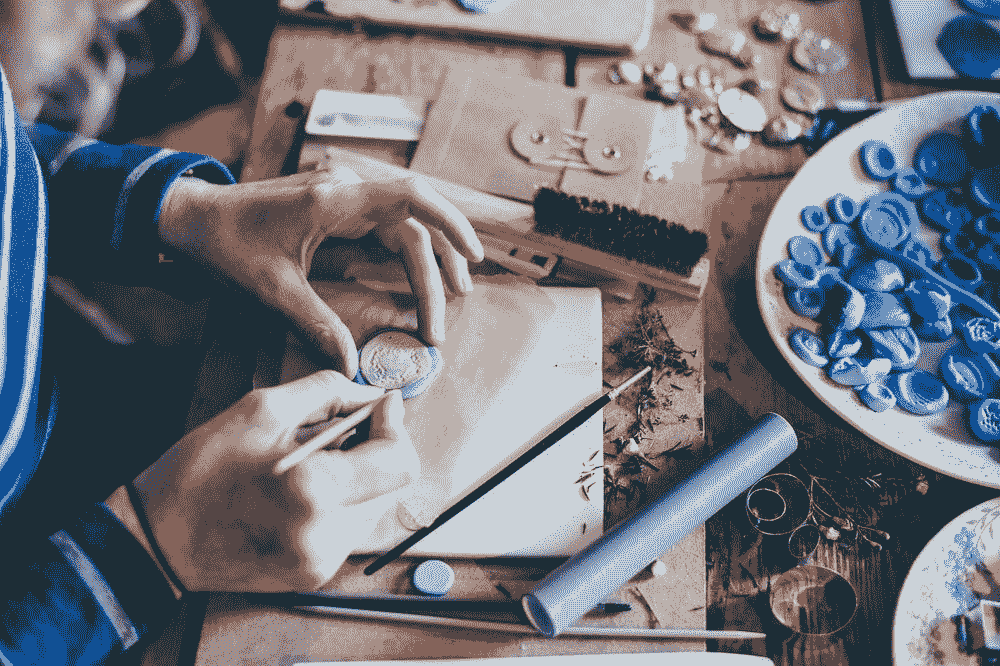
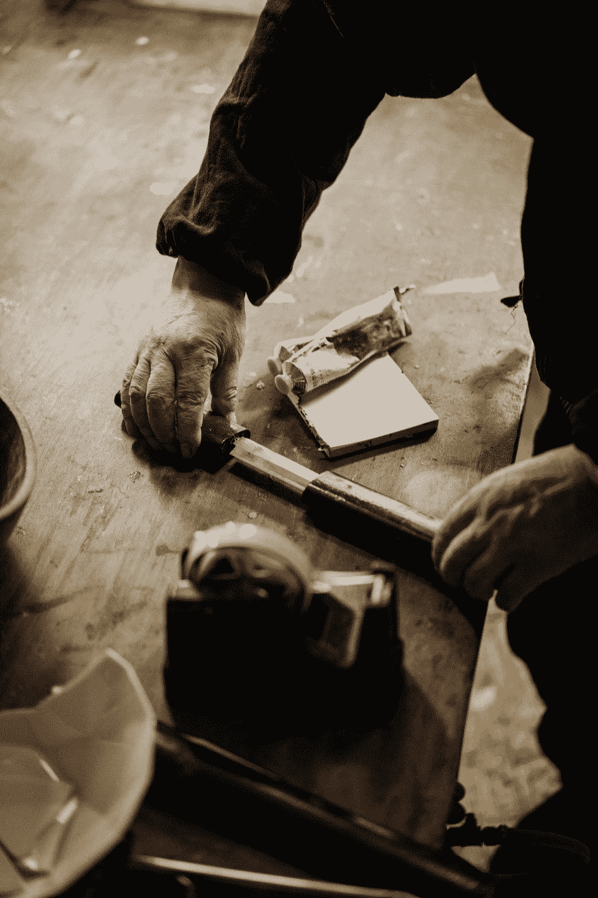

# 学习任何东西的心态

> 原文：<https://medium.com/codex/craftmanship-mindset-to-learn-anything-e173c7ede2ab?source=collection_archive---------8----------------------->

在当今世界，一般来说，一切有助于赚钱的东西都是抽象的，比如信息。以信息技术为例。我们不能触摸软件或闻或尝它。我们甚至看不到它。你可能认为你可以看到软件的源代码，但这只是一个表象。当你呆在家里的时候，更有可能是外面什么东西的影子。

为了增加我们赚更多钱的潜力和提高我们的技能，一般来说，我们必须学习那些抽象的东西。但是，由于它们都是理论性的，所以在这个过程中，有时我们会感到困惑。另一方面，人类已经学会了如何处理更具体的东西，如手工艺、手工制作等。一般来说，我们倾向于更快地学习这种真正的东西，因为我们可以触摸它，感受它，并在工作时建立一种本能。我们将分析如何将此应用于抽象技能的提高。

假设你决定学习一门新的编程语言。有效学习 it 的路线图是什么？一般我得到的答案就是看书或者文档，可能写几个小脚本理解几个想法就这样了。这是最常见和最直接的答案，不仅对编程语言如此，对框架和开发工具如 Docker、Git 等也是如此。但这是正确的吗？

让我们想一个等价的例子，但是这次让我们把它变成一个手艺。假设你是一个手工家具制造商。如果你是一名软件工程师，那么你正在构建软件，你的主要工具是计算机硬件、编程语言等。；同样，如果你是一个家具制造商，你正在建造家具，你的主要工具是锯子、测量工具、锤子、钉子等。从这个角度来说，基本上学习一门编程语言和学习如何使用锤子差不多。那么如何才能学会使用锤子呢？

很简单，对吧？首先，看看一些说明，然后，拿几个钉子，练习使用锤子。就这样对吗？说实话，这还不够。你说得对，这些是第一步，但还不够，因为你不会知道很多东西。例如，在哪里钉钉子来连接两个木块是最好的，或者你应该如何切割木块来以最好和最耐用的方式连接它们？要经历这样的事情，你可能会读更多的书，但肯定的是，你需要通过从头开始构建一些东西来尝试和体验更多的东西。也许你可以从草图到手工制作，从头开始打造一把椅子。然后，你应该坐下来测试它，你应该明白什么是错的，可以做些什么来使它变得更好，也许你应该再试一次。然后，你应该尝试建造一些别的东西，一个衣柜，一张桌子，楼梯甚至一座小桥。一步一步地，通过生产更多，你会获得一种本能，看到做某事的最佳方式。

在抽象领域，通常我们会忘记最后一步。没有更多的练习和建立一些东西，我们直接假设我们学到了我们需要的东西，并试图寻找一份更好的工作来使用这些新技能。然而，总的来说，我们忽略了一个不可否认的事实:如果真的那么简单，很多人都会去做，而且这也不是一项必需的技能。许多杰出的人都在 IT 行业工作，并不断改进技术。如果不付出正确的努力，我们有多聪明或学得多快都没用。培养这种大师级本能的练习是成功的关键，也是关键的一部分，因为在这一步之前，学习曲线是指数级的；这个之后就成对数了。正因为如此，人们很容易感到厌倦，并通过这一步。

你如何在你的领域里练习发展这种大师的本能？这取决于领域，但我认为你应该做的第一件事是检查开源项目。了解其他人如何做同样的事情，并从其他人的经验中学习是非常重要的。之后，如果你有一个新的想法，你可以尝试实现一个新的未来，或者你可以通过改变现有的类或函数来尝试其他算法。这非常类似于得到一个现成的引擎，用你创造的引擎更换几个部件，然后在上面练习。这是一个非常好的方法，如果你改变每一个部分，最终，你会得到自己的引擎。

我想用一个我喜欢的故事来结束这篇文章。从前，在一家德国工厂里，工厂的很大一部分停止了工作。许多工人试图修理它，但没有人能修好它。然后，他们寻找能修理它的人，然后他们发现了一个非常老的人。这位老人绕着机器走了一圈，听了听问题。然后，他拿了一把橡胶锤，敲了一下机器。机器又开始工作了。之后，工厂的老板感谢了那个人，并询问了这次修理的价格。老人说 1000 马克(德国旧货币)。得到这个回答后，店主生气了，他想让这位老人给他一张详细的收据，看看什么东西会那么贵。老人写了一张收据，交给了失主。收据上写的东西是“击中 1 马克，知道击中哪里 999 马克”。

别忘了，你工作不是为了击球，而是为了知道哪里击球。

谢谢你的时间和问候。

