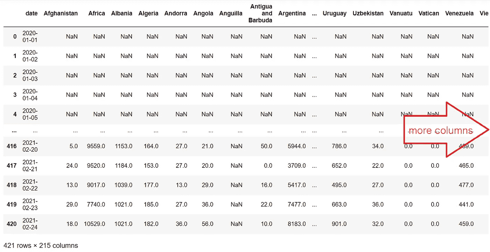

# 使用 Python 轻松创建动画条形图比赛

> 原文：<https://medium.com/codex/create-a-bar-chart-race-for-covid-19-cases-easily-with-python-15cc37015899?source=collection_archive---------1----------------------->

## [法典](http://medium.com/codex)

## 使用 Python 和来自真实世界新冠肺炎案例数据集的强大 bar_chart_race 库创建条形图竞赛的实践指南

数据可视化是 Python 的优势之一。用 Python 从数据集创建丰富多彩且有意义的图表总是很有趣，尤其是当它是动画的时候！是的。你没看错！今天我将向你展示如何用 Python 和 [**条形图-比赛**](https://pypi.org/project/bar-chart-race/) 库创建一个移动的比赛条形图。


作者用 Python-GIF 创建的新冠肺炎案例条形图竞赛

# 介绍

Python 实践者认为用 Python 进行数据可视化是有效且有趣的。有了像 **pandas** 、 **Matplotlib** 和 s **eaborn** 这样强大的库，我们使用 Python 的数据处理和可视化能力是强大的。彩色图表从我们希望理解的数据集中揭示了有意义的信息。

还有另一个强大的库可以把我们的可视化带到另一个层次！介绍 [**条形图竞赛**](https://pypi.org/project/bar-chart-race/) ，这是一个库，它将赋予你的条形图以生命，并使条形图在一场丰富多彩的竞赛中不断增长和移动。

## 可视化新冠肺炎案例数据集

除了在艺术上有意义之外，数据可视化还可以提供大量信息并产生影响，尤其是在反映世界上正在发生的事情时。

在我发表这篇文章的那一天，我们都经历了一年多的新冠肺炎局势。它仍在全球范围内进行。现在，这不再是一个新奇的情况，但它仍然会给我们带来不必要的后果，让我们每天都要处理。

在痛苦的紧缩环境下，各国政府(应该)正在尽最大努力应对这种情况，优化经济。跟踪一个国家处理这种情况的有效性的一种方法可能是可视化该病毒在该国与其他国家相比传播的速度。

为了让这个故事更有趣一点，我们将研究一个[真实世界的新冠肺炎案例数据集](https://ourworldindata.org/covid-cases)，并从中制作一个赛车条形图。我们将通过一个赛车条形图来展示病毒在世界主要经济体的传播速度。“快速”一词意味着我们将处理一个时间序列数据集，而“时间”将在我们的图表中揭示一个有趣的行为，一旦我们完成创建，您就会看到这一点。

***注意事项一:*** *本文基于*[***Python 3 . 9 . 1***](https://www.python.org/downloads/release/python-391/)*[***Jupyter 笔记本 6 . 1 . 6***](https://en.wikipedia.org/wiki/Project_Jupyter)**运行于 64 位*[***Windows 14***](https://en.wikipedia.org/wiki/Windows_10)**

# **动手部分**

## **制定明确的目标**

**首先，我们需要为我们的项目设定一个明确的目标。这样做将有助于指导我们从数据集中只收集我们真正需要的东西，并比我们漫无目的地探索和实验数据时更快地完成项目(希望如此)。**

**从一开始，我们的目标就已经非常明确:我们将制作一个赛车条形图，以可视化新冠肺炎病毒在世界上一些顶级国家的传播。**

****剩下的问题是我们希望在哪些国家和多长时间内可视化数据？****

**我做的选择只是武断的。在这种情况下，我决定创建一个记录了世界 10 大经济体中新冠肺炎案例的条形图竞赛。我从 investopedia.com 那里得到了这些国家的名单。然后，我决定时间框架将大致为一年，从 2020 年 1 月任何一个国家的任何记录数据的第一天开始，到 2021 年 1 月底。**

****目标总结:****

*   **制作一个条形图比赛，显示世界前 10 个国家的新冠肺炎病例**
*   **时间框架为 1 年(2020 年 1 月至 2021 年 1 月底)**

**一切就绪！我们可以走了！**

## **数据探索和重塑**

**准备好！我们将从这个链接下载一个真实的新冠肺炎案例数据集:【https://ourworldindata.org/covid。**

**你也可以在这里下载数据集和这个项目中使用的所有 Python 代码:[https://github.com/pkx8326/COVID-19-Race-Bar-Chart.git](https://github.com/pkx8326/COVID-19-Race-Bar-Chart.git)**

**一旦我们放置好**。csv** 文件放在我们运行 Python 的同一个文件夹中，我们可以开始在键盘上忙碌了。**

****导入库:****

**首先，我们需要为这个项目导入几个库:**

```
**import pandas as pd
import matplotlib.pyplot as plt #Not necessary
plt.style.use("seaborn-whitegrid") #Not necessary
import bar_chart_race as bcr**
```

**熊猫是不可或缺的，因为在制作最终的赛车条形图之前，我们必须将数据整理成我们想要的形状。**

**这个项目中另一个不可或缺的库是[**bar _ chart _ race**](https://pypi.org/project/bar-chart-race/)**。我们将对这个库施展魔法。没有必要导入 **matplotllib，**，但是，在这种情况下，我希望 Python 基于 **matplotlib 的**能力来绘制图表，并且我还希望在图表上使用“ **seaborn-whitegrid** ”样式。不过，这是我个人的偏好。****

****创建数据帧:****

**现在，我们已经导入了所有必需的库，让我们继续将数据加载到 dataframe 中并研究它:**

```
**df = pd.read_csv("covid-data.csv")
df**
```

****

****df** 的结果——作者照片**

**在这个项目中，我将文件命名为“ **covid-data.csv** ”。最初，我们可以看到数据有**71061 行**和 **59 列**。我使用了 **df** 而不是 **df.head()** ，因为我想同时看到这个数据帧的头部和尾部。似乎我们有许多国家按字母顺序排列，从**阿富汗**到**津巴布韦**。但是和阿富汗有很多分歧，和津巴布韦也有很多分歧。这两个国家之间的所有其他国家必须相同，分布在多行中。**

**回顾我们的目标摘要，我们需要的唯一信息是国家名称、日期从 2020 年 1 月到 2021 年 1 月，以及每个国家每天登录的病例数。让我们首先删除所有其他不必要的信息，只保留我们需要的信息:**

```
**df = df[["location", "date", "new_cases"]]
df**
```

****

****df** 去掉所有不必要信息后的结果——作者照片**

**太好了！现在只剩下 3 列需要处理了。**

**仔细观察**日期**列，我们可以看到每一天都会开始一个新行，其中包含所有其他信息，包括国家名称。这就是为什么我们在**位置**栏中有重复的国家名称。**

**我们已经可以想象，一个以连续日期为索引、以国家名称和案件数量填充的列的表将有助于创建我们的条形图竞赛。**

**我们这里已经有的是一个 [**窄**](https://en.wikipedia.org/wiki/Wide_and_narrow_data) (有时**叠**或**高**)的数据框架。这种类型的数据帧包含一个粒度最高的列。在本例中，是包含每日案例数的 **new_cases** 列。其余的列是上下文列，包含值的“上下文”以使它们有意义。上下文列中的值可以重复。在我们的例子中，它是 location 列，包含国家名称。**

****透视数据:****

**很明显，我们不能使用这种类型的数据框架来创建我们的赛车条形图。让我们用 pandas 的 pivot 函数将我们的数据框架转换成更有用的东西:**

```
**df = df.pivot(index = "date", columns = "location", values = "new_cases").reset_index().rename_axis(None, axis=1)df**
```

**我使用 pivot 函数将我们的 dataframe 转换为一个索引列，其中包含国家名称的列以案件数量作为值。**

**尽管我们的目标是创建一个以日期作为索引的 dataframe，但我现在还不需要它们，因为我仍然想修改日期格式，并且我现在需要将 **date** 列作为普通列。**

****。reset_index()。rename_axis(None，axis=1)** chain 将重置索引并从索引列中删除名称。**

**做好准备，结果数据框架中的列数与原始数据框架中的所有国家数一样多:**

****

**创建透视表后 **df** 的结果。**日期**列暂时作为普通列保留——作者照片**

**我们的新数据帧有 421 行和 215 列。这意味着原始文件包含所有国家 421 天的数据记录信息，该表中有 215 个国家。我们不需要那么多日子和国家。**

**来自[https://www.investopedia.com/insights/worlds-top-economies/](https://www.investopedia.com/insights/worlds-top-economies/)的消息，2020 年世界前 10 大经济体分别是美国、中国、日本、德国、印度、英国、法、意、巴西和加拿大。让我们只将这 10 个国家保留在我们的数据框架中，并删除所有其他国家:**

```
**df = df[["date", "United States", "China", "Japan", "Germany", "India", "United Kingdom", "France", "Italy", "Brazil", "Canada"]]df**
```

****

**“去掉所有其他国家的信息后，只留下世界十大经济体的结果”——作者照片**

**太好了！我们的数据框架现在小多了。去掉所有其他国家的信息后，我们只剩下世界前 10 个经济体的数据，这些数据可以放入一个 421 乘 11 的数据框架。**

****数据清理:****

**正如我们所看到的，在我们的数据帧的开头有一些单元格中有 **NaN** (不是一个数字)值。这些单元开始于 2020 年 1 月 1 日(2020–01–01)。这意味着这 10 个国家没有一个在 2020 年 1 月 1 日开始记录数据。我们不知道每个国家到底有多少个 nan。nan 越多，我们就需要等待越长的时间才能在最终产品中出现一个条形。**

**让我们设计一个策略，从我们的数据框架中删除尽可能多的 nan。**不言而喻，我们将删除 nan 而不删除我们有用的 case 值！****

**首先，找出这 10 个国家中谁首先开始记录数据将是有用的。我们将删除第一个国家开始记录其数据的第一天之前的 NaNs，其余的我们将保留。**

**为了找出谁是第一个开始记录数据的人，让我们从数据框的第一行开始数每个国家的 NaNs:**

```
**import mathfor i in df.columns[1:]:
    j = 0
    while math.isnan(df[i].iloc[j]):
    j = j + 1
    print(i, j)United States 22
China 22
Japan 22
Germany 26
India 29
United Kingdom 30
France 23
Italy 30
Brazil 56
Canada 25**
```

**嵌套在 for 循环的**中的【while 循环**检查每个国家每一行中的 nan。美国、中国和日本似乎是最早开始记录数据的三个国家。他们也在同一天开始。**

**我们现在知道，我们将从索引 0 到 22 的整个数据帧中删除 nan:**

```
**for i in range(22):
    df.drop(index = i, inplace = True)df.head()**
```

****

****df.head()** 去掉所有不必要的 nan 后的结果——作者照片**

**现在，我们的数据框架变小了。仔细看，美国和日本在伐木第一天还是 0 例，而中国已经有 95 例了。**

**从数据帧的头部删除一些行后，索引不再从 0 开始。为了防止将来可能出现的混乱，让我们重置数据帧的索引，从 0 重新开始:**

```
**df = df.reset_index()
df.drop(columns = “index”, inplace = True)df.head()**
```

****

****df.head()** 重置索引后的结果。索引又从 0 开始—作者照片**

**我们还需要从数据帧中删除一些行。记得我们的目标吗？我们数据框架中的最后日期应该是 2021 年 1 月底(2021 年 1 月 31 日)。我们还不知道它在哪里(什么指数)。让我们来了解一下:**

```
**for i in df.index:
    if df["date"].iloc[i] == "2021-01-31":
        print(i)374**
```

**我们数据的最后一天记录在索引#374 中。我们将删除该索引之后的所有行:**

```
**for i in range(375, len(df.index), 1):
    df.drop(index = i, inplace = True)df**
```

****

**删除索引#374 之后的所有行后的 **df** 结果—作者照片**

**我们将数据帧从 421×11 缩小到 375×11。现在我们又瘦又健康！但是我们还没有到那一步。**

**我们仍然有 NaNs，我们的案例号的数据类型是 **float** 而不是 **int** 。因为浮点型对象需要更大的内存分配。这将不必要地消耗我们的处理时间。**

**让我们将所有的 NaNs 更改为 0，并将每个案例号更改为 int:**

```
**df = df.fillna(0)
for i in df.columns[1:]:
    df[i] = df[i].astype(int)df**
```

****

**将 NaNs 替换为 0 并将每个案例号更改为 int-Photo(作者拍摄)后的结果 **df****

**我们真的快到了！还有几件事。**

**看**日期**栏。光是看日期格式就已经让我很痛苦了。我*讨厌*这种格式。因为我们要在图表上显示变化的日期，我不能接受。**

**我希望是 2021 年 1 月 1 日，而不是 **2021 年 1 月 1 日**。这在我的图表上会看起来更漂亮(也更有意义)。**

**日期中有三个元素:年、月号和日。我们需要改变的主要事情是月份。我们需要将月份号改为英语中实际的月份名称。我认为首先我们需要创建一个包含所有月份名称的字典:**

```
**monthDict = {"01":"January", "02":"February", "03":"March", "04":"April", "05":"May", "06":"June", "07":"July", "08":"August","09":"September", "10":"October", "11":"November", "12":"December"}**
```

**因为日期中的每个元素都用“-”分隔，所以我们将使用字符串。split()方法将每个元素彼此分开，交换它们的位置，并用字典中的月份名替换月份号。**

**让我们用日期(2020 年 1 月 23 日)的第一条记录来测试这个策略:**

```
**print(monthDict[df["date"].iloc[0].split("-")[1]], df["date"].iloc[0].split("-")[2]+",", df["date"].iloc[0].split("-")[0])January 23, 2020**
```

**太好了！print 函数给出了我想要的日期格式。我们必须将每个日期记录都转换成这种格式。让我们为此创建一个函数:**

```
**def correctDate(dateStr):
    strList = dateStr.split("-")
    dateFormat = str(monthDict[strList[1]]) + " " + str(strList[2]) + ", " + str(strList[0])
    return dateFormat**
```

**该函数的工作原理是切换原始日期元素的位置，并用 **monthDict** 字典中的月份名称替换月份号。**

**让我们测试一下这个函数:**

```
**correctDate("2020-01-23")'January 23, 2020'**
```

**维奥拉。现在让我们用 Python 的 **lambda 函数**功能将这个函数应用于**日期**列中的所有记录:**

```
**df["date"] = df["date"].apply(lambda x: correctDate(x))
df**
```

****

**对**日期**列应用 **correctDate()** 函数后 **df** 的结果—作者照片**

**现在，在创建条形图竞赛之前，我们需要对这个数据帧做的最后一件事是将**日期**列作为索引列:**

```
**df.set_index("date", inplace = True)
df**
```

****

**用粗体表示，我们的**日期**列现在是这个数据框的索引列——作者照片**

**不要忘记，我们的数据框架中的病例是每日记录的病例。我们实际需要的是每个国家所有病例的累计总和。我们可以通过下面的代码得到累积和:**

```
**c_sumData = df.cumsum(axis = 0)**
```

**我分配了一个名为 c_sumData 的新数据框架，并让它等于我们原始数据框架中每个国家所有案例的累积总和。**轴= 0** 参数用于指示行之间发生求和。**

**让我们检查一下新数据框架的尾部，每个国家的病例数应该很大:**

```
**c_sumData.tail()**
```

****

****c_sumData.tail()** 的结果显示了每个国家/地区累积总和后的大量案例—作者提供的照片**

## **为新冠肺炎案例创建条形图竞赛**

**现在，我们准备调用我们的摇滚明星库并创建我们的图表。遵循下面的代码，我们的 Jupyter 笔记本上就会出现一个动画条形图比赛。运行代码后，根据您的处理能力，您可能需要等待几分钟。但我向你保证，结果是值得等待的。**

*****注意二:*** 您可能会从 Jupyter 笔记本上收到关于图表设置的警告信息。这个可以忽略。**

**让我们创造我们的条形图比赛！：**

```
**bcr.bar_chart_race(df = c_sumData, filename = None, period_summary_func = summary, period_label = {'x':.75, 'y': .1}, title = 'COVID-19 Cases by Country (JAN 20 - 21)')**
```

*****注意三:*** 你可能会得到一个错误，声称你的机器上没有 **FFmpeg** 。可以用 [ImageMagick](https://imagemagick.org/index.php) 安装，免费。**

**结果是:**

****

**将来自 **bcr** (昵称)库中的 **bar_chart_race()** 函数应用于我们的数据的结果— GIF by author**

**虽然条形图比赛出现在你的 Jupyter 笔记本上，但你可以选择将其保存为 **.mp4** 视频文件。尝试单击图表右下角的保存图标。**

**根据条形图 race 库的[教程](https://www.dexplo.org/bar_chart_race/tutorial/)，如果您想要更多的信息，比方说，如果您想要所有案例的运行摘要出现在运行日期下，您可以创建下面的函数，并在 **bar_chart_race()** 函数中使用它作为参数:**

```
**def summary(values, ranks):
    total_cases = values.sum()
    s = f"Total cases - {total_cases:,.0f}"
    return {'x': .75, 'y': .05, 's': s, 'size': 8}**
```

**现在，让我们再次对我们的数据应用 **bar_chart_race()** 函数，这一次使用我们刚刚创建的 **summary()** 函数:**

```
**bcr.bar_chart_race(df = c_sumData, filename = None, period_summary_func = summary, period_label = {'x':.75, 'y': .1}, title = 'COVID-19 Cases by Country (JAN 20 - 21)')**
```

**结果是:**

****

**由于 **summary()** 功能——GIF by author，运行中的总病例数现在显示在运行显示日期下**

**现在，我们的最终产品准备好了。美丽，有用，令人兴奋，因为它应该是。**

# **结论**

**我已经向您展示了如何使用 Python 和 **bar_chart_race()** 库将真实世界的新冠肺炎案例数据转换成激动人心的条形图竞赛。**

## **这张图表告诉了我们什么？**

**由此产生的种族条形图告诉我们的一件事是冠状病毒在我们选择的时间段内在每个国家的传播速度，仅此而已。这并不能真正反映一个政府应对疫情的效率。**

## **带回家的信息**

**每个国家都有其独特的社会和技术背景，仅仅通过观察病毒在一段时间内传播的速度，无法真正比较其在缓解危机方面的表现与其他国家的表现。该图表可能反映了有效的政府干预或出现听力免疫时，酒吧显着放缓，但这种解释仍然是模糊的。**

**然而，创建这种可视化总是有趣且有教育意义的。除了查看新冠肺炎案例，这种图表还有其他应用，比如可视化同一行业的公司在一段时间内的增长。**

**有了 **bar_chart_race** 库，代码得到了极大的简化，最终的可视化效果既美观又丰富。然而，大部分仍然是数据准备、转换和清理。因此，在对数据做任何事情之前，首先设定一个明确的目标并在脑海中有一个成品的画面总是有用的。尽管如此，我们总是可以从数据准备中获得乐趣。**

**我希望这篇文章对您的可视化项目有用。**

**下次见，编码快乐！**