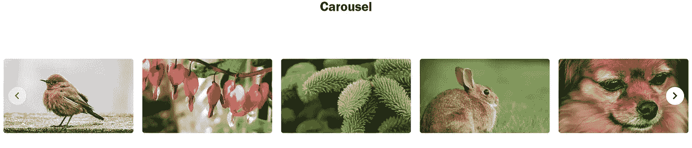

# 创建一个具有角度缩放效果的旋转木马

> 原文：<https://medium.com/codex/create-a-carousel-with-awesome-zoom-effects-like-that-of-amazon-prime-and-netflix-in-angular-940d5c6333cd?source=collection_archive---------4----------------------->

很多时候，当我们为购物、食品和在线课程创建 web 应用程序时，我们通常会遇到需要一个包含所有图像/项目的转盘，并且希望当我们悬停在图像/项目上时，图像/项目会放大。

在这篇博客中，我们将学习如何创建一个具有令人敬畏的缩放效果的响应转盘，就像亚马逊 Prime 和网飞在 Angular 中那样。最终的旋转木马看起来会像这样。

让我们首先使用以下命令创建一个基本的 angular 应用程序。

> → ng 新型响应转盘
> 
> → cd 响应-转盘
> 
> → ng 服务

ta-犹大准备好你的基本角度应用程序。现在让我们创建我们的转盘，我们将使用*角度响应转盘*来创建一个响应转盘。让我们使用下面的命令将它添加到我们的依赖项中。

> → npm i 角响应转盘

现在，在 app.module.ts 文件中导入 carousel。添加包后，该文件看起来会像这样。

```
import { NgModule } from '[@angular/core](http://twitter.com/angular/core)';
import { BrowserModule } from '[@angular/platform-browser](http://twitter.com/angular/platform-browser)';import { AppRoutingModule } from './app-routing.module';
import { AppComponent } from './app.component';import {IvyCarouselModule} from 'angular-responsive-carousel';[@NgModule](http://twitter.com/NgModule)({
  declarations: [
    AppComponent
  ],
  imports: [
    BrowserModule,
    AppRoutingModule,
    IvyCarouselModule
  ],
  providers: [],
  bootstrap: [AppComponent]
})
export class AppModule { }
```

现在让我们通过使用一些来自 pixabay 的很酷的图片来创建我们的响应转盘。出于演示目的，我创建了一个有 10 张卡片的转盘，您可以随意使用任意数量的卡片。为 carousel 添加代码后，我的文件如下所示。

app.component.html

```
<div id="heading">
  Carousel
</div>
<div class="carousel-outer" >
  <carousel class="row" [cellsToShow]=nos [cellsToScroll]=nos  [margin]=20 [height]=240 >
    <div class="col-md-1 carousel-cell" *ngFor="let src of list_of_images,let i = index" >
      <div class="grid-box">
        
      </div>
    </div>
  </carousel>
</div>
```

应用程序组件

```
import { Component, OnInit  } from '@angular/core';@Component({
selector: 'app-root',
templateUrl: './app.component.html',
styleUrls: ['./app.component.css']
})export class AppComponent {title = 'scroll';nos=5;ngOnInit(): void {}list_of_images =['a.jpg','b.webp','c.webp','d.webp','e.webp','f.jpg','g.webp','h.webp','i.webp','j.webp']}
```

应用程序.组件. css

```
#heading {
    margin-top: 10px;
    font-size: 30px;
    font-weight: 600;
    font-family: 'Franklin Gothic Medium', 'Arial Narrow', Arial, sans-serif;
    text-align: center;
}.carousel-outer {
    padding: 0 0 50px;
    position: relative;
    margin-top: 100px;
}.carousel-cell {
    overflow: visible !important;
    z-index: 9 !important;
}.grid-box {
    position: relative;
    overflow: hidden;
    -webkit-transition: all 200ms;
    -moz-transition: all 200ms;
    -ms-transition: all 200ms;
    -o-transition: all 200ms;
    transition: all 200ms;
}.image {
    width: 100%;
    border-radius: 5px;
    height: 165px ;
}
```



现在，我们已经有了一个基本但很好看的旋转木马 tha→带缩放效果的 Angular-Carousel
[https://medium . com/codex/create-a-Carousel-with-awesome-zoom-effects-like-the-of-Amazon-prime-and-in-Angular-940 D5 c 6333 CD](/codex/create-a-carousel-with-awesome-zoom-effects-like-that-of-amazon-prime-and-netflix-in-angular-940d5c6333cd)
→Angular-one drive picker
[https://medium . com/@ one-drive-picker-in-Angular-17290644 我们将使用 CSS *transform* 属性来实现这一点。我们将图像缩放 1.25 倍以获得缩放效果。CSS 文件在做了 needy 之后看起来会像这样。](/@sankethdesuwar5/one-drive-picker-in-angular-1729064fbca9)

应用程序.组件. css

```
#heading {
    margin-top: 10px;
    font-size: 30px;
    font-weight: 600;
    font-family: 'Franklin Gothic Medium', 'Arial Narrow', Arial, sans-serif;
    text-align: center;
}.carousel-outer {
    padding: 0 0 50px;
    position: relative;
    margin-top: 100px;
}.carousel-cell {
    overflow: visible !important;
    z-index: 9 !important;
}
.carousel-cell:hover{
    z-index: 999 !important;
}.grid-box {
    position: relative;
    overflow: hidden;
    -webkit-transition: all 200ms;
    -moz-transition: all 200ms;
    -ms-transition: all 200ms;
    -o-transition: all 200ms;
    transition: all 200ms;
}.grid-box:hover{
    -moz-transform: scale(1.25);
    -webkit-transform: scale(1.25);
    -o-transform: scale(1.25);
    -ms-transform: scale(1.25);
    transform: scale(1.25);
    transform-origin: center top;
}.image {
    display: block;
    width: 100%;
    object-fit: cover !important;
    border-radius: 5px;
    height: 165px !important;
}.image:hover {
    -moz-transform: scale(1.25);
    -webkit-transform: scale(1.25);
    -o-transform: scale(1.25);
    -ms-transform: scale(1.25);
    transform: scale(1.25);
    transform-origin: center top;
    border-radius: 5px;
}
```

现在你的旋转木马在悬停时看起来会像这样。

这是不是很神奇，我们用一些 CSS 代码就可以很容易地让旋转木马的元素变得可缩放？

**但是你能在上面的视频中发现什么蹊跷吗？**

是的，你猜对了！当我们缩放时，角上的元素会被裁剪。所以让我们修复它们，为此我们必须修改我们的 *HTML* 文件，使得每个滚动中的第一个元素应该从左边缘缩放作为它的固定边缘，并且每个滚动中的最后一个元素应该从右边缘缩放作为它的固定边缘。

让我们通过使用 CSS *transform-origin* 属性以及一些代码将第一个和最后一个类分配给各自的 carousel 块来实现这一点。完成需求后，文件看起来会像这样。

app.component.html

```
<div id="heading">
  Carousel
</div>
<div class="carousel-outer" >
  <carousel class="row" [cellsToShow]=nos [cellsToScroll]=nos  [margin]=20 [height]=240 >
    <div class="col-md-1 carousel-cell" *ngFor="let src of list_of_images,let i = index" [ngClass]="{'first-item': i == 0 || i%nos == 0, 'last-item': i != 0 && i%(nos-1) == 0}">
      <div class="grid-box">
        
      </div>
    </div>
  </carousel>
</div>
```

应用程序.组件. css

```
#heading {
    margin-top: 10px;
    font-size: 30px;
    font-weight: 600;
    font-family: 'Franklin Gothic Medium', 'Arial Narrow', Arial, sans-serif;
    text-align: center;
}.carousel-outer {
    padding: 0 0 50px;
    position: relative;
    margin-top: 100px;
}.carousel-cell {
    overflow: visible !important;
    z-index: 9 !important;
}
.carousel-cell:hover{
    z-index: 999 !important;
}.grid-box {
    position: relative;
    overflow: hidden;
    -webkit-transition: all 200ms;
    -moz-transition: all 200ms;
    -ms-transition: all 200ms;
    -o-transition: all 200ms;
    transition: all 200ms;
}.grid-box:hover{
    -moz-transform: scale(1.25);
    -webkit-transform: scale(1.25);
    -o-transform: scale(1.25);
    -ms-transform: scale(1.25);
    transform: scale(1.25);
    transform-origin: center top;
    border-radius: 5px;
}.image {
    width: 100%;
    border-radius: 5px;
    height: 165px ;
}.first-item .grid-box:hover{
    transform-origin: left top;
}.last-item .grid-box:hover{
    transform-origin: right top;
}
```

万岁！我们完成了任务，现在我们有了一个很棒的旋转木马，我们可以在任何角度应用程序中使用它来显示我们的项目列表，干杯。

**一定要看看我的其他博客。
→带缩放效果的 Angular-Carousel** [https://medium . com/codex/create-a-Carousel-with-awesome-zoom-effects-like-the-of-Amazon-prime-and-in-Angular-940 D5 c 6333 CD](/codex/create-a-carousel-with-awesome-zoom-effects-like-that-of-amazon-prime-and-netflix-in-angular-940d5c6333cd)
**→Angular-one drive picker** [https://medium . com/@ sankethdesuwar 5/one-drive-picker-in-Angular-1729063](/@sankethdesuwar5/one-drive-picker-in-angular-1729064fbca9)

在 https://twitter.com/Sanketh38731692[的**推特**上关注我](https://twitter.com/Sanketh38731692)

**重要链接**

**GITHUB 回购链接【https://github.com/sanketh5/Angular-ResponsiveCarousel】:**