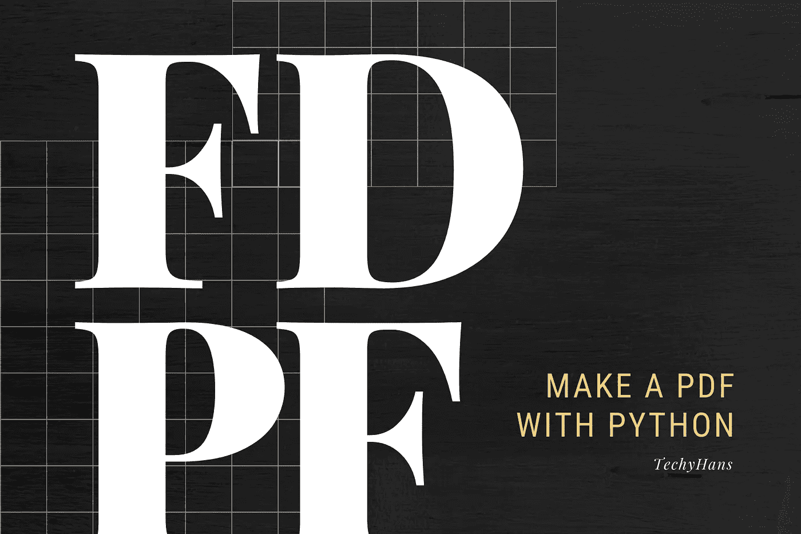
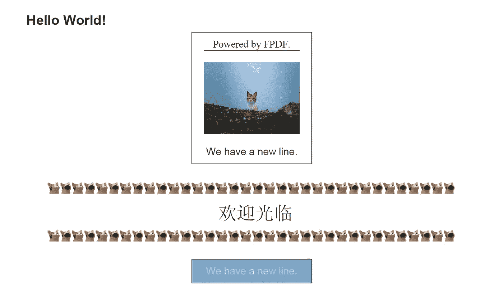

# 使用 Python 创建自定义 PDF

> 原文：<https://medium.com/codex/create-a-custom-pdf-using-python-219a7e11c78b?source=collection_archive---------0----------------------->



在这篇文章中，我将向你展示我们如何使用 **Python** 和 **FPDF** 库创建 PDF。默认情况下，FPDF 只支持某些语言，所以我也将通过 FPDF 使用更多语言所需的步骤。

学习成果:

1.  什么是 FPDF、PyFPDF 和 tFPDF？
2.  用 Python 实现 FPDF 的基本功能。
3.  FPDF 的多语言支持。
4.  在这篇文章里和我一起做一个简单的 PDF。


来源:https://unsplash.com/

# 什么是 FPDF？

FPDF 是一个 PHP 类，允许用纯 PHP 生成 PDF 文件。来自 FPDF 的 f 代表免费:你可以将它用于任何用途，并根据你的需要进行修改。生成 PDF 是一个相当流行的选择。

# PyFPDF

从 PHP FPDF 移植而来， *PyFPDF* 是一个在 Python 下生成 PDF 文档的库。这是我们将要安装和使用的库。下面解释的基本函数也来自这个库。

# tFPDF

FPDF 的一个修改版本，增加了对 UTF 8 的支持，只要您提供字体，就可以生成多种语言的文档。您需要在您的机器上安装 PHP 来使用这个 PHP 类。

如果您想了解如何立即将其他语言添加到您的 PDF 中，请转到最后一节。

# 主要特征

FPDF 提供了一系列现成的高级功能:

*   度量单位、页面格式和页边距的选择
*   页眉和页脚管理
*   自动分页
*   自动换行和文本对齐
*   图像支持(JPEG、PNG 和 GIF)
*   颜色；色彩；色调
*   链接
*   TrueType、Type1 和编码支持
*   页面压缩

在这一节中，我将向您展示如何安装 FPDF 和使用它的基本功能，打开一个新的 Python 文件并跟随操作！

来源:[gfycat.com](https://gfycat.com/)

## 装置

```
$ pip install fpdf
```

## 开始一个 FPDF

在一个 python 文件中，我们将首先导入并创建一个 FPDF 对象。

```
from fpdf import FPDF

pdf = FPDF('P', 'mm', 'A4')
pdf.add_page()pdf.set_margins(0, 0, 0)
```

上面的 FPDF 对象使用默认值:页面为纵向，度量单位为毫米，格式为 A4。您可以使用横向(L)、度量单位(pt、cm、in)和其他页面格式(如 Letter 和 Legal)。

然后我们用 *pdf.add_page()* 添加一个新页面。原点位于左上角，默认情况下，当前位置位于距离边框 1 厘米处。可以使用 *pdf.set_margins()* 更改页边距。

## 生成 PDF

```
pdf.output('sample.pdf', 'F')
```

用给定的名称“sample.pdf”将 PDF 保存到本地文件。遵循以下步骤，重新运行 python 文件，以查看添加新行时的差异。

如果您是第一次创建 PDF 文件，可能需要一些时间，下次会更快。

始终将这一行放在代码的底部。

## 在 PDF 中添加您的第一行

```
pdf.set_font('Arial', 'B', 14)
pdf.cell(w = 40, h = 10, 'Hello World!', border = 0, ln = 1, align = '', fill = **False**, link = '')
```

在我们可以打印文本之前，必须使用 *pdf.set_font()* 选择一种字体。我们可以用 I 指定斜体，用 U 指定下划线，甚至用 BI 指定斜体和粗体。其他标准字体有 Times、Courier、Symbol 和 ZapfDingbats。

一个[单元格](https://pyfpdf.readthedocs.io/en/latest/reference/cell/index.html)是一个可以容纳内容的矩形区域。我们指定它的尺寸(w，h)、它的文本、是否应该绘制边框、当前位置在它之后移动到哪里(向右、向下或到下一行的开头)、它的文本对齐、形状填充和链接附件。

## 添加新行

```
pdf.set_font('Times', '', 12)
pdf.cell(210, 10, 'Powered by FPDF.', 0, 0, 'C')
```

然后让我们用另一种字体添加一个新行。新的单元格将位于下一行，就像我们在前面的 *pdf.cell()* 中的`ln=1`一样，它指定了下一行的位置。此外，它在其单元维度中居中，没有边框。

## 管理您的文本位置

```
pdf.set_font('Arial', '', 12)
pdf.ln(50)
pdf.cell(85)
pdf.cell(0, 0, 'We have a new line.', 0)
```

转到下一行，我个人更喜欢使用 *ln* ，它允许你指定断点的高度。如果你注意到了， *pdf.ln()* 和 *pdf.cell()* 实际上是从我们的第二行“由 FPDF 驱动”的左上角开始计数的 *pdf.ln()* 和 *pdf.cell()* 就像一个光标，它从它所指向的地方开始，通过 *pdf.ln()* 和 *pdf.cell()* 移动到下一个指定高度和宽度的地方。

如果您想创建一个复杂的 pdf 文件，比如一张收据，其中的文本不是逐行排列的，那么这是一个放置文本的好方法。但是如果您只想生成一个包含一些文本或者图像的整洁的文档，您可以通过在 *pdf.cell()* 参数中指定下一行的位置来轻松实现。

此外，如果您已经有一个虚拟模板，测量文本位置的一个技巧是使用 word 编辑器中的标尺。

## 添加图像

```
pdf.image('cat_in_the_snow.jpg', x = 85, y = 32.5, w = 40, h = 0, type = '', link = '')
```

我们将指定图像左上角的坐标(x，y)。此外，如果没有指定，将自动计算图像的宽度(w)和高度。

## 划一界线

```
pdf.line(x1 = 85, y1 = 27.5, x2 = 125, y2 = 27.5)
```

用 FPDF 画线很容易，我们只需要指定线的两个端点的坐标，(x1，y1)和(x2，y2)。

请注意，图像和线条都不受 *pdf.ln()* 和 *pdf.cell()* 当前指向位置的影响。它们只会影响细胞的位置。

## 画一个矩形或椭圆形

```
pdf.rect(x = 80, y = 20, w = 50, h = 55, style = '')
```

通过设置左上角的位置(x，y)和矩形的尺寸(w，h ),毫不费力地画出一个矩形。或者，画一个有边框的单元格也可以，两者都可以进行颜色填充。

绘制(D)是默认样式，您可以使用填充(F)或绘制和填充(DF 或 FD)来更改样式。

同样，可以用 *pdf.ellipse()* 画一个椭圆。

## 设置颜色

```
pdf.set_fill_color(128, 166, 197)
pdf.set_draw_color(41, 53, 50)
pdf.rect(80, 115, 50, 10, 'DF')

pdf.set_text_color(183, 208, 232)
pdf.ln(50)
pdf.cell(70)
pdf.cell(70, 0, 'We have a new line.', 0, 0, 'C')
```

我们可以用上面的代码为下面的单元格、线条或形状设置颜色。

这就是我将介绍的 FPDF 的基本功能，如果你需要更多的资源来做你需要的事情，请查看 PyFPDF 的参考手册[。](https://pyfpdf.readthedocs.io/en/latest/ReferenceManual/index.html)

在我们进入最后一部分之前，让我们来看看 popcat 边框。

```
for i in range(17):
    pdf.image('popcat.gif', 20 + i * 10, 102.5, 5)
    pdf.image('popcat.gif', 20 + i * 10, 82.5, 5)
    pdf.image('popcat2.jpg', 25 + i * 10, 102.5, 5)
    pdf.image('popcat2.jpg', 25 + i * 10, 82.5, 5)
```


来源:[monkeyuser.com](https://www.monkeyuser.com/)

最后，让我们谈谈如何在 PDF 中使用多种语言。

## 启用其他语言

If you are finding a solution to works with multi-language in FPDF, you may face the problem already which the text printed out is a list of rectangles ▯▯▯▯ while what you want to show is four letters, eg. “欢迎光临”. Or no better, a Unicode Encode Error pop out.

我将展示如何用 **tFPDF** 包含更多的语言字体。可能还有其他的解决方案，比如中文对 FPDF 的支持，日文的插件，或者甚至使用另一个 PDF 生成器。然而，我发现 FPDF 的 tFPDF 是最好的，它的设置非常简单，你可以使用它的许多语言和字体。

设置:

1.  在你的机器上安装 PHP。

*   我建议像 XAMPP 这样的一体化软件包，如果你单独安装 PHP，可能会发生一些奇怪的事情，需要你编辑`php.ini`来启用 mbstring 扩展。

2.下载 [tFPDF.zip](http://www.fpdf.org/en/script/dl.php?id=92&f=zip) 或从这个[站点](http://www.fpdf.org/en/script/script92.php)下载。

3.你需要的只是`tfpdf.php`和`font/`文件夹。将它们放在当前目录下。其余的是一些示例文件，请随意测试。

4.在 python 文件的顶部包含以下行:

```
from fpdf import FPDF
import subprocess
subprocess.call(["php", "tfpdf.php"], shell=True)
font_path = './font/unifont/'
```

5.不错！我们快到了。让我们通过 *pdf.add_font()* 添加你想要使用的字体。

*   在`font/`文件夹中已经有一些字体可以直接使用。`font/unifont/`下的字体需要添加 *pdf.add_font()* 才能使用。
*   您可以在`font/unifont/`中添加更多`.ttf`格式的字体。在我下面的 GitHub 链接中，你可以找到我在这里展示的`Simsun`字体。
*   然而，一个挫折是并不是所有的`.ttf`字体都可以与 tFPDF 一起使用，需要进行测试来找出可用的字体。

```
pdf.add_font('Simsun', '', font_path + 'SIMSUN.ttf', uni=True)
```

6.设置字体并使用它。

```
pdf.set_text_color(0, 0, 0)
pdf.set_font('Simsun', '', 22)
pdf.ln(-24)
pdf.cell(90)
pdf.cell(0, 0, '欢迎光临', 0)
```

如果您完全遵循了我们的代码，您将能够生成包含以下内容的 PDF 文件:



# 开源代码库

你可以在[这个网站](https://github.com/hansheng0512/fpdf-python)找到以上所有代码。

# 参考

1.  [http://www.fpdf.org/](http://www.fpdf.org/)
2.  [http://www.fpdf.org/en/script/script92.php](http://www.fpdf.org/en/script/script92.php)
3.  [https://pyfpdf.readthedocs.io/en/latest/](https://pyfpdf.readthedocs.io/en/latest/)
4.  [https://pyfpdf . readthedocs . io/en/latest/reference/image/index . html](https://pyfpdf.readthedocs.io/en/latest/reference/image/index.html)

# 关于作者

本文由马来西亚 [Arkmind](https://arkmind.com.my) 技术负责人韩胜撰写。他对软件设计/架构相关的东西、计算机视觉以及边缘设备充满热情。他开发了几个基于人工智能的网络/移动应用程序来帮助客户解决现实世界的问题。你可以通过他的 Github 简介来了解他。