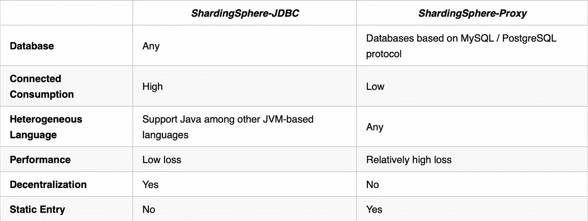

# 基于 PostgreSQL 和 openGauss 创建分布式数据库解决方案

> 原文：<https://medium.com/codex/create-a-distributed-database-solution-based-on-postgresql-opengauss-b30d0e1ced2c?source=collection_archive---------2----------------------->

随着 MySQL ShardingSphere-Proxy 逐渐成熟并被广泛接受，ShardingSphere 也开始关注 PostgreSQL ShardingSphere-Proxy。

与 alpha 版和 beta 版相比，ShardingSphere-Proxy 5.0.0 在 PostgreSQL 协议实现、SQL 支持和控制等方面做了很多改进。这为未来与 PostgreSQL 生态全面对接奠定了基础。ShardingSphere-Proxy 和 PostgreSQL 的生态系统集成在 PostgreSQL 数据库的基础上，为用户提供了透明和增强的功能，如:数据分片、读/写拆分、影子数据库、数据屏蔽和数据去敏感化以及分布式治理。

除了 PostgreSQL，华为开发的开源数据库 openGauss 也越来越受欢迎。借助 Shardingsphere openGauss 的功能和生态系统，它享有出色的独立性能，将有可能创建满足日益多样化的场景需求的分布式数据库解决方案。

目前，ShardingSphere PostgreSQL 和 openGauss 代理支持 Apache ShardingSphere 生态系统的大多数功能，包括数据分片、读/写拆分、影子数据库、数据屏蔽/去敏感化和分布式治理。因此，它几乎和 ShardingSphere MySQL 代理一样成熟。

本文将介绍基于 PostgreSQL 构建的 ShardingSphere-Proxy 5.0.0 的改进及其与 openGauss 的生态系统集成。

# ShardingSphere-Proxy 简介

ShardingSphere-Proxy 是 ShardingSphere 生态系统中的一个适配器，被定位为对用户透明的数据库代理。ShardingSphere 代理不仅限于 Java。而是实现了 MySQL 和 PostgreSQL 数据库协议，用户可以使用各种兼容 MySQL / PostgreSQL 协议的客户端访问和操作数据。



ShardingSphere-Proxy 能够解决以下问题:通过子数据库、子表或其他规则，数据将被分布到多个数据库实例中，这必然会给管理带来一些不便；或者当非 Java 开发人员需要 ShardingSphere 提供的功能时……这正是 ShardingSphere-Proxy 构建的目的。

ShardingSphere-Proxy 隐藏了后端数据库。对于客户端来说，就像使用数据库一样。用户不需要担心 ShardingSphere 如何协调其背后的数据库。所以对非 Java 开发人员或者 DBA 更友好。

协议方面，ShardingSphere PostgreSQL 代理实现了大部分扩展查询协议，支持异构语言通过 PostgreSQL 和 openGauss 驱动和连接代理。基于重用 PostgreSQL 协议，ShardingSphere openGauss 代理还支持 openGauss 独有的批量插入协议功能。

但由于 ShardingSphere-Proxy 比 ShardingSphere-JDBC 多了一层网络交互，所以 SQL 执行的延迟增加了，损失比 ShardingSphere-JDBC 略高。

# sharding sphere-代理和 PostgreSQL 生态系统集成


兼容 PostgreSQL 简单查询和扩展查询

简单查询和扩展查询是大多数使用 PostgreSQL 的用户最常用的协议。例如，当使用下面的命令行工具`psql`连接 PostgreSQL 进行 CRUD 操作时，通常使用简单的查询与数据库进行交互。

```
$ psql -h 127.0.0.1 -U postgres 
psql (14.0 (Debian 14.0–1.pgdg110+1))
Type “help” for help.
postgres=# select id, name from person where age < 35;
 id | name 
 — — + — — — 
 1 | Foo
(1 row)
```

简单查询的协议交互图如下:


使用 PostgreSQL JDBC 驱动和其他驱动时，代码如下 PreparedStatement，默认对应扩展查询协议。

```
String sql= "select id, name from person where age > ?";PreparedStatement ps = connection.prepareStatement(sql); ps.setInt(1,35); ResultSet resultSet = ps.executeQuery()
```

扩展查询的协议交互图如下:


目前，ShardingSphere PostgreSQL 代理实现了简单查询和大多数扩展查询的协议。但是，由于数据库客户端和驱动程序已经封装了 API 供用户使用，用户不需要担心数据库协议。

ShardingSphere-Proxy 兼容 PostgreSQL 的简单查询和扩展查询，这意味着用户可以使用常用的 PostgreSQL 客户端或驱动程序连接 ShardingSphere-Proxy 进行 CRUD 操作，以利用数据库上层 ShardingSphere 提供的增量功能。

# ShardingSphere-Proxy 和 openGauss 生态系统集成

## 支持 openGauss JDBC 驱动

openGauss 数据库有相应的 JDBC 驱动。JDBC 网址的前缀是`jdbc:opengauss`。尽管使用 PostgreSQL 的 JDBC 驱动程序也可以连接 openGauss 数据库，但是 openGauss 的批量插入和其他独特功能将无法完全发挥作用。ShardingSphere 集成了能够识别 openGauss JDBC 驱动程序的 openGauss 数据库，**允许开发人员在 ShardingSphere 中直接使用 openGauss JDBC 驱动程序。**

## 支持 openGauss 批量插入协议

例如，当我们准备如下的插入句时:

```
insert into person (id, name, age) values (?, ?, ?)
```

以 JDBC 为例，我们可以使用以下方法进行批量插入:

```
String sql = "insert into person (id, name, age) values (?, ?, ?)"; PreparedStatement ps = connection.prepareStatement(sql); ps.setLong(1, 1); ps.setString(2, "Foo"); ps.setInt(3, 18); ps.addBatch(); ps.setLong(1, 2); ps.setString(2, "Bar"); ps.setInt(3, 36); ps.addBatch(); ps.setLong(1, 3); ps.setString(2, "Tom"); ps.setInt(3, 54); ps.addBatch(); ps.executeBatch();
```

在 PostgreSQL 协议层，`Bind`可以传递一组参数形成门户，`Execute`每次可以进行一个门户。

通过`Bind`和`Execute`的重复可以实现批量插入。协议交互图如下:


PostgreSQL 批量插入

`Batch Bind`是 openGauss 独有的消息。与`Bind`相比，`Batch Bind`可以一次传送多组参数。使用`Batch Bind`进行批量插入的协议交互图如下:


openGauss 批量插入

ShardingSphere-Proxy openGauss 支持批量绑定协议，这意味着**用户可以使用 openGauss 客户端或驱动程序来执行 ShardingSphere 代理的批量插入。**

# 未来的 sharing sphere-代理开发

## 支持元数据中的 ShardingSphere PostgreSQL 代理逻辑查询

ShardingSphere-Proxy 是一个透明的数据库代理，这意味着用户不需要考虑代理如何协调数据库。

下图中，在 ShardingSphere-Proxy 中配置逻辑数据库`sharding_db`和逻辑表`person`时，Proxy 后面的两个数据库中有四个表。


目前在 ShardingSphere MySQL Proxy 中执行`show schemas`和`show tables`语言时，查询结果被列为逻辑数据库`sharding_db`和逻辑表`person`。

当使用`psql`连接`PostgreSQL`时，用户可以通过`\l`、`\d`等请求查询数据库和表格。

不过与 MySQL 不同的是，`show tables`是 MySQL 支持的语言，而`psql`中使用的`\d`其实对应的是更复杂的 SQL。目前，使用 ShardingSphere PostgreSQL 代理时，无法查询逻辑数据库或逻辑表。

# 描述支持扩展查询的预准备语句

PostgreSQL 协议中有两种类型的描述消息，即描述门户和描述预备语句。目前，ShardingSphere 代理仅支持描述门户。

Describe Prepared 语句实际应用的一个例子:

请在执行 PreparedStatement 之前获取结果集的元数据。

```
PreparedStatement preparedStatement = connection.prepareStatement("select * from t_order limit ?"); ResultSetMetaData metaData = preparedStatement.getMetaData();
```

ShardingSphere 与 PostgreSQL 和 openGauss 的生态系统集成仍在进行中，在完全完成之前还有一些步骤。如果你对我们正在做的事情感兴趣，欢迎你通过 GitHub、Twitter、Slack 或官方邮件列表加入 ShardingSphere 社区。

# 开源项目链接:

***sharding sphere Github:【https://github.com/apache/shardingsphere】***

***sharding sphere Twitter:***【https://twitter.com/ShardingSphere】T4

***ShardingSphere Slack 频道:***[https://join . Slack . com/t/Apache sharding sphere/shared _ invite/ZT-sbd de 7 ie-sjdqo 9 ~ I 4 rycr 18 bq 0 sytg](https://join.slack.com/t/apacheshardingsphere/shared_invite/zt-sbdde7ie-SjDqo9~I4rYcR18bq0SYTg)

***GitHub 问题:***[https://github.com/apache/shardingsphere/issues](https://github.com/apache/shardingsphere/issues)

***投稿指南:*【https://shardingsphere.apache.org/community/cn/contribute/】**

**GitHub:**https://github.com/apache/shardingsphere

# **参考文献:**

https://www.postgresql.org/docs/current/protocol.html—[https://gitee . com/open gauss/open gauss-connector-JDBC/blob/master/pg JDBC/src/main/Java/org/PostgreSQL/core/v3/queryexecutorimpl . Java # l 1722](https://gitee.com/opengauss/openGauss-connector-jdbc/blob/master/pgjdbc/src/main/java/org/postgresql/core/v3/QueryExecutorImpl.java#L1722)

[](https://www.postgresql.org) [## 一种数据库系统

### PostgreSQL 是一个强大的开源对象关系数据库系统，经过 30 多年的积极开发…

www.postgresql.org](https://www.postgresql.org) [](https://opengauss.org/en/) [## 开放高斯

### 使用 openGauss 会议预约功能的登录提示需要 SIG 群维护者的身份权限或者…

opengauss.org](https://opengauss.org/en/) 

[https://gitee . com/open gauss/open gauss-connector-JDBC/blob/master/pg JDBC/src/main/Java/org/PostgreSQL/core/v3/queryexecutorimpl . Java # l 1722](https://gitee.com/opengauss/openGauss-connector-jdbc/blob/master/pgjdbc/src/main/java/org/postgresql/core/v3/QueryExecutorImpl.java#L1722)

# 作者

吴伟杰

> Apache ShardingSphere 提交者& SphereEx 的中间件工程师。对 Apache ShardingSphere 和 Apache ShardingSphere ElasticJob 的开发做出了贡献。

