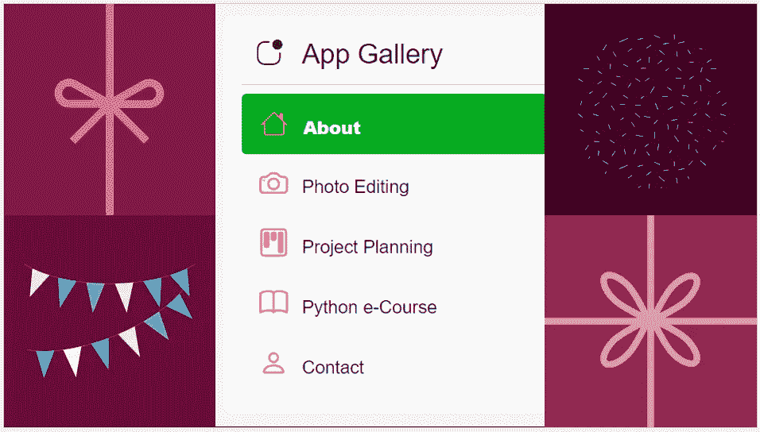

# 使用新的简化选项菜单组件创建一个多页面应用程序

> 原文：<https://medium.com/codex/create-a-multi-page-app-with-the-new-streamlit-option-menu-component-3e3edaf7e7ad?source=collection_archive---------0----------------------->

## 还用 st.radio()创建菜单？是时候尝试在 Github 中提供完整代码的 Streamlit-Option-Menu 了

作者创建的图像

# 介绍

Streamlit-option-menu 是一个新的自定义 Streamlit 组件，允许用户在菜单中的选项之间切换。它…