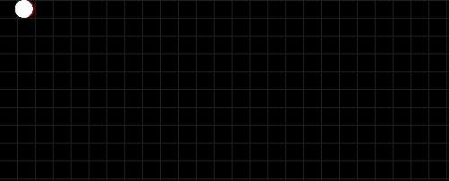

# 使用 Angular 和 Pixi 创建一个蛇游戏。射流研究…

> 原文：<https://medium.com/codex/create-a-multiplayer-game-using-angular-and-pixi-js-part-1-7fafccc2c996?source=collection_archive---------3----------------------->

洛伦佐·埃雷拉在 [Unsplash](https://unsplash.com?utm_source=medium&utm_medium=referral) 上拍摄的照片

今天，我想用 Angular 创建一个蛇游戏。

首先，我们要初始化环境。

1.  创建新文件夹，打开终端，使用`ng new`
2.  另外，我们将使用 PIXI.js `npm install pixi.js`
3.  安装 RxJs 我们以后会用到，`npm install rxjs`
4.  前往`tsconfig.json`添加`allowSyntheticDefaultImports: true`更多信息请阅读[https://www . typescriptlang . org/ts config # allowSyntheticDefaultImports](https://www.typescriptlang.org/tsconfig#allowSyntheticDefaultImports)
5.  清除`app.component.html`中的所有内容

差不多就是这样。

是时候初始化 PIXI.Js 了。在`AppComponent`中，让我们创建 PIXI 属性。申请类型。

我们在前面的代码中向应用程序传递了一些参数，以便画布大小与窗口大小相同。现在，我们不会有任何调整大小的功能，但以后我们会添加它。此外，我们已经添加了`document.body.appendChild(this.app.view)`将画布添加到身体。

当创建一个游戏时，你需要有通用的帮助方法和属性来帮助你画图、计算等等。因此，让我们创建每个 actor 组件派生的`Actor`类。

要在 PIXI Js 中绘制图形，我们可以使用`PIXI.Graphics`。我们的 actor 组件继承了`PIXI.Graphics`来访问绘制和改变状态的方法。

您可以覆盖`update`方法来移动您的对象或更改其每帧的状态。如果您想捕捉玩家点击的输入，您可以使用`onKeydown`或`onKeyup`

现在，我们需要将所有演员存储在`AppComponent`中，然后将其添加到应用程序阶段，我们为每帧调用`update`方法。此外，我们将通知演员关于按键事件。

前面的代码遍历 actors 并将 update 方法注册到 ticker。因此，对于每一帧，都会调用 update 方法。还有，要画演员，必须把演员加到舞台上。这就是第一个循环所做的。

我已经使用 RxJs 来捕获按键事件，但是你也可以使用`document.addEventListener`或者`RxJs`，angular 有你可以使用的[https://angular.io/api/core/HostListener](https://angular.io/api/core/HostListener)。这取决于你。

好了，该用我们的演员班了。首先，我们来添加一个简单的背景。

上面的代码将添加一个数学模式背景。如果你按照这篇文章做了所有的事情，你的结果应该是这样的:

我们的蛇将在单元格中移动，因此背景将帮助我们进行调试。稍后我们可以移除它。

现在让我们创建一个蛇类。

要改变蛇的状态，必须使用`update`的方法。相反，要捕捉按键，我们必须覆盖`onKeydown`

现在我们可以将我们的蛇添加到 actor 数组中。

所以，我们的蛇由细胞组成。因此，我们必须分别绘制每个单元格，这将由 Snake 类控制。

如上所述，蛇在我们已经绘制为背景的单元格中移动。因此,`tileX`和`tileY`将用于在单元格中查找蛇的位置。不要与背景单元格和蛇形单元格混淆。他们两个都不一样。基本上，蛇细胞是蛇身体的一部分，而背景细胞是我们的蛇将要移动的小矩形。所以我们的蛇细胞是互相依赖的。因此，我们有了`next`属性，我们将在其中存储下一个 snake 单元格。

好吧，让我们画蛇。首先我们调用`SnakeCell`类构造函数中的 draw 方法。

我们调用了`drawCircle`方法来传递单元格的半径，并通过调用`beginFill`方法来指示颜色。此外，我们还添加了 getWorldPosition。基本上，它所做的就是占据瓷砖位置，然后转换到世界位置。如上所述，我们的蛇必须在背景细胞中移动，因此每个细胞大小为 20。所以，让我们把 tile 调用到背景单元格。如果您的位置在 x 轴上是 4，在 y 轴上是 3，将它们乘以图块大小将得到世界位置。

我们的蛇细胞还没有被使用，所以要画细胞；首先，我们必须将它们添加到 Snake 类中。

既然我们的蛇已经添加到了 actors 中，那么是时候添加 Snake cell 了，但是既然 Snake cell 是蛇的一部分，我们就不需要在 Snake 类之外添加它们了。因此，我们可以使用继承自`PIXI.Graphics`的`addChild`方法，该方法会将这些蛇细胞添加到蛇阶段来绘制它们。

如果你照着做，你会看到和上图一样的结果。

现在，是时候为我们的蛇添加一些基本的动作了。

这条蛇将能够移动:北，南，西，东。

因此，让我们创建一个新的枚举，并将其命名为“方向”

如果我们的蛇移动到西方，它不能旋转到东方。反之，如果它向北移动，它就不能向南移动。另外，如前所述，我们的 snake 类控制它的单元格。因此，snake 类捕获按键事件并通知细胞。

好的，现在让我们给蛇细胞添加运动。

首先，我们需要知道我们的蛇要去哪里。因此，我们必须在 SnakeCell 类中添加两个属性。`directionX`和`directionY`所以，如果我们向东移动，`directionX`将是 1 或-1，`directionY`将是 0。相反，如果我们移动到 y 轴，`directionY`将是 1 或-1，而`directionX`将是 0。因为我们的蛇不应该同时向两个轴移动。

默认情况下，我们可以去东边。但是一旦玩家按下按钮，我们必须改变方向。为此，我们需要一个方法来接收`direction`参数并相应地改变方向。

`changeDirection`方法接收方向并相应地更新。好了，上面的代码只是改变了方向。现在我们需要添加运动。为此，我们必须覆盖`update()`，在那里我们可以更新单元格的位置。每个细胞都与下一个细胞相连；每次更新时，我们都会更新单元格的位置。一个 snake 单元格有下一个 snake 单元格，因此一旦发生更新，该单元格位置就成为下一个单元格位置。因此，主细胞是最后一个细胞，也就是头部。一旦头部更新了位置，其余的细胞也会跟着更新。

因此，如果下一个 snake 单元格未定义，则意味着该单元格是 head。所以我们应该按方向更新，`tileX`和`tileY`，否则按下一个单元格位置更新。因此，蛇的细胞是互相跟随的。

这是我们的蛇细胞类的样子:

正如你在上面的代码中看到的，我们正在基于方向更新`tileX`和`tileY`。

但是现在，我们正在更新`tileX`和`tileY`，这还不够。我们需要更新蛇细胞的实际位置。

我们必须使用`PIXI.Graphics` API 来改变位置。

为了更新位置，我们需要将图块位置转换为世界位置。为此，我们可以调用已经声明的`getWorldPosition()`。并用它改变蛇细胞的位置。

这就是更新方法的样子:

好了，现在我们需要迭代 snake 子元素并调用 update 方法来移动 snake 单元格。

上面的代码显示了 snake 类的更新方法。

如果我们运行代码，我们的蛇移动得很快，但是我们将通过延迟更新方法来降低速度。在我们继续之前，我想说一件事。

如果我们降低速度，你会看到细胞像这样移动:

这是因为我们使用的是整数而不是浮点数。毕竟，蛇在瓷砖上移动。我们稍后将使用线性插值来解决这个问题。

使用线性插值

好了，现在我们必须通过延迟更新方法来降低速度。为此，我们可以存储从`performance.now()`给定的数字，并从当前给定的数字中减去上次存储的数字，如果它大于一个阈值，我们可以重置它并调用`update`方法。

在前面的代码中，我们添加了两个属性`lastUnix`和`threshold`，因此对于每一帧，我们检查 Unix 是否超过了阈值，然后调用 update 方法并重置它。

好了，现在我们的蛇慢慢移动。现在是时候应用线性插值了。平稳地改变蛇的位置。

我们需要在 SnakeCell 中添加一个新方法，该方法将从 update 方法中调用。我将它命名为`smoothUpdate`。从`update`方法中移除位置变化，并将其放入新方法中。

现在，我们必须使用已经在 Actor 类中声明的 lerp 方法来平滑地插入运动。

这是 SnakeCell 类的样子:

因此，我们已经创建了一个新的方法来平滑更新，并留下现有的瓷砖位置。此外，我们使用线性插值来平滑地更新位置。

如果运行该脚本，您将看到相同的结果:

如你所见，我们的插值工作正常。但是，有些问题却不用担心。我们稍后将修复它们。

好了，现在是时候捕捉按键并相应地旋转蛇了。

首先，我们只需要捕捉箭头键:{左，上，右，下}。让我们添加一个 enum，将其命名为 KeyboardMap，并添加带有适当键码的条目。

随后，我们需要在 Snake 类中覆盖 onKeydown。我们必须通过键码找到正确的方向。不用写很多 if-else，我们可以创建一个 hashmap 来添加 KeyboardMap 作为键，Direction 作为值。因此，当我们得到一个按键事件时，我们可以通过键码从散列表中获取方向。

首先，让我们创建 IHashTable 接口。

现在，让我们向 snake 类添加方向图属性，并向其中插入值。

这是 snake 类的一部分，我们在其中添加了`directionMap`并插入了值。所以这很好。

现在让我们根据方向旋转蛇。

要做到这一点，我们必须得到头部细胞，并调用改变方向的方法。

好了，现在我们的蛇移动得很好。

这是第一部分，所以在下一部分我们将继续:

1.  跟踪蛇的摄像机
2.  动作改进
3.  碰撞
4.  添加食物，让蛇成长

感谢阅读，我希望你喜欢它，如果你喜欢这篇文章，请跟我来。

源代码:[https://github.com/DharmaEye/snake-multiplayer](https://github.com/DharmaEye/snake-multiplayer)