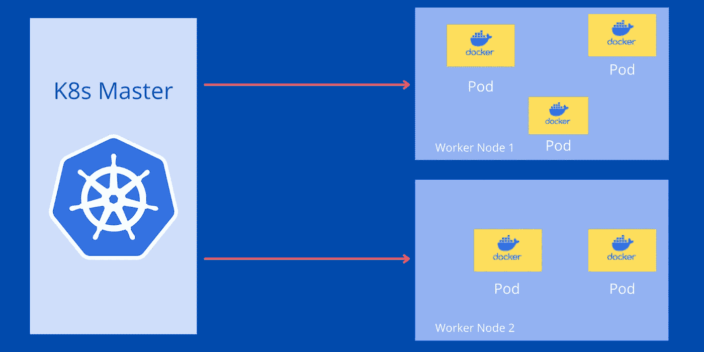

# 在 Kubernetes 集群中创建一个 Pod

> 原文：<https://medium.com/codex/create-a-pod-in-kubernetes-cluster-b9e0c33bb904?source=collection_archive---------3----------------------->

## 了解什么是 Pod 以及如何在 Kubernetes 集群中创建 Pod。

库伯内特斯豆荚

Kubernetes 有各种成分。 **Pod** 是 Kubernetes 组件之一，也是 Kubernetes 集群中最小的单元。在本文中，我们将了解什么是 Pod 以及如何创建 Pod。

# **什么是 Pod？**