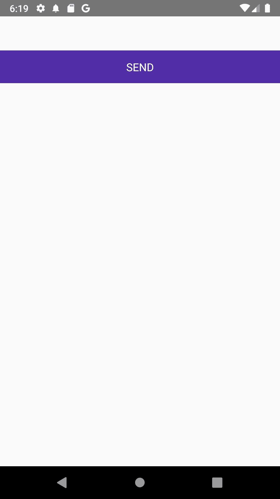
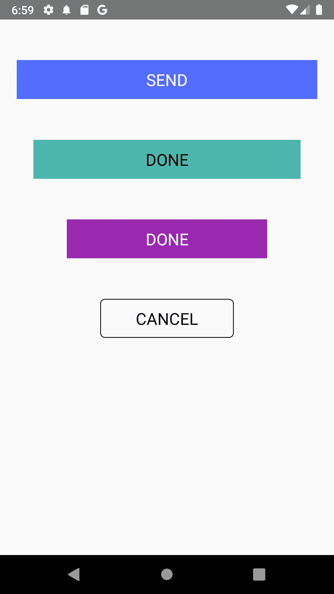

# 在 React Native 中创建可重用的自定义按钮

> 原文：<https://medium.com/codex/create-a-reusable-custom-button-in-react-native-2a2910425695?source=collection_archive---------14----------------------->


反应原生船有一个默认的按钮组件，你可以在这里找到。这个按钮的一个大缺点是它不是高度可定制的。为此，如果你想玩很多东西，就有必要创建你自己的自定义按钮组件。

我们将使用 React Native 的`TouchableOpacity`组件来创建我们的自定义按钮组件。这个按钮也可以接受道具。

首先，

*   建立一个新的 React 本地项目；
*   创建一个`src`文件夹，并在其中添加一个`component`文件夹。
*   在`component`文件夹中创建另一个文件夹，命名为`CustomButton`。
*   在`CustomButton`内部，添加一个`index.js`文件。

您的文件结构应该如下所示

```
src 
    |components
            |CustomButton
                |index.jsRender the CustomButton in your App’s index.js;
```

在 CustomButton 的 index.js 文件中添加以下代码行。

```
// CustomButton/index.js
import React from 'react';
import {Text, StyleSheet} from 'react-native';const CustomButton = () => {
  return (
        <View style={styles.container}>
           <Text> hello button </Text> 
        </View>
    );
};export default CustomButton;const styles = StyleSheet.create({
  container: {
    marginTop: 50,
  },
});
```

我们将使用`TouchableOpacity`替换文件中的`View`组件，

```
..
import {Text, TouchableOpacity StyleSheet} from 'react-native';
...
    <TouchableOpacity style={styles.container}>
      <Text> hello button </Text>
    </TouchableOpacity>
...
```

`TouchableOpacity`接收`View`道具和另一个接受函数的`onPress`。

```
...
 <TouchableOpacity style={styles.container} onPress={() => console.log("Haha I'm about to be button")}> 
      <Text> hello button </Text>
...
```

有了这个，任何时候我们按下`hello button`文本，我们都会在控制台中看到一个“哈哈我就要成为按钮了”，去试试吧。

让我们开始设计这个按钮

```
// Here I changed the text and added style prop
...
 <Text style={styles.title}> SEND </Text>
```

这是新的款式

```
const styles = StyleSheet.create({
  container: {
    marginTop: 50,
    backgroundColor: '#512DA8',
    height: 48,
    alignItems: 'center',
    justifyContent: 'center'
  },
  title: {
      color: "#fff",
      fontSize: 16,
  }
});
```



当然，您可以添加您认为合适的其他样式。

目前，我们的按钮是静态的，让我们把它变成动态的和可重用的。也就是说，如果我们想把标题从`SEND`改成`CONTINUE`怎么办，按钮的颜色怎么办，如果我们想让按钮在按下时做别的事情怎么办等等。

为了实现这一点，我们将让按钮接受一些道具

*   **标题**:改变按钮的标题。它采用一个`string`数据类型。
*   **onPress** :传入任意选择的函数。它需要一个函数。
*   **按钮颜色**:改变按钮的颜色。它采用一个`string`数据类型。
*   **标题颜色**:改变标题文本的颜色。它采用一个`string`数据类型。

此外，我们将添加通用样式属性，以防我们想要覆盖默认样式的`title`和`TouchableOpacity`

*   **buttonStyle** :接受样式的对象。
*   **textStyle** :它接受一个样式的对象。

像这样设置道具

```
...
const CustomButton = ({
  title,
  onPress,
  buttonColor,
  titleColor,
  buttonStyle,
  textStyle,
}) => {
  return (
...
```

然后把它们放在适当的位置

对于**标题**和**按下**道具

```
<TouchableOpacity
  style={styles.container}
    // Here
  onPress={onPress}
>
//Here too
  <Text style={styles.title}> {title} </Text>
...
```

所以，对于`TouchableOpacity`我们有

```
...
<TouchableOpacity
// This here
      style={{...styles.container, ...buttonStyle, backgroundColor: buttonColor || '#512DA8' }}
      onPress={onPress}
>
...
```

对于`Text`,我们有

```
//This here too
...
<Text style={{...styles.title, ...textStyle, color: titleColor || "#fff"}}> {title} </Text>
...
```

> *注意我们如何使用 JavaScript*[*spread 操作符*](https://developer.mozilla.org/en-US/docs/Web/JavaScript/Reference/Operators/Spread_syntax) *来适应许多样式，我们还分别为按钮和文本添加了默认的背景颜色和文本颜色。他们将充当后援。*

这是当前的代码

```
import React from 'react';
import {Text, TouchableOpacity, StyleSheet} from 'react-native';const CustomButton = ({
  title,
  onPress,
  buttonColor,
  titleColor,
  buttonStyle,
  textStyle,
}) => {
  return (
    <TouchableOpacity
      style={{
        ...styles.container,
        ...buttonStyle,
        backgroundColor: buttonColor || '#512DA8',
      }}
      onPress={onPress}>
      <Text
        style={{...styles.title, ...textStyle, color: titleColor || '#fff'}}>
        {title}
      </Text>
    </TouchableOpacity>
  );
};export default CustomButton;const styles = StyleSheet.create({
  container: {
    marginTop: 50,
    backgroundColor: '#512DA8',
    height: 48,
    alignItems: 'center',
    justifyContent: 'center',
  },
  title: {
    color: '#fff',
    fontSize: 16,
  },
});
```

为了利用这些道具，打开 App.js 或任何你渲染过`CustomButton`组件的地方，添加如下内容:

```
...
    <>
      <CustomButton
        buttonColor="#536DFE"
        title="SEND"
        buttonStyle={{width: '90%', alignSelf: 'center'}}
        textStyle={{fontSize: 20}}
        onPress={() => console.log('I am the first button')}
      /><CustomButton
        buttonColor="#4DB6AC"
        titleColor="#000"
        title="DONE"
        buttonStyle={{width: '80%', alignSelf: 'center'}}
        textStyle={{fontSize: 20}}
        onPress={() => console.log('I am the second button')}
      /><CustomButton
        buttonColor="#9C27B0"
        titleColor="#FFF"
        title="DONE"
        buttonStyle={{width: '60%', alignSelf: 'center'}}
        textStyle={{fontSize: 20}}
        onPress={() => console.log('I am the third button')}
      /><CustomButton
        buttonColor="transparent"
        titleColor="#000"
        title="CANCEL"
        buttonStyle={{
          width: '40%',
          alignSelf: 'center',
          borderWidth: 1,
          borderColor: '#1c1c1c',
          borderRadius: 6,
        }}
        textStyle={{fontSize: 20}}
        onPress={() => console.log('I am the fourth button')}
      />
    </>
...
```

我们会得到



就这样，你成功地在 React Native 中创建了一个可重用的自定义按钮。

> 如果您喜欢这篇文章，请点赞、分享并添加您的评论。
> 
> *你也可以关注我的* [*推特*](http://twitter.com/talk2dera)

*原载于*[*https://dera . hashnode . dev*](https://dera.hashnode.dev/create-a-reusable-custom-button-in-react-native)*。*