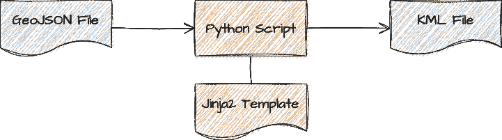
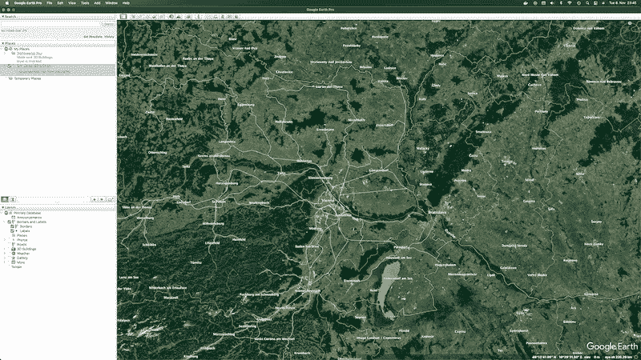

# 用 Python 中的 Jinja2 创建一个简单而有效的 JSON 文件转换器

> 原文：<https://medium.com/codex/create-a-simple-but-effective-json-file-converter-with-jinja2-in-python-28732d4f210e?source=collection_archive---------2----------------------->


照片由 [Shiro hatori](https://unsplash.com/@shiroscope?utm_source=unsplash&utm_medium=referral&utm_content=creditCopyText) 在 [Unsplash](https://unsplash.com/s/photos/long-exposure?utm_source=unsplash&utm_medium=referral&utm_content=creditCopyText) 上拍摄

需要将一个 JSON 文件转换成另一种格式？这可以通过几行 Python 和 Jinja2 模板快速实现并重用。我们将用不到 30 个 LOC 实现这一点，并使用一个示例模板将 GeoJSON 转换为 KML，并且可以在更多转换中重用。

将文件从一种格式转换成另一种格式是软件开发人员日常生活中经常出现的任务。问八个不同的软件开发者他们最喜欢的方法，你会得到 128 个答案。有现成的转换工具、脚本、框架、库，但有时一个简单的解决方案就足以完成手头的任务。

[JSON](https://en.wikipedia.org/wiki/JSON) 是半结构化数据的一种流行格式。将 JSON 转换成其他文件格式的用例很多:JSON 转换成 XML，JSON 转换成另一种 JSON 方言，等等。然而，没有人想从头开始为每个转换编写新的解析器和转换器。今天的解决方案将可重复用于不同的用例，从长远来看可能会节省时间。

我已经把最终的 Python 脚本放在一个 [GitHub gist](https://gist.github.com/mostsignificant/acddc048851d0e751846d24e62afc6d1) 中以供参考。

# 今天的例子:GeoJSON 到 KML

为了演示快速简单的转换，我们使用开放数据世界中的一个例子。奥地利国家铁路(ÖBB)在其开放数据门户上提供[文件](https://data.oebb.at/oebb?dataset=uddi:77ce2fcf-1712-11e8-b619-a385d0a26832)及其车站和路线。其中一个文件 [GIP_OEBB_STRECKEN.json](https://data.oebb.at/oebb?dataset=uddi:77ce2fcf-1712-11e8-b619-a385d0a26832&file=uddi:d3e25791-7889-11e8-8fc8-edb0b0e1f0ef/GIP_OEBB_STRECKEN.json) 是所谓的 [Geojson](https://geojson.org/) 格式:一种基于 JSON 的地理数据结构编码的可访问格式。

以下示例显示了 GeoJSON 文件。该文件包含类型为`Feature`的对象。其中几个可以捆绑在一个`FeatureCollection`中。每个`Feature`都有一个`geometry`，T3 本身就拥有`coordinates`。这些`coordinates`是两个或三个数字的数组。这些数字是经度和纬度(或东距和北距)，以及可选的高度(或海拔)。您可以在相应的 [RFC 7946](https://www.rfc-editor.org/rfc/rfc7946) 中阅读完整的规范。

```
{
    "type" : "FeatureCollection",
    "name" : "GIP_OEBB_STRECKEN",
    "features" : [
        {
            "type" : "Feature",
            "geometry" : {
                "type" : "MultiLineString",
                "coordinates" : [
                    [
                        [ 13.8282417878, 46.5874404328 ],
                        [ 13.8281239459, 46.5871572442 ],
                        // ...
                    ]
                ]
            },
            "properties" : {
                // ...
            }
        }
}
```

我们希望实现一个脚本，将 GeoJSON 文件转换成 Keyhole 标记语言( [KML](https://developers.google.com/kml) )格式的新文件。KML 是地理数据和注释的 XML 符号。KML 文件可以被导入到像谷歌地球这样的浏览器中，这是它最初被开发出来的目的。这种格式的名字源于它的历史:谷歌地球以前被称为 Keyhole Earth Viewer，由一家名为 Keyhole Inc .的公司创建，后来被大型搜索引擎巨头收购。

以下示例显示了一个简单的 KML 文件及其基本概念:

*   标准的 XML 声明
*   带有名称空间引用的`kml`标签
*   一个`Document`标签，用于保存任意数量的
*   `Placemark`标签，包含以下信息
*   带`name`和`description`的注释和
*   带有`Point`标签和嵌入式`coordinates`的地理位置

你可以在官方的[谷歌开发者网站](https://developers.google.com/kml)上了解更多信息。

```
<?xml version="1.0" encoding="UTF-8"?>
<kml >
<Document>
<Placemark>
  <name>Vienna</name>
  <description>Beautiful city in the east of Austria</description>
  <Point>
    <coordinates>16.363449,48.210033,190.0</coordinates>
  </Point>
</Placemark>
</Document>
</kml>
```

关于坐标，我们已经可以看到 GeoJSON 格式的平行。请注意，坐标的顺序是经度，然后是纬度，因为它对应于 x 轴和 y 轴，然后是高程，映射到 z 轴。从 GeoJSON 转换到 KML 基本上是一个简单的过程，我们稍后会看到一些例外。这个过程的基本概念如下图所示。该转换器将使我们能够在谷歌地球上显示ÖBB 开放数据 GeoJSON 文件及其站点和路线。


转换器概念

# 工具集

在今天的练习中，我们将结合使用我们库存中的两个强大工具: [Python](https://www.python.org/) 和 [Jinja2](https://palletsprojects.com/p/jinja/) 模板引擎及其丰富的模板语法。Python 脚本将接收源 JSON 文件，并将其转换为相应模板中定义的任何格式。

通过使用模板，我们可以将转换器从实际的转换用例中分离出来:

*   如果我们需要另一种类型的目标数据格式，我们只需编写另一个模板
*   如果我们在目标文件中需要一个额外的特性，我们只需要改变模板



带有 Jinja2 模板的 Python 转换器

Jinja2 就是我们需要的模板引擎。它带来了具有条件、循环等等的表达性和强大的语法。官方文档中的以下示例展示了它的一些功能。对于我们的转换器，我们不会使用所有这些功能，读者可以发挥自己的创造力，用额外的功能来扩展转换器。

```


  <ul>
  
    <li><a href="{{ user.url }}">{{ user.username }}</a></li>
  
  </ul>

```

对于版本 3 之前的 Python 安装，有一个没有版本号的原始版本，名为`Jinja`。然而，我们需要`Jinja2`,因为我们使用的是 Python 3(如果你被之前的东西卡住了，我会很同情你)。你可以通过 Python 的包管理器`pip`简单地安装模板引擎:

```
pip install jinja2
```

# 完成这项工作的脚本

每个剧本都需要一个超级有趣和超级有创意的短名字——但是我们两者都缺乏，所以我们正在创建一个名为`convo.py`的文件。在脚本的顶部，我们添加了一个描述性的一行程序，并导入了重要的包:

```
import argparse # reading the command line parameters
import json # reading the input file
import os # file path magic

from jinja2 import Environment, FileSystemLoader # template magic
```

我们按照流行的 Python [模式](https://realpython.com/python-main-function/#create-a-function-called-main-to-contain-the-code-you-want-to-run)编写了一个`main()`函数，尽管整个脚本会很短——但是为了将来的增强，我们会保持它的简洁。在`main()`函数中，我们将解析三个命令行参数:

*   `input`是要摄取和转换的 JSON 文件
*   `template`是应用的 Jinja2 模板
*   `output`是最终转换文件的名称

对于 GeoJSON 和最终 KML 文件的示例，从命令行调用脚本的语法应该如下所示:

```
python convo.py \
  GIP_OEBB_STRECKEN.json \
  templates/geojson.kml \
  oebb_strecken.kml
```

这个调用将导致脚本读取文件`GIP_OEBB_STRECKEN.json`，使用模板`templates/geojson.kml`将 JSON 数据转换为最终文件`oebb_strecken.kml`。下面的代码行将设置 [Python 参数解析器](https://docs.python.org/3/library/argparse.html)来接收三个命令行参数。为了简洁起见，省略了对参数的描述，但是强烈建议您使用命令行参数来使任何脚本更有用。

```
parser = argparse.ArgumentParser(
        description='Converts json files to other formats via templates')
parser.add_argument('input')
parser.add_argument('template')
parser.add_argument('output')

args = parser.parse_args()
```

接下来的两行获取输入文件，并将 JSON 数据读入 Python dictionary 对象。字典的美妙之处在于，这种数据结构以后可以直接传递给模板引擎，而不需要任何额外的转换代码。

```
file = open(args.input)
data = json.load(file)
```

解析 JSON 文件后，我们加载模板文件。第二个名为`template`的命令行参数是实际模板文件的路径。我们从它构造一个绝对路径来获得目录名。Jinja2 环境需要包含模板文件的目录，我们将通过使用绝对路径来省去一些麻烦。

```
template_dir = os.path.dirname(os.path.abspath(args.template))
environment = Environment(loader=FileSystemLoader(template_dir))
```

类似地，我们从同一个命令行参数中提取模板文件名。我们将使用文件名通过 Jinja2 环境加载模板。

```
template_file = os.path.basename(args.template)
template = environment.get_template(template_file)
```

最后，调用 Jinja2 `template`来渲染数据。这个 render 方法接受一个 dictionary 对象，这就是这个转换代码如此简单的原因。`render()`方法返回一个字符串类型的对象。该字符串可以写入输出文档。

```
content = template.render(data)
with open(args.output, mode='w', encoding='utf-8') as document:
    document.write(content)
```

# 完成工作的模板

此外，我们需要写相应的模板。以下部分显示了将 GeoJSON 文件转换为 KML 文件的完整模板。我们只在条件和循环中使用基本的 Jinja2 特性。这些必须用带百分号的大括号括起来。开始标记处的减号告诉模板引擎在呈现输出文件时不要用空行替换这一行。

```
<?xml version="1.0" encoding="UTF-8"?>
<kml >
    <Document>
        
        <name>{{ name }}</name>
        
        <description>Converted KML file from GeoJSON</description>
        
        <Placemark>
            
            <name>{{ feature.properties.GIP_OBID }}</name>
            
            
            <description>{{ feature.properties.MAINNAME }}</description>
            
            
            <LineString>
                <coordinates>
                
                    
                    {{ coordinate.0 }},{{ coordinate.1 }}
                    
                
                </coordinates>
            </LineString>
            
        </Placemark>
        
    </Document>
</kml>
```

有一些变通方法可以使模板适合我们特定的输入 GeoJSON 格式:

*   对于`<Document>`标签内的`<name>`标签的文本，我们使用整个 GeoJSON 文件的名称，这在 GeoJSON 标准中是不需要的。这意味着如果输入文件在 JSON 结构中没有名称，KML 文档也没有名称。
*   对于`<Placemark>`的`<name>`标签，我们使用了一个未标准化的属性。出现了与前面的解决方法相同的问题。
*   类似地，对于`<Placemark>`的`<description>`标记，我们使用了另一个属性，如果我们有不同的输入 GeoJSON 文件，会再次导致相同的问题。

为了减轻这种情况，我们可以为其他 GeoJSON 输入文件使用不同的模板，或者使模板更加通用。对于更通用的版本，我们可以使用输入或输出文件的名称作为 KML 文档的名称。为此，在将输入文件的数据传递给模板引擎渲染器时，我们必须包含额外的字典条目。这个练习留给读者。

# 最后的结果

最后，我们可以使用ÖBB 开放数据 GeoJSON 文件和模板调用完成的脚本，将其转换为 KML:

```
python convo.py GIP_OEBB_STRECKEN.json templates/geojson.kml oebb_strecken.kml
```

转换后的 KML 文件可以通过*文件* > *导入…* 并选择您的 KML 文件导入到 Google Earth Pro 中。下面的截图显示了地图上的结果。实际路线在画布上绘制为白线。



谷歌地球 Pro 截图

# 奖励步骤

对于奖励积分，可以添加许多功能，使我们的转换脚本更加有用:

*   更多的输入文件格式:支持 CSV、XML 或 Parquet 等格式
*   约定胜于配置:让我们将模板和输出文件名命令行参数设置为可选的，并从输入文件的名称中推断出它们的名称
*   模板的元信息:输入/模板/输出文件名、转换时间戳或 Python 版本等信息

# 结论

这个快速练习展示了 Python 的 Jinja2 模板结合其板载 JSON 解析器的有效性。它允许您控制模板中的转换逻辑，并使用新模板添加额外的输出格式。我已经把最终的 Python 脚本放在一个 [GitHub gist](https://gist.github.com/mostsignificant/acddc048851d0e751846d24e62afc6d1) 中以供参考。

您可以在下一个文件转换任务中使用这种方法，但更重要的是:继续编码，继续创作！