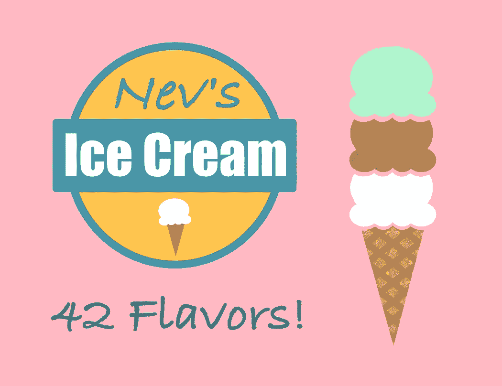

# 用普通的 JavaScript 和画布 API 创建一个动画横幅

> 原文：<https://medium.com/codex/create-an-animated-banner-with-vanilla-javascript-and-html5-canvas-8b499c294b88?source=collection_archive---------3----------------------->

图片由内文·卡茨提供。

虽然 JavaScript Canvas API 对于丰富的、高性能的动画有着巨大的潜力，但是工作的每一步都必须手动完成。鉴于制作一部动画需要付出的努力，一个现成的库可以让工作更有效率。

在本教程中，我们将用普通的 JavaScript 构建一个微型库，用于创建…