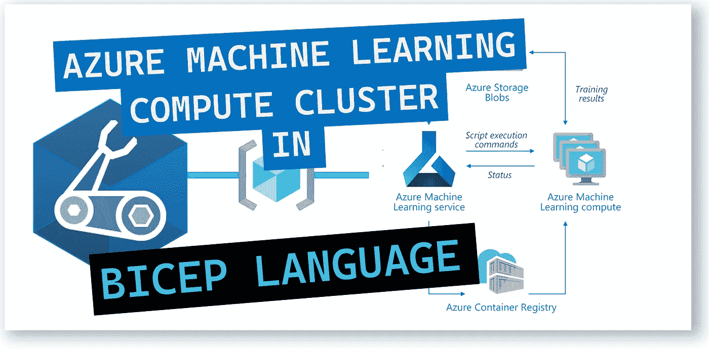
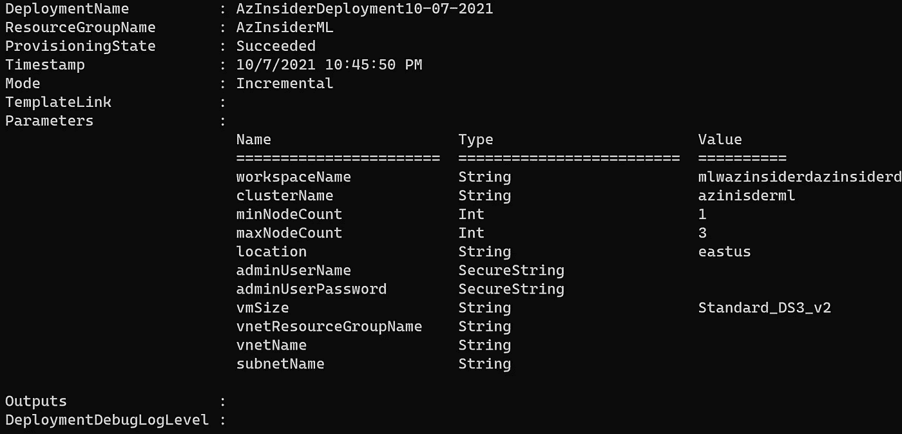
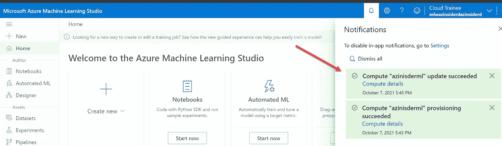
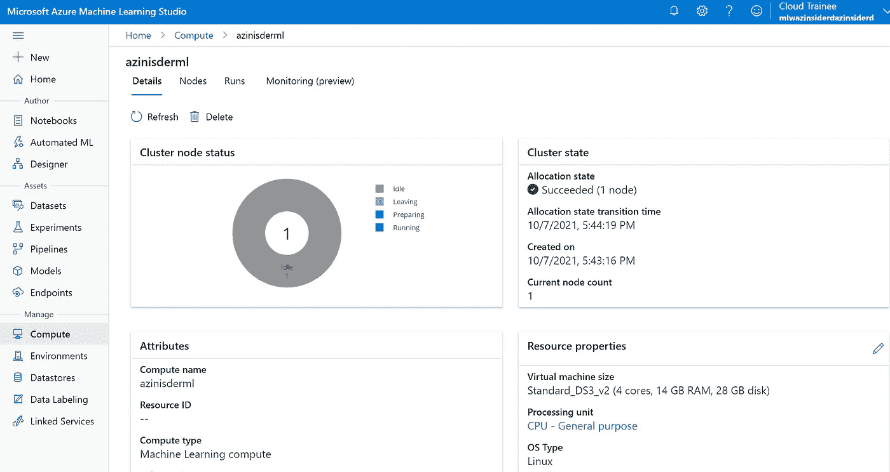

# 💪使用 Azure Bicep 创建 Azure 机器学习计算集群

> 原文：<https://medium.com/codex/create-an-azure-machine-learning-compute-cluster-using-azure-bicep-dd43f367f36a?source=collection_archive---------4----------------------->

了解如何使用 Azure Bicep 在 Azure 机器学习工作区中创建和管理计算。



**Azure Machine Learning** 是一款用于加速和管理机器学习项目生命周期的云服务。为了部署一个完整的 Azure 机器学习解决方案，我们需要几个组件:

*   **Azure 机器学习工作区**:工作区是所有机器学习活动的顶级资源，也是查看和管理工件的集中场所。*在这里* *阅读更多关于如何部署工作区* [*的信息。*](https://blog.azinsider.net/using-bicep-to-create-workspace-resources-and-get-started-with-azure-machine-learning-bcc57fd4fd09)
*   **Azure 机器学习计算实例**:一个作为托管云工作站的计算实例，供您使用您的机器学习模型。这是一个托管虚拟机，将包括一些预构建功能，以便您可以专注于您的机器学习开发环境。*点击* 阅读更多关于如何部署计算实例 [*的信息。*](https://blog.azinsider.net/create-an-azure-machine-learning-compute-instance-using-azure-bicep-491783578656)
*   Azure 机器学习计算集群:计算集群将帮助你在一个 CPU 或 CPU 计算节点集群中分布一个训练或批量推理过程。

本文将回顾如何使用 Azure Bicep 创建 Azure 机器学习计算集群，Azure Bicep 是用于在 Azure 中部署资源的 Azure 域特定语言(DSL)。

# 先决条件。

我们需要具备以下条件:

*   Azure 机器学习工作区。在这里检查您如何部署工作区[。](https://blog.azinsider.net/using-bicep-to-create-workspace-resources-and-get-started-with-azure-machine-learning-bcc57fd4fd09)
*   安装二头肌
*   在 Azure 中拥有所有者或贡献者角色的用户。

# 我们为什么需要计算集群？

Azure 机器学习中的计算集群是一种可以在工作空间中共享的资源。该计算资源可以根据需要进行扩展以高效处理作业，并且可以是单节点或多节点计算资源。

该计算资源在容器化的环境中执行，并将您的模型依赖项打包到 Docker 环境中。

创建过程非常简单，您可以在同一个工作区与同事共享计算结果，并根据您提交的运行次数自动放大或缩小计算结果。

您可以为计算集群设置最大和最小节点数。

# 留点💵 💵💵

我建议您考虑一下低优先级虚拟机，以降低成本。

另一个最佳实践是安排您的计算实例。这样，您可以在工作时间使用它们，并自动启动和停止计算实例。

第三种选择是利用保留的实例。这是适用于每小时运行**虚拟机实例**的折扣。您为虚拟机支付一年或三年的费用。从长远来看，这可能是一个不错的选择。

现在让我们处理 Azure Bicep 文件来创建一个 Azure 机器学习计算集群。

# Azure Bicep 文件来创建 Azure 机器学习计算集群

友情提示，在使用以下 Bicep 文件之前，请确保您至少有一个 Azure 机器学习工作区。

我们将抓取 Azure 机器学习**工作区**名称。我们将把它作为参数值与计算资源的管理员用户名和密码一起传递。最后，我们将包含一个集群名称参数。

如前所述，我们可以为计算集群指定节点数量。我们还将提供位置，并且您可以选择指定虚拟网络名称和子网名称。

下面的代码展示了创建 Azure 机器学习计算集群的完整 Bicep 模板。

```
[@description](http://twitter.com/description)('Specifies the name of the Azure Machine Learning Workspace which will contain this compute.')
param workspaceName string[@description](http://twitter.com/description)('Specifies the name of the Azure Machine Learning Compute cluster.')
param clusterName string[@description](http://twitter.com/description)('The minimum number of nodes to use on the cluster. If not specified, defaults to 0')
param minNodeCount int = 1[@description](http://twitter.com/description)(' The maximum number of nodes to use on the cluster. If not specified, defaults to 4.')
param maxNodeCount int = 3[@description](http://twitter.com/description)('The location of the Azure Machine Learning Workspace.')
param location string = resourceGroup().location[@description](http://twitter.com/description)('The name of the administrator user account which can be used to SSH into nodes. It must only contain lower case alphabetic characters [a-z].')
[@secure](http://twitter.com/secure)()
param adminUserName string[@description](http://twitter.com/description)('The password of the administrator user account.')
[@secure](http://twitter.com/secure)()
param adminUserPassword string[@description](http://twitter.com/description)(' The size of agent VMs. More details can be found here: [https://aka.ms/azureml-vm-details.'](https://aka.ms/azureml-vm-details.'))
param vmSize string = 'Standard_DS3_v2'[@description](http://twitter.com/description)('Name of the resource group which holds the VNET to which you want to inject your compute in.')
param vnetResourceGroupName string = ''[@description](http://twitter.com/description)('Name of the vnet which you want to inject your compute in.')
param vnetName string = ''[@description](http://twitter.com/description)('Name of the subnet inside the VNET which you want to inject your compute in.')
param subnetName string = ''var subnet = {
  id: resourceId(vnetResourceGroupName, 'Microsoft.Network/virtualNetworks/subnets', vnetName, subnetName)
}resource workspaceName_clusterName 'Microsoft.MachineLearningServices/workspaces/computes@2021-01-01' = {
  name: '${workspaceName}/${clusterName}'
  location: location
  properties: {
    computeType: 'AmlCompute'
    properties: {
      vmSize: vmSize
      scaleSettings: {
        minNodeCount: minNodeCount
        maxNodeCount: maxNodeCount
      }
      userAccountCredentials: {
        adminUserName: adminUserName
        adminUserPassword: adminUserPassword
      }
      subnet: (((!empty(vnetResourceGroupName)) && (!empty(vnetName)) && (!empty(subnetName))) ? subnet : json('null'))
    }
  }
}
```

下面的代码是我们在部署过程中传递的参数文件:

```
{
    "$schema": "[https://schema.management.azure.com/schemas/2019-04-01/deploymentParameters.json#](https://schema.management.azure.com/schemas/2019-04-01/deploymentParameters.json#)",
    "contentVersion": "1.0.0.0",
    "parameters": {
      "workspaceName": {
        "value": "YOUR-WORKSPACE-NAME"
      },
      "adminUserName": {
        "value": "YOUR-ADMIN-USERNAME"
      },
      "adminUserPassword": {
        "value": "YOUR-ADMIN-USER-PASSWORD"
      },
      "clusterName": {
        "value": "YOUR-CLUSTER-NAME"
      }
    }
  }
```

我们将使用下面的命令来部署这个 Bicep 文件:

```
$date = Get-Date -Format "MM-dd-yyyy"
$deploymentName = "AzInsiderDeployment"+"$date"New-AzResourceGroupDeployment -Name $deploymentName -ResourceGroupName AzInsiderML -TemplateFile .\main.bicep -TemplateParameterFile .\azuredeploy.parameters.json -c
```

下图显示了此部署的输出:



Bicep 模板来创建 Azure 机器学习计算集群。

现在你可以去你的 Azure 机器学习工作室检查可用的计算集群，如下所示:



Azure Machine Learning Studio —计算供应和更新成功。

您可以查看详细信息并验证节点数和虚拟机大小，如下所示:



Azure 机器学习工作室计算集群

希望你对如何使用 Bicep 创建 Azure 机器学习计算集群有更好的理解。

让我知道你的意见或反馈。

[*在此加入****azin sider****邮箱列表。*](http://eepurl.com/gKmLdf)

*-戴夫·r*