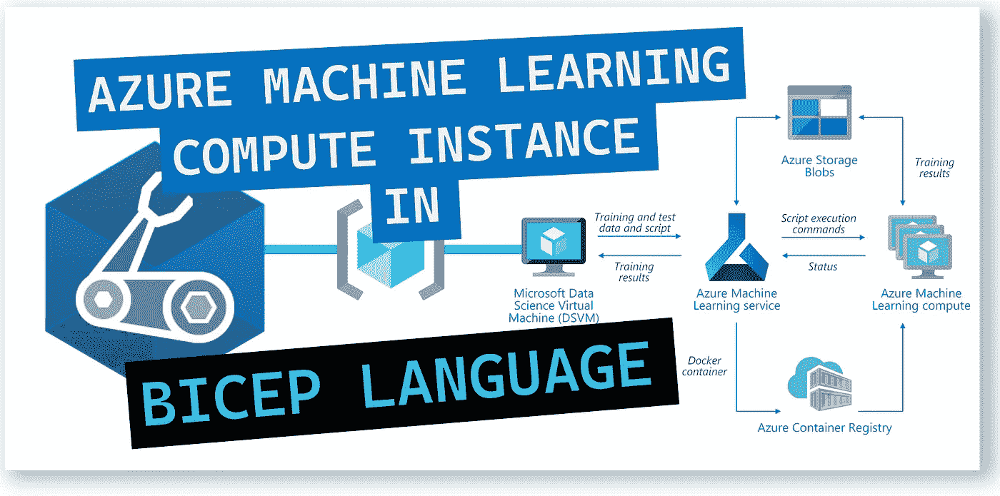
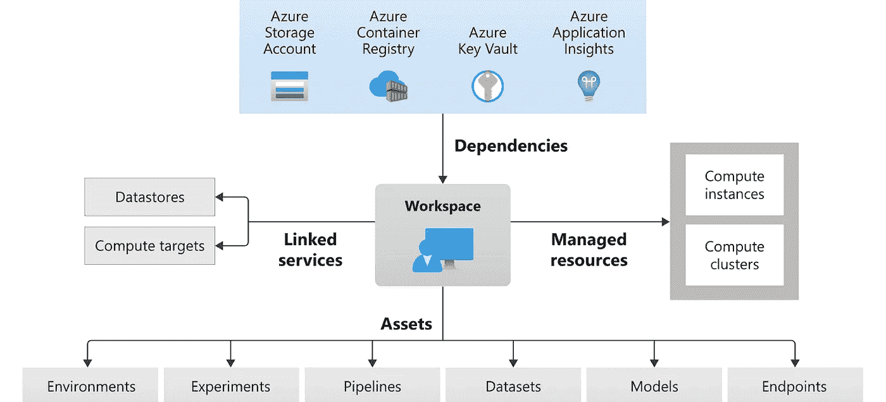
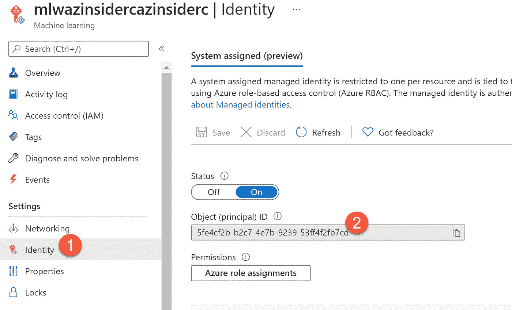
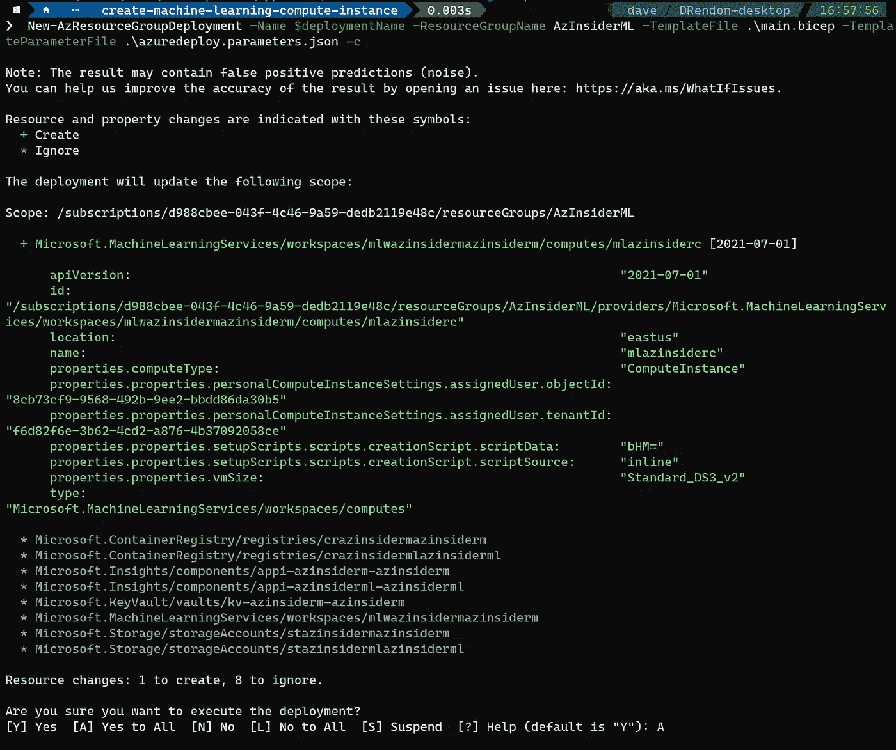
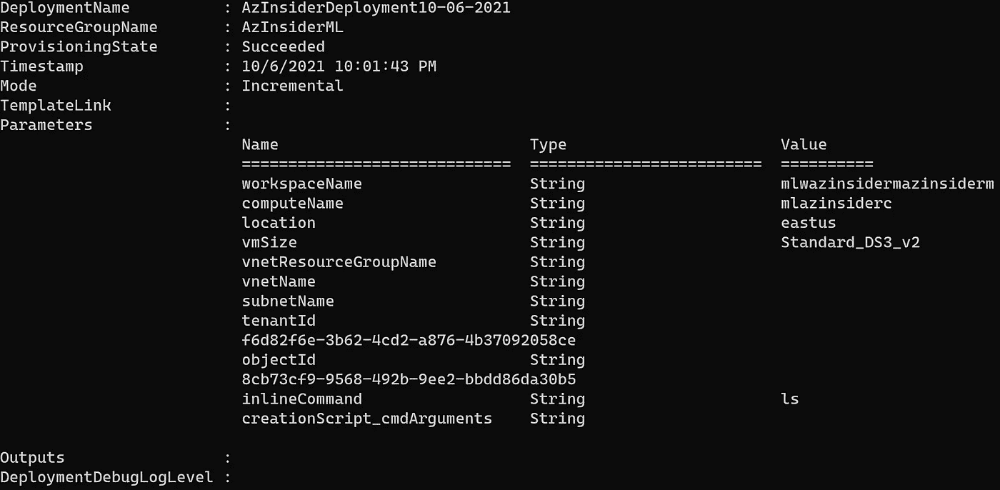
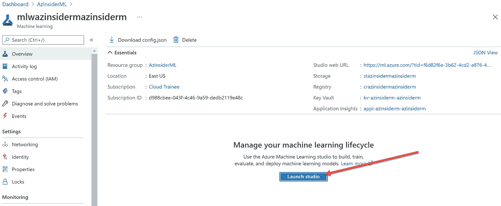
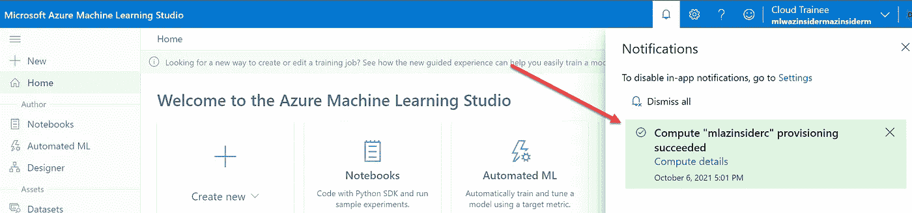

# 💪使用 Azure Bicep 创建 Azure 机器学习计算实例

> 原文：<https://medium.com/codex/create-an-azure-machine-learning-compute-instance-using-azure-bicep-491783578656?source=collection_archive---------3----------------------->

了解如何使用 Bicep 模板利用基础设施即代码来创建 Azure 机器学习服务计算实例。



使用 Azure Bicep 创建 Azure 机器学习计算实例

**Azure Machine Learning** 是一款用于加速和管理机器学习项目生命周期的云服务。

在之前的[文章](https://blog.azinsider.net/using-bicep-to-create-workspace-resources-and-get-started-with-azure-machine-learning-bcc57fd4fd09)中，我们回顾了如何开始使用 Azure 机器学习服务和架构。我们还提供了一个创建工作空间的二头肌模板。在开始使用 Azure Machine Learning 之前，需要这个工作区。

下图显示了 Azure 机器学习的高级架构以及工作区中包含的组件:



Azure 机器学习

一旦在 Azure 订阅中部署了工作空间，就可以开始开发自己的 Azure 机器学习服务，第一步是根据模型的需要添加计算实例和计算集群。

# Azure 机器学习计算实例。

将计算实例视为一个托管云工作站，供您使用机器学习模型。这是一个托管虚拟机，将包括一些预构建功能，以便您可以专注于您的机器学习开发环境。

一个计算实例将集成在工作区和 Azure Machine Learning Studio 之上。您可以使用集成的笔记本和工具(如 Jupyter、JupyterLab、Visual Studio Code 和 RStudio)来构建和部署模型。

## 创建计算实例

可以使用 Azure Machine Learning Studio 中的工作区按需创建计算实例。您可以使用 Azure 门户、ARM 模板、使用 Azure 机器学习 SDF、使用 AML 的 CLI 扩展和使用 Bicep 来创建计算实例。

现在让我们看看如何使用 Azure Bicep 创建 Azure 机器学习计算实例。

# 使用 Azure Bicep 创建 Azure 机器学习计算实例

## 1.先决条件

有两个先决条件:

*   创建资源组。
*   在创建、计算实例之前，请确保您有一个工作空间。你可以参考这篇[文章](https://blog.azinsider.net/using-bicep-to-create-workspace-resources-and-get-started-with-azure-machine-learning-bcc57fd4fd09)使用 Bicep 创建一个工作空间。

一旦你有了 Azure 机器学习工作空间，获取以下信息:

*   工作区名称:计算实例将部署到的 Azure 机器学习工作区的名称
*   对象 id:计算实例分配到的用户的 Azure AD 对象 ID。你可以从你部署的 Azure 机器学习工作区获得这些信息。然后转到 identity 选项并获取对象 ID，如下所示:



Azure 机器学习-对象 ID

## 2.部署 Bicep 文件以创建 Azure 机器学习计算实例

代码显示了创建 Azure 机器学习计算实例的 Bifep 文件的定义:

```
[@description](http://twitter.com/description)('Specifies the name of the Azure Machine Learning workspace to which compute instance will be deployed')
param workspaceName string[@description](http://twitter.com/description)('Specifies the name of the Azure Machine Learning compute instance to be deployed')
param computeName string[@description](http://twitter.com/description)('Location of the Azure Machine Learning workspace.')
param location string = resourceGroup().location[@description](http://twitter.com/description)('The VM size for compute instance')
param vmSize string = 'Standard_DS3_v2'[@description](http://twitter.com/description)('Name of the resource group which holds the VNET to which you want to inject your compute instance in.')
param vnetResourceGroupName string = ''[@description](http://twitter.com/description)('Name of the vnet which you want to inject your compute instance in.')
param vnetName string = ''[@description](http://twitter.com/description)('Name of the subnet inside the VNET which you want to inject your compute instance in.')
param subnetName string = ''[@description](http://twitter.com/description)('AAD tenant id of the user to which compute instance is assigned to')
param tenantId string = subscription().tenantId[@description](http://twitter.com/description)('AAD object id of the user to which compute instance is assigned to')
param objectId string[@description](http://twitter.com/description)('inline command')
param inlineCommand string = 'ls'[@description](http://twitter.com/description)('Specifies the cmd arguments of the creation script in the storage volume of the Compute Instance.')
param creationScript_cmdArguments string = ''var subnet = {
  id: resourceId(vnetResourceGroupName, 'Microsoft.Network/virtualNetworks/subnets', vnetName, subnetName)
}resource workspaceName_computeName 'Microsoft.MachineLearningServices/workspaces/computes@2021-07-01' = {
  name: '${workspaceName}/${computeName}'
  location: location
  properties: {
    computeType: 'ComputeInstance'
    properties: {
      vmSize: vmSize
      subnet: (((!empty(vnetResourceGroupName)) && (!empty(vnetName)) && (!empty(subnetName))) ? subnet : json('null'))
      personalComputeInstanceSettings: {
        assignedUser: {
          objectId: objectId
          tenantId: tenantId
        }
      }
      setupScripts: {
        scripts: {
          creationScript: {
            scriptSource: 'inline'
            scriptData: base64(inlineCommand)
            scriptArguments: creationScript_cmdArguments
          }
        }
      }

    }
  }
}
```

现在我们将定义参数文件。

## 3.参数文件。

下面的代码显示了我们将在部署时传递的三个参数的定义:

```
{
    "$schema": "[https://schema.management.azure.com/schemas/2019-04-01/deploymentParameters.json#](https://schema.management.azure.com/schemas/2019-04-01/deploymentParameters.json#)",
    "contentVersion": "1.0.0.0",
    "parameters": {
        "workspaceName": {
            "value": "YOUR-WORKSPACE-NAME"
        },
        "computeName": {
            "value": "YOUR-COMPUTE-NAME"
        },
        "objectId": {
            "value": "YOUR-WORKSPACE-OBJECT-ID"
        }
    }
}
```

现在我们有了两个文件，创建 Azure 机器学习计算实例的 Bicep 文件和参数文件，我们将使用下面的命令执行部署:

```
$date = Get-Date -Format "MM-dd-yyyy"
$deploymentName = "AzInsiderDeployment"+"$date"New-AzResourceGroupDeployment -Name $deploymentName -ResourceGroupName AzInsiderML -TemplateFile .\main.bicep -TemplateParameterFile .\azuredeploy.parameters.json -c
```

注意:我们在末尾添加了标志-c，以便预览部署，如下所示:



Azure 机器学习计算实例— Bicep 部署预览

验证完成后，让我们执行部署。下图显示了此部署的输出。



Azure 机器学习计算实例部署输出。

要验证部署，您可以转到 Azure 门户，然后选择您的工作区并选择 Launch Studio 选项，如下所示:



Azure 机器学习工作区

您将被重定向到 Microsoft Azure Machine Learning Studio 门户，您将会看到一个通知，告知您已经提供了一个新的计算资源，如下所示:



微软 Azure 机器学习工作室门户

这些计算资源可以在虚拟网络中安全地运行作业，而无需打开 SSH 端口。

您可以将计算实例重新用作开发工作站或培训的计算目标。可以利用多个计算实例并将它们附加到您的工作区。

# 下一步。

我向您推荐以下资源:

[](https://docs.microsoft.com/en-us/azure/machine-learning/how-to-access-terminal?WT.mc_id=AZ-MVP-5000671) [## 如何访问工作区中的计算实例终端——Azure Machine Learning

### 访问工作区中计算实例的终端，以使用 Git 和版本文件中的文件。这些文件是…

docs.microsoft.com](https://docs.microsoft.com/en-us/azure/machine-learning/how-to-access-terminal?WT.mc_id=AZ-MVP-5000671) [](https://docs.microsoft.com/en-us/azure/machine-learning/how-to-deploy-model-designer?WT.mc_id=AZ-MVP-5000671) [## 使用 studio 部署在 designer - Azure 机器学习中训练的模型

### 在本文中，您将了解如何在 Azure Machine Learning studio 中将设计器模型部署为实时端点…

docs.microsoft.com](https://docs.microsoft.com/en-us/azure/machine-learning/how-to-deploy-model-designer?WT.mc_id=AZ-MVP-5000671) 

[*在此加入****azin sider****邮箱列表。*](http://eepurl.com/gKmLdf)

*-戴夫·r·*