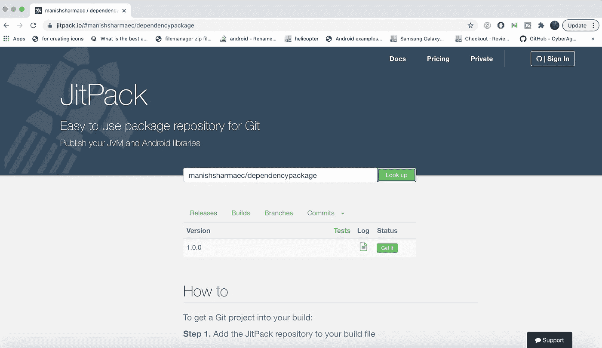
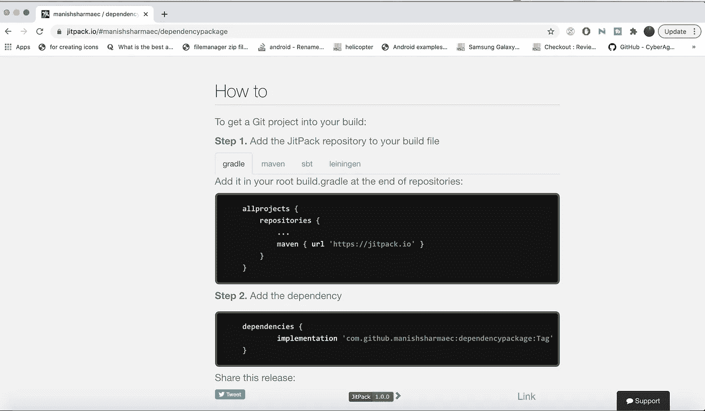

# 为你的库创建 android 依赖包

> 原文：<https://medium.com/codex/create-android-dependency-package-for-your-library-d6bf92fc220f?source=collection_archive---------10----------------------->

有一次我接到一个任务，要把我们的 android 库项目转换成一个包，当我试图完成这个任务时，我遇到了这么多困难。为什么它成为我的痛苦，因为当我在谷歌或 Stackoverflow 上搜索我的问题时，没有人提供符合标准的答案，或者我可能没有从他们的答案或可用的文档中正确理解它。所以我决定提供所有可能的信息来为 gradle 创建一个依赖包，以及我所面临的问题和解决方案。

**让我们开始**

创建依赖包实际上是一个几步的过程。

**第一步。创建一个库项目**

要创建一个库项目，你需要在应用程序的 gradle 文件顶部添加 apply **插件**:**' com . Android . library '**。an 和 a 库的 gradle 文件的基本区别在于，在 android 应用程序中，gradle 的第一行将分别应用**插件**:**' com . Android . application '**，而在库中，则分别应用**插件**:**' com . Android . library '**。

**第二步。创建包含 Github PAT 和用户名的 github.properties 文件:**

这也是一个简单的步骤，只需在你的项目根目录下创建一个 github.properties，即你的库项目/github.properties

在这个文件中，只需保存您的 Github 用户名和 PAT(个人访问令牌),这是 Github 包注册(GPR)所必需的。也要确保你把它分两行粘贴，如下所述。

```
gpr.usr=manishsharmaec
gpr.key=9d90e3d5a34b566a7b2b77603XXXXXXXXXX
```

> 我犯了一个大错，把它们粘贴在一行中，得到了授权错误 401，但没有地方提到它应该在两行中提到。

**点击右上角的个人资料图标> >设置> >转到开发者设置>个人访问令牌>生成新令牌**

**步骤三。创建一个 publish.gradle:**

这个 gradle 文件告诉你的库源代码创建一个包，通过 Github 验证它并生成相关细节的构建文件，这些文件最终将被集成这个库的应用程序使用。比如包名和版本，要包含和排除什么样的库。

**出版**

```
apply **plugin**: **'maven-publish'

def** githubProperties = **new** Properties()
githubProperties.load(**new** FileInputStream(rootProject.file(**"github.properties"**))) **def** getArtificatId = { ->
    **return "somename"** }

**def** getGroupId = { ->
    **return "com.mylib"** }

**def** getVersionName = { ->
    **return "1.0.0"** }

task sourceJar(**type**: Jar) {
    from android.sourceSets.main.java.srcDirs
    classifier **"sources"** }

afterEvaluate {
    publishing {
        repositories {
            maven {
                name = **"GithubPackages"** */** Configure path of your package repository on Github
                 ** Replace GITHUB_USERID with your/organisation Github userID
                 ** and REPOSITORY with the repository name on GitHub
                 */* url = uri(**"https://maven.pkg.github.com/manishsharmaec/dependencypackage"**)
                credentials {
                    */** Create github.properties in root project folder file with
                     ** gpr.usr=GITHUB_USER_ID & gpr.key=PERSONAL_ACCESS_TOKEN
                     ** Set env variable GPR_USER & GPR_API_KEY if not adding a properties file**/* username = githubProperties[**'gpr.usr'**] ?: System.*getenv*(**"GPR_USER"**)
                    password = githubProperties[**'gpr.key'**] ?: System.*getenv*(**"GPR_API_KEY"**)
                }
            }

            maven {
                name = **'CustomMavenRepo'** url = **"file://**${buildDir}**/repo"** }
        }
        publications {
            release(MavenPublication) {
*//                from components.release* groupId getGroupId()
                artifactId getArtificatId()
                version getVersionName()
                artifact(**"**$buildDir**/outputs/aar/**${getArtificatId()}**-release.aar"**)
                artifact(sourceJar)

                pom.withXml {
                    **def** dependenciesNode = asNode().appendNode(**'dependencies'**)

                    *//Iterate over the compile dependencies (we don't want the test ones), adding a <dependency> node for each* configurations.**api**.allDependencies.each {
                        **def** dependencyNode =
                                dependenciesNode.appendNode(**'dependency'**)
                                dependencyNode.appendNode(**'groupId'**, it.group)
                                dependencyNode.appendNode(**'artifactId'**, it.name)
                                dependencyNode.appendNode(**'version'**, it.version)
                    }
                }
            }

        }

    }
}
```

一旦创建了 publish.gradle，就在应用程序的 build.gradle 文件中调用它，方法是添加一行 apply**from**:file(**' publish . gradle '**)under apply**plugin**:**' com . Android . library '**，如下所述:

```
apply **plugin**: **'com.android.library'** apply **from**: file(**'publish.gradle'**)
```

**步骤四。。/gralew clean build publish 发布一个包**

您几乎可以在 github 上创建一个与您的 gihub 资源库相链接的包了。你所要做的就是使用。/gradlew 命令的顺序与下面提到的顺序相同:

**。/gradlew clean**

成功清除命令后，请等待操作完成

**。/gradlew build**

这将构建您的项目，并将在 app/build 文件夹中生成库可执行文件。它还会在 app/build/ path 中生成/repo 文件夹。这个 repo 文件夹包含使用 pom.xml 文件或可执行文件等包所需的所有必要文件。罐子还是。aar 文件。

现在，生成包的最后一步是

**。/gradlew publish**

## 发布命令后，你将能够在 github 上成功地生成一个包，但是你不能在任何 android 项目中使用它，因为 JVM 或 Android 项目无法读取它。为了让 JVM 和 Android 项目可读，我们需要把它上传到 jitpack、packr、nexus、central repository 等地方。我们将使用 jitpack.io，因为它快速且易于使用。

**第五步。为您的分支创建一个发布并上传到** [**jitpack.io**](https://jitpack.io/)

通过给这个释放赋予一个标记名来释放您的分支。我已经给了这个项目的标签 1.0.0。当你发布了一个在 github 上生成包的分支后，只需提供 githubusername/reponame 并点击 lookup。它将获取所有的版本，并运行任务来创建可执行文件，如。aar 或. jar。



第六步。怎么用？

你的包可以在任何 android 项目中使用，你只需要在目标应用程序中做两个改变(应用程序将消耗你的库，请参考附上的截图。



**Hurray** ，你刚刚发布了一个 android libray，可以通过调用实现**' com . github . username:reponame:tagname '**在 app gradle 文件中添加依赖项来导入

**源代码可在** [Github](https://github.com/manishsharmaec/LibraryKiddo) 上获得