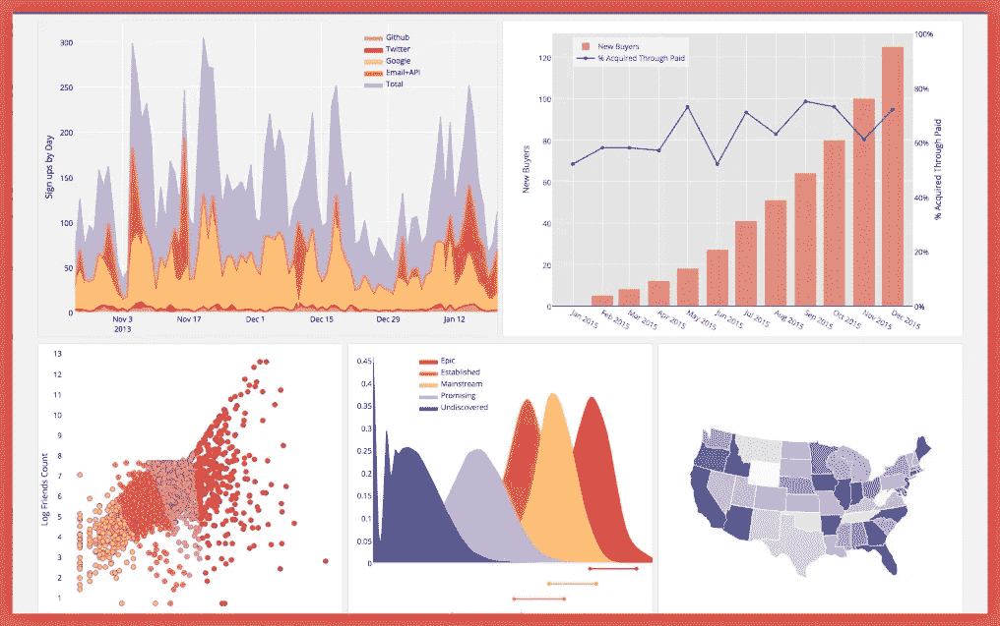

# 使用这些强大的 Python Matplotlib 函数创建各种漂亮的数据可视化

> 原文：<https://medium.com/codex/create-any-kind-of-beautiful-data-visualizations-with-these-powerful-python-matplotlib-functions-537ad359e9a3?source=collection_archive---------1----------------------->

## 学习生成任何类型的数据可视化所需的最重要的 matplotlib 函数。

Matplotlib 是一个很棒的用于数据可视化的 Python 包。Matplotlib 可以用来制作几乎任何…