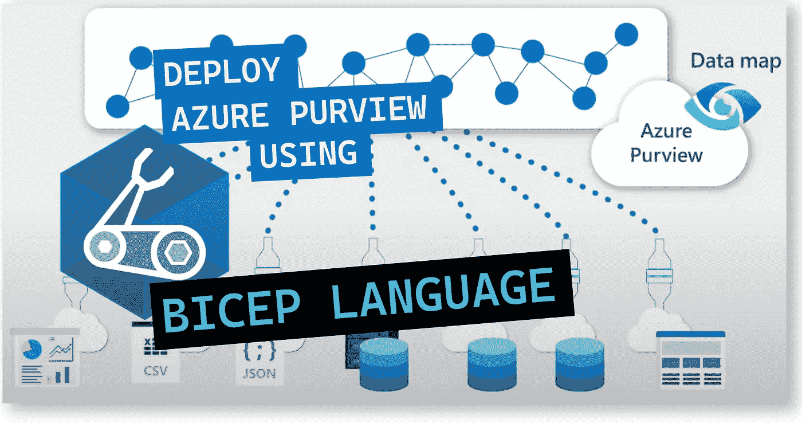
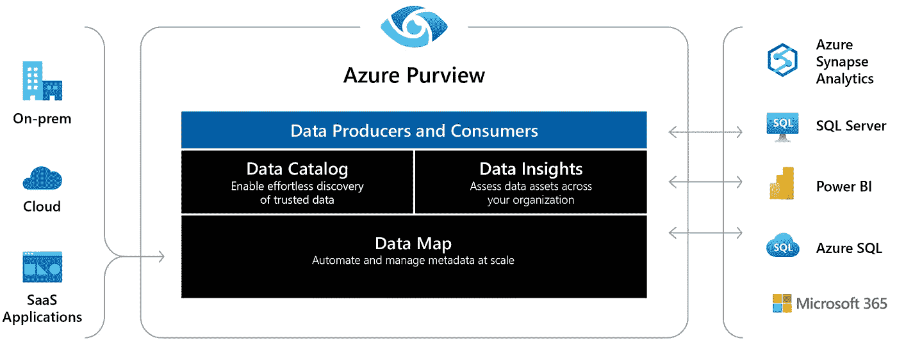
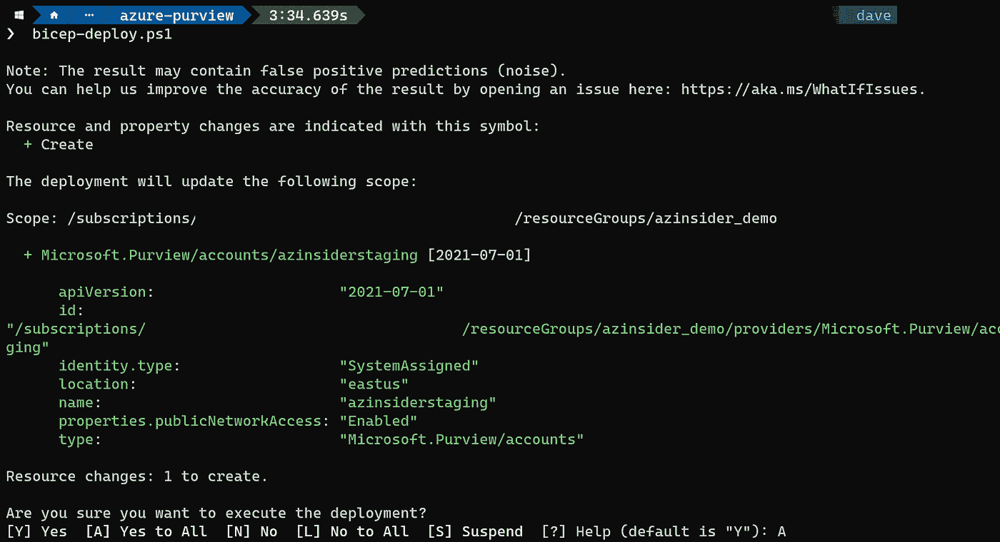
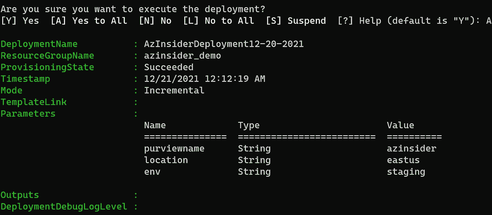
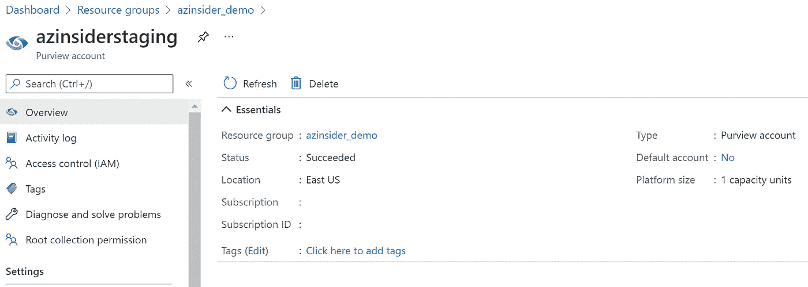
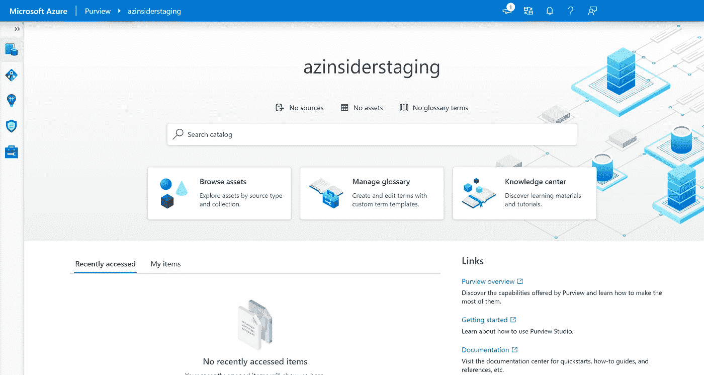

# 使用 Bicep 创建 Azure 权限

> 原文：<https://medium.com/codex/create-azure-purview-using-bicep-47cdf2192c20?source=collection_archive---------5----------------------->

了解如何通过 Bicep 将基础设施作为代码来部署 Azure without。



使用 Bicep 语言创建 Azure 权限

A**zure view**是一个统一的数据治理解决方案，可帮助您管理和治理您的内部、多云和软件即服务(SaaS)数据。

本文旨在向您展示如何利用 Bicep，这是一种特定于领域的语言(DSL ),它使用声明性语法来部署 Azure 权限。

# **先决条件。**

*   有效的 Azure 订阅
*   在订阅中创建资源的权限
*   Azure Biccep 已安装—[bit.ly/bicep-install](https://bit.ly/bicep-install)
*   Azure PowerShell

# 解决方案概述

我们将创作一个 Bicep 模板，该模板创建了一个 Azure without 的实例，通过提供数据扫描和分类作为跨数据资产的服务来自动化数据发现。

> 通过连接到您的内部、云计算和软件即服务(SaaS)来源的数据，view 创建了一个最新的信息地图。它对敏感数据进行识别和分类，并提供端到端的连接。数据消费者能够发现整个组织中的数据，数据管理员能够审核、保护和确保正确使用您的数据。



蔚蓝视界

该解决方案将包括以下文件:

*   **📄 *main.bicep*** :这是二头肌模板
*   **📄*azure deploy . parameters . JSON***:该参数文件包含用于部署 Bicep 模板的值。

我们开始吧！

# 创建 Azure 权限的 Azure Bicep 文件

第一步是创建一个名为' *main.bicep* '的文件，我们将从定义 Azure 权限实例的几个参数开始。

# Azure Bicep 文件-参数

在您的工作目录中创建一个新文件，并将其命名为' *main.bicep* '。我们将定义以下参数:

```
@description('Name of the resource')
param purviewname string@description('Deployment region')
param location string@description('Deployment environment')
param env string
```

# Azure 二头肌模板—资源

我们将定义以下资源:

```
resource purviewname_env 'Microsoft.Purview/accounts@2021-07-01' = {
  name: '${purviewname}${env}'
  location: location
  identity: {
    type: 'SystemAssigned'
  }
  properties: {
    publicNetworkAccess: 'Enabled'
  }

  tags: {}
  dependsOn: []
}
```

您会注意到我们没有使用 *SKU p* 属性，在撰写本文时该属性是“只读”的，因此默认情况下 *SKU* 将是“*标准*”。

# 参数文件

创建一个名为“*azure deploy . parameters . JSON*”的新文件。下面的代码显示了参数文件的定义:

```
{
    "$schema": "[https://schema.management.azure.com/schemas/2019-04-01/deploymentParameters.json#](https://schema.management.azure.com/schemas/2019-04-01/deploymentParameters.json#)",
    "contentVersion": "1.0.0.0",
    "parameters": {
        "purviewname": {
            "value": "" 
        },
        "location": {
            "value": "" 
        },
        "env": {
            "value": "" 
        }
    }
}
```

# Azure Bicep 模板-部署

我们将使用下面的命令来部署我们的二头肌模板:

```
$date = Get-Date -Format "MM-dd-yyyy"
$deploymentName = "AzInsiderDeployment"+"$date"New-AzResourceGroupDeployment -Name $deploymentName -ResourceGroupName azinsider_demo -TemplateFile .\main.bicep -TemplateParameterFile .\azuredeploy.parameters.json -c
```

提示:您可以创建一个 script.ps1 并运行该脚本来执行这个部署。

注意:在执行实际部署操作之前，我们利用假设操作来验证我们的部署。

下图显示了部署的预览:



使用 Bicep 语言部署 Azure 权限

然后，我们将执行部署。下图显示了部署输出:



部署输出— Azure 范围

您可以在下面的 URL 中找到这个解决方案的代码，请随意投稿！

[](https://github.com/daveRendon/azinsider/tree/main/application-workloads/azure-purview) [## azin sider/应用程序-工作负载/azure-在主 daveRendon/azinsider 的权限

### 在 GitHub 上创建一个帐户，为 daveRendon/azinsider 开发做出贡献。

github.com](https://github.com/daveRendon/azinsider/tree/main/application-workloads/azure-purview) 

现在，在 Azure 门户中，您应该会看到 Azure 权限服务的实例，如下所示:



使用 Bicep 语言部署 Azure 权限

创建 Azure 权限帐户后，您可以使用权限工作室来访问和管理它。有两种方法可以打开权限工作室。

1.  在 [Azure 门户](https://portal.azure.com/)中。选择概览页面上的“打开权限工作室”板块。
2.  浏览到 https://web.purview.azure.com[的](https://web.purview.azure.com)

下图显示了权限工作室:



Azure 权限工作室

在这篇文章中，我们回顾了如何使用 Bicep 语言将基础设施作为代码来创建 Azure 权限的实例，以及如何通过权限工作室访问它。

下一步是确保您有一个用户分配的托管身份，该身份可以使用 Azure Active Directory 直接与资源进行身份验证，并使用“集合”，这是一个 Azure 权限工具，用于跨资产、源和信息管理所有权和访问控制。

[](https://www.buymeacoffee.com/drbmc)

👉 [*在此加入****azin sider****邮箱列表。*](http://eepurl.com/gKmLdf)

*-戴夫·R*