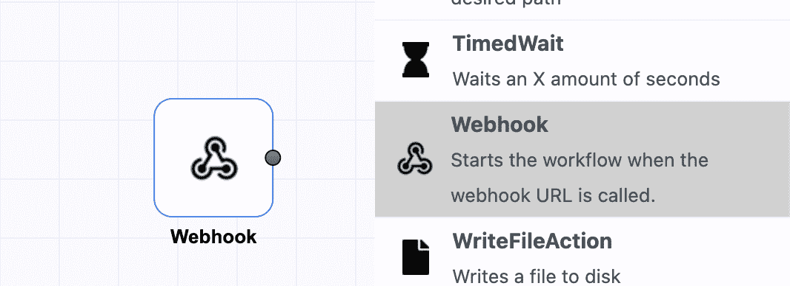
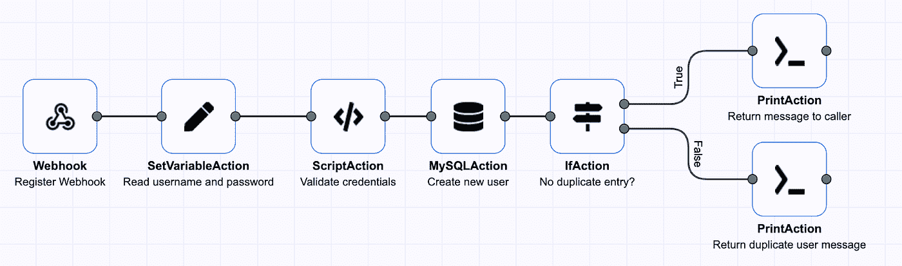
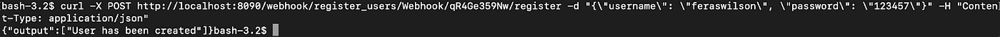
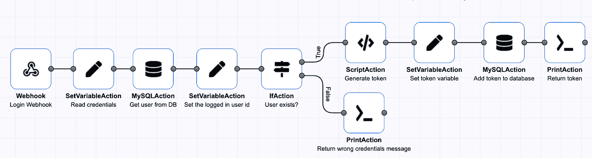
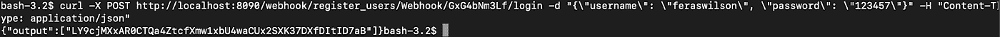

# 使用 DopplerTask 更轻松地创建后端

> 原文：<https://medium.com/codex/create-backends-easier-with-dopplertask-fec824334afa?source=collection_archive---------10----------------------->

DopplerTask 是一款全新的革命性开源自动化工具，允许您创建、运行和共享任务。它可以在任何平台上工作，因为它是用 Java 编写的，而且为了更加方便，它还有一个 Docker 映像。DopplerTask 试图解决的问题之一是后端的创建。后端很难从头开始编写，通常需要花费大量时间来设置环境、配置变量、选择框架、选择 ORM 等。DopplerTask 一劳永逸地解决了这个问题。它允许你作为一个用户拖放动作来创建你的后端，比使用传统的方法和框架要少 10 倍的时间。

让我们来看看如何使用 DopplerTask 实现这一点。假设您想要创建一个提供注册和登录 API 的后端。如果你要从头开始创造一切，这将是一项艰巨的任务，但让我们看看 DopplerTask 的下图:

我们首先创建一个 Webhook 动作，它允许在收到 HTTP 调用时触发任务。这个 HTTP 调用可以配置为 GET、POST、PUT、DELETE 或 PATCH 调用。如果您愿意，也可以在 Webhook 中配置身份验证方法。

在添加验证、数据库插入和注册成功后向用户显示的消息后，它看起来应该如下图所示:

让我们用 curl 来试试这个:

如您所见，用户已经创建。现在，让我们继续向您展示在 DopplerTask 中登录是什么样子。该登录将接受用户名和密码，检查它们是否存在于数据库中，生成令牌，并将令牌插入数据库供其他服务使用:

让我们看看当我们尝试登录时是什么样子:

如您所见，我们得到了一个令牌，以后可以用它来调用我们的其他服务。

我们对当前高级语言的理解是，考虑到我们写了多少代码，它们已经不是那么高级了。DopplerTask 正在努力解决这个问题，它提供了一个更高的后端视图，并让您更专注于如何在更短的时间内实现关键的业务需求。

GitHub 上有 DopplerTask:[https://github.com/dopplertask/dopplertask/stargazers](https://github.com/dopplertask/dopplertask/stargazers)

DopplerTask 网站:【https://www.dopplertask.com T3

让我听听你的想法！