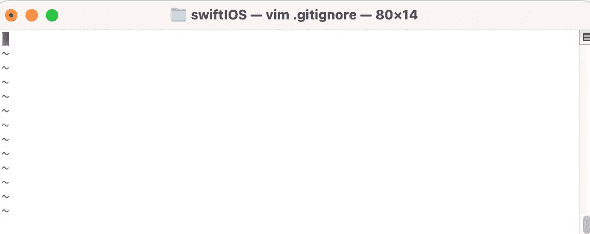

# 为 Swift 和 Xcode 开发创建 git 忽略文件

> 原文：<https://medium.com/codex/create-git-ignore-file-for-swift-and-xcode-development-d7faaf58893c?source=collection_archive---------0----------------------->

如果你对开发感兴趣，你应该使用源代码控制。源代码控制(版本控制)是跟踪和管理代码变更的实践。但是，添加不应该跟踪的文件(如个人密钥、隐藏的系统文件和个人 IDE 设置)时可能会遇到问题。

如果您正在使用 git，您可以简单地让 git 忽略文件来取消对文件的跟踪。对于一个. gitignore 文件，**你应该把它放在存储库的根文件夹中。**

如何创建 git 忽略文件？

[](https://www.toptal.com/developers/gitignore) [## gitignore.io

### 创造有用。git 从 514 操作系统、IDE 和编程语言中选择忽略项目文件…

www.toptal.com](https://www.toptal.com/developers/gitignore) 

去网站 gitignore.io，根据你的项目给出关键词。例如，我正在使用 Swift，所以我的关键字是 *Swift、CocoaPods 和 Xcode 工具。*


然后点击生产，


当你看到上面的文件，复制它，并在粘贴前做以下步骤。如果你想自定义它，然后添加或删除一些行。例如，隐藏一个*。swift* 文件，只需在里面写文件名即可。

然后打开 Terminal 或 Git Bash for Windows，转到要创建 git ignore 文件的文件目录。

1️⃣创造了一个**。git 忽略存储库的文件**。

```
touch .gitignore
```

2️⃣编辑你的。gitignore 文件

```
vim .gitignore
```

3️⃣现在你会看到像这样的终端，然后粘贴它！



4️⃣要保存并退出→ :wq

```
:wq
```

5️⃣你现在可以使用 git 忽略文件了👏🏻

💡哦，不要忘记把它推到你的 git 和 git 状态来检查文件是否被跟踪🙌🏻