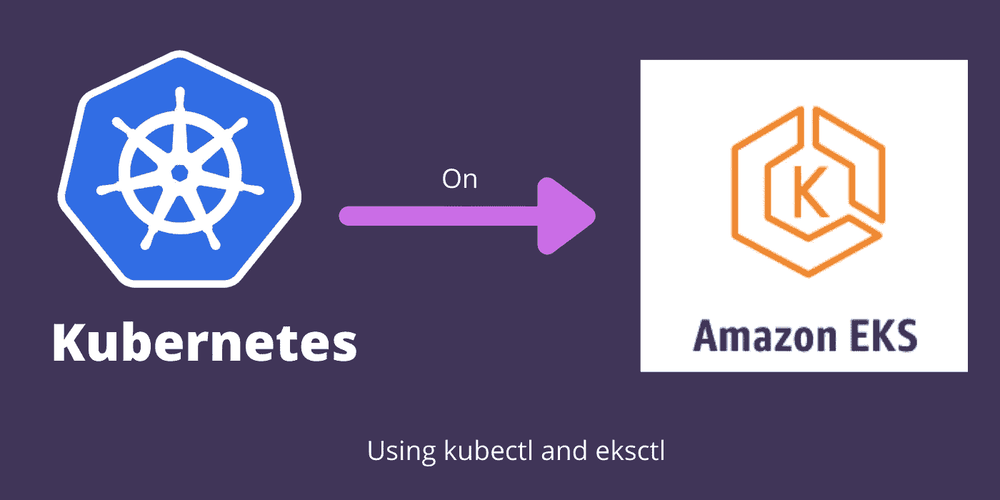

# 在 AWS EKS 上创建 Kubernetes 集群

> 原文：<https://medium.com/codex/create-kubernetes-cluster-on-aws-eks-6ced4c488e62?source=collection_archive---------0----------------------->

## 设置 AWS 凭证并在 Ubuntu 上安装 kubectl、eksctl。使用 eksctl 创建 Kubernetes 集群。

AWS EKS 安装集群

今天我很兴奋能在 Kubernetes 上开始新的系列。我计划写更多关于 Kubernetes 的东西。敬请关注更多关于 DevOps 的文章。