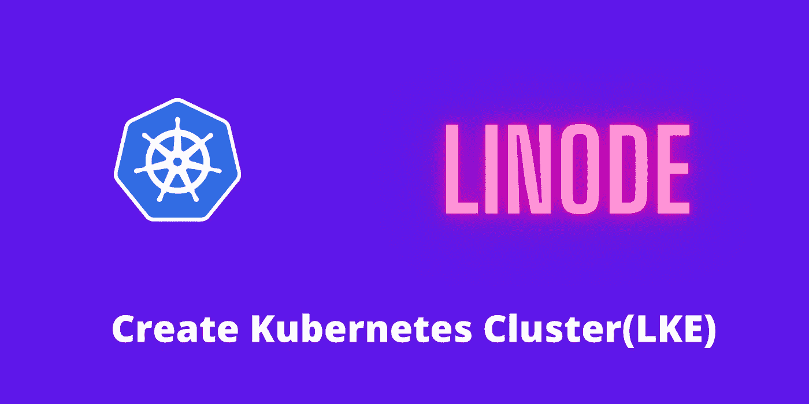

# 使用利诺德·LKE 创建 Kubernetes 集群

> 原文：<https://medium.com/codex/create-kubernetes-cluster-using-linode-lke-4f9c71d03a8d?source=collection_archive---------3----------------------->

了解如何在 Linode 上设置托管 Kubernetes 并使用 kubectl 访问集群

库伯内特星团

在本教程中，您将学习如何使用 **Linode** 云提供商建立一个 **Kubernetes** 集群。有许多云提供商为我们提供 Kubernetes 托管服务。然而，就定价而言，Linode 非常便宜。所以，如果你打算学习库伯内特，那么 LKE(利诺德库伯内特…