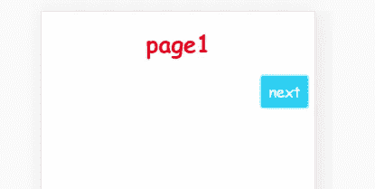

# 使用样式化组件创建 PageWrapper

> 原文：<https://medium.com/codex/create-pagewrapper-with-styled-components-a405da81a0a4?source=collection_archive---------7----------------------->

## 向组件添加逻辑以创建分页

在这个项目中，我们基于[前面的例子](/geekculture/how-to-use-styled-components-in-react-72d767a542e)创建分页包装器，其中页面内的按钮将根据页面和按钮的数量正确对齐。

例如，如果这是第一页，它只有一个按钮，这个按钮应该被推到页面的右边。

