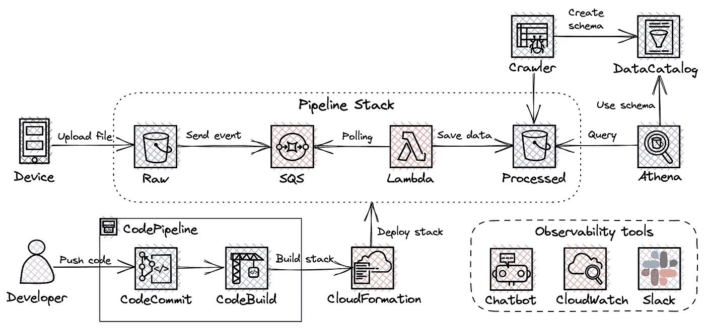
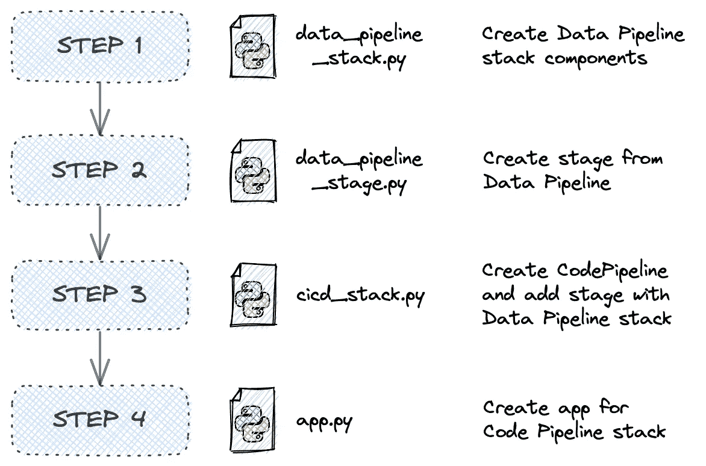
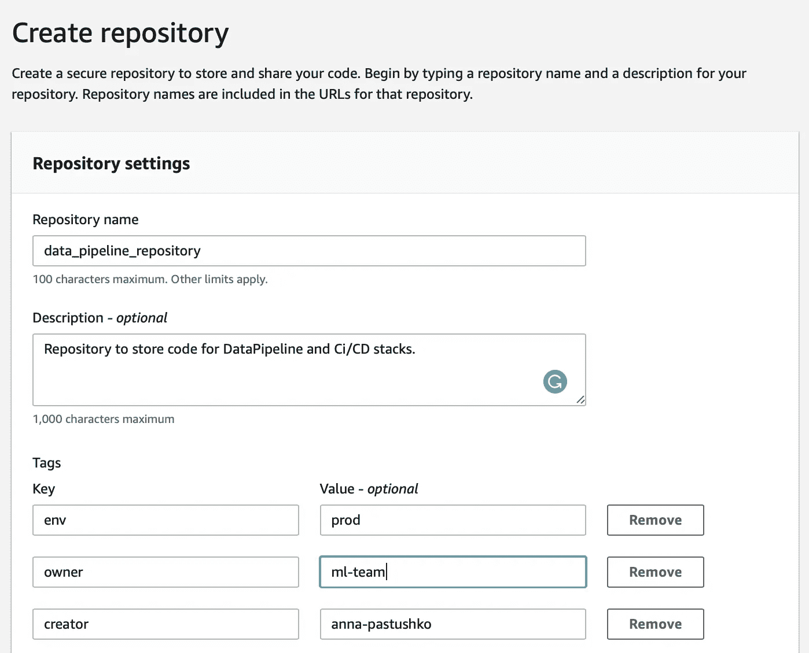
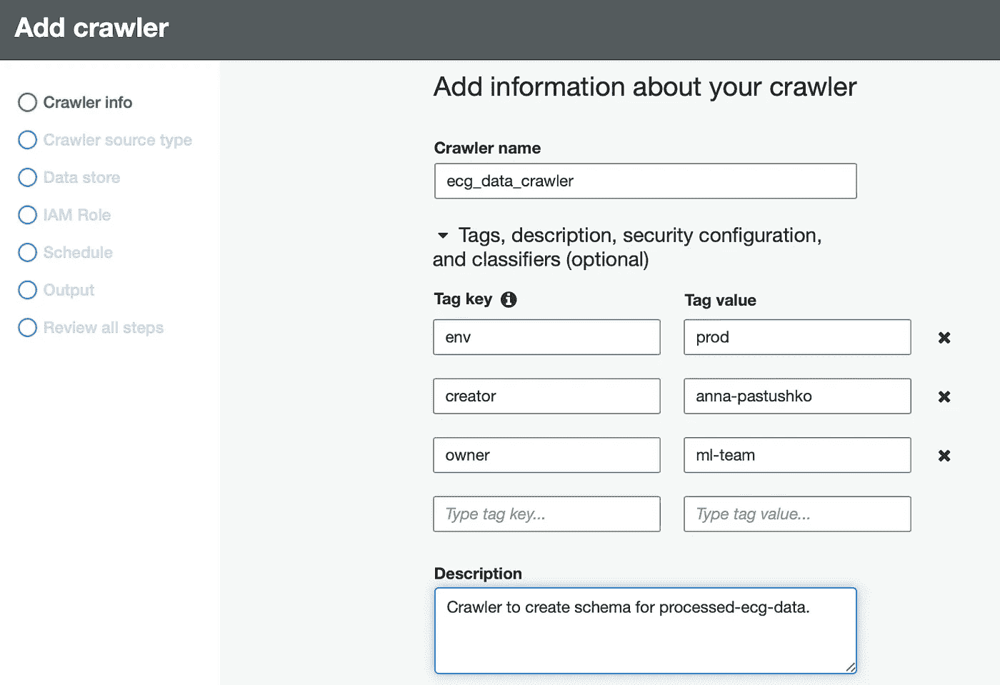
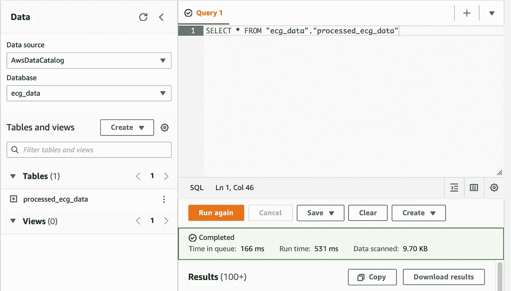

# 使用 AWS CDK (Python)创建无服务器数据管道

> 原文：<https://medium.com/codex/create-serverless-data-pipeline-using-aws-cdk-python-ab2179488efd?source=collection_archive---------2----------------------->



架构图

# 语境

数据科学团队即将开始一项研究，他们需要一个基于 AWS 云的解决方案。这是我能提供给他们的:

**主要流程(数据处理):**

*   **设备**上传*。垫*文件与心电数据到 S3 桶( **Raw** )
*   上传触发事件创建，该事件被发送到 **SQS** 队列。
*   **Lambda** 轮询 SQS 队列(事件映射调用)并开始处理事件。Lamba 的运行时是一个 Python Docker 容器，因为库的大小超过了层的大小限制 250 MB。如果过程中出现任何错误，您将在 **Slack** 中收到通知。
*   一旦完成，以拼花格式处理的数据被保存到 S3 桶中(**已处理**)。
*   为了使数据科学家能够查询数据，**胶合爬虫**作业在**数据目录**中创建一个模式。然后， **Athena** 用于查询已处理的桶。

**二次流程(CI/CD):**

当开发人员想要更改处理作业逻辑时，他应该准备好更改并提交给 **CodeCommit** 库。其他一切都是自动化的，由 CI/CD 流程处理。

CodeBuild 服务将 CDK 代码转换成 CloudFormation 模板并部署到你的账户。换句话说，它自动创建所有基础结构组件。完成后，部署的资源组(堆栈)可在 web UI 上的 **CloudFormation** 服务中获得。为了简化这两个步骤并为 CI/CD 流程提供自我更新，使用了**代码管道**抽象。您还会收到进度延迟通知。

# 准备

要为此项目准备您的本地环境，您应该遵循下面描述的步骤:

1.  [安装 AWS CLI](https://docs.aws.amazon.com/cli/latest/userguide/getting-started-install.html) 并设置凭证。
2.  [安装 NodeJS](https://nodejs.org/en/download/) 以便能够使用 CDK。
3.  使用命令`sudo npm install -g aws-cdk`安装 CDK。
4.  为您的项目创建一个新目录，并将您的当前工作目录更改为该目录。
5.  运行`cdk init --language python`启动 CDK 项目。
6.  使用 CDK 资源运行`cdk bootstrap`来引导 AWS 帐户。
7.  [安装 Docker](https://docs.docker.com/engine/install/) 在 Lambda 内部运行 Docker 容器。

# 项目结构

这是项目的最终外观。我将提供一步一步的指导，以便您最终理解其中的每个组件。

```
DataPipeline
├── assets
│   ├── lambda
│   │   ├── dockerfile
│   │   └── processing.py
├── cdk.out
│   └── ...
├── stacks
│   ├── __init__.py
│   ├── data_pipeline_stack.py
│   ├── cicd_stack.py
│   └── data_pipeline_stage.py
├── app.py 
├── cdk.json
└── requirements.txt
```

我们的起点是`stacks`目录。它包含一个强制的空文件`__init__.py`来定义一个 Python 包。其他三个文件位于此处:

*   `data_pipeline_stack.py`
*   `cicd_stack.py`
*   `data_pipeline_stage.py`

首先，我们打开`data_pipeline_stack.py`，导入进一步开发所需的所有库和构造。此外，我们需要定义一个具有父类`cdk.Stack`的类。

之后，我们使用 SQS `[Queue](https://docs.aws.amazon.com/cdk/api/v2/python/aws_cdk.aws_sqs/Queue.html)`构造来连接 S3 桶和 Lambda。参数非常简单:堆栈元素 id ( `‘raw_data_queue’`)、队列名称(`‘data_pipeline_queue’`)以及 Lambda 处理队列中的消息后该消息不可见的时间(`cdk.Duration.seconds(200)`)。请注意，可见性超时值取决于您的处理时间，如果处理需要 30 秒，最好将其设置为 60 秒。在本例中，我将它设置为 200 秒，因为处理需要大约 100 秒。

接下来，我们将使用`[Bucket](https://docs.aws.amazon.com/cdk/api/v2/python/aws_cdk.aws_s3/Bucket.html?highlight=add_event_notification#bucket)`构造为原始数据和已处理数据创建 S3 存储桶。记住，原始数据通常在上传后的头几天内被访问，我们可以添加`lifecycle_rules`在 7 天后将数据从 S3 标准传输到 S3 冰川，以降低存储成本。

此外，我们需要连接原始桶和 SQS 队列，以定义从桶中生成的事件的目的地。为此，我们使用带有两个参数的`[add_event_notification](https://docs.aws.amazon.com/cdk/api/v2/python/aws_cdk.aws_s3/Bucket.html?highlight=add_event_notification#aws_cdk.aws_s3.Bucket.add_event_notification)`方法:我们希望通知队列的事件(`_s3.EventType.OBJECT_CREATED`)和要通知的目标队列(`_s3n.SqsDestination(data_queue)`)。

> ⚠️堆栈被销毁后，桶和里面的所有数据都将被删除。可以通过删除(设置为默认值)removal_policy 和 auto_delete_objects 参数来更改此行为。

下一步是使用`[DockerImageFunction](https://docs.aws.amazon.com/cdk/api/v2/python/aws_cdk.aws_lambda/DockerImageFunction.html)`构造创建 Lambda。请参考下面的代码，看看我定义了什么参数。我认为它们是不言自明的，你已经熟悉了以前的例子，所以我相信这不会是一段艰难的时间。如有问题，请参考文档。

> ⚠️:我唯一应该强调的是 Lambda 中的参数`timeout`的值——它应该总是小于队列中的参数`visibility_timeout`(`180`对`200`)。

然后，我们附加一个策略来自动创建一个 Lambda 角色，这样它就可以使用`attach_inline_policy`方法处理来自 S3 的文件。您可以调整操作/资源参数，以授予 Lambda 对 S3 更细粒度的访问权限。

现在我们转到`assets`目录。

我们需要创建带有数据转换逻辑的`dockerfile`和`processing.py`，这非常简单。首先，我们解析来自 SQS 的事件以获得关于文件和桶的信息，然后解析*。mat* 将心电数据归档，清理后保存在*中。拼花*格式到加工桶。此外，它还包括日志记录和松弛错误消息。最后，我们应该从队列中删除消息，这样文件就不会被再次处理。

对于你的管道，你可以改变处理逻辑，用你自己的 Slack 钩子替换`_url`。

让我们快速浏览一下 Docker 文件的逻辑:首先，我们从 AWS ECR 存储库中为 Lambda 汇集特殊的映像，然后安装所有 Python 库，将我们的`processing.py`脚本复制到容器中，并运行命令从脚本中启动处理程序函数。

> ⚠️:不要忘记将你在`processing.py`中使用的库添加到`dockerfile`中。

在此阶段，我们完成了数据管道堆栈的创建，可以进一步开始开发 CI/CD 堆栈。

# CI/CD 堆栈

对于 CI/CD 流程，我们将使用 CodePipeline 服务，这有助于我们简化部署流程。每次我们通过 CodeCommit push 更改数据管道或 CI/CD 堆栈时，CodePipeline 都会自动重新部署这两个堆栈。简而言之，应用程序堆栈应添加到代码管道阶段，在该阶段添加到代码管道之后。之后，应用程序被合成为 CI/CD 堆栈，而不是应用程序堆栈。您可以在下面的代码管道结构后面找到文件和逻辑之间的连接的更详细的描述。



创建代码管道堆栈的步骤

首先，我们需要打开`cicd_stack.py`，开始导入我们将使用的所有库和构造。稍后，我们将手动创建 CodeCommit 存储库，但是现在我们只需要引用它，所以我们可以将它作为源代码添加到 CodePipeline 中。

我们使用`[CodePipeline](https://docs.aws.amazon.com/cdk/api/v2/python/aws_cdk.pipelines/CodePipeline.html)`构造来创建 CI/CD 流程。我们使用参数`self_mutation`设置为`True`来允许管道自我更新，默认情况下它有`True`值。如果我们在应用程序堆栈中使用 Docker，参数`docker_enables_for_synth`应该设置为`True`。之后，我们添加应用程序部署阶段，并启动管道构建来构建我们的管道。后者是将来设置时差通知的必要步骤。

下一步是为 CodePipeline 配置 Slack 通知，以便开发人员可以监控部署。为此，我们使用`[SlackChannelConfiguration](https://docs.aws.amazon.com/cdk/api/v1/python/aws_cdk.aws_chatbot/SlackChannelConfiguration.html)`构造。我们可以通过右键单击频道名称并复制 URL 的最后 9 个字符来获取`slack_channel_id`的值。要获得`slack_workspace_id`参数值，请使用 [AWS 聊天机器人指南](https://docs.aws.amazon.com/chatbot/latest/adminguide/getting-started.html)。为了定义我们想要得到的通知类型，我们使用`[NotificationRule](https://docs.aws.amazon.com/cdk/api/v1/python/aws_cdk.aws_codestarnotifications/NotificationRule.html)`construct。如果您想更精确地定义通知事件，请使用通知规则的[事件。](https://docs.aws.amazon.com/dtconsole/latest/userguide/concepts.html#events-ref-pipeline)

> 具有`[.pipeline](https://docs.aws.amazon.com/cdk/api/v1/python/aws_cdk.pipelines/CodePipeline.html#aws_cdk.pipelines.CodePipeline.pipeline)`属性的ℹ️我们指的是部署 CDK 应用的代码管道。只有在管道已经用`[build_pipeline()](https://docs.aws.amazon.com/cdk/api/v1/python/aws_cdk.pipelines/CodePipeline.html#aws_cdk.pipelines.CodePipeline.build_pipeline)`方法建造后才可用。对于`source`的论点，我们应该传递的不是构造，而是管道对象。

定义管道后，我们添加数据管道部署阶段。为了使我们项目更加清晰，我们在单独的文件中定义了数据管道部署的阶段。为此，我们使用`[cdk.Stage](https://docs.aws.amazon.com/cdk/api/v1/python/aws_cdk.core/Stage.html)`父类。

对于那些使用 **CDKv1** 的人来说，额外的步骤是修改`cdk.json`配置文件，你应该将下面的表达式添加到上下文中。

```
"context": {"@aws-cdk/core:newStyleStackSynthesis": true}
```

至此，我们已经为数据管道堆栈创建了所有的构造和文件。剩下的唯一事情就是创建`app.py`和所有的最终步骤。我们导入从`cicd_stack.py`创建的所有构造，并为所有堆栈资源创建标签。

恭喜，我们已经完成了堆栈的创建。现在，我们终于可以创建名为`data_pipeline_repository`的 CodeCommit 存储库并向其中推送文件了。



代码提交存储库创建

我们可以手动添加与在堆栈中创建的标签相同的标签，这样我们就可以在成本报告中看到为此任务创建的所有资源绑定在一起。

> ⚠️在部署之前检查服务配额中的代码构建限制。

恭喜，现在我们终于可以使用命令`cdk deploy`将堆栈部署到 AWS，并享受所有资源是如何自动设置的。

# 雅典娜查询

让我们从创建 Glue Crawler 开始，因为你需要在 Glue 控制台的数据目录部分点击 Crawler。然后，您应该点击添加爬虫按钮，并检查所有步骤。我添加了与其他数据管道资源相同的标记，因此我可以一起跟踪它们。



胶水爬虫创建

不要更改 crawler 源类型，添加 S3 数据存储并在包含路径中指定存储桶的路径。之后，创建新的或添加现有的角色，并指定运行它的频率。然后你应该创建数据库，在我的例子中我创建了`ecg_data`数据库。完成所有步骤并创建 crawler 后，运行它。

这就是我们用 Athena 查询`processed_ecg_data`表所需的全部内容。简单查询示例如下。



雅典娜查询

# 帐户清理

如果您想删除开发过程中在您的帐户中创建的所有资源，您应该执行以下步骤:

1.  运行以下命令删除所有栈资源:
    `cdk destroy CodePipelineStack/DataPipelineDeploy/DataPipelineStack CodePipelineStack`
2.  删除代码提交存储库
3.  为雅典和 CDK 创建的 Clean ECR 存储库和 S3 存储桶，因为它会产生成本。
4.  删除带表的粘合爬虫和数据库。

> ℹ️命令`cdk destroy`只会破坏代码管道(CI/CD)栈和依赖它的栈。因为应用程序堆栈不依赖于代码管道堆栈，所以它们不会被销毁。我们需要分别销毁数据管道堆栈，有一个[讨论如何删除它们两个](https://github.com/aws/aws-cdk/issues/10190)。

手动删除一些资源不太方便，需要与 AWS 开发人员进行几次讨论来解决这个问题。

# 结论

CDK 为您提供基于 AWS 服务的应用开发工具包。一开始可能会很有挑战性，但你的努力最终会有回报的。您将能够通过一个命令来管理和传输您的应用程序。

CDK 资源和完整代码可以在 [GitHub 资源库](https://github.com/ChildishGirl/serverless-data-pipeline)中找到。

谢谢你一直读到最后。我真的希望它是有帮助的，如果你在评论中发现任何错误，请让我知道。