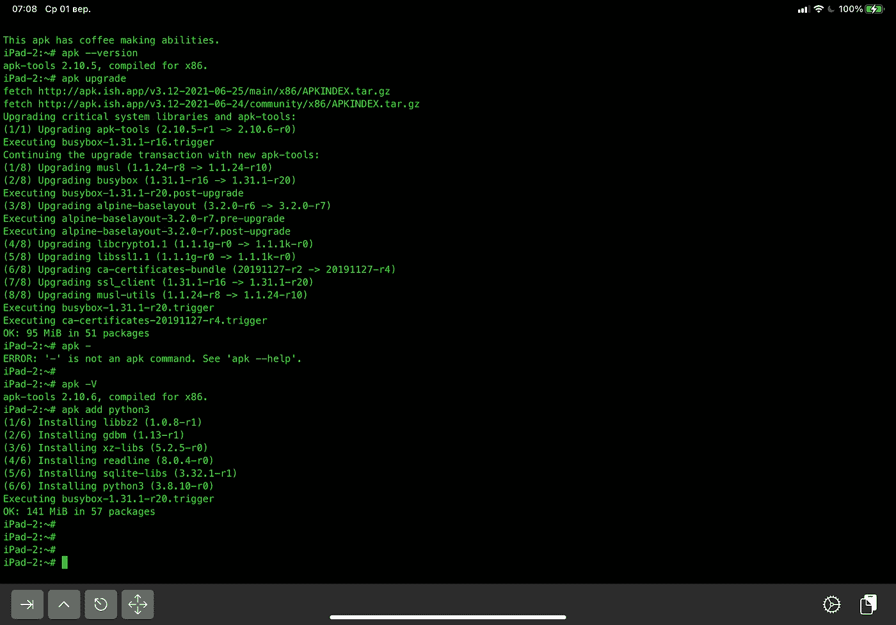
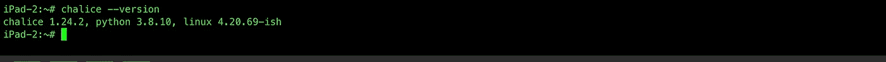
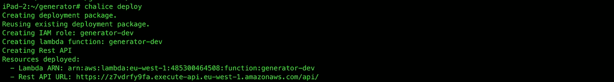
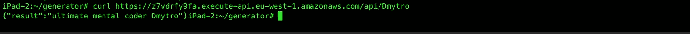

# 像疯子一样在 iPad 上创建无服务器 REST API

> 原文：<https://medium.com/codex/create-serverless-rest-api-on-ipad-like-a-madman-58c0ed369d62?source=collection_archive---------11----------------------->

今天我想展示如何用 a̶l̶m̶o̶s̶t̶毫不费力地创建无服务器 REST API。为了证明我完全疯了——我要在 iPad 上这么做。接下来的动作可以在任何电脑上执行，只是不用 iSh 和 Alpine，你可以使用你的本地操作系统、终端和软件包管理器(或者如果你在 Windows 上，可以使用巫毒魔法，但是说真的 [Chocolatey](https://chocolatey.org) )。以下所有命令都是在 iPad 上的 iSh 应用程序中测试的，这是 Alpine Linux emulator for iOS。


由[马库斯·斯皮斯克](https://unsplash.com/@markusspiske?utm_source=medium&utm_medium=referral)在 [Unsplash](https://unsplash.com?utm_source=medium&utm_medium=referral) 上拍摄的照片

我[描述了](/codex/how-to-get-a-free-cloudy-linux-server-7f528c09595f)如何获得一个免费的 Oracle 服务器，以及如何在 iOS 上 ssh 到它。但是现在我要用 iSh 直接从 iPad 设备部署一个 API，中间没有 Linux 服务器。

剧透在前，我准备用 [AWS Lambda](https://aws.amazon.com/lambda/?nc1=h_ls) ，Python3 和 Chalice 框架。当地一家很棒的咖啡馆提供的 WIFI 上网服务。

AWS Lambda 是一个无服务器的函数执行服务，这意味着我可以将任何代码块部署为一个函数，而不需要关心基础设施、服务器及其支持和维护。AWS 每月提供 100 万个免费请求和 40 万千兆秒的计算时间。它非常适合测试第一个基于 MVP 或 POC API 的产品。无服务器架构的优点和简单之处在于您只关心代码，而不关心其他。AWS 负责使其公开和可伸缩。有多种框架可以简化 AWS Lambda 函数的开发，Chalice 就是其中之一。让我展示一下它是如何工作的。但是首先你需要一个 AWS 账户[如果你没有的话。](https://aws.amazon.com/premiumsupport/knowledge-center/create-and-activate-aws-account/)

我建议对信用卡使用与获取 Oracle 服务器文章中相同的策略:小额信用卡或私人预付卡。AWS 以隐性成本闻名。您可以使用我们的示例 API，但是如果您决定测试免费层没有覆盖的其他服务——预计会有意想不到的费用。

一旦您有了 AWS 帐户，[创建访问密钥](https://aws.amazon.com/premiumsupport/knowledge-center/create-access-key/),以便对您的帐户进行编程访问。为了做一些事情，你还需要正确的用户策略。对于测试，我推荐 PowerUserAccess，我假设您在某个时候有过 AWS 的经验，但也许我会在将来为 AWS IAM 和安全性准备一篇文章。

一旦您有了访问密钥，请按如下方式设置它们:

```
$ mkdir ~/.aws
$ cat >> ~/.aws/config
[default]
aws_access_key_id=YOUR_ACCESS_KEY_HERE
aws_secret_access_key=YOUR_SECRET_ACCESS_KEY
region=YOUR_REGION (such as us-west-2, us-west-1, etc)
```

它将在*中创建文件*配置*。aws* 文件夹与您的凭证。

我接下来要做的是在 iPad 上安装 Python3。是的，你没看错。实际上也没那么难。我打开 iSh，输入`apk add --no-cache --update python3 py3-pip`。



下一部分更具挑战性——我将安装圣杯。执行`pip3 install chalice`。现在，如果你用的是 iPad，你会想要喝一两杯咖啡，吃点零食，或者拜访一个你有一段时间没见的亲戚，因为这需要一段时间。一段时间，像大时代。你知道，Alpine Linux 在 iPad 上的模拟不会出现芯片，所以要有耐心。我已经等了大约一个小时。也许有时候按下回车键，它似乎在进程停滞时帮助了我。愿力量与你同在。

Chalice 正在使用 boto core(AWS SDK)——这是一个自我高效的框架，可以自己进行部署和资源供应。一旦安装完成，你需要执行`chalice --version`来检查你的努力是否得到了回报。



我要创建一个简单的 API 来生成不同的短语来描述使用 iPad 进行开发的不稳定的人。多酷啊。使用您最喜欢的文本编辑器。我用的是 *nano* ，说实话我对 *vi* 不太感冒。(`apk add nano`)。你可以使用你最喜欢的文本编辑器。

*   执行`chalice new-project generator`。它将在*生成器*文件夹中创建基本项目脚手架，包括 *app.py* 文件。
*   执行`cd generator`和`nano app.py`(或者使用自己喜欢的文本编辑器)。
*   编辑文件以获得下一个内容，或者发挥创造力大声呼喊:

```
from chalice import Chalice
from random import choiceapp = Chalice(app_name='generator')
adjectives = ['totally', 'completely', 'ultimate', 'absolutely', 'epic', 'seeking medical attention']
attributes = ['cuckoo', 'mental', 'creepy', 'cray-cray', 'shizo', 'phsyco']
subjects = ['coder', 'devops', 'project manager', 'scrum master', 'girlfriend']result = choice(adjectives) + ' ' + choice(attributes) + ' ' + choice(subjects)@app.route('/{name}')
def index(name): 
    return {'result': result + ' ' + name}
```

*   执行`chalice deploy`。如果您拥有正确的凭据和权限，并且非常幸运，您将得到类似的输出:



*   试试看:`curl [https://your/api/url](https://your/api/url)`



*   删除应用:`chalice delete`
*   阅读文件和实验:[https://github.com/aws/chalice](https://github.com/aws/chalice)

我希望你玩得开心，记得关注我，这样我就有动力写更多疯狂的话题。如果你有关于建立帐户或执行某些命令的问题，请在评论中写下。