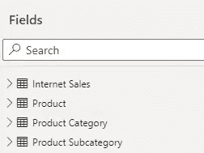

# 使用 Power BI 创建简化的复合模型—直接查询 Azure 分析服务

> 原文：<https://medium.com/codex/create-simplified-composite-models-using-power-bi-direct-query-to-azure-analysis-service-e60de1568ee5?source=collection_archive---------2----------------------->

在 Power BI 中，DirectQuery 选项通常可用于关系数据库，但不能用于分析服务数据库。对 AAS 的直接查询目前正在预览中，用户可以使用此功能连接到 AAS，并将其与自己的其他数据源(如 Excel 电子表格)相结合，以丰富企业语义模型中的元数据。

这确实是一个很棒的特性，但是报告作者对这个特性并不完全满意，因为他们不能从 AAS 数据库中选择他们需要的特定表。微软听取了用户的反馈，并宣布对 AAS 的直接查询选项进行改进。

在发布之前，当您使用 DirectQuery 连接到 AAS 模型时，您看不到从模型中选择单个表的选项。但是现在有了新的版本，用户将可以灵活地从模型中选择单个的表，下图描述了同样的情况

使用直接查询 AAS 模型的简化复合模型

让我们看看如何启用直接查询选项并连接到 AAS 模型。

# 启用直接查询选项

要在 Power BI Desktop
1 中启用此预览功能。打开 Power Bi 桌面
2。点击文件>选项和设置>选项
3。单击预览功能部分，并选择 Power BI 数据集和分析服务的 DirectQuery 复选框。
4。重启 Power BI 桌面

# 使用直接查询连接到 AAS 模型

现在，当你连接到 Azure 分析服务时，你应该会看到**直接查询**选项。直接选择查询→点击确定

早些时候，通过从 Power BI 到 AAS 模型的 DirectQuery 连接，该模型用于包含所有的表。但是现在有了新版本，报表作者可以对模型进行更多的控制，他们可以从模型中选择他们需要的特定表，或者从模型中删除表。

如果我们有一个包含数百个表的大型模型，这对报告作者来说是一个很好的特性。

选择您需要的表格，单击提交按钮，如果您看到下面的屏幕，请单击确定

现在，在我的本地模型中，我只看到我的报告需要的表，但不是全部。这样，即使您所连接的数据集或模型中有数百个表，我们也可以保持我们的模型简单而小巧。

此外，在连接到模型后，您可以通过选择下面的选项(包括以后添加的表)来自动添加任何可能添加到数据集或模型中的表。

希望这是翔实的，看到你在我的下一篇文章，直到那时有一个伟大的时间

[参考](https://quoteideas.com/respect-quotes/)