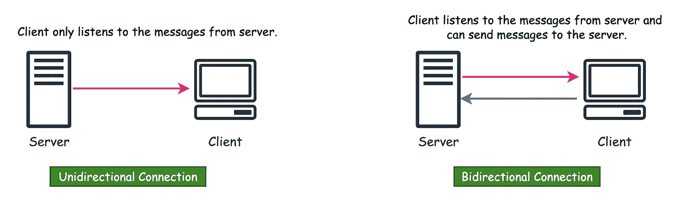
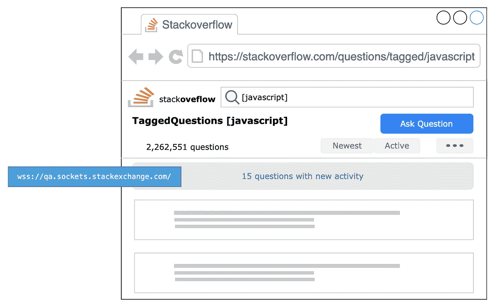
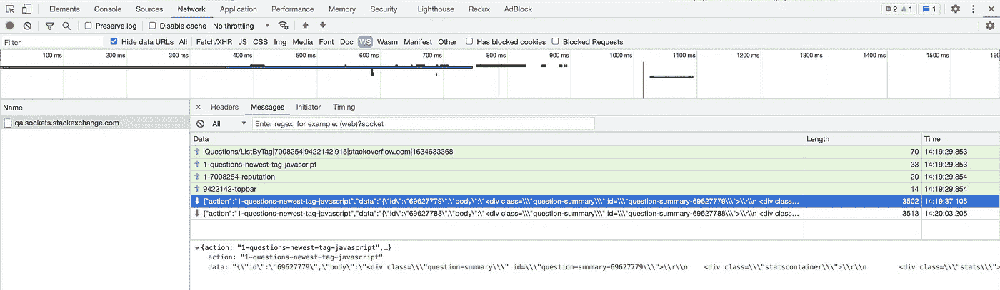
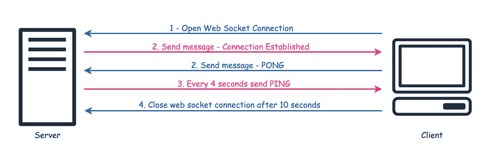
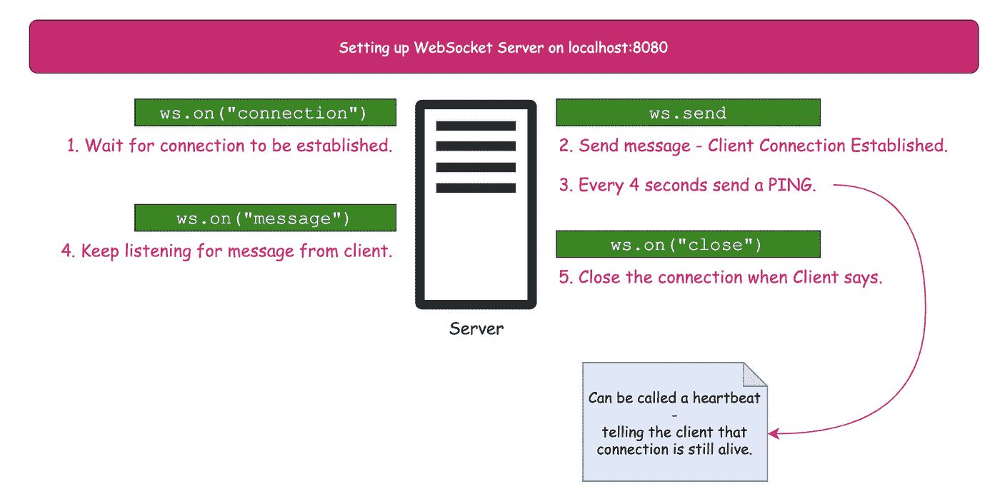
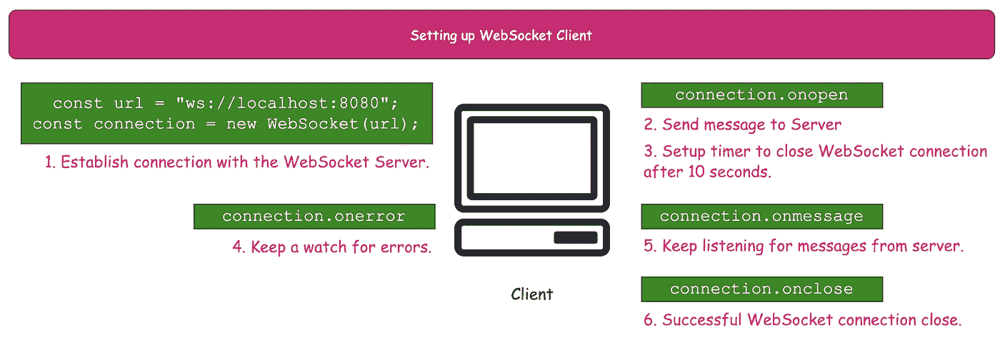

# 创建 WebSocket 游乐场

> 原文：<https://medium.com/codex/create-websocket-playground-12e3ab8ecf7c?source=collection_archive---------1----------------------->

作为初学者，WebSocket 对我来说是个谜。

> 我只需要设置一次！一个隧道！？

在开始的时候，我找到了很多资源，这些资源讨论了什么是 WebSockets，它们是如何使用的，以及它们应该在哪里/什么时候使用。但是我想使用它，运行它——一个*快速&肮脏*的设置。我想检查不同的情况，尤其是浏览器失去连接时的行为。*(如果你想知道 Chrome 和 Firefox 上的网络套接字在连接断开时的不同表现。这并不奇怪！)*

这个博客是设置 WebSockets 并对其进行实验的快速指南。但首先要快速介绍一下 WebSockets。

# 3w——什么、为什么和谁

WebSockets 用于在客户端(浏览器)和服务器之间打开一个**交互式&持久通道**。客户端*根据需要建立和关闭*连接。WebSockets 可以设计为支持*单向*或*双向*通信流。



*单向*或*双向*与 WebSockets 通信的流程。

我们可以在许多网站上找到这些协议。考虑一下[堆栈溢出](https://stackoverflow.com/)。如果你花足够的时间在这个网站上，你可以看到网络套接字在发挥作用。新活动通过 WebSocket 连接发送到客户端。



Stackoverflow 使用 draw.io 的恐怖模仿——Web Sockets 实时。

要在任何网站上查看 WebSocket 请求，您可以—

1.  在浏览器中打开开发者工具。
2.  切换到网络选项卡。
3.  过滤`ws`请求。
4.  选择`ws`请求并检查正在进行的通信的消息选项卡。



在开发者工具中识别 WebSockets 请求。

你可能已经猜到了，WebSockets 是客户机和服务器的合资企业。以下链接提供了所需的详细设置和工具。

1.  [web socket API(web sockets)](https://developer.mozilla.org/en-US/docs/Web/API/WebSockets_API)
2.  [编写 WebSocket 客户端应用程序](https://developer.mozilla.org/en-US/docs/Web/API/WebSockets_API/Writing_WebSocket_client_applications)
3.  [编写 WebSocket 服务器](https://developer.mozilla.org/en-US/docs/Web/API/WebSockets_API/Writing_WebSocket_servers)

或者你可以从 WebSockets 工具中选择。

但是如果你只是像我一样需要快速设置，你只熟悉 JavaScript *继续*阅读。

# 网络插座游乐场

在操场上，我们将实现服务器-客户端 WebSocket 连接的最基本实现，如下图所示。



一点要求

我们将建立 WebSocket 连接，传递一些消息，然后从客户端关闭连接。

## 设置项目

我们将建立一个 NodeJS 开发环境(快速简单)。*如果您是新手，需要更多关于如何设置 NodeJS 项目的详细信息，请查看* [*设置并运行一个简单的节点服务器项目*](https://levelup.gitconnected.com/set-up-and-run-a-simple-node-server-project-38b403a3dc09) *和*[*Express web framework(Node.js/JavaScript)*](https://developer.mozilla.org/en-US/docs/Learn/Server-side/Express_Nodejs)*。如果不需要，可以忽略 Express 部分。我们将只使用 NodeJS。*

我们的项目结构将只包括两个文件— `client.js`和`server.js`。

```
- ws_starter
| - client.js
| - server.js
| - package.json
```

我们将使用 NodeJS Web Socket 库— `ws`。

> ws 是一个简单易用、速度极快且经过全面测试的 WebSocket 客户端和服务器实现。

## 设置服务器



服务器会做什么？

一旦客户端向服务器请求`connection`，服务器就可以向客户端发送`send`消息或者监听来自客户端的`message`。

```
// server.jsconst WebSocket = require("ws");// Create a web socket connection at port 8080.
// This is where the client will keep listening to.
const wss = new WebSocket.Server({ port: 8080 });wss.on("connection", (ws) => {
  ws.send("SERVER: Connection established");function pingClient() {
    ws.send("SERVER: PING");
  }// Keep pinging the client every 4 seconds.
  const ping = setInterval(pingClient, 4000);// Listen to the message coming from client.
  ws.on("message", (message) => {
    console.log(`${new Date().toLocaleTimeString()}: ${message}`);
  });// Clearing up when client closes web socket connection
  ws.on("close", () => {
    clearInterval(ping);
    console.log("Connection closed.");
  });
});
```

这是所有需要的，现在我们将启动服务器。打开项目根目录的终端并运行节点服务器。

```
node server
```

WebSocket 服务器在`localhost:8080`运行。

## 设置客户端



客户会怎么做？

客户机将与 WebSocket 服务器建立`connection`,然后一旦连接打开就发送初始消息。有一个`onerror`事件用于处理错误，例如网络错误，或者客户端丢失了来自服务器的任何传入消息。10 秒钟后，WebSocket 连接关闭。

```
// client.jsconst WebSocket = require("ws");
const url = "ws://localhost:8080";
const connection = new WebSocket(url);let introduceStop;connection.onopen = () => {
  // After connection opens send message to server.
  connection.send("CLIENT: PONG");// After 10 seconds close web socket connection.
  introduceStop = setTimeout(function () {
    console.log(
      `${new Date().toLocaleTimeString()}: Client closing WebSocket connection`
    );
    connection.close();
  }, 10000);
};// Catch error while web socket connection is open.
// After `onerror`, `onclose` will be triggered.
connection.onerror = (error) => {
  console.log(`Web socket error: ${error}`);
};// Keep reading messages from server.
connection.onmessage = (event) => {
  console.log(`${new Date().toLocaleTimeString()} ${event.data}`);
};// Clear things once web socket connection is closed.
connection.onclose = () => {
  clearTimeout(introduceStop);
  console.log("Web Socket connection properly closed.");
};
```

对于客户端，您可以使用您的项目或者在终端中运行以下内容。

```
node client
```

现在，客户机和服务器都已启动并运行，我们可以继续处理终端了。

## 测试 WebSocket 游乐场

我们分别为服务器和客户端启动了两个终端。如果我们在分割窗口中打开它们，我们可以看到以下行为。


WebSocket Playground in Motion |使用 [Canva](https://www.canva.com/create/gif-maker/) 制作

这就是我们在操场上需要的一切。我们有一个服务器，我们可以修改它来发送任何数据或实现更多功能。我们不需要让客户呆在同一个地方。我们只需要建立 WebSocket 连接并保持服务器活动。

上述设置的代码可从[darshna 09/web socket _ mind mapping](https://github.com/darshna09/websocket_mindmapping)获得。

# 参考

1.  【快递网络框架(Node.js/JavaScript)【T2 | MDN
2.  [没有框架的 Node.js 服务器](https://developer.mozilla.org/en-US/docs/Learn/Server-side/Node_server_without_framework) | Level Up 编码|中