# 使用 Azure Portal 创建第一个 Azure Logic 应用程序实例

> 原文：<https://medium.com/codex/create-your-first-azure-logic-app-instance-using-azure-portal-b72fb40ceb77?source=collection_archive---------7----------------------->

在继续创建 Azure Logic 应用程序之前，请阅读文章“[Azure Logic 应用程序简介](https://oindrila-chakraborty88.medium.com/introduction-to-azure-logic-app-217cf797856e)”。

***前置条件*** -
1 .Azure 订阅

## 创建第一个 Azure Logic 应用程序

***第一步*** - ***打开******蔚蓝门户***(***【portal.azure.com】***)。

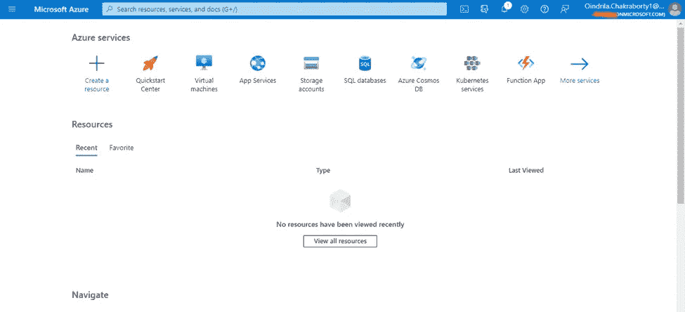

***第二步***—

***步骤 2.1*** -给 ***创建******蔚蓝逻辑 App******首先点击**上的 ***创建资源******图标*****从*****

****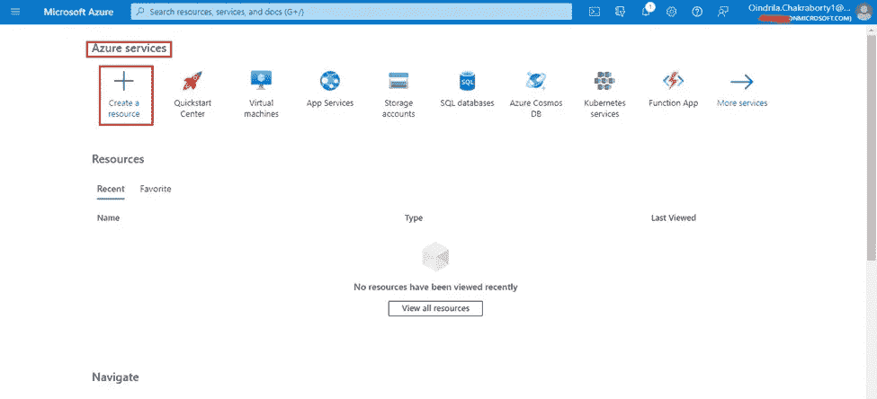****

*******步骤 2.2*** - ***类型******逻辑 App******选择******第二选项******逻辑 App*** 。****

****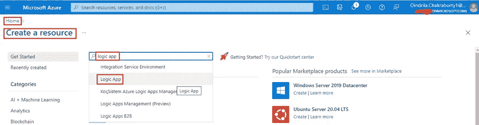****

*******第三步***——现在， ***点击 ***上的****按钮*** 。*********

**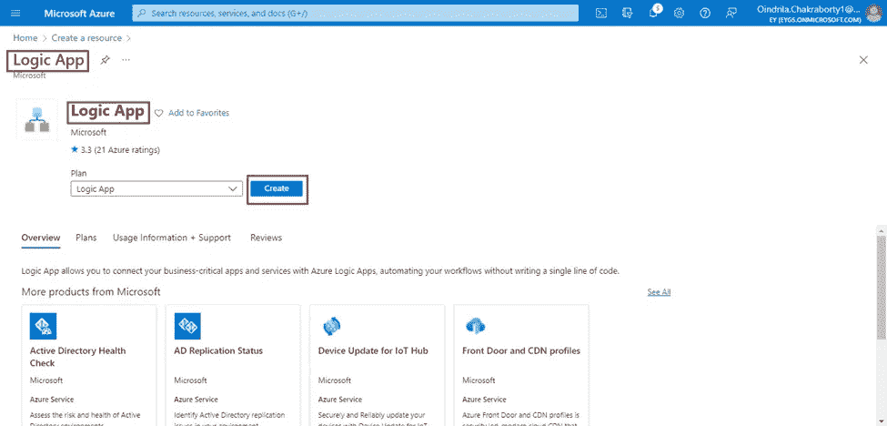**

*****第四步***-**-*提供*-**以下信息在**-*基础知识*-**-**-*页签*-**-**-*创建逻辑 App*-**-**-*页*-****

*****步骤 4.1***-***项目详情******章节***--**

*   *****订阅***-**-*选择*-*-**-**-*-**-*订阅*-**-**--*下拉*-**为****
*   *******资源组***-**-*创建*** 一个 ***新建******资源组*** 通过一个名称，如“***RG-测试*** ”、**、**点击 ***上的*******

*****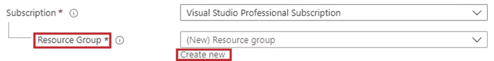*****

*********弹出*** 是 ***打开******键入******RG-Test***文本框中的**** 为 ***名称*********

******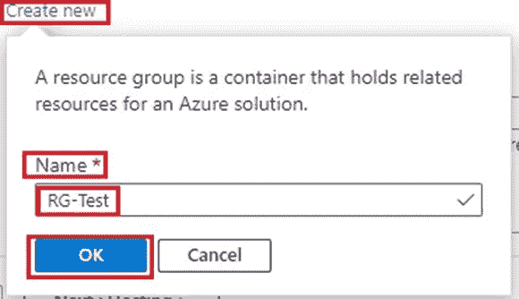******

******在本例中， ***选择******RG-LogicApp******从******下拉*** 为 ***资源组*** 。******

******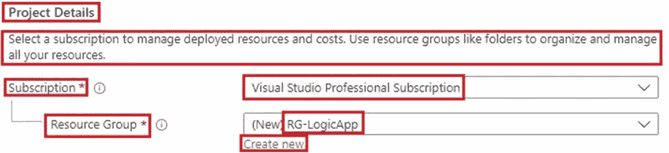******

*********步骤 4.2***-**-*-【实例详情】章节*-********

*   *********逻辑 App 名称*** - ***类型******逻辑-App-Oindrila-2022-6 月******文本框*** 中的 ***逻辑 App 名称*** 。******
*   *********发布******选择******单选按钮******工作流*** 。******
*   *********区域*** - ***选择******适当的数据中心区域*** 使用 ***从******下拉*** ，像-***东美*** 、 ***中印*** 等。
    本例中， ***选择******中部印度******从******下拉******区域*** 。******

******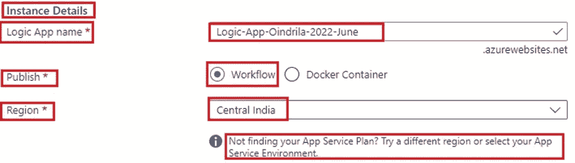******

*********步骤 4.3*** - ***计划*-********

*   *********选择******选项******消费:最适合入门级，只需支付您工作流程运行的费用。*** “从 ***下拉***”***计划类型*** ”。******

******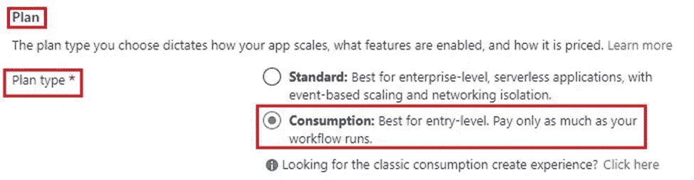******

*********步骤 4.4***-**-*区域冗余(预览)*-**-******

*   *********选择******选项******禁用:您的消费逻辑 app 不使用可用区。*** "从 ***下拉菜单*** " ***【区域冗余(预览)*** "。******

******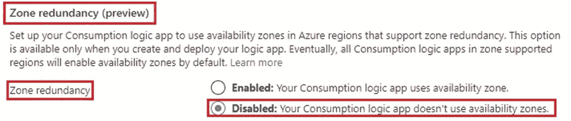******

******现在， ***点击*** 上的 ***审核+创建******按钮*** 。******

************

******最后， ***点击 ***上的******按钮*** 。*********

***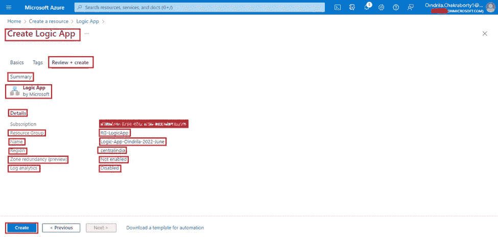***

***现在 ***Azure Logic App 实例*** 将 ***启动*** 到 ***部署*** 。***

******第七步***——一旦 ***部署完毕****。 ***点击*** 上的 ***转到资源******按钮*** 。
***如果*** 这个 ***按钮*** 被 ***禁用******点击*** 上的 ***刷新******链接*** 。 ***转到资源******按钮*** 将 ***启用*** 。****

****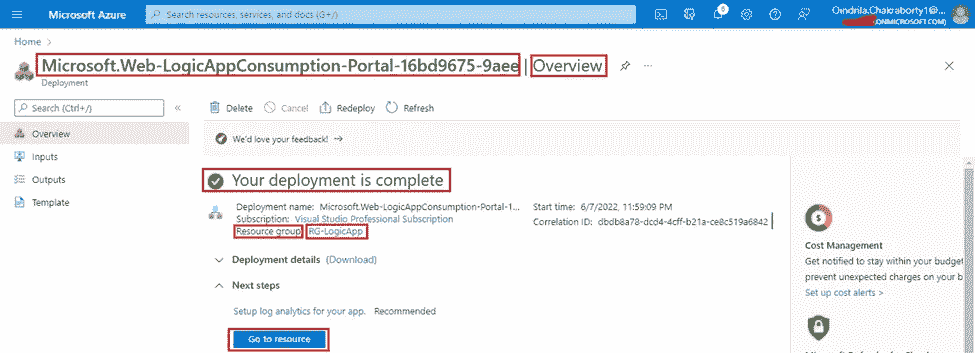****

*******第八步***-***逻辑 App 设计者******页面******刚创建的*** ***Azure 逻辑 App******逻辑-App-Oindrila-2022*******

****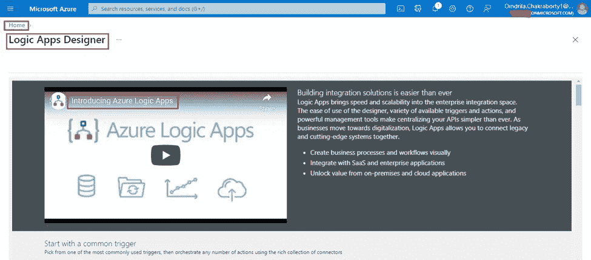****