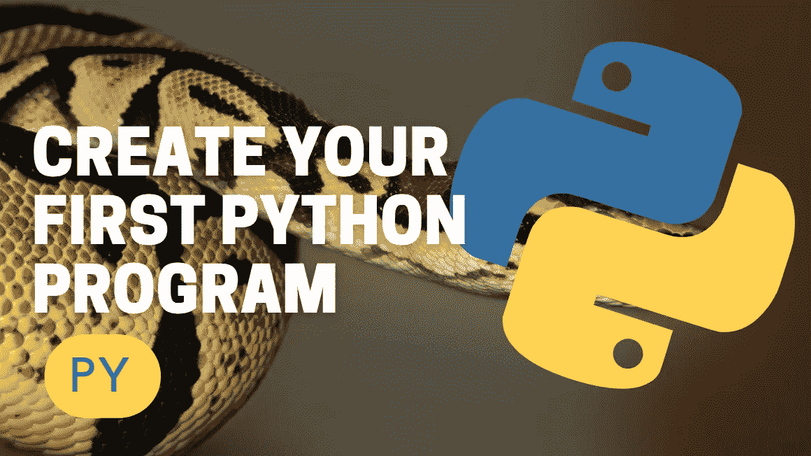

# 轻松创建您的第一个 Python 程序

> 原文：<https://medium.com/codex/create-your-first-python-program-278c910d8e25?source=collection_archive---------9----------------------->

## 现在就开始用 Python 写这篇文章吧！

开始编程有多种方法。在本文中，我将介绍一种非常简单的方法，让你可以开始用 python 编程。我们将创建的程序将是标准的“Hello，World！”程序。我们将使用谷歌实验室作为编程环境。