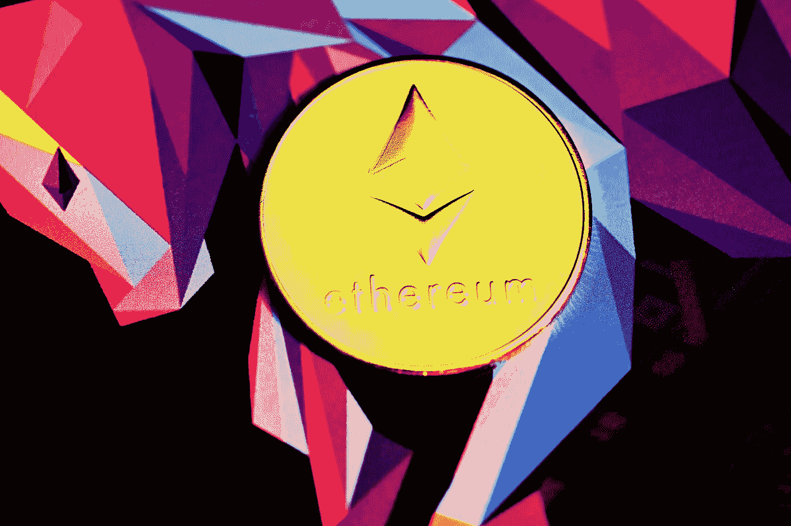
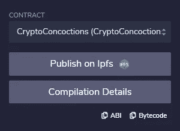

# 用 Web3 和 NextJS 创建一个基本的 dApp

> 原文：<https://medium.com/codex/creating-a-basic-dapp-with-web3-and-nextjs-2ee94af06517?source=collection_archive---------0----------------------->

## *将去中心化与 JAMstack 相结合，实现快速 dApp。*



[行政](https://unsplash.com/@executium?utm_source=unsplash&utm_medium=referral&utm_content=creditCopyText)在 [Unsplash](https://unsplash.com/s/photos/ethereum?utm_source=unsplash&utm_medium=referral&utm_content=creditCopyText) 上拍照

分散式应用程序有各种形状和大小。我们有分散的做市商、闪贷、加密游戏和简单的 NFT 网站。猜猜我们要做哪个？没错，简单的 NFT。

本文将快速介绍设置 NextJS、下载 Web3 和 MetaMask，并且我们将回顾从区块链获取数据和发送铸造或购买 NFT 的简单事务的基础知识。

# 安装

让我们为我们的 dApp 准备好一切。我们需要一个简单的区块链合同和一个 MetaMask 钱包。

## 元掩码

我们将使用元掩码连接到我们的 dApp。我写了一篇关于制作新钱包的文章[这里](/quick-programming/opening-a-metamask-wallet-for-cryptocurrencies-the-quick-guide-f28bdd8d6c00)。如果你像我一样使用 Polygon，我已经写了另一篇关于在 Polygon [这里](/codex/setting-up-metamask-for-polygon-blockchain-development-af058d0fab2e)设置你的钱包进行开发的文章。

## 智能合同

我将使用部署在 Polygon Mumbai testnet 上的智能合约。合同将符合 [ERC721 标准](https://docs.openzeppelin.com/contracts/4.x/api/token/erc721)。因为这篇文章不是关于可靠性和智能合同的，所以我不会深入讨论细节。我将调用标准的 ERC721 函数。如果你想了解更多，你可以点击这里查看这篇文章。

## Web3 和 NextJS

我们需要使用 NPM 安装 Web3 和 Next。您可以通过运行以下命令来实现这一点:

```
**npm i web3 next react react-dom**
```

Web3 是一个连接钱包的工具，还有其他一些有用的功能，比如计算来自 ETH 的 Wei，NextJS 是一个网站建设的框架。

创建一个名为`pages`的文件夹，并在其中创建`index.js`。这是我们 NextJS 的主页。

我们将导入 React 以及`useState`和`useEffect`，稍后我们将使用它们。我们还导入了 Web3 并创建了一个简单的页面。您可以使用以下命令运行代码:

```
**next dev**
```

# 寻找 Web3

每当扩展安装并激活时，MetaMask 就将`window.ethereum`对象注入到我们的浏览器中。当我们的页面加载到一个`useEffect`钩子中，并把它放入我们的状态以备后用时，我们就这样做。

这段代码应该在`return`语句之前的`Index()`函数中。当我们的页面被加载时，它将调用我们的`useEffect`函数，在这个函数中，我们使用一个[三元运算符](https://developer.mozilla.org/en-US/docs/Web/JavaScript/Reference/Operators/Conditional_Operator)来检查`window.ethereum`对象。

如果找到了对象，我们将 Web3 对象设置为 React 状态，并从元掩码中设置登录地址，我们稍后需要使用它。如果运行这段代码，您应该会看到一个元掩码弹出窗口，要求您进行连接。

尝试添加`console.log`函数来记录控制台中的地址和 Web3 对象，这样您就可以检查它们的设置了。

# ABI 和调用合约函数

为了能够用我们新创建的`web3`对象调用函数，我们需要在代码中添加智能契约的 ABI。我们需要 ABI 将一个契约对象添加到我们的状态中，我们可以从中调用函数。

## 获得 ABI 奖

我知道我的 ABI 正在使用 [Remix](http://remix.ethereum.org/) ，一个在线 Solidity IDE 和编译器。添加一个新文件，并将您的智能合约代码粘贴到编辑器中。右键单击 Remix 中的新文件，然后单击编译。转到左边的编译标签，点击小小的`ABI`按钮来复制你的 ABI。将它粘贴到我们代码中 states 下的一个新变量中。



在复制 ABI 之前，请确保选择您自己的合同

现在，我们可以将它添加到现有代码之间的代码中。

ABI 是我们在 JSON 中的可靠性代码的表示，因此 Web3 知道它可以调用什么，以及期望从代码中得到什么。

## 调用合同视图功能

从 Web3 调用契约函数有两种方法。要看函数的类型才知道用哪个。对于`view`函数，以及不需要加油费的函数，我们可以使用我们新的`contract`状态来调用

```
**contract.methods.your_contract_function().call()**
```

这将返回一个 JavaScript `Promise`，我们可以使用`then()`来解析它。

您现在可以在`return`语句中添加一个变量来显示我们的令牌的总供应量。

*我最初遇到的一个问题是，* `*useEffect*` *中的* `*contract*` *而不是* `*c*` *调用没有返回任何内容。请注意，更新状态可能需要很短的时间，如果可以，请从源而不是状态调用它。*

## 调用消耗汽油的合同函数

一个合同可以有一个`payable`功能。如果我们想的话，我们可以从那里得到报酬。其他功能如`mint`也将收取用户燃气费。这些功能需要以不同的方式调用，以便我们的用户可以接受费用和付款。

我们需要`request`一笔交易。这将从 MetaMask 弹出一个窗口提示用户接受付款和汽油费。在这种情况下，付款将是 1 ETH，或 1 MATIC，如果你在多边形。**价格需要在魏而不是 ETH** 发送。

*标准的 ERC721 合约不需要价格，也没有* `*payable*` *的造币功能。我认为了解如何去做是很重要的，所以我把它包括在内，就好像它会被写进合同一样。*

我们请求交易，如果交易被接受，我们将提醒用户交易散列，他或她可以在 Etherscan 或 Polygonscan 上检查。

# 结论

这看起来好像教程遗漏了一些信息，但事实并非如此。除了 HTML 和 CSS，我的第一个 NFT 项目没有比这更多的代码。我得到总供应量，我得到用户的地址，如果用户想铸造一个，他会得到如上的提示。

完整的(粗略的和未经测试的)代码可以在[这里找到](https://gist.github.com/mbvissers/ad96c21706d25194be6f30b076eb25c1)来帮助把代码片段拼凑在一起。

非常感谢您的阅读，祝您有美好的一天，并祝您自己的项目好运。

*在* [*Twitter 上查看我的*](https://twitter.com/MVissers4) *在多边形网上查看我的* [*NFT 收藏*](https://www.cryptoconcoctions.com/) *！*

[*成为中等会员*](https://mbvissers.medium.com/membership) *享受万千博主的内容。*