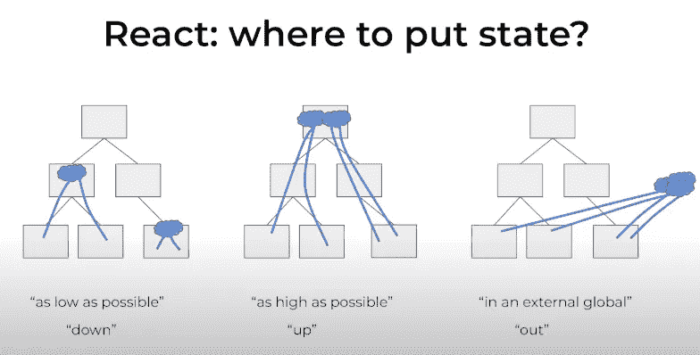

# 第一次创建 ClojureScript App—Pt。一

> 原文：<https://medium.com/codex/creating-a-clojurescript-spa-for-the-first-time-pt-1-d3012c42e622?source=collection_archive---------8----------------------->

## 了解堆栈并构建项目的基础


Jaanus jagomgi 在 [Unsplash](https://unsplash.com?utm_source=medium&utm_medium=referral) 上拍摄的照片

几年前，当我了解 Nubank 背后的技术时，我遇到了 Clojure。尽管那时我已经有了几年的经验，但在那天之前我从未接触过任何 Lisp 语言。它最初令人困惑但却美丽的语法吸引了我，它本质上散发着简单。

然而，从那以后，我只在 Clojure 上了一些速成课程，看了许多 T4 的演讲和 YouTube 视频。除此之外，缺乏关于应用程序开发的好教程和文档使得人们很难开始深入研究这个生态系统。正因为如此，我从未尝试在项目中应用它。

直到现在。

几周前，我决定深入 Clojure 生态系统，从头开始构建一个应用程序。本文是我在 Clojure(脚本)的括号海洋中的冒险经历的第一部分。

# 应用程序

考虑到我将学习一门新的语言、工作流程和框架，我决定最好使用一个至少有一些基本 UI 原型的项目；这样我就可以专注于重要的事情。

去年，我参加了一个来自 Rocketseat 的 Node.js/ReactJS/React 本地训练营，我们参与的一个项目是名为 GoFinance 的财务管理系统。它非常简单和漂亮，非常适合我移植到 ClojureScript。

也就是说，我已经改了名字，改变了调色板，增加了一些额外的功能。GoBudget 诞生了:


主页。摘自我的 Figma 文件:)

背后的想法是非常简单的。当您添加新的事务时:它们被推送到列表中；重新计算所有值；生活还在继续。对于第一个 ClojureScript 项目来说没有什么复杂的。

它还包含一个简单的个人资料，注册和登录页面。


一个**非常**的基本个人资料页面。摘自我的 Figma 文件:)

# 堆栈

作为一个 React 用户，这个决定有点简单:我决定用 Reagent + Re-frame。试剂如其 [github 页面](http://reagent-project.github.io)所述:

*“…*[*ClojureScript*](https://github.com/clojure/clojurescript)*和*[*React*](https://reactjs.org/)*之间的极简接口。它允许你只使用简单的 ClojureScript 函数和数据来定义高效的 React 组件，这些函数和数据使用类似于*[*Hiccup*](https://github.com/weavejester/hiccup)*的语法来描述你的 UI。*

Reagent 的目标是使用几个基本概念来定义任意复杂的用户界面，并且在默认情况下足够快以至于你很少需要考虑性能。”

事实证明，有时候，因为 ClojureScript 利用了令人敬畏的 [Google 的闭包编译器，](https://developers.google.com/closure/compiler/)一个试剂项目可以比 React 本身更小更快。🚀

[不要忘记重新帧:](https://day8.github.io/re-frame/)

*..是用于构建用户界面的 ClojureScript 框架。它有* ***面向数据，功能设计*** *。它的主要焦点是程序员的高生产率和扩展到更大的单页应用程序。*

*虽然重新帧利用了 React(通过试剂)，但它只需要 React 成为 MVC 中的 V，仅此而已。re-frame 走了一条不同的路，与当前流行的观点不同，即视图应该是因果的(协同定位查询、组件装载、钩子等)。在 re-frame 中，事件是因果的，* ***视图是纯反应的。***

*所以，它是关于`data`和转换该数据的`functions`。而且，因为是**反应式框架**，`data`坐标`functions`，而不是反过来。*

*喜悦的泪水从我的眼中滑落，🥳*

# *ClojureScript SPA 101*

*我必须说，由于我使用 Clojure 已经有一段时间了，我确实对它的基础有一些简单的了解；由于围绕 Clojure(Script)语言有非常好的资源，我在这里的重点将放在理解如何用 ClojureScript、Reagent 和 re-frame 构建单页应用程序所必需的知识上。*

## *试剂*

*React 也有 Jsx，它是 Javascript 的语法扩展，允许我们将“html”写入 Javascript，Reagent 使用 Hiccup。Hiccup 是一个在 Clojure 中表示 HTML 的库。它使用向量来表示元素，使用映射来表示元素的属性。*

*与 React 的 Jsx 的主要区别在于 Hiccup 使用 Clojure 自己的数据结构来表示组件:*

*这只是一个 Clojure 向量，它将 html 标签`a`定义为一个关键字，同时使用 Clojure 映射来设置它的属性(在本例中是`href`和`onClick`)。*

*同样，您可以使用 Hiccup 来组合 html 标签以形成更复杂的元素:*

*您甚至可以添加一些内联样式，或者稍后通过 css 使用类对其进行样式化:*

*定义一个类有两种方法:要么使用 Hiccup 为我们提供的语法糖`:a.profile-avatar-link`，要么使用`:class`关键字；不过，后者更适合动态定义类。id 属性也是如此:`:a#profile-avatar-link`将创建一个 id 为`profile-avatar-link.`的`a` html 标签*

*没有新的语言、模板或混合不同的结构来创建元素。这都是关于结合 Clojure 自己的数据结构。还有更多关于设置样式和组件的细节，但是我会在适当的时候再讨论。*

*除此之外，例如，对于表单的简单状态，我们根本不需要使用重新框架。相反，我们可以使用试剂自己版本的`atom`。它的工作方式类似于 Clojure，只是在原子发生变化时添加了组件重新呈现功能:*

*柠檬榨汁机。*

## *状态和重构*

*应用程序的一个重要部分是它的状态和我们管理它的方式。多年来，React 开发人员习惯于将状态保存在每个组件中，严重基于面向对象编程，使得应用程序状态分散在各处。*

*然后 Redux 来了，把状态全局化，通过动作来管理。*

**

*摘自 [Rafal Dittwald 的《用 Clojure 方法解决问题》](https://www.youtube.com/watch?v=vK1DazRK_a0)*

*原来 Redux 背后的想法实际上来自于 re-frame，这就是我要用来管理我们的应用程序状态。*

*重建框架通过事件和订阅工作。每当我们需要改变我们的应用程序状态时，我们会分派一些事件来为我们做这件事。因此，如果应用程序的数据库是这样的:*

*我们有如下的事件处理程序和订阅者:*

*不介意现在试着去理解这个。以后再详谈:)*

*然后，我们可以调度事件并订阅数据库中的更改:*

*`:create-transaction`事件更新应用程序状态中的`:transaction-history`数据。事件会通知订阅该状态中特定信息的任何人，然后 Reagent 会重新呈现该组件。*

*现在，我们应用程序中的每个组件都是反应式的。*

# *本地主机设置*

*好吧，这就是事情变得棘手的地方。一开始你有很多选择。Clojure 开发的圣杯是 Emacs。作为一个刚开始接触 Clojure 世界的人，这让我害怕极了。我一生中从未使用过 Emacs，那么学习一个新的工具会很麻烦。*

*幸运的是，有一些不错的选择！就我而言，作为一名 VSCode 用户，我选择坚持使用它，并添加了一些不错的扩展:*

*   *[卡尔瓦](https://calva.io)，综合 REPL。它包括内联代码评估、Paredit、代码格式化、测试运行器、语法高亮、[林挺](https://calva.io/linting/)等等；*
*   *[Clojure Lint:](https://marketplace.visualstudio.com/items?itemName=marcomorain.clojure-lint) 这个扩展使用 [clj-kondo](https://github.com/clj-kondo/clj-kondo/blob/master/doc/install.md) 对 Clojure 和 EDN 代码进行 Lint。每当保存 Clojure 文件时，林挺将自动发生。*
*   *[颜色高亮:](https://marketplace.visualstudio.com/items?itemName=naumovs.color-highlight)好吧，我们将处理样式，所以没有比扩展更好的了。这个扩展设计了文档中的 css/web 颜色。*

*除此之外，我需要安装一个 Java JDK 和 Node.js(以及相应的 npm)。我已经用 [sdkman](https://sdkman.io) 安装了 openjdk 的最新稳定版，超级推荐；以及通过 [nvm](https://github.com/nvm-sh/nvm) 节点的 LTS 释放。*

*差点忘了节目的主角:Clojure！让我们运行以下命令来安装 CLI 工具:*

```
*$ brew install clojure/tools/clojure*
```

*PS:我用的是 Mac OS。如果您想安装它，并且您正在使用另一个系统，请参考此处的[。](https://clojure.org/guides/getting_started)*

*一切都准备好了，是时候开始动手编写代码了。*

# *设置项目*

*当我创建一个 shadow-cljs 应用程序时，有一个 npm 命令为我们引导一个项目:*

```
*$ npx create-cljs-app gobudget-web*
```

*完成后，我得到了一个类似这样的项目结构:*

**

*初始项目文件夹结构*

*样板代码有助于您理解试剂是如何工作的，因此值得看一看。我开始着手清理这个项目。*

## *清理东西*

*我已经删除了`app`文件夹中除了`core.cljs`以外的所有文件；我也删除了`e2e`文件夹。这样我可以从一个几乎空的项目开始。*

*在`core.cljs`中，我删除了一些不必要的东西，所以我得到了这样一个文件:*

*这里要提到几件事:*

*   *`^:export`是一种元数据，它使得主函数对 javascript 引擎可用。这样，应用程序可以从`index.html`文件中呈现出来。*
*   *`^:dev/after-load`是一个元数据，shadow-cljs 使用它作为钩子，为我们的应用程序提供热重载功能。*
*   *`(:require [reagent.core :as r])`在核心名称空间中包含试剂，因此我们可以调用`r/render`将我们的应用程序呈现到 DOM 中。*
*   *当我们创建根组件时，我们的`r/render`调用中的`[]`将包含它。因此，reagent 可以将我们的应用程序注入 DOM。*

```
*(r/render [app] (.getElementById js/document "app"))*
```

*与以下内容非常相似:*

```
*ReactDOM.render(
  <App />
  ,document.getElementById('app'),
)*
```

*另外，我在 app 文件夹下创建了一个`db.cljs`文件。这个文件将包含我们的应用程序状态，这将通过重新构建事件来进一步管理。初始 db 将包含一些数据，因此我们可以在浏览器中可视化它们；但是现在，让我们只定义它的基本键:*

*让我们将一个组件传递给`r/render`试剂函数，这样我们终于可以在浏览器中看到一些东西了！创建一个名为`main.cljs`的新文件，内容如下:*

*这个文件在做什么非常清楚:*

*   *定义`app.main`名称空间；*
*   *创建一个名为 root 的函数，这是我们的第一个组件。它返回一个带有上面文本的`<h1>`标签。很酷吧。*

*现在，新文本需要在浏览器中呈现。为此，我将名称空间`app.main`导入到`core.cljs`中，通过使用`:refer`关键字引用我们的组件。然后，我将根组件作为参数传递给了`r/render`函数:*

*在终端运行`npm start`，触发`shaddow-cljs watch app`命令；它构建我们的应用程序，启动应用程序，并持续监视我们的文件。这样，无论何时我做了更改，它都会自动重新加载我们的应用程序。*

*在浏览器中访问`http://localhost:3000/`应该会显示出文本:*

**

*厉害！*

*更改文本会触发 shadow-cljs 自动构建应用程序并将其重新加载到浏览器上(不需要 F5！).*

```
*[:app] Compiling ...
[:app] Build completed. (154 files, 2 compiled, 0 warnings, 0.22s)*
```

**

*热重装起作用了！耶！🎉*

# *为即将到来的事情做准备*

*既然项目已经设置好了，下一步就是开始构建应用程序。我将为我们的应用程序创建一些基本页面，并讨论 ClojureScript 项目的文件夹结构:我所看到的和我决定坚持的。*

*我还将使用 CSS 和 Hiccup 的内联样式做一些初步的实验。很多很酷的事情还在后面呢！*

*感谢您的到来！我会在我的 ClojureScript 冒险的下一章见到你！*

*再见！✌🏽*

# *参考*

*[](https://clojurescript.org) [## ClojureScript

### 编辑描述

clojurescript.org](https://clojurescript.org) [](https://clojure.org) [## Clojure

### Clojure 是一种动态的通用编程语言，结合了易用性和交互式开发…

clojure.org](https://clojure.org) [](http://reagent-project.github.io) [## 试剂:对 ClojureScript 的最小反应

### 试剂提供了 ClojureScript 和 React 之间的最小界面。它允许您定义有效的反应…

reagent-project.github.io](http://reagent-project.github.io)  [## 重新框定

### 用 ClojureScript 构建 web 应用程序，利用 React。具有面向数据的功能设计。先进到足以拥有…

第八天 github.io](http://day8.github.io/re-frame/)  [## 亚采克·沙

### 编辑描述

www.jacekschae.com](https://www.jacekschae.com) [](https://www.exoscale.com/syslog/single-page-application-with-clojurescript-and-reframe/) [## 用 ClojureScript 和 re-frame 构建一个单页应用程序

### 在这篇文章中，我们将讨论使用 ClojureScript 和 re-frame 来构建一个健壮的、可维护的…

www.exoscale.com](https://www.exoscale.com/syslog/single-page-application-with-clojurescript-and-reframe/)*