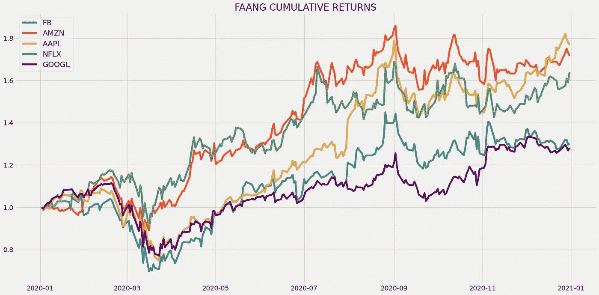
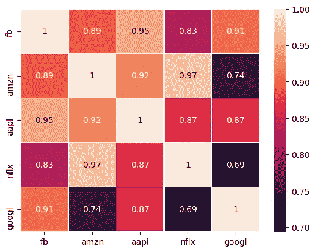

# 用 Python 中的相关矩阵创建多元化投资组合

> 原文：<https://medium.com/codex/creating-a-diversified-portfolio-with-correlation-matrix-in-python-7d7825255a2d?source=collection_archive---------1----------------------->

## 所有投资股票市场的人都必须知道的过程


安德烈·泰森在 [Unsplash](https://unsplash.com?utm_source=medium&utm_medium=referral) 上拍摄的照片

# 介绍

对可交易资产的投资不仅由机构或专业交易者进行，也由普通人进行，他们的目标是在长期的基础上赚取额外收入。第一类交易者是专业人士和机构交易者，他们喜欢在市场上赚很多钱，因此承担巨大的风险(就像孤注一掷的情况)。第二类人是普通人，他们在本质上与第一类人相反。他们的目标不是马上发财，而是随着时间的推移逐渐增加的稳定收入。重要的是，他们讨厌风险，喜欢持续的收入。

为了同时满足这两个条件，投资者创造了投资组合多样化这个术语。这个概念的定义是，在一个人的投资组合中持有不同数量的股票，最终降低风险，增加稳定收入的确定性。

多元化投资组合中的股票不是随机选择的，而是遵循一定的步骤或方法。在这篇文章中，我们将遵循一种统计方法，即使用相关矩阵来选择正确的股票，并在多样化的投资组合中持有。在此之前，什么是相关性？相关性只不过是两个或多个变量之间关系的大小。相关性可以分为三种类型:两个或更多变量之间的关系大于零(> 0)的正相关性，关系小于零的负相关性(< 0), and No correlation where the reading is equal to zero (= 0).

The ultimate goal of this article is to find the two best stocks among FAANG (acronym of Facebook, Amazon, Apple, Netflix, Google) to hold in a diversified portfolio that achieves lesser risk with gradual constant income. With that being said, let’s code the approach in Python.

**在继续之前，免责声明:本文的唯一目的是教育人们，必须被视为信息，而不是投资建议等。**

# 用 Python 实现

编码部分可以分为以下几个步骤:

```
**1\. Importing packages
2\. Extracting Stock Data from Twelve Data
3\. Calculating Returns
4\. Creating and Analyzing the Correlation Matrix
5\. Backtesting
6\. Volatility Comparison**
```

我们将按照上面列表中提到的顺序，系好安全带，跟随每一个即将到来的编码部分。

## 步骤 1:导入包

将所需的包导入 python 环境是一个不可跳过的步骤。主要的包将是处理数据的 Pandas，处理数组和复杂函数的 NumPy，用于绘图的 Matplotlib 和 Seaborn，以及进行 API 调用的请求。二级包是数学函数的 Math 和字体定制的 Termcolor(可选)。

**Python 实现:**

```
**# IMPORTING PACKAGES** 
import pandas as pd
import requests
import numpy as np
import matplotlib.pyplot as plt
import seaborn as sns
from math import floor
from termcolor import colored as cl

from matplotlib import style
from matplotlib import rcParams

style.use('fivethirtyeight')
rcParams['figure.figsize'] = (20, 10)
```

既然我们已经将所有需要的包导入到 python 环境中。让我们用十二数据的 API 端点来拉 FAANG(脸书、亚马逊、苹果、网飞、谷歌的缩写)的历史数据。

## 步骤 2:从 12 个数据中提取股票数据

在这一步中，我们将使用 twelvedata.com[提供的 API 端点提取 FAANG 的历史股票数据。在此之前，请注意 twelvedata.com](https://twelvedata.com/):十二数据公司是领先的市场数据提供商之一，拥有大量适用于所有类型市场数据的 API 端点。它非常容易与十二数据提供的 API 进行交互，并且拥有有史以来最好的文档。此外，确保您在[twelvedata.com](https://twelvedata.com/)上有一个帐户，只有这样，您才能访问您的 API 密钥(使用 API 提取数据的重要元素)。

**Python 实现:**

```
**# EXTRACTING STOCKS DATA** 
def get_historical_data(symbol, start_date, end_date):
    api_key = 'YOUR API KEY'
    api_url = f'https://api.twelvedata.com/time_series?symbol={symbol}&interval=1day&outputsize=5000&apikey={api_key}'
    raw_df = requests.get(api_url).json()
    df = pd.DataFrame(raw_df['values']).iloc[::-1].set_index('datetime').astype(float)
    df = df[df.index >= start_date]
    df = df[df.index <= end_date]
    df.index = pd.to_datetime(df.index)
    return df

fb = get_historical_data('FB', '2020-01-01', '2021-01-01')
amzn = get_historical_data('AMZN', '2020-01-01', '2021-01-01')
aapl = get_historical_data('AAPL', '2020-01-01', '2021-01-01')
nflx = get_historical_data('NFLX', '2020-01-01', '2021-01-01')
googl = get_historical_data('GOOGL', '2020-01-01', '2021-01-01')
```

**代码解释:**我们做的第一件事是定义一个名为‘get _ historical _ data’的函数，它将股票的符号(‘symbol’)、历史数据的开始日期(‘start _ date’)和结束日期(‘end _ date’)作为参数。在函数内部，我们定义了 API 键和 URL，并将它们存储到各自的变量中。接下来，我们使用“get”函数提取 JSON 格式的历史数据，并将其存储到“raw_df”变量中。在对原始 JSON 数据进行清理和格式化之后，我们将以干净的 Pandas 数据帧的形式返回它。最后，我们调用创建的函数来从 2020 年开始提取 FAANG 的历史数据，并将其存储到各自的变量中(' fb '，' amzn '，' aapl '，' nflx '，' googl ')。

## 步骤 3:计算回报

在这一步中，我们将计算所有 FAANG 股票的累积收益，并绘制它们，以观察它们之间的相关性。

**Python 实现:**

```
**# CALCULATING RETURNS** 
fb_rets, fb_rets.name = fb['close'] / fb['close'].iloc[0], 'fb'
amzn_rets, amzn_rets.name = amzn['close'] / amzn['close'].iloc[0], 'amzn'
aapl_rets, aapl_rets.name = aapl['close'] / aapl['close'].iloc[0], 'aapl'
nflx_rets, nflx_rets.name = nflx['close'] / nflx['close'].iloc[0], 'nflx'
googl_rets, googl_rets.name = googl['close'] / googl['close'].iloc[0], 'googl'

plt.plot(fb_rets, label = 'FB')
plt.plot(amzn_rets, label = 'AMZN')
plt.plot(aapl_rets, label = 'AAPL')
plt.plot(nflx_rets, label = 'NFLX')
plt.plot(googl_rets, label = 'GOOGL', color = 'purple')
plt.legend(fontsize = 16)
plt.title('FAANG CUMULATIVE RETURNS')
plt.show()
```

**输出:**



作者图片

**代码解释:**前几行，我们是用股票的当前收盘价值除以股票的初始收盘价值来计算每只 FAANG 股票的累计收益。然后，我们在 Matplotlib 包的帮助下绘制回报，我们得到了上面的结果图。回报也可以在每日时间框架内计算，但选择累积回报的原因是，当绘制成图表时，我们很容易注意到股票之间的相关性。例如，从上面的图表中，我们可以注意到所有五只股票之间存在很强的相关性，因为它们的价格都显示出类似的波动或运动。相反，在每日回报图中不可能观察到这种变化，因为这些线会相互重叠。

## 步骤 4:创建和分析相关矩阵

在所有步骤中，这是最有趣的一步，我们将根据之前计算的回报构建一个相关矩阵，并对其进行分析，以了解哪些股票最适合我们的多元化投资组合。

**Python 实现:**

```
**# CREATING THE CORRELATION MATRIX** 
rets = [fb_rets, amzn_rets, aapl_rets, nflx_rets, googl_rets]
rets_df = pd.DataFrame(rets).T.dropna()
rets_corr = rets_df.corr()

plt.style.use('default')
sns.heatmap(rets_corr, annot = True, linewidths = 0.5)
plt.show()
```

**输出:**



作者图片

**代码解释:**首先，我们创建一个名为‘RETs’的变量来存储我们之前计算的所有回报，在下一步中，我们将使用它创建一个数据框架。为了计算股票之间的相关性，我们使用 Pandas 软件包提供的“corr”函数，并将矩阵存储到“rets_corr”变量中。除非以热图的形式绘制，否则相关矩阵没有意义。

可以使用 Matplotlib 绘制热图，但是徒劳无功。这就是 Seaborn 发挥作用的地方。Seaborn 是一个 python 包，它提供了大量函数来创建统计图形表示。因此，我们使用 Seaborn 软件包提供的“热图”功能从关联矩阵中绘制出热图。

现在，让我们来分析代表股票之间相关性的热图。我们可以在图中看到一些值，这些值就是相关分数。谷歌和脸书之间的相关系数是 0.91，代表着很强的关系。这意味着，如果谷歌股票下跌 10%，脸书也会下跌 8%左右(因为它不是 100%相关)，反之亦然。同样，我们可以看到，谷歌和网飞之间的相关性为 0.69，代表较弱的关系(与其他关系相比)，其价格运动将彼此相反(不太多，但有点，因为它不是负相关)。

持有多元化投资组合的主要目标是尽可能降低风险，为了实现这一目标，我们必须持有彼此高度不相关的股票。即使我们投资组合中的一只股票小幅下跌，另一只不相关的股票也会回补，因为它们的价格波动是成反比的。从上面的相关性矩阵中，我们可以说谷歌和网飞是最不相关的，所以在我们的多元化投资组合中持有这两只股票是最理想的。

## 步骤 5:回溯测试

现在，我们已经决定了在我们的多元化投资组合中持有哪些股票，让我们试着做一个回溯测试，看看我们的投资组合表现如何。这一步是最重要的一步，不仅对我们的投资组合进行多样化，而且对每一项金融研究都是如此，因为它能让我们对投资策略的表现有所了解。

**Python 实现:**

```
**# BACKTESTING** 
investment_value = 100000
N = 2
nflx_allocation = investment_value / N
googl_allocation = investment_value / N

nflx_stocks = floor(nflx_allocation / nflx['close'][0])
googl_stocks = floor(googl_allocation / googl['close'][0])

nflx_investment_rets = nflx_rets * nflx_stocks
googl_investment_rets = googl_rets * googl_stocks
total_rets = round(sum(((nflx_investment_rets + googl_investment_rets) / 2).dropna()), 3)
total_rets_pct = round((total_rets / investment_value) * 100, 3)

print(cl(f'Profit gained from the investment : {total_rets} USD', attrs = ['bold']))
print(cl(f'Profit percentage of our investment : {total_rets_pct}%', attrs = ['bold']))
```

**输出:**

```
**Profit gained from the investment : 30428.957 USD**
**Profit percentage of our investment : 30.429%**
```

**代码解释:**首先，我们创建一个名为‘investment _ value’的变量来存储我们想要投资的总资本，即十万美元。接下来，我们将资本平均分配给两只股票，资本分配相等的投资组合称为等权重投资组合。有时，投资者通过一些因素为投资组合中的每只股票分配独特的权重，但这超出了本文的范围。之后，我们将创建两个新变量，即“nflx_stocks”和“googl_stocks ”,以存储我们可以用资本金额购买的股票数量。然后，是投资回报的计算。首先，我们通过将我们购买的股票数量乘以我们之前计算的股票回报来计算每只股票的回报。

之后，为了计算我们多样化投资组合的总回报，我们找到了每只股票平均回报的总和。我们还通过将总投资回报除以总投资资本，然后乘以 100 来计算利润率。从显示的输出中，我们可以看到我们的投资组合在一年内获得了大约 30500 美元的利润，利润率为 30.429%。那还不错！

## 第六步:波动性比较

我之前说过，持有多元化投资组合的最终目的是尽可能降低风险，创收是次要的。现在我们知道我们设法从我们的投资组合中获得了一些利润，让我们看看我们是否能够将风险降到最低。现在，有很多金融工具可以用来衡量风险，在这篇文章中，我们将利用波动率。对于那些不知道什么是波动性的人来说，波动性是投资者用来计算投资风险的工具。

**Python 实现:**

```
**# VOLATILITY CALCULATION
**    
rets_df['Portfolio'] = (rets_df[['googl', 'nflx']].sum(axis = 1)) / 2
daily_pct_change = rets_df.pct_change()
volatility = round(np.log(daily_pct_change + 1).std() * np.sqrt(252), 5)

companies = ['FACEBOOK', 'APPLE', 'AMAZON', 'NFLX', 'GOOGL', 'PORTFOLIO']
for i in range(len(volatility)):
    if i == 5:
        print(cl(f'{companies[i]} VOLATILITY : {volatility[i]}', attrs = ['bold'], color = 'green'))
    else:
        print(cl(f'{companies[i]} VOLATILITY : {volatility[i]}', attrs = ['bold']))
```

**输出:**

```
FACEBOOK VOLATILITY : 0.46539
APPLE VOLATILITY : 0.38944
AMAZON VOLATILITY : 0.47043
NFLX VOLATILITY : 0.46069
GOOGL VOLATILITY : 0.3881
**PORTFOLIO VOLATILITY : 0.37843**
```

**代码解释:**首先，我们在‘RETs _ df’数据框架中创建一个新的列‘Portfolio ’(我们以前使用过)来存储我们多样化投资组合的回报。然后，我们使用 Pandas 包提供的“pct_change”函数来计算“rets_df”中每只股票的当前读数和先前读数之间的百分比变化，并将它们存储到“daily_pct_change”变量中。然后是波动率计算。在讨论代码之前，有一个公式需要记住，这是计算年化波动率的公式:

```
**VOLATILITY** = **LOG** [ ( **STD OF PCT CHANGE** + **1** ) * **SQRT OF 252** ]where,
**STD OF PCT CHANGE** = Standard Deviation of Daily Percentage Change
**SQRT OF 252** = Square Root of 252
```

我们将上述公式代入我们的代码，计算每只股票的波动率，并将它们存储到“波动率”变量中。从显示的输出中，我们可以看到，与其他 FAANG 股票相比，我们的多元化投资组合实现了最小的波动性。太好了！

# 最后的想法！

经过漫长的编程过程，我们已经成功地建立了一个多元化的投资组合，将风险降至最低，并获得利润。我还将我们投资组合的表现与 SPY ETF(一种专为跟踪标准普尔 500 市场指数走势而设计的 ETF)的表现进行了比较，似乎我们以微小的差异否决了它。现在，我们来谈谈改进。

可以改进的第一个方面是使用大量的股票。在本文中，我们只考虑了五只股票，并从中挑选了两只相关性较低的股票。但是，当持有大量不相关的股票时，投资组合多样化的概念表现最佳。例如，我们可以考虑标准普尔 500 市场指数中包含的所有股票，并挑选高度不相关的股票。通过这样做，我们可以实现两件重要的事情。

首先，我们将能够找到高度不相关的股票。在这篇文章中，最小相关分数是 0.69(这实际上是一个很好的正相关关系)，因为我们只有几只股票。但是，如果我们考虑由不同部门组成的大量股票，我们可以设法找到即使相关性很低的股票，帮助提高我们的投资组合的表现。其次，我们将能够更有效地降低风险。

另一个可以改进的方面，不仅是持有股票，还有其他资产。多元化投资组合的第一个目标是降低风险，第二个主要目标是产生稳定的收入。定期从股票中获得回报的确定性很低，因为它具有特定水平的波动性，无法完全消除或降低，而当我们将我们的投资组合扩大到更广泛的资产范围，如债券、交易所交易基金等，恒定收入的概率就会增加。

话虽如此，你已经到了文章的结尾。如果您忘记了遵循任何编码部分，不要担心。我在最后提供了完整的源代码。希望你能从这篇文章中学到一些新的有用的东西。

## 完整代码:

```
# IMPORTING PACKAGES

import pandas as pd
import requests
import numpy as np
import matplotlib.pyplot as plt
import seaborn as sns
from math import floor
from termcolor import colored as cl

from matplotlib import style
from matplotlib import rcParams

style.use('fivethirtyeight')
rcParams['figure.figsize'] = (20, 10)

# EXTRACTING STOCKS DATA

def get_historical_data(symbol, start_date, end_date):
    api_key = 'YOUR API KEY'
    api_url = f'https://api.twelvedata.com/time_series?symbol={symbol}&interval=1day&outputsize=5000&apikey={api_key}'
    raw_df = requests.get(api_url).json()
    df = pd.DataFrame(raw_df['values']).iloc[::-1].set_index('datetime').astype(float)
    df = df[df.index >= start_date]
    df = df[df.index <= end_date]
    df.index = pd.to_datetime(df.index)
    return df

fb = get_historical_data('FB', '2020-01-01', '2021-01-01')
amzn = get_historical_data('AMZN', '2020-01-01', '2021-01-01')
aapl = get_historical_data('AAPL', '2020-01-01', '2021-01-01')
nflx = get_historical_data('NFLX', '2020-01-01', '2021-01-01')
googl = get_historical_data('GOOGL', '2020-01-01', '2021-01-01')

# CALCULATING RETURNS

fb_rets, fb_rets.name = fb['close'] / fb['close'].iloc[0], 'fb'
amzn_rets, amzn_rets.name = amzn['close'] / amzn['close'].iloc[0], 'amzn'
aapl_rets, aapl_rets.name = aapl['close'] / aapl['close'].iloc[0], 'aapl'
nflx_rets, nflx_rets.name = nflx['close'] / nflx['close'].iloc[0], 'nflx'
googl_rets, googl_rets.name = googl['close'] / googl['close'].iloc[0], 'googl'

plt.plot(fb_rets, label = 'FB')
plt.plot(amzn_rets, label = 'AMZN')
plt.plot(aapl_rets, label = 'AAPL')
plt.plot(nflx_rets, label = 'NFLX')
plt.plot(googl_rets, label = 'GOOGL', color = 'purple')
plt.legend(fontsize = 16)
plt.title('FAANG CUMULATIVE RETURNS')
plt.show()

# CREATING THE CORRELATION MATRIX

rets = [fb_rets, amzn_rets, aapl_rets, nflx_rets, googl_rets]
rets_df = pd.DataFrame(rets).T.dropna()
rets_corr = rets_df.corr()

plt.style.use('default')
sns.heatmap(rets_corr, annot = True, linewidths = 0.5)
plt.show()

# BACKTESTING

investment_value = 100000
N = 2
nflx_allocation = investment_value / N
googl_allocation = investment_value / N

nflx_stocks = floor(nflx_allocation / nflx['close'][0])
googl_stocks = floor(googl_allocation / googl['close'][0])

nflx_investment_rets = nflx_rets * nflx_stocks
googl_investment_rets = googl_rets * googl_stocks
total_rets = round(sum(((nflx_investment_rets + googl_investment_rets) / 2).dropna()), 3)
total_rets_pct = round((total_rets / investment_value) * 100, 3)

print(cl(f'Profit gained from the investment : {total_rets} USD', attrs = ['bold']))
print(cl(f'Profit percentage of our investment : {total_rets_pct}%', attrs = ['bold']))

 # VOLATILITY CALCULATION

rets_df['Portfolio'] = (rets_df[['googl', 'nflx']].sum(axis = 1)) / 2
daily_pct_change = rets_df.pct_change()
volatility = round(np.log(daily_pct_change + 1).std() * np.sqrt(252), 5)

companies = ['FACEBOOK', 'APPLE', 'AMAZON', 'NFLX', 'GOOGL', 'PORTFOLIO']
for i in range(len(volatility)):
    if i == 5:
        print(cl(f'{companies[i]} VOLATILITY : {volatility[i]}', attrs = ['bold'], color = 'green'))
    else:
        print(cl(f'{companies[i]} VOLATILITY : {volatility[i]}', attrs = ['bold']))
```