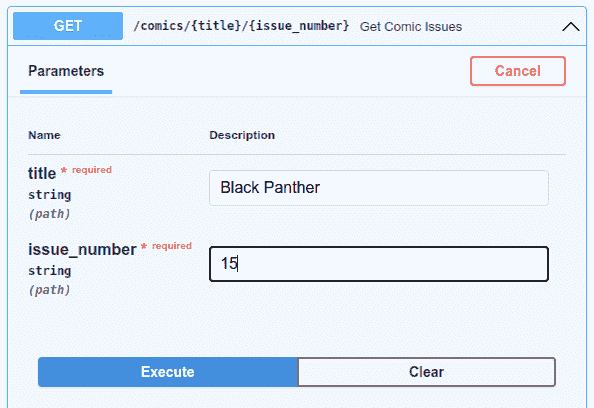

# 使用 Docker Compose 创建场堆栈开发环境—第 2 部分，共 3 部分:FastAPI

> 原文：<https://medium.com/codex/creating-a-farm-stack-dev-environment-with-docker-compose-part-2-of-3-fastapi-9ee7ab644809?source=collection_archive---------7----------------------->


# 介绍

在第一部分中，我启动了一个 FastAPI、React 和 Mongo (FARM)栈，重点是 MongoDB。在本次会议中，我将重点介绍 FARM 堆栈的 FastAPI 部分。本文的结构将分解 FastAPI 服务器所涉及的配置文件和 Python 代码。您可以查看每一部分，看看配置和代码文件行完成了什么。

我将只讨论本系列文章第一部分中没有讨论的项目部分。本文末尾包含了 FastAPI 服务器的演示。

## 第一部分

[https://medium . com/codex/farm-stack-with-docker-compose-part-1-MongoDB-54c c65 e 31636](/codex/farm-stack-with-docker-compose-part-1-mongodb-54cc65e31636)

# 需要什么

本条的要求与第一部分的要求相同。然而，我为本文创建了一个 GitHub 存储库，其中也包括 FastAPI 服务 Python 代码。

# GitHub 知识库

您可以剪切并粘贴本演示中的代码。您也可以从 GitHub 资源库下载本教程中使用的代码。这个库可以从 https://github.com/chupati/farm-part-2 的[克隆而来。](https://github.com/chupati/farm-part-2)

# 目录结构

这个项目有一个专门用于 FastAPI 服务的文件夹。fastapi 服务位于项目的“FastAPI”目录中。

下面是项目的目录树结构表示。

```
./
├── data
│ └── mongo-init
│ ├── install.sh
│ └── issues.tar.gz
├── docker-compose.yml
├── fastapi
│ ├── app
│ │ ├── main.py
│ │ └── __pycache__
│ │ └── main.cpython-39.pyc
│ └── requirements.txt
├── fastapi.dockerfile
├── LICENSE
└── README.md
```

# 运行群组堆栈

在将存储库克隆到您的系统之后，通过运行下面的 Docker Compose 命令来运行包含 MongoDB 和 FastAPI 的 FARM 栈。

```
docker-compose up
```

一旦群组堆栈运行，您就可以通过以下 URL 访问 FastAPI 服务器。

[http://0.0.0.0:8000/](http://0.0.0.0:8000/)

通过将浏览器定向到下面的文档 URL，测试演示中可用的 API 端点。

[http://0.0.0.0:8000/docs](http://0.0.0.0:8000/docs)

您将在文档页面中看到两个端点。两者都是 GET 请求。其中一个是简单的“hello world”呼叫。另一个 GET 请求查询本系列第一部分中描述的样本漫画问题 MongoDB 集合。这两个端点将在“FastAPI Python 脚本”和“结果和演示”部分详细讨论。

# Docker 编写配置文件

在本系列的这一部分中，我将只讨论“docker-compose.yml”中新的“fastapi”部分。有关“docker-compose.yml”文件其余部分的信息，请参考本系列的第一部分。

fastapi 服务配置位于 docker-compose.yml 的“fastapi”部分,“FastAPI”服务需要“build”部分，而不是“image”部分。指定一个“build”部分可以确保当 Docker 构建堆栈启动时，自动为服务构建一个映像。必须在 build 部分指定 docker 构建文件(“fastapi.dockerfile”)。“上下文”行配置构建文件在主机上的位置。在您的情况下,“上下文”将被设置为。/”目录。

[](https://github.com/chupati/farm-part-2/blob/main/docker-compose.yml) [## main chupati 的 farm-part-2/docker-compose . yml/farm-part-2

### 通过在 GitHub 上创建帐户，为 chupati/farm-part-2 开发做出贡献。

github.com](https://github.com/chupati/farm-part-2/blob/main/docker-compose.yml) 

```
version: '2'
  services:
    mongo:
      image: mongo
…
    mongo-express:
      image: mongo-express:0.54
…
    fastapi:
      build:
        context: ./
        dockerfile: fastapi.dockerfile
      volumes:
        - './fastapi:/app'
      ports:
        - 8000:8000
      environment:
        MONGODB_HOST: mongo
        MONGODB_PORT: 27017
        MONGODB_USER: root
        MONGODB_PASSWORD: OTNmYTdjYmZkMjE5ZmYzODg0MDZiYWJh
        PYTHONPATH: /app
```

## 已装载的卷

应用程序服务的工作目录是容器中的“/app”。因此目录“fastapi”必须挂载到“fastapi”服务容器的“/app”目录中。当您登录 Docker 容器时，您会在“/app”中找到代码这是通过“fastapi”服务的“volumes”部分完成的。

```
volumes:
 — './fastapi:/app'
```

## 使用的端口

您必须通过在“端口”部分指定映射，将容器的端口 8000 映射到主机的端口 8000。这将允许您通过 [http://0.0.0.0:8000](http://0.0.0.0:8000) 访问 FastAPI 服务器。

```
ports:
 - 8000:8000
```

## 环境变量

从“fastapi”服务中查询数据需要与 MongoDB 服务凭证相关的环境变量。该信息在服务的“环境”部分中指定。“PYTHONPATH”环境变量设置为“/app。”这对于某些安装是必要的，因为应用程序“uvicorn”可能无法识别“app”目录，即使工作目录设置为“/app”

“MONGODB_HOST”行被设置为用于 MONGODB 服务的服务名。Docker Compose 会将 MongoDB 服务映射到域名“mongo”，以便在“docker-compose.yml”中配置的任何其他服务中使用名称空间查找功能。

```
environment:
  MONGODB_HOST: mongo
  MONGODB_PORT: 27017
  MONGODB_USER: root
  MONGODB_PASSWORD: OTNmYTdjYmZkMjE5ZmYzODg0MDZiYWJh
  PYTHONPATH: /app
```

# FastAPI Dockerfile 文件

本节解释当您在命令提示符下键入“docker-compose up”时自动触发的“fastapi”映像构建。构建说明在文件“fastapi.dockerfile”中。

[](https://github.com/chupati/farm-part-2/blob/main/fastapi.dockerfile) [## main chupati/farm-part-2 处的 farm-part-2/fastapi.dockerfile

### 通过在 GitHub 上创建帐户，为 chupati/farm-part-2 开发做出贡献。

github.com](https://github.com/chupati/farm-part-2/blob/main/fastapi.dockerfile) 

```
from python:3.9.1
RUN mkdir /app
WORKDIR /app
RUN cd /app
COPY fastapi/requirements.txt /app/requirements.txt
RUN pip install -r requirements.txt
EXPOSE 8000
CMD ["uvicorn", "app.main:app", " - host", "0.0.0.0", " - port", "8000", " - log-level", "debug"]
```

第一行的“from”语句确保您使用的是 python 版本 3.9.1 的图像。

Docker 映像需要一个“app”目录来映射“fastapi”目录，所以它是在“RUN mkdir”行上创建的。

您还需要确保容器的工作目录是“/app”并带有“WORKDIR”行。构建的当前目录也必须设置为容器目录“/app”“运行 cd /app”确保“运行 cd”命令之后的剩余 Dockerfile 行在容器的目录“/app”中运行。

“fastapi/requirements . txt”Python 需求文件包含正确运行“fastapi/main.py”脚本所需的包。在 Docker 映像构建期间，构建文件的“COPY”命令将主机的“fastapi/requirements.txt”复制到容器中的“/app/requirements.txt”中。需求文件在“RUN pip”命令中用于指定“fastapi”服务需要哪些 Python 包。需求文件中的包如下。

*   必须安装“fastapi”包才能使用创建 FastAPI 应用程序所需的 FastAPI 类。
*   需求文件的包“uvicorn”用于将 FastAPI 应用程序作为 web 服务在您的主机的端口 8000 上提供。
*   “pymongo”包是从 MongoDB 服务中查询的。
*   “pydantic”包用于创建类型化的 FastAPI 模型和 OpenAPI 文档(Pydantic)。

[](https://github.com/chupati/farm-part-2/blob/main/fastapi/requirements.txt) [## 主 Chu pati/farm-part-2/requirements . txt

### 通过在 GitHub 上创建帐户，为 chupati/farm-part-2 开发做出贡献。

github.com](https://github.com/chupati/farm-part-2/blob/main/fastapi/requirements.txt) 

```
fastapi[all]
uvicorn[standard]
pymongo==3.11.3
pydantic
```

构建文件的“PORT”行将打开容器的端口 8000。“docker-compose.yml”文件中的“port”配置行将打开的容器端口 8000 映射到主机端口 8000。

最后，“CMD”命令启动端口 8000 上的 FastAPI 服务。服务器是用“uvicorn”命令运行的。应用程序“uvicorn”将作为 FastAPI([https://www.uvicorn.org/](https://www.uvicorn.org/))的异步 web 服务器。

# FastAPI Python 脚本

Python 脚本“fastapi/app/main.py”是在“fastapi”Docker 构建文件中找到的“uvicorn”应用程序调用中引用的文件。这是运行 FastAPI 服务的 Python 脚本。我将在下面的小节中详细描述代码。

[](https://github.com/chupati/farm-part-2/blob/main/fastapi/app/main.py) [## farm-part-2/main.py 位于 main chupati/farm-part-2

### 通过在 GitHub 上创建帐户，为 chupati/farm-part-2 开发做出贡献。

github.com](https://github.com/chupati/farm-part-2/blob/main/fastapi/app/main.py) 

```
from fastapi import FastAPI
from pydantic import BaseModel
from typing import List
from pymongo import MongoClient
import os
from urllib.parse import quote_plusapp = FastAPI()
mongo_client = Nonedef get_client():
    """
    Setup a mongo client for the site
    :return:
    """
    global mongo_client
    if bool(mongo_client):
        return mongo_client
    host = os.getenv('MONGODB_HOST', '')
    username = os.getenv('MONGODB_USER', '')
    password = os.getenv('MONGODB_PASSWORD', '')
    port = int(os.getenv('MONGODB_PORT', 27017))
    endpoint = 'mongodb://{0}:{1}@{2}'.format(quote_plus(username),
                                              quote_plus(password), host)
    mongo_client = MongoClient(endpoint, port)
    return mongo_clientclass ComicIssue(BaseModel):
    number: str
    series_name: str
    on_sale_date: str
    price: str
    publisher_name: str[@app](http://twitter.com/app).get('/')
async def root():
    return {'message': 'Hello World'}[@app](http://twitter.com/app).get('/comics/{title}/{issue_number}', response_model=List[ComicIssue])
async def get_comic_issues(title: str, issue_number: str): 
    criteria = {'series_name': title, 'number': issue_number}
    client = get_client()
    db = client.farmdemo
    issues = db.issues.find(criteria)
    data = list()
    for issue in issues:
        data.append(ComicIssue(**issue))
    return data
```

## 进口

在这一节中，我将回顾 FastAPI 主脚本中使用的导入。导入的项目由四个类、一个包和一个函数组成。

*   “FastAPI”类使这个 Python 脚本作为一个 FastAPI 应用程序运行。
*   “BaseModel”是 Python 脚本中的类对象将继承的内容。这是一个“Pydantic”模型。当您通过继承“BaseModel”来进一步开发 API 时，可以利用许多有用的特性在这个应用程序中，您将利用序列化和文档功能。
*   “List”类用于“获取漫画问题”获取请求响应模型，以将端点配置为预期“漫画问题”对象的列表。
*   要设置 MongoDB 客户机，您需要导入“pymongo.MongoClient”
*   使用“os”模块检索环境变量。
*   函数“quote_plus”确保用于 MongoDB 客户端的字符在 URL 中被安全地转义。

```
from fastapi import FastAPI
from pydantic import BaseModel
from typing import List
from pymongo import MongoClient
import os
from urllib.parse import quote_plus
```

## 全局变量

变量“app”是一个“FastAPI”实例，用于设置您的 FastAPI 应用程序。“fastapi”docker 文件中的“uvicorn”调用引用了变量“app”。

您的 MongoDB 客户端将被设置为变量“mongo_client”。在 Python 脚本首次运行时，“mongo_client”变量被设置为“None”。但是“mongo_client”会在需要的时候初始化。您必须将该变量设置为全局变量，以确保每个 FastAPI 线程只创建一个连接。根据我的经验，如果您允许在一个线程中多次创建一个连接，MongoDB 服务可能会耗尽可用的 MongoDB 连接，这对于高流量的网站是可能的。

```
app = FastAPI()
mongo_client = None
```

## 功能

在这一节中，我将讨论没有装饰器伴随的函数。在你的情况下，只有一个功能。函数“get_client”设置全局 MongoDB 客户端。功能步骤如下。

1.  如果变量“mongo_client”设置为“None”以外的值，则返回变量“mongo_client”，函数任务完成。
2.  如果全局变量“mongo_client”仍然设置为“None”，那么您必须设置 MongoDB 端点字符串值“host”、“username”、“password”和“port”。这些变量是从环境变量中检索的。这些环境值通过对“os.getenv”的函数调用来检索。要查看环境变量的设置，请查看“docker-compose.yml”的“环境”部分
3.  使用参数“username”、“password”和“host”作为格式化的字符串参数，将“endpoint”设置为格式化的 MongoDB URL。“quote_pluse”函数确保任何无效的 URL 字符被转义。
4.  通过使用字符串变量“endpoint”作为参数调用“MongoClient”，实例化全局变量“mongo_client”。还包括“port”作为第二个参数。
5.  最后返回变量“mongo_client”。

```
def get_client():
"""
Setup a mongo client for the site
:return:
"""
    global mongo_client
    if bool(mongo_client):
        return mongo_client
    host = os.getenv('MONGODB_HOST', '')
    username = os.getenv('MONGODB_USER', '')
    password = os.getenv('MONGODB_PASSWORD', '')
    port = int(os.getenv('MONGODB_PORT', 27017))
    endpoint = 'mongodb://{0}:{1}@{2}'.format(quote_plus(username),
    quote_plus(password), host)
    mongo_client = MongoClient(endpoint, port)
    return mongo_client
```

## 班级

“main.py”中唯一的类是“ComicIssue”该类基于 Pydantic 包类“BaseModel”继承“BaseModel”将为您的类提供对 FastAPI 有用的功能。继承“BaseModel”的一个功能是响应模式文档包含在位于 [http://0.0.0.0:8000/docs](http://0.0.0.0:8000/docs) 的 FastAPI 文档页面中。

定义了类别“ComicIssue”，并设置了类别属性“number”、“series_name”、“on_sale_date”、“price”和“publisher_name”。它们都被设置为“str”类型。这将确保进行类型检查。例如，为“价格”属性提供浮点值将导致类型错误。

```
class ComicIssue(BaseModel):
    number: str
    series_name: str
    on_sale_date: str
    price: str
    publisher_name: str
```

## 端点函数

端点函数使用“app.get”装饰器。在 Python 中，decorators 是以“@”字符开头的函数和方法上面的行。装饰行是帮助函数，它向装饰行下面的已定义函数或方法添加额外的功能。该脚本中的装饰行设置了“GET”请求功能，并为已定义的函数定义了 API 路由。

```
[@app](http://twitter.com/app).get('/')
async def root():
    return {'message': 'Hello World'}[@app](http://twitter.com/app).get('/comics/{title}/{issue_number}', response_model=List[ComicIssue])
async def get_comic_issues(title: str, issue_number: str): 
    criteria = {'series_name': title, 'number': issue_number}
    client = get_client()
    db = client.farmdemo
    issues = db.issues.find(criteria)
    data = list()
    for issue in issues:
        data.append(ComicIssue(**issue))
    return data
```

**“根”功能**

根函数的端点在“应用程序”中定义。获取“decorator”作为“/”路径。您可以通过对 [http://0.0.0.0:8000/](http://0.0.0.0:8000/) 的 GET 请求来访问端点。端点的响应将始终是一个 JSON 对象，该对象的“message”属性的值为“Hello World”。

**“获取 _ 漫画 _ 问题”功能**

函数“get_comic_issues”是端点调用，它将查询您在“mongo”服务中设置的 MongoDB。它使用上面讨论的“get_client”函数来获取 MongoDB 客户端连接，以便在 Python 代码中使用。端点 URL 由路径定义，其中“/comics”后面是问题名称，后面是问题编号。下面的 GET 请求示例是对端点的有效调用。

[http://0 . 0 . 0 . 0:8000/comics/Black % 20 panther/15](http://0.0.0.0:8000/comics/Black%20Panther/15)

请注意 URL 是如何转义的。在装饰行中，response_model 被设置为“List[comici issue]。”这将确保函数返回的结果是“ComicIssue”类型的列表。如果不是这种情况，端点调用将会出错。在函数定义中，您将看到 URL 端点部分“title”和“issue_number”作为参数传递。任务主体将执行以下功能。

1.  变量“criteria”被设置为具有关键字“series_name”和“number”的“dict”对象,“dict”值被分别设置为“title”和“issue_number”。
2.  通过调用“get_mongo_client”将变量“client”设置为 MongoDB 连接。
3.  变量“db”被设置为“farm demo”MongoDB 集合。
4.  创建一个空列表对象，并将其设置为“data”变量。这充当最终可以返回的“List[comici issue]”类型的数据。
5.  通过调用 MongoDB 集合方法“find”并将变量“criteria”设置为参数，将“issues”变量中的数据设置为一个游标对象。
6.  遍历游标对象“issues ”,并将变量“issue”设置为迭代中的当前对象。
7.  向“数据”追加一个新的“ComicIssue”对象请注意，在“db.append”命令中实例化“ComicIssue”对象时，“issue”对象是如何作为“**issue”传递的。这是为了确保“dict”属性作为键/值对传递。与“comici issue”属性名称匹配的“issues”参数的“dict”键将用于确保设置适当的“comici issue”属性值。
8.  退出循环后，返回“数据”

# 结果和演示

在运行“运行 Farm Stack”部分中的“docker-compose up”命令后，将您的浏览器定向到 [http://0.0.0.0:8000/docs](http://0.0.0.0:8000/docs) 。浏览器将加载“FastAPI — Swagger UI”页面。在页面顶部，您会找到下载 OpenAPI JSON 规范的链接。该页面有两个部分。第一部分称为“默认”最后一部分称为“模式”您将测试在 default 部分找到的“Get Comic Issues”端点。请参考“模式”一节中的“ComicIssue”模式，看看您的响应会是什么样子。


FastAPI 文档的主网页。

# “获取漫画问题”终点

下面是你如何使用你创建的“获取漫画问题”端点。

1.  单击“获取漫画问题”行上的“获取”按钮，展开“端点”部分。


“获取漫画问题”表单页面。

2.点击“尝试一下”
3。在“标题”字段中输入文本“黑豹”。
4。在“问题编号”字段中输入“15”。



解锁的“获取漫画问题”表单页面。

5.点击“执行”按钮。

您将在 200 状态代码部分看到示例“curl”命令、请求 url 和响应。响应将有两个条目被格式化为一个 JSON 对象，由“ComicIssue”模式表示。


对“获取漫画问题”端点的成功请求的响应。

**收拢命令**

```
curl -X 'GET' \
  'http://0.0.0.0:8000/comics/Black%20Panther/15' \
  -H 'accept: application/json'
```

将演示中发送的请求返回的响应与文档页面底部的 ComicIssue schema 部分进行比较。您收到的数据将与模式匹配。


ComicIssue 响应对象的架构文档。

本系列的第三部分将包括向 Docker Compose 栈添加 React 前端的主题，该前端将与 Docker Compose FARM 栈的 FastAPI 服务进行通信。