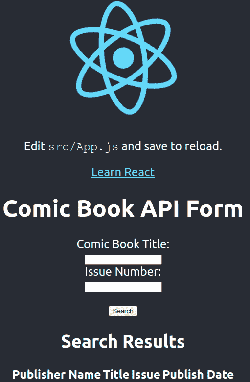
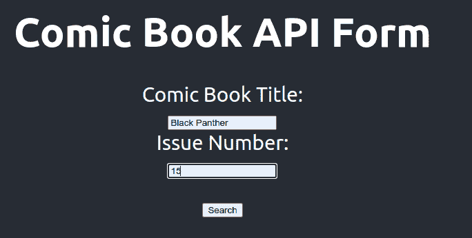
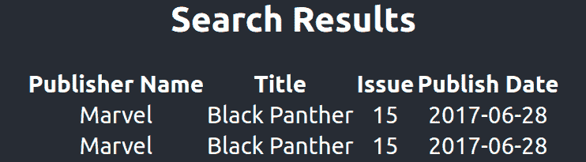

# 使用 Docker Compose 创建场堆栈开发环境—第 3 部分，共 3 部分:反应

> 原文：<https://medium.com/codex/creating-a-farm-stack-dev-environment-with-docker-compose-part-3-of-3-react-123bfa8f187a?source=collection_archive---------3----------------------->


# 介绍

这是使用 Docker Compose 创建 Python FastAPI、React 和 MongoDB (FARM)堆栈开发环境系列的最后一部分。我将回顾 docker-compose.yml 文件的新增内容。我还会添加一个部分，用于打包并分发给你的队友。尽管这意味着本地开发，但是如果您希望确保您的队友拥有不同的 MongoDB 凭证，我将向您展示如何在 Docker Compose 中使用环境变量，这样您就不必在您的包或 Git 存储库中包含您的凭证。

这个资源库的 React 部分是从 React“入门”网站([https://create-react-app.dev/docs/getting-started/](https://create-react-app.dev/docs/getting-started/))上的 starter 应用程序开始的。我将回顾一下为与 FastAPI 服务器通信而添加的组件。此外，您将看到用于加载 FastAPI 结果数据的添加的 HTML 表单和表格。

## 本系列的前几部分

如果您错过了本系列的第一和第二部分，您可以查看位于[https://medium . com/codex/farm-stack-with-docker-compose-part-1-MongoDB-54c c65 e 31636](/codex/farm-stack-with-docker-compose-part-1-mongodb-54cc65e31636)的 FARM 栈的 MongoDB 部分，以及位于[https://medium . com/codex/creating-a-FARM-stack-dev-environment-with-docker-compose-part-2-of-3-FastAPI-9eeapi 的 FARM 栈的 FastAPI 部分](/codex/creating-a-farm-stack-dev-environment-with-docker-compose-part-2-of-3-fastapi-9ee7ab644809)

# 运行群组堆栈

要运行 FARM 堆栈并直接进入 React 站点，请在下面键入 Docker Compose 命令。请注意，您必须添加一个“.”。env "文件和 MongoDB 凭证添加到项目的根目录。要了解更多信息，请阅读本文的“分发包”一节。

```
docker-compose up
```

Docker Compose 开发栈运行后，将你的浏览器定向到 [http://0.0.0.0:3000](http://0.0.0.0:3000) 。您将看到在 MongoDB 数据库中搜索漫画问题的 web 表单。



# FastAPI 附加功能

当从 React 前端与场堆栈中的 FastAPI 服务通信时，您可能会收到如下错误。这可能因您使用的浏览器而异。

> CORS 策略已阻止从源“http://localhost:3000”访问位于“http://0 . 0 . 0 . 0:8000/comics/Black % 20 panther/15”的 XMLHttpRequest:请求的资源上不存在“Access-Control-Allow-Origin”标头。

这是大多数现代网络浏览器抛出的“跨源资源共享”(CORS)错误。

您的浏览器针对 0.0.0.0:3000 或 localhost:3000 发送的 CORS 检查将失败。CORS 检查失败，因为 FastAPI URL 0.0.0.0:8000 因端口不同而不同。默认情况下，FastAPI 服务器不会将“Access-Control-Allow-Origin”头发送回浏览器。更新的浏览器可能会拒绝从 FastAPI 服务加载资源。

您必须使用模块“CORSMiddleware”“CORSMiddleware”模块允许您添加原始 URL，以满足现代浏览器的标题要求。在您的情况下，必须添加 0.0.0.0:3000 和 localhost:3000。可以在以下位置找到该文档。

[https://fastapi.tiangolo.com/tutorial/cors/?h = % 20 CORS # use-CORS middleware](https://fastapi.tiangolo.com/tutorial/cors/?h=%20cors#use-corsmiddleware)

以下步骤允许您的 FastAPI 服务向浏览器返回有效的 CORS 头。

1.  打开“fastapi/app”目录中的 main.py 文件
2.  添加导入行“from fastapi . middleware . CORS import CORS middleware”
3.  创建一个名为 origins 的列表，并将字符串“http://0.0.0.0:3000”和“http://localhost:3000”添加到列表中
4.  调用 app.add_middleware，将模块“CORSMiddleware”作为第一个参数，并将参数“allow_origins”设置为上一步中创建的“origins”变量

[](https://github.com/chupati/farm-part-3/blob/main/fastapi/app/main.py) [## farm-part-3/main.py 位于 main chupati/farm-part-3

### 构建一个农场堆栈。第三部分。React 包含在这个堆栈中。- farm-part-3/main.py 位于 main chupati/farm-part-3

github.com](https://github.com/chupati/farm-part-3/blob/main/fastapi/app/main.py) 

```
origins = [
    "http://0.0.0.0:3000",
    "http://localhost:3000"
]app = FastAPI()
app.add_middleware(
    CORSMiddleware,
    allow_origins=origins,
    allow_credentials=True,
    allow_methods=["*"],
    allow_headers=["*"],
)
```

有关 CORS 的更多信息，请查看 Mozilla 开发者网站上的 CORS 文档。
的[https://developer.mozilla.org/en-US/docs/Web/HTTP/CORS](https://developer.mozilla.org/en-US/docs/Web/HTTP/CORS)的栈是

# Docker 编写配置文件

栈的 React 部分的构建文件只有四行。

*   第 1 行确保安装了运行 React 的节点
*   下一行将工作目录设置为“/app”
*   网络浏览器必须暴露端口 3000
*   最后一行确保安装了必要的包，并启动了 React 应用程序

**Docker 构建文件“react . Docker File”**

[](https://github.com/chupati/farm-part-3/blob/main/react.dockerfile) [## main Chu pati/farm-part-3/react . docker file

### 构建一个农场堆栈。第三部分。React 包含在这个堆栈中。-farm-part-3/react . docker file at main…

github.com](https://github.com/chupati/farm-part-3/blob/main/react.dockerfile) 

```
from node:14.17.5
WORKDIR /app
EXPOSE 3000
CMD npm install -l; npm start
```

“react”部分被添加到 docker-compose 文件中。文件夹“farm-react”映射到工作目录“/app”，容器端口 3000 映射到主机端口 3000。

**docker-compose.yml "react "部分**堆栈是

[](https://github.com/chupati/farm-part-3/blob/main/docker-compose.yml) [## main chupati 的 farm-part-3/docker-compose . yml/farm-part-3

### 构建一个农场堆栈。第三部分。React 包含在这个堆栈中。-farm-part-3/docker-compose . yml at main…

github.com](https://github.com/chupati/farm-part-3/blob/main/docker-compose.yml) 

```
react:
    build:
      context: ./
      dockerfile: react.dockerfile
    volumes:
      - './farm-react:/app'
    ports:
      - 3000:3000
```

除了添加到“docker-compose.yml”文件中的“react”部分之外，还有用于 MongoDB 凭证的环境变量，这与本系列前面部分中添加的硬编码凭证相反。这将在后面的“分发包”章节中讨论。

# 反应表单组件

这个项目的 React 部分最初是用 React starter 示例项目创建的。我添加了一个表单组件来展示与 FastAPI 服务器通信的示例。我喜欢使用 Axios 处理 web 请求，所以你可以在节点包管理器中看到这个包。

[https://github.com/facebook/create-react-app](https://github.com/facebook/create-react-app)

## 反应项目相关性

依赖项可以在 farm-react/package.json 中找到，代码可以在下面的 GitHub 位置找到。

[](https://github.com/chupati/farm-part-3/blob/main/farm-react/package.json) [## main Chu pati/farm-part-3/package . JSON

### 构建一个农场堆栈。第三部分。React 包含在这个堆栈中。-main Chu pati/farm-part-3/package . JSON

github.com](https://github.com/chupati/farm-part-3/blob/main/farm-react/package.json) 

*   Axios:我在“farm-react/package.json”的“依赖项”部分添加了“axios: ^.21.1”

# 主反应页面代码

我更新了 create-react-app 页面“farm-react/src/App.js ”,添加了从 FastAPI 服务器查询的表单，并在页面底部的表格中显示结果。

[](https://github.com/chupati/farm-part-3/blob/main/farm-react/src/App.js) [## main Chu pati/farm-part-3/app . js

### 构建一个农场堆栈。第三部分。React 包含在这个堆栈中。-main Chu pati/farm-part-3/app . js

github.com](https://github.com/chupati/farm-part-3/blob/main/farm-react/src/App.js) 

```
import logo from './logo.svg';
import './App.css';
import {useState} from "react";
import axios from "axios";function App() {
  const [comicBookTitle, setComicBookTitle] = useState("");
  const [comicBookIssueNumber, setComicBookIssueNumber] = useState("");
  const [comicsList, setComicsList] = useState([]);
  const comicSearchHandler = async () => {
    const response = await axios.get("[http://0.0.0.0:8000/comics/](http://0.0.0.0:8000/comics/)" + comicBookTitle + "/" + comicBookIssueNumber);
    console.log(comicsList);
    console.log(response.data);
    setComicsList(response.data);
    console.log(comicsList);
  };const handleComicTitleChange = (event) => {
    setComicBookTitle(event.target.value);Example .env File
  };const handleComicBookIssueNumber = (event) => {
    setComicBookIssueNumber(event.target.value);
  };
  return (
    <div className="App">
      <header className="App-header">
        
        <p>
          Edit <code>src/App.js</code> and save to reload.
        </p>
        <a
          className="App-link"
          href="[https://reactjs.org](https://reactjs.org)"
          target="_blank"
          rel="noopener noreferrer"
        >
          Learn React
        </a>
        <h1>Comic Book API Form</h1>
        <form>
          <label htmlFor="comicBookTitleInput">Comic Book Title:</label><br/>
          <input type="text" name="comicBookTitleInput" id="comicBookTitleInput" value={comicBookTitle} onChange={handleComicTitleChange}/><br/>
          <label htmlFor="comicBookIssueNumberInput">Issue Number:</label><br/>
          <input type="text"  name="comicBookIssueNumberInput" id="comicBookIssueNumberInput" value={comicBookIssueNumber} onChange={handleComicBookIssueNumber}/><br/>
        </form><br/>
        <button id="comicBookSearch" onClick={comicSearchHandler}>Search</button>
        <h2>Search Results</h2>
        <table>
          <thead>
          <tr>
            <th>Publisher Name</th>
            <th>Title</th>
            <th>Issue</th>
            <th>Publish Date</th>
          </tr>
          </thead>
          <tbody>
          {comicsList.map((comicBook, key) =>
            <tr key={key}>
                <td>{comicBook.publisher_name}</td>
                <td>{comicBook.series_name}</td>
                <td>{comicBook.number}</td>
                <td>{comicBook.on_sale_date}</td>
              </tr>
            )}
          </tbody>
        </table>
      </header>
    </div>
  );
}export default App;
```

## 导入 Axios

您必须使用以下代码行导入“Axios”包。

```
import axios from "axios";
```

## 设置 React 应用程序状态属性

用下面几行将应用程序状态属性添加到 React 应用程序的“app”函数中。这些属性表示将从 FastAPI 服务器返回的数据。属性数据将被填充到添加到 React 应用程序的 HTML 表中。

```
const [comicBookTitle, setComicBookTitle] = useState("");
const [comicBookIssueNumber, setComicBookIssueNumber] = useState("");
const [comicsList, setComicsList] = useState([]);
```

## 添加 FastAPI GET 请求和搜索表单处理程序

在“App”函数中添加一个表单搜索处理程序“comicSearchHandler”要调用 FastAPI 服务器，使用“await axios.get”创建一个 GET 请求。注意“0.0.0.0:8000”是硬编码的。但这很可能是一个环境变量。出于简单和演示的目的，FastAPI 服务器 URL 是硬编码的。调用“await axios.get”提供了获取所请求的漫画数据的功能。

属性“comicBookTitle”和“comicBookIssueNumber”用于创建 GET 请求中使用的 URL。

```
const comicSearchHandler = async () => {
  const response = await axios.get("[http://0.0.0.0:8000/comics/](http://0.0.0.0:8000/comics/)" + comicBookTitle + "/" + comicBookIssueNumber);
  console.log(comicsList);
  console.log(response.data);
  setComicsList(response.data);
  console.log(comicsList);
};
```

## 在输入框改变时更新应用程序状态

添加变量“handleComicTitleChange”和“handleComicBookIssueNumber”来处理对表单文本输入框的任何更改。

属性“comicBookTitle”和“comicBookIssueNumber”用分配给变量“handleComicTitleChange”和“handleComicBookIssueNumber”的处理程序更新

```
const handleComicTitleChange = (event) => {
  setComicBookTitle(event.target.value);
};
const handleComicBookIssueNumber = (event) => {
  setComicBookIssueNumber(event.target.value);
};
```

## 创建搜索表单并设置变更处理程序

添加一个 HTML 表单来输入漫画书标题、漫画书发行号，并包含一个搜索按钮。

对于输入字段“comicBookTitleInput”和“comicBookIssueNumberInput”，处理程序“handleComicTitleChange”和“handleComicBookIssueNumber”被设置为“onChange”属性

将按钮“comicBookSearch”的“onClick”属性设置为“comicSearchHandler”

```
<form>
  <label htmlFor="comicBookTitleInput">Comic Book Title:</label><br/>
  <input type="text" name="comicBookTitleInput" id="comicBookTitleInput" value={comicBookTitle} onChange=,{handleComicTitleChange}/><br/>
  <label htmlFor="comicBookIssueNumberInput">Issue Number:</label><br/>
  <input type="text" name="comicBookIssueNumberInput" id="comicBookIssueNumberInput" value={comicBookIssueNumber} onChange={handleComicBookIssueNumber}/><br/>
</form>
<button id="comicBookSearch" onClick={comicSearchHandler}>Search</button>
```

## 添加结果表

添加的表将用于加载 FastAPI 调用结果数据。表数据被加载到上面讨论的“comicSearchHandler”中。每个行单元格都映射到 FastAPI 服务在“comicSearchHandler”GET 请求中返回的 JSON 数据。“comicsList.map”是用于通过“comicsList”属性进行迭代的机制。

```
<table>
  <thead>
    <tr>
      <th>Publisher Name</th>
      <th>Title</th>
      <th>Issue</th>
      <th>Publish Date</th>
    </tr>
  </thead>
  <tbody>
{comicsList.map((comicBook, key) =>
    <tr key={key}>
      <td>{comicBook.publisher_name}</td>
      <td>{comicBook.series_name}</td>
      <td>{comicBook.number}</td>
      <td>{comicBook.on_sale_date}</td>
    </tr>
)}
  </tbody>
</table>
```

# 用于分发的包装

在本系列的前几部分中，可以在 docker-compose 文件中找到硬编码的 MongoDB 凭证。如果您希望将它分发给队友，但不希望他们使用与您相同的凭证，您可以使用名为“. env”的环境变量配置文件。env "文件，并使用在。env "文件，如果它存在的话。可以加”。婀“到了”。git ignore“git 存储库的文件，以便”。env "文件不包含在您的存储库中。

要引用“docker-compose.yml”文件中的环境变量，请键入“$”字符，并将环境变量插入到大括号“{}”中例如，如果要引用环境变量“MONGO_USER”，请键入“${MONGO_USER}”

**举例。环境文件**

```
MONGO_USER=root
MONGO_PASSWORD=OTNmYTdjYmZkMjE5ZmYzODg0MDZiYWJh
```

**Docker-compose.yml 环境变量在“mongo”部分**

```
mongo:
  image: mongo
  restart: always
  environment:
    MONGO_INITDB_ROOT_USERNAME: ${MONGO_USER}
    MONGO_INITDB_ROOT_PASSWORD: ${MONGO_PASSWORD}
  volumes:
    - ./data/mongo:/data/db
    - ./data/mongo-init:/docker-entrypoint-initdb.d
  ports:
    - "27017:27017"
```

# 结论

现在 Docker 构建栈已经完成，您可以使用“docker-compose up”命令运行栈。

将您的网络浏览器指向“https://0.0.0.0:3000”，您将看到“漫画 API 表单”

输入带有发行号的漫画书名，例如“黑豹”和“15”。点击“搜索”您将在表单下方看到加载的结果。



我希望本系列对您有所帮助，并且现在能够快速启动您的农场栈进行开发。您还应该能够将您的农场堆栈分发给您的队友，而不会危及本地农场堆栈的安全。