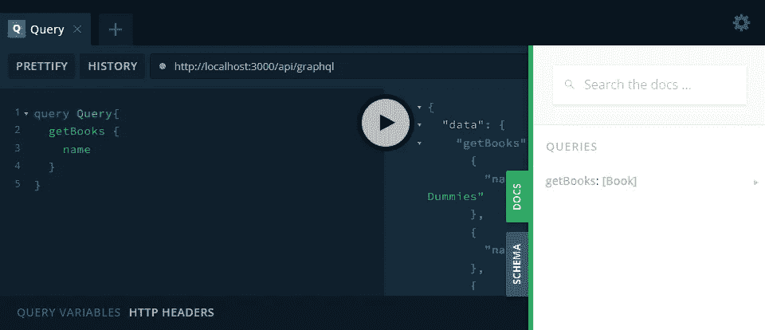
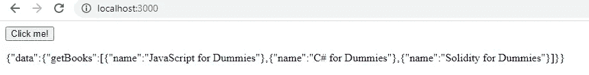

# 用 NextJS 创建 GraphQL API

> 原文：<https://medium.com/codex/creating-a-graphql-api-with-nextjs-ef51a0f6e6ed?source=collection_archive---------1----------------------->

*可以用 GraphQL 为什么要用 REST？*


来自[官方网站](https://graphql.org/)的 GraphQL 标志。

REST 是几年前发明的，它可能会过时，但是，我们仍然有更现代的替代品，每天都有成百上千的贡献者在工作。GraphQL 最初由脸书内部使用，几年前就已经公开了，现在用它创建一个好的 API 比以往任何时候都容易。

因此，我们正在构建一个与 GraphQL 协同工作的简单 API。我们将在 NextJS 中构建我们的示例，这是一个很好的框架，可以快速制作像这样的测试应用程序。它使用 React 进行渲染。除了一些基础知识，我不会讲太多。让我们开始吧。

# 安装

首先，我们需要建立我们的项目。我们将从创建一个简单的 NextJS 网页和一个简单的 NextJS API 路由开始。这两件事都很简单，我将在这里解释如何做。

我们需要初始化 NPM，并为一个简单的 NextJS 项目添加所需的包。我将**而不是**使用 Next 的 create-app 命令。

```
npm init -y
npm i next react react-dom
```

接下来，我们需要创建一个名为`pages`的新文件夹和一个名为`index.js`的页面。

然后我们需要更新`package.json`来包含下面的脚本。

现在，您可以通过在控制台中运行以下命令来运行基本网页。

```
npm run dev
```

它将在`localhost:3000`上运行服务器。

# 添加基本 API

要为 NextJS 创建一个基础 API，我们需要在`pages`中添加一个名为`api`的文件夹，并为一个基础 API 添加另一个文件。我们称之为`books.js`。

当您再次使用`npm run dev`运行这段代码，并浏览到`localhost:3000/api/books`时，您将看到我们返回的 JSON。现在是时候添加更多的功能，并真正添加 GraphQL 了。这将在另一个名为`graphql.js`的文件中完成。

# 添加 GraphQL API

我们将大致按照 NextJS 的[示例](https://github.com/vercel/next.js/blob/canary/examples/api-routes-graphql/)进行一些小的调整。接下来我们将使用`micro`和`apollo-server-micro`来设置一个简单的 GraphQL 服务器作为 API 路由。我们将使用`apollo-server-core`作为一个有用的小 GraphQL 平台。

```
npm i micro apollo-server-micro graphql apollo-server-core
```

在`api`文件夹中，创建名为`graphql.js`的新文件。我们将在其中使用这些包，并添加我们的模式和其他与 GraphQL 相关的代码。

由于这不是一篇关于 GraphQL 本身的文章，我将回顾一下基础知识，但不会展示太多与 API 无关的内容。对于 API，我们需要创建一个简单的图书列表、该列表的模式和一个我们可以调用的解析器。

我们首先定义一个图书列表并设置`typeDefs`。我们定义了`Book`类型，并设置了一个返回所有书籍的查询。我们现在也可以为这个`getBooks`函数编写解析器，这样 GraphQL 也可以使用它。

在这种情况下，它只是返回我们的列表。如果需要，我们可以进行更高级的查询，但这对于本文来说不是必需的。让我们通过添加适当的 Apollo 服务器代码来结束`graphql.js`。

当我们运行`npm run dev`并浏览到`localhost:3000/api/graphql`时，您将看到我们在文档中输入的所有数据。



打开文档的 GraphQL 操场。

现在，您可以像上面设置的那样运行一个查询来获取每本书的所有名称。

## 如何从网页调用 GraphQL？

为此，我们将使用 Axios。我们先装 Axios，之后再看代码。

```
npm i axios
```

我写了一些关于 Axios 的文章，所以我不会详细讨论它是如何工作的，但它本质上是一个基于 Promise 的 HTTP 请求库。我们在 POST 请求的`data`中设置 GraphQL 查询。

这是在我们网站的主页`index.js`内。当您运行这个程序时，您将从屏幕上显示的 GraphQL API 中获取数据。



当然，您现在可以根据需要以任何方式使用这些数据。但是我们现在有一个可用的 API。阅读所有代码，尤其是 GraphQL 的解析器、模式和文档，看看这有多强大。

# 结论

GraphQL 在大型应用程序中确实非常强大，但是必须为您想做的任何事情更新模式和解析器会非常烦人。不过，我现在肯定会更经常地使用它。

非常感谢您的阅读，祝您度过美好的一天。

[支持我支持介质，成为会员](https://mbvissers.medium.com/membership)。它帮了我很大的忙，它不会额外花费你，你可以阅读尽可能多的中等文章！

在 [Twitter](https://twitter.com/0xmbvissers) 和 [gm.xyz](https://gm.xyz/u/mbvissers.eth) 上关注我。

在此查看我是[的开发人员的项目。](https://kangaroomob.io/)

在 Polygon 上查看我最新的 [NFT 收藏](https://www.pixel-pizzas.com/)。