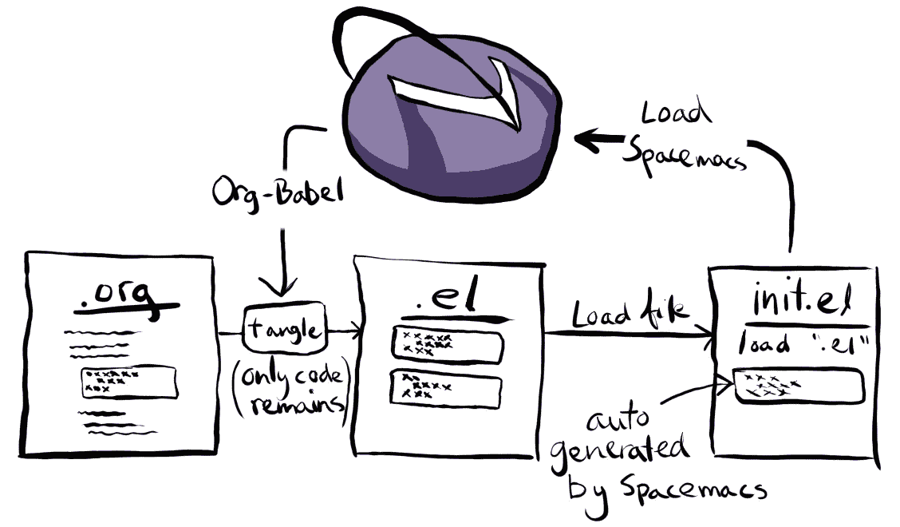

# 为航天飞机创建一个有文化的配置

> 原文：<https://medium.com/codex/creating-a-literate-config-for-spacemacs-b0bab798de9b?source=collection_archive---------24----------------------->

## 创建和正确加载组织模式文件作为 Spacemacs 读写配置的指南


照片由[尼古拉斯·霍伊泽](https://unsplash.com/@nhoizey)在[未喷涂](https://unsplash.com/photos/sOgCGNT3xks)上拍摄

# 为什么要创建“识字配置”？

在之前的[帖子](https://www.olavpedersen.com/2021/03/literate-programming-reproducible-research-and-clean-code-docstrings/)中，我解释了*识字编程*的概念和起源。*识字配置*只是将识字编程概念应用于配置文件。这对于配置文件非常有用，因为配置文件通常需要更多关于设置的上下文，以及为什么您选择以特定的方式做某事。有时，这可能包括指向您找到配置设置或“工作进行中”设置的位置的链接。有文化的配置有用的另一个原因是因为配置文件不需要每天修改。当跳回到您的配置来修复、添加或修改一个特性时，有一个简短的解释来快速跟上您的进度可能是有用的。

这篇文章的目标是为[太空飞行器](https://www.spacemacs.org)创建一个有文化的配置。这是一个对 Emacs 进行了大量修改的发行版。这主要是因为我自己也使用 Spacemacs，并发现为它提供一个有文化的配置非常有用。识字配置本身是一个`.org`文件，其中编织的代码在代码块中定义。使用 [org-mode](https://orgmode.org) 标题也使得导航您的配置文件更加容易。从读写配置中提取文件代码，或*缠结*读写配置，将产生一个`elisp`文件。

Spacemacs 也非常适合一个有文化的配置，因为它默认加载一个单一的`.spacemacs`文件，随着它越来越多地占据你的生活，它往往会稳步增长。在写这篇文章的时候，我当前的配置(代码)有 1500 行长。

# 正确加载 Spacemacs 读写配置

当我试图创建一个有文化的 Spacemacs 配置时，有几个有用的链接来弄清楚如何从一个`.org`文件中*纠结*并生成输出文件。我努力找出加载文件本身的最佳方式。您的 Spacemacs 配置有两个默认位置[和以下加载优先级:](https://develop.spacemacs.org/doc/QUICK%5FSTART.html)

1.  `~/.spacemacs`:主目录中的单个点文件
2.  `~/.spacemacs.d/init.el`:主目录下的一个点文件目录

对于一个有文化的配置，我们需要多个文件，因此我发现使用第二个选项并创建一个`~/.spacemacs.d`目录会更有序。

最初，创建一个`spacemacs.org`读写配置文件，而*将*直接绑定到`.spacemacs`或`init.el`文件似乎是有意义的。可以这样做，但是 Spacemacs 在下面的函数中在`init.el`(或`~/.spacemacs`)文件的末尾添加了自定义内容:

这是 Emacs 存储运行时生成的`custom-set-variables`和`custom-set-faces`的地方。如果我们将*我们的文字配置文件直接与`init.el`文件纠缠在一起，它会在每次生成时覆盖这个函数和变量。因此，可将读写配置*纠结*到中间文件，例如`spacemacs.el`，然后`init.el`文件可加载其内容:*

*   `spacemacs.org`:读写配置文件
*   `spacemacs.el`:纠结的配置文件
*   `init.el`:space Macs 加载为默认配置文件的文件。

图 [1](https://www.olavpedersen.com/2021/03/creating-a-literate-spacemacs.org-config/#orgb857022) 显示了其工作原理。



图 1:如何为 spacemacs 创建一个不覆盖 Spacemacs 自动生成的设置的文字配置的概念概述。创作于克里塔。

## “spacemacs.org”文件

这是识字配置文件本身。当创建它时，你必须确保你的配置文件的每一部分都被复制到代码片段中。下面是我的配置文件的开始。这些设置中的大部分对于生成配置文件并不是特别重要，但是到目前为止对我很有用。

```
#+TITLE: Spacemacs Literate User Configuration 
#+STARTUP: headlines 
#+STARTUP: nohideblocks 
#+STARTUP: noindent 
#+OPTIONS: toc:4 h:4 #+PROPERTY: header-args:emacs-lisp :comments link
```

下面是我的配置中的一个代码块示例。重要的部分是配置在代码块中。

什么定义了代码块:

```
#+BEGIN_SRC emacs-lisp :tangle spacemacs.el 
   // Code here //
#+END_SRC
```

`emacs-lisp`选项表明代码块是用什么语言编写的。当文件纠结时，`:tangle spacemacs.el`将输出目标文件设置为`spacemacs.el`。我完整的`spacemacs.org`，包括它所有的缺点，可以在 github 上我的[点文件](https://github.com/olavpe/dotfiles/blob/BigArch/spacemacs/.spacemacs.d/spacemacs.org)库中找到。

## “spacemacs.el”文件

为了生成复杂的文件`spacmacs.el`，函数`org-bable-tangle()`必须在读写配置上运行。为了在每次保存文件时运行该功能，可将以下“局部变量”添加到`spacmacs.org`的底部。这将为`after-save-hook`添加一个功能。一个[钩子](https://www.gnu.org/software/emacs/manual/html%5Fnode/emacs/Hooks.html)是一个变量，它保存一个特定时间的函数列表。

```
* Local Variables :ARCHIVE: 
# Local Variables: 
# eval: (add-hook 'after-save-hook (lambda ()(org-babel-tangle)) nil t) 
# End:
```

## “init.el”文件

这是 Spacemacs 作为配置加载的文件。您只需将下面一行添加到文件中。

然后 Spacemacs 应该会加载您的配置，您应该可以启动并运行了！随着您继续使用 Spacemacs，它将填充`init.el`文件:

# 就是这样！

现在当你改变你的`spacemacs.org`文件并把输出纠结到`spacemacs.el`时，它不会覆盖`init.el`中 Spacemacs 生成的变量。这并不复杂，但我希望这能帮助那些刚刚接触`org-babel`或 Spacemacs 的人。

# 资源

*   **关于识字编程的帖子**:[https://olavpe . medium . com/Literate-Programming-reproducible-research-and-clean-code-doc strings-accf 1a 9 f 6661](https://olavpe.medium.com/literate-programming-reproducible-research-and-clean-code-docstrings-accf1a9f6661)
*   太空飞船:【https://www.spacemacs.org 
*   https://www.gnu.org/software/emacs/:**[T4](https://www.gnu.org/software/emacs/)**
*   ****组织模式**:**[https://orgmode.org](https://orgmode.org)****
*   ******Spacemacs 默认装载位置**:[https://develop.spacemacs.org/doc/QUICK_START.html](https://develop.spacemacs.org/doc/QUICK_START.html)****
*   ******Emacs 钩子**:[https://www . GNU . org/software/Emacs/manual/html _ node/Emacs/Hooks . html](https://www.gnu.org/software/emacs/manual/html_node/emacs/Hooks.html)****

*****原载于 2021 年 3 月 26 日 https://www.olavpedersen.com*[](https://www.olavpedersen.com/2021/03/creating-a-literate-spacemacs.org-config/)**。******