# 在 Unity 中创建一个生命计数器 UI 元素

> 原文：<https://medium.com/codex/creating-a-lives-counter-ui-element-in-unity-9d48b485555e?source=collection_archive---------0----------------------->

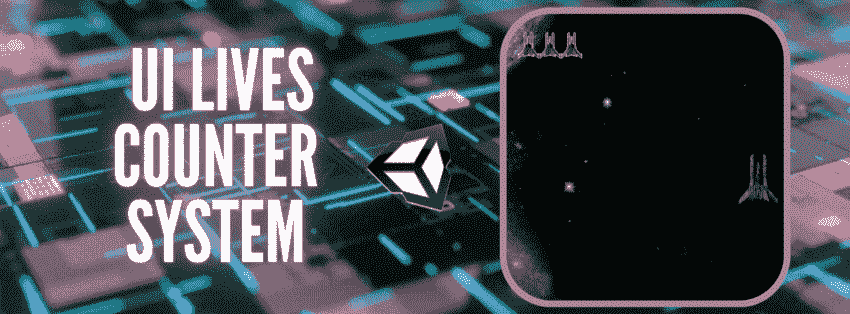

健康条、健康点或生命都是电子游戏中最重要元素之一的同义词。这个组件决定了一个角色或实体在死亡或被击倒前可以吸收多少伤害或生命值。如本书中所示 [*升一级！:伟大的视频游戏设计指南，作者斯科特·罗杰斯*](https://www.amazon.com/Level-Guide-Great-Video-Design/dp/1118877160/ref=sr_1_1?dchild=1&keywords=Level+Up%21%3A+The+Guide+to+Great+Video+Game+Design%2Cby+Scott+Rogers&qid=1619811406&sr=8-1) *:*

> “生命值会以一种明显的方式减少，因为每击一次，玩家就离失去生命更近一步”

虽然一些游戏选择微妙的方式来表现损害，设计师仍然优先考虑以某种形式使它明显。传统上，视频游戏有健康条，健康点，或者生活的图像表现。

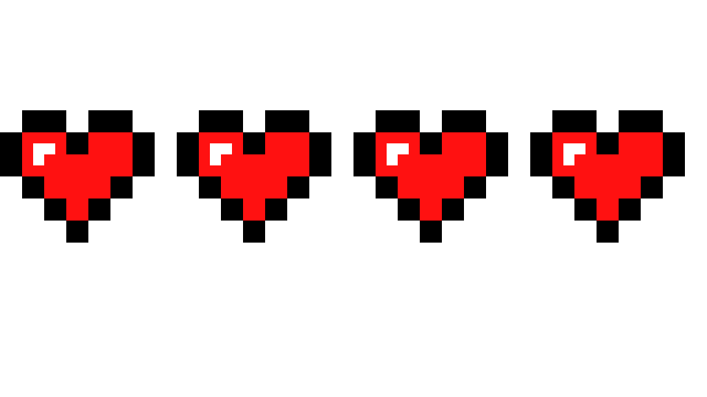

在上一篇文章中，我们创建了一个 [**UI 评分系统**](https://levelup.gitconnected.com/ease-of-building-ui-elements-in-unity-4f501c7e7c5e?source=your_stories_page-------------------------------------) ，时间完成设定！

在本文中，您将学习如何使用精灵图像来表示生命，从而制作一个生命计数器。这些图像将通过代码交换，以表示玩家当前可以获得的生命数量。

# 设置

1.  通过 UI 的同一个下拉菜单添加图像。最好的做法是以“_img”结尾来命名图像，以区别于其他 UI 元素。

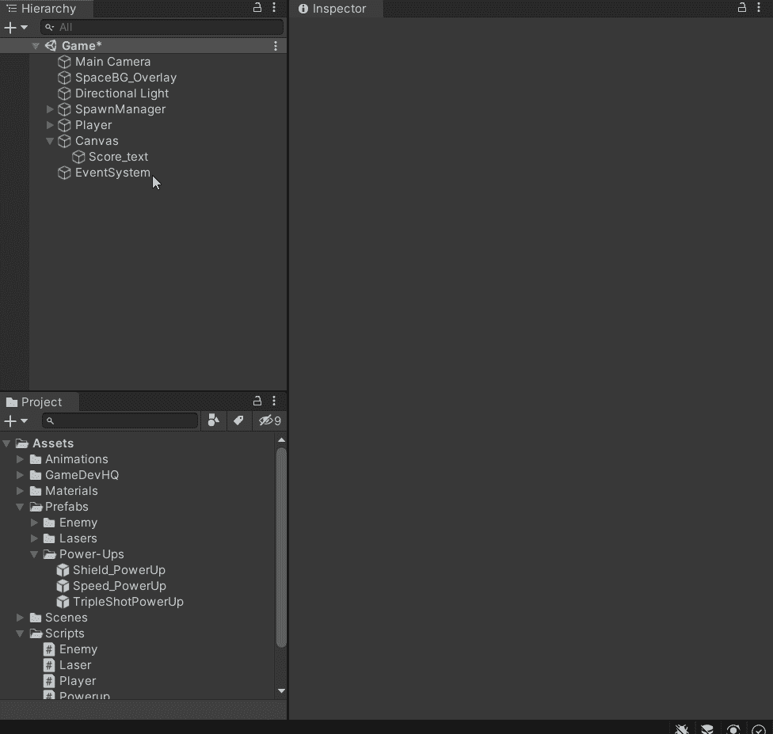

2.将您想要的精灵图像拖放到检查器中的**图像源**中。此图像应表示生命计数器已满。

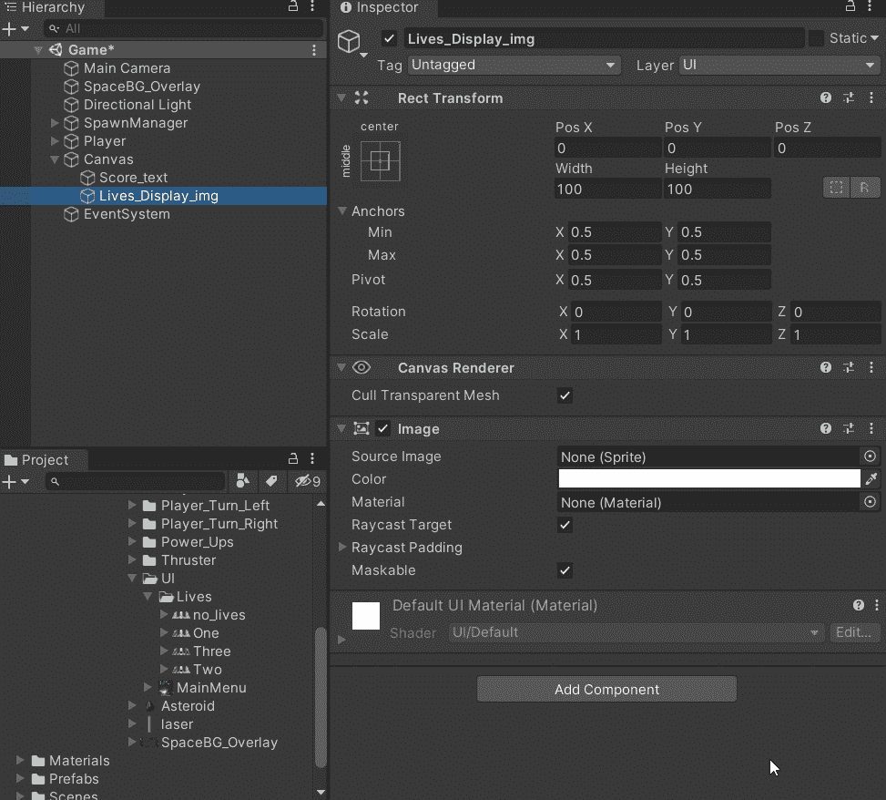

3.将图像锚定到所需的位置。我的会在左上角。

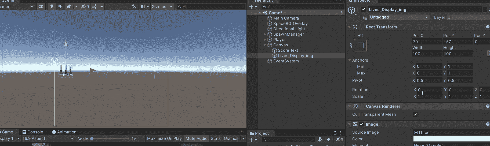

4.如你所见，我的形象似乎被拉长了。为了避免图像扭曲，请确保调整检查器中的**保留外观**选项。

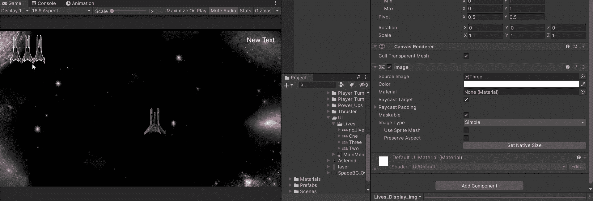

5.在 UI 管理器脚本中，添加一个带有 SerializeField 的 [**数组**](https://docs.unity3d.com/2020.1/Documentation/ScriptReference/Array.html) 来存储 sprite 图像。这将允许您在您的检查器中为每个生命数量手动添加整个精灵图像列表。

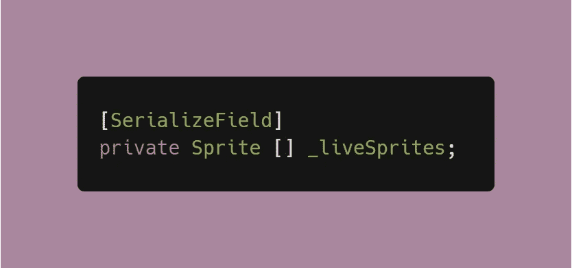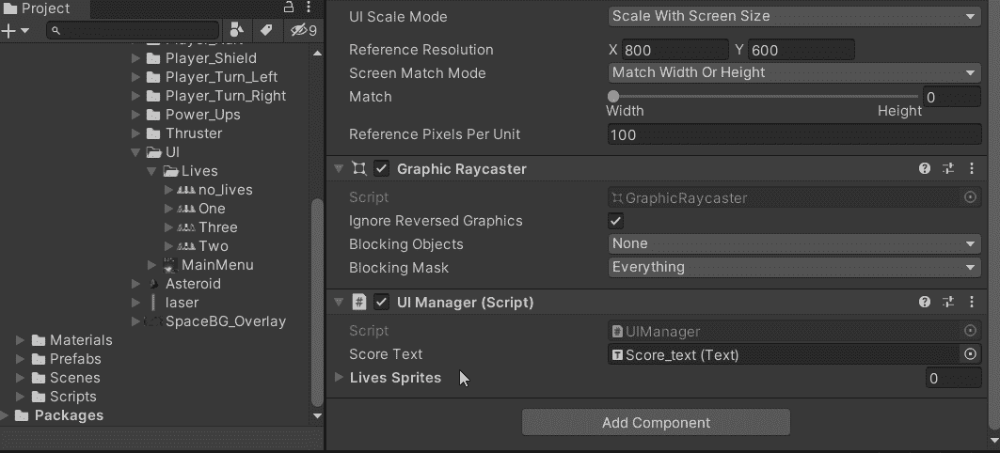

# 交换图像

1.  创建一个句柄来引用 UI 管理器脚本中的图像组件，这是图像的实际位置，我们需要它来进行交换。

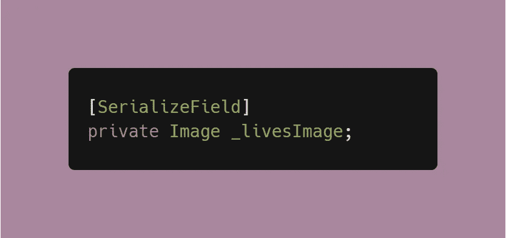

2.将图像从层次拖动到新创建的图像引用。

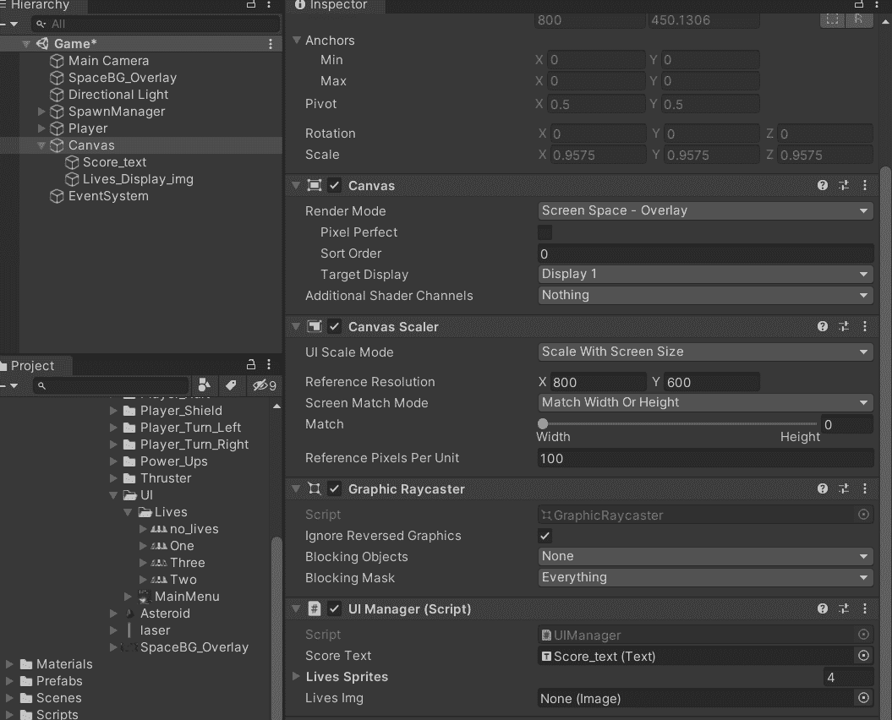

3.在 UI 管理器脚本中创建一个处理当前生命计数器的方法。这是利用了精灵数组和图像对象。

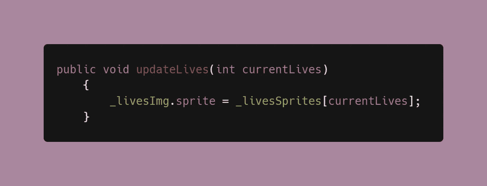

4.这个方法需要在玩家生活被减去的脚本中调用。在我的情况下，这是在球员脚本。因为我已经有了一个对我的脚本的引用(正如在评分系统中提到的)，当生命被减去时，我可以简单地调用它。

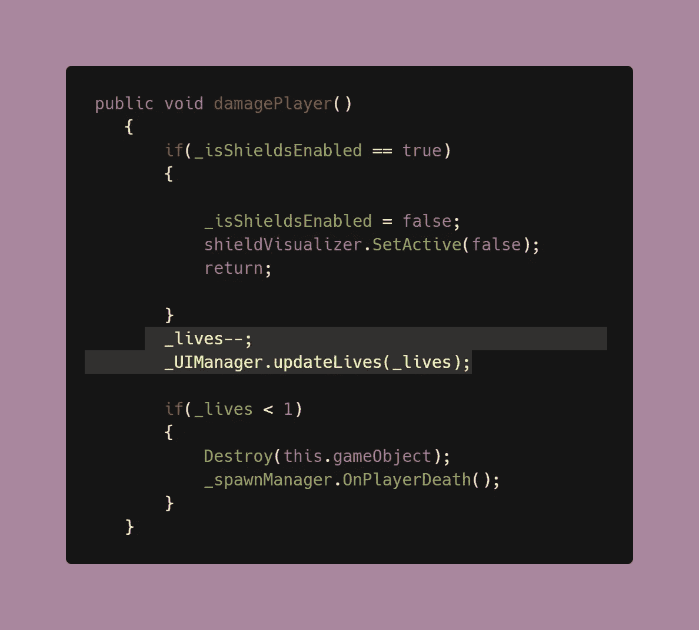

现在，你应该有一个功能齐全的生活计数器用户界面！

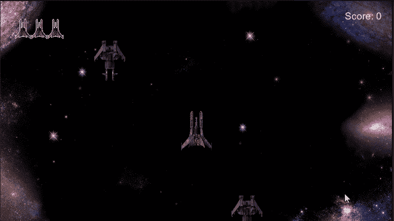

在我的下一篇文章中，我们将看看如何在屏幕上制作一个复古游戏！