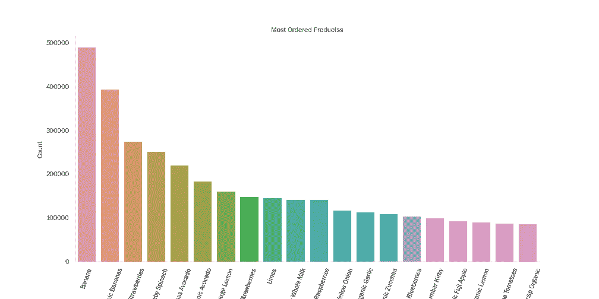

# 创建一个多方面的杂货推荐系统

> 原文：<https://medium.com/codex/creating-a-multifaceted-grocery-recommender-system-c394208f5e0b?source=collection_archive---------2----------------------->

## [法典](http://medium.com/codex)

为了这个项目，我基于 2017 年 Kaggle 比赛中使用的 Instacart 数据创建了一个多方面的杂货推荐系统。

作为一名受过市场营销教育的终身“美食家”，我在完成数据科学课程时，立即被创建一个杂货推荐系统的想法吸引住了。我经常从当地的杂货店收到优惠券，这些优惠券要么是我过去购买过的物品，要么是商店认为“我会感兴趣”的物品。我也收到当地药店发来的电子邮件，提供优惠券，让我知道“我可能喜欢的商品”何时打折。这些是推荐系统运行的例子。

# 数据

只需探索数据中的购买模式，就可以获得有用的信息。我们可以看到哪些过道和部门的订单从最多，甚至下降到产品级别。我们可以看到每个订单中的典型商品数量，以及用户在下一个订单之前还有多少天。例如，订购最多的产品如下所示。

# 客户聚类

我的第一个建模步骤是使用 K-Means 聚类算法，根据相似性将我的用户聚类在一起。在商业环境中，拥有这些信息可以让你针对不同的用户群进行个性化营销。一个群体似乎被定义为大量购买婴儿用品。另一群人买了很多酒。有些很大，有些很小但很具体。我觉得查看每个集群的“购买力”很重要，我通过集群中的用户数量、来自该集群的订单和产品的百分比以及下面看到的其他购买指标来定义购买力。

# NLP 产品搜索引擎

超过 3200 万个订单 id 和产品 id 组合的数据规模，禁止使用基于记忆的推荐器，如 KNN，它将查看客户与客户的相似性和项目与项目的相似性。然而，比较相似商品的想法驱使我使用自然语言处理来创建一个搜索引擎，人们可以在其中输入任何文本值并获得推荐的产品。具体来说，我对每个产品的通道、部门和产品名称进行了标记化和词干化，然后使用计数矢量器计算每个产品的余弦相似性矩阵。示例搜索输出如下所示。

# 奇异值分解推荐器

接下来，我使用了奇异值分解，这是一种矩阵分解方法，可以在降低数据维度的同时发现客户和商品的潜在特征，从而为每个用户生成产品“评级”。在没有明确的产品评级的情况下，我使用用户购买特定产品的次数作为评级的代表，给我的评级范围是 1-100。我最初的 RMSE 是 3.46，在 1-100 的范围内，这似乎不是一个很大的误差，但是进一步检查后，我意识到评级较高的项目有非常大的预测误差。

因此，我将我的评级重新调整到 1-5 的范围内，通过超参数网格搜索，我的 RMSE 降到了 1.26。然而，数据中的大流行性偏差导致最受欢迎的项目(即香蕉)被高度推荐给每个用户。经过一些研究，我决定对每个用户的推荐产品进行个性化的重新排序，指定一定比例的推荐产品来自产品分布的“长尾”或“远尾”。我将产品的“短头”定义为占订单前 80%的前 15%的产品。

对于新客户，我创建了一个函数，允许他们提交一定数量的产品(如果需要的话，来自某个通道)的评级，然后该模型将生成所需数量的推荐(如果需要的话，也来自特定的通道)，并提供分布长尾中指定百分比的产品。

# 关联规则—购物篮分析

我在 Medium 上找到了其他数据科学家的一些很棒的博客，他们为这些数据中的产品创建了关联规则。通过计算每个产品和产品组合的频率和支持，以及产品 B 将与产品 A 一起购买的置信度，然后计算产品组合的提升，这基本上是产品一起购买的频率除以它们一起出现的概率(如果它们是独立的)。主要是重用他们的代码(我记在笔记本上)，我为每个用户群中一起购买的每对产品生成产品关联规则。以下是第 19 类提升分数最高的项目组合。

我意识到这些计算方法考虑到了数据中的受欢迎程度偏差。因此，即使香蕉几乎与所有东西一起购买，它们的信心和提升分数也会根据它们的相对频率而打折扣。

# 烧瓶应用

最后，我创建了一个 FLASK 应用程序来将我的建模部署到 web 浏览器。这个应用程序有一个主页以及 NLP 和 SVD 推荐器的单独页面。还有一个评级页面，供新用户提交评级，然后接收来自 SVD 模型的推荐。希望以后能把关联规则推荐器作为单独的页面添加进去。

# **感谢阅读！**

查看 [Github 此处](https://github.com/melodygr/grocery_recommendation)
联系我 [LinkedIn 此处](https://www.linkedin.com/in/melody-peterson-7092852/)
我目前公开招聘！